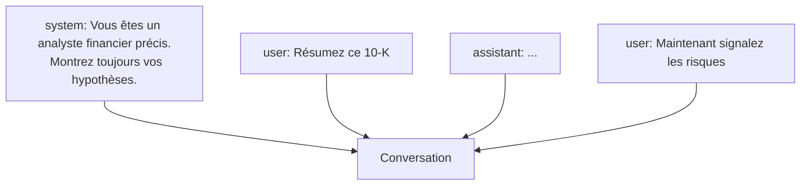

<LevelBadge level="beginner" />

<Callout type="objectives" items={["Les trois rôles qui composent toute conversation IA — et à quoi sert chacun", "Pourquoi le prompt système est l'endroit à plus fort effet de levier pour orienter le comportement", "Comment la même idée apparaît dans les apps de chat, Claude Code et l'API", "Un piège courant : enfouir les règles dans un tour utilisateur au lieu du message système"]} />

Toute conversation IA est composée de **messages**, et chaque message a un **rôle**. Comprendre ces trois rôles explique comment orienter le modèle — et pourquoi certaines instructions tiennent alors que d'autres non.

## Les trois rôles

<Steps items={[{title: "system — le briefing permanent", body: "Configuration de haut niveau pour toute la conversation : qui doit être le modèle, les règles, le format de sortie. Défini une fois, s'applique à chaque tour qui suit."}, {title: "user — votre tour à chaque fois", body: "Vos questions et entrées, un tour à la fois. Restez concentré sur la tâche réelle ; ne re-collez pas les règles permanentes à chaque tour."}, {title: "assistant — la réponse du modèle", body: "Les réponses du modèle. Vous pouvez aussi mettre des mots dans la bouche de l'assistant comme exemples few-shot (voir /docs/prompting/few-shot) — le modèle les traite comme des tours antérieurs et continue dans ce style."}]} />

```mermaid
flowchart TD
  S["system: Vous êtes un analyste financier précis.
  Montrez toujours vos hypothèses."] --> C[Conversation]
  U1[user: Résumez ce 10-K] --> C
  A1[assistant: ...] --> C
  U2[user: Maintenant signalez les risques] --> C
```

## Pourquoi le prompt système est votre levier le plus puissant

Le message système encadre **tout ce qui suit**. C'est là que vous définissez le rôle du modèle, ses standards, son ton et ses règles strictes — et le modèle y accorde un poids important. Si vous voulez un comportement cohérent sur toute une conversation (ou une app), mettez-le ici, pas enfoui dans un tour utilisateur.

Même idée, trois surfaces :

| Surface | Ce qui joue le rôle du prompt système |
|---|---|
| **Apps de chat** (Claude.ai, ChatGPT, Gemini) | Vos [instructions personnalisées](/docs/claude-app/custom-instructions) de compte |
| **Claude Code** | [`CLAUDE.md`](/docs/claude-code/claude-md) à la racine du projet |
| **L'API** | Le paramètre `system` sur la requête ([premier appel](/docs/api/first-call)) |

## Un avant/après pratique

L'erreur la plus courante est de mettre les règles permanentes dans chaque tour utilisateur au lieu du message système. Regardez ce qui change.

**Avant — règles enfoncées dans un tour utilisateur, répétées à chaque fois :**

<PromptCard title="Règles dans le tour utilisateur (fragile)">{`user: Vous êtes un analyste financier précis. Montrez toujours vos hypothèses.
Never invent numbers. Now: summarize this 10-K.
[10-K text]`}</PromptCard>

**Après — règles hissées au message système, les tours utilisateur restent propres :**

<PromptCard title="Règles dans le message système (durable)">{`system: You are a precise financial analyst. Always show your assumptions.
Never invent numbers. Cite the section of the filing for each claim.

user: Summarize this 10-K.
[10-K text]

user: Now flag the risks.`}</PromptCard>

La version « après » garde un comportement stable au fil des tours, divise par deux les tokens renvoyés à chaque tour, et rend l'app plus facile à modifier — vous éditez le briefing permanent en un seul endroit.

## Mettre des mots dans la bouche de l'assistant

Un mouvement sous-utilisé : vous pouvez préposer un tour `assistant` comme **exemple few-shot** ou **amorce de format**, et le modèle continuera dans ce style. C'est ainsi que templates et grilles s'imposent sans gros prompt.

<PromptCard title="Amorcer l'assistant pour suivre un format">{`system: You are a code reviewer. Return only the sections below.

user: Review this pull request. [diff]

assistant: ## Summary
- 
## Risks
- 
## Suggested changes
-`}</PromptCard>

Le modèle traite votre tour assistant amorcé comme une réponse antérieure et complète dans la même forme.

## Erreurs courantes

<Callout type="tip" items={["Règles dans chaque tour utilisateur — mettez les règles permanentes une fois dans le message système ; utilisez les tours utilisateur pour la tâche réelle.", "Se contredire d'un tour à l'autre — une instruction utilisateur explicite et tardive peut écraser une instruction système vague. Soyez cohérent.", "Traiter le rôle assistant comme en lecture seule — vous pouvez l'amorcer pour préparer format, ton ou un pattern few-shot.", "Surcharger le prompt système de faits qui changent — mettez les faits volatils (docs, données, état courant) dans le tour utilisateur ou le contexte de récupération, pas dans le message système."]} />

## Vérifiez-vous

<Quiz title="Vérifiez-vous" questions={[{q: "Où doivent vivre les règles permanentes comme le ton, le format et le rôle ?", options: ["Répétées dans chaque tour utilisateur pour que le modèle n'oublie pas", "Dans le message système, défini une fois", "Dans la première réponse de l'assistant", "Dans la configuration du modèle, pas dans le prompt"], answer: 1, explain: "Le message système encadre toute la conversation. Y définir les règles une fois est plus durable, moins cher et plus facile à modifier que de les répéter à chaque tour utilisateur."}, {q: "Dans Claude Code, quel fichier joue le même rôle que le paramètre system de l'API ?", options: ["package.json", "CLAUDE.md", "README.md", ".env"], answer: 1, explain: "CLAUDE.md à la racine du projet est le briefing permanent de Claude Code — l'équivalent d'un prompt système pour ce projet."}, {q: "Pouvez-vous écrire vous-même du texte dans un tour assistant avant que le modèle réponde ?", options: ["Non — le rôle assistant est en lecture seule", "Oui — amorcer un tour assistant prépare format ou style et le modèle continue à partir de là", "Seulement dans l'API, jamais dans les apps de chat", "Seulement si vous utilisez le fine-tuning"], answer: 1, explain: "Amorcer un tour assistant est une technique courante pour imposer un template ou un style few-shot — le modèle le traite comme une réponse antérieure."}, {q: "Un tour utilisateur dit maintenant quelque chose qui contredit le prompt système. Que se passe-t-il typiquement ?", options: ["Le prompt système l'emporte toujours", "Une instruction utilisateur explicite et tardive peut écraser une instruction système vague — soyez cohérent pour éviter les surprises", "Le modèle refuse de répondre", "Le modèle fait la moyenne des deux"], answer: 1, explain: "Le prompt système est fortement pondéré, mais une instruction utilisateur claire et explicite peut écraser une instruction vague. La cohérence entre rôles compte."}]} />

<Callout type="takeaways" items={["Trois rôles : system définit le briefing, user demande à chaque tour, assistant répond (ou est amorcé).", "Le prompt système est le levier à plus fort effet — mettez-y les règles permanentes une fois.", "Les instructions personnalisées de chat, CLAUDE.md et le champ `system` de l'API sont la même idée sur trois surfaces.", "Les faits volatils appartiennent aux tours utilisateur ou à la récupération, pas au message système."]} />

## Suite

- [Bases du prompting](/docs/prompting/basics)
- [Instructions personnalisées & styles](/docs/claude-app/custom-instructions)
- [Tokens, contexte et mémoire](/docs/foundations/tokens-and-context)
