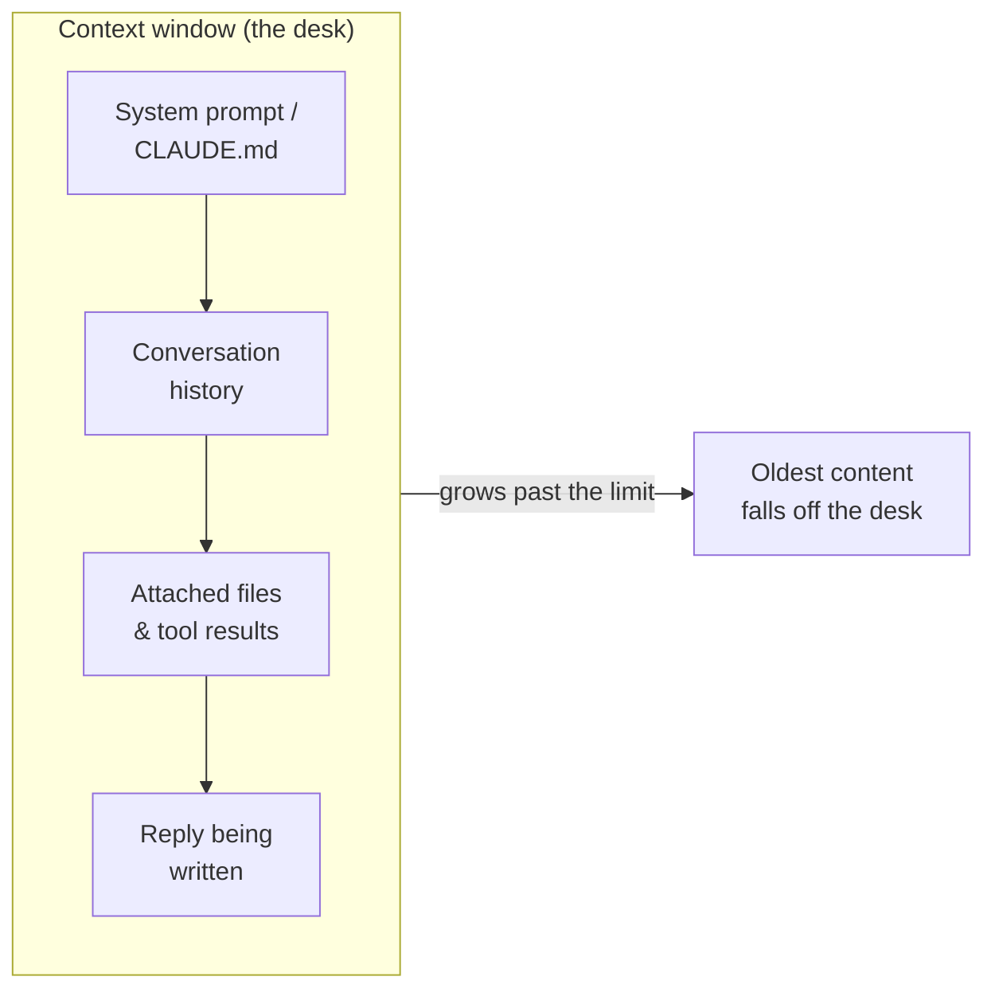

<LevelBadge level="beginner" />

Trois idées débloquent beaucoup de moments « pourquoi a-t-il fait ça ? » : les **tokens**, la **fenêtre de contexte** et la **mémoire**. Une fois ces notions acquises, vous cesserez d'être surpris par la dérive, les oublis et les factures inattendues.

<Callout
  type="objectives"
  items={[
    "Lire le texte comme le fait un modèle — en tokens, pas en mots ni en caractères",
    "Vous représenter la fenêtre de contexte comme un bureau fini, et prédire quand les choses en tombent",
    "Reconnaître la « pourriture du contexte » — pourquoi les modèles peuvent perdre le milieu d'une longue entrée",
    "Connaître les quatre vraies sources de « mémoire » et comment la fournir intentionnellement"
  ]}
/>

## Les tokens : l'unité dans laquelle les modèles pensent

Les modèles ne lisent ni les caractères ni les mots — ils lisent des **tokens**, des fragments de texte représentant environ ¾ d'un mot en anglais. « Unbelievable » peut faire 3 à 4 tokens ; les mots courants comptent pour un chacun ; une espace, une virgule ou un morceau de code coûtent eux aussi des tokens. Votre entrée *et* la sortie du modèle sont toutes deux comptées, et les tokens sont précisément l'unité dans laquelle se mesurent [les prix et les limites](/docs/api/tokens-and-pricing).

Vous n'avez pas besoin de compter à la main, mais un ordre de grandeur aide : **~750 mots ≈ ~1 000 tokens**. Tapez quelque chose et observez :

<TokenEstimator />

:::tip Pourquoi le ratio varie
L'anglais courant tourne autour de ¾ de mot par token. Le code, le JSON, les écritures non latines, les longues URL et les mots rares se découpent en *davantage* de tokens — un fichier de 500 lignes ou un paragraphe en chinois coûte donc plus que ne le suggère son nombre de mots. Quand une facture ou une limite vous surprend, c'est généralement la raison.
:::

## La fenêtre de contexte : la mémoire de travail

La **fenêtre de contexte** est le nombre maximal de tokens que le modèle peut considérer en une seule fois — *votre prompt système, toute la conversation jusqu'ici, les fichiers attachés et la réponse en cours de rédaction,* le tout ensemble. Voyez-la comme le bureau du modèle : grand, mais fini. La taille de la fenêtre varie selon le modèle et ne cesse de croître — consultez [Modèles et tarifs](/docs/whats-new/models-and-pricing) pour les chiffres actuels plutôt que d'en mémoriser un.

Tout ce que le modèle « sait » sur le moment se trouve sur ce bureau :

Quand une conversation dépasse la fenêtre, le **contenu le plus ancien tombe**. C'est pourquoi une conversation très longue peut sembler « oublier » comment elle a commencé, ou s'éloigner de votre instruction initiale.

## La pourriture du contexte : ce n'est pas seulement *plein* contre *vide*

Un problème plus subtil : même quand tout tient encore, les modèles ont tendance à exploiter le **début et la fin** d'une longue entrée plus fidèlement que le **milieu**. Enfouissez la seule phrase qui compte au centre d'un copier-coller de 50 pages et elle risque d'être sous-pondérée — un mode de défaillance souvent appelé *« perdu au milieu »*.

<VerifyNote lastVerified="2026-06-29" source="https://arxiv.org/abs/2307.03172">L'effet « perdu au milieu » — l'exploitation dégradée d'une information placée au milieu du contexte — a été documenté par Liu et al. (2023). Les modèles à long contexte plus récents le gèrent mieux, mais l'habitude pratique ci-dessous reste payante.</VerifyNote>

<Steps
  items={[
    {title: "Commencez par la demande", body: "Mettez l'instruction ou la question réelle en premier, avant de coller un long document — pas enfouie après."},
    {title: "Reformulez à la fin", body: "Répétez l'instruction clé en une ligne après le long contenu. Les positions de début et de fin sont les plus fortes."},
    {title: "Élaguez avant de coller", body: "Supprimez les sections non pertinentes. Moins de bruit au milieu signifie que le signal restant reçoit plus d'attention."},
    {title: "Découpez si c'est énorme", body: "Pour les entrées très volumineuses, résumez ou découpez plutôt que de tout déverser — ou démarrez une nouvelle conversation pour une nouvelle sous-tâche."}
  ]}
/>

Voici la même requête, structurée pour que l'instruction occupe les positions fortes :

<PromptCard title="Instruction d'abord, reformulée à la fin">{`Tâche : trouver chaque endroit où ce contrat plafonne notre responsabilité, et citer la clause exacte.

[... collez ici le contrat complet de 40 pages ...]

Rappel de la tâche : lister uniquement les clauses de plafonnement de responsabilité, avec les citations exactes et les numéros de section. Ignorer tout le reste.`}</PromptCard>

:::tip Dans Claude Code
Les longues sessions d'agent atteignent le même plafond. Claude Code le gère délibérément — en compactant l'historique et en vous laissant piloter ce qui reste sous les yeux. Voir [Gestion du contexte](/docs/claude-code/context-management) et [Ingénierie du contexte](/docs/frontiers/context-engineering).
:::

## La mémoire : il n'y en a aucune, sauf si vous la fournissez

Par défaut, chaque conversation est une **page blanche**. Le modèle ne se souvient pas de votre dernière conversation. Tout ce qui ressemble à de la mémoire est l'une de ces quatre choses :

| Source | Ce que c'est | Vous la contrôlez en |
| --- | --- | --- |
| **Historique renvoyé** | Les applications de chat renvoient la conversation à chaque tour, jusqu'à ce que la fenêtre se remplisse | Démarrant de nouvelles conversations ; gardant les fils centrés |
| **Fonctions de mémoire** | Certaines surfaces Claude conservent des faits d'une conversation à l'autre | Réglages [Mémoire entre conversations](/docs/claude-app/memory) |
| **Fichiers que vous fournissez** | Du contexte persistant que vous attachez intentionnellement | [Projects](/docs/claude-app/projects), [CLAUDE.md](/docs/claude-code/claude-md) |
| **Votre propre code** | L'API est **sans état** — vous renvoyez les messages précédents | [Premier appel API](/docs/api/first-call) |

Le fil conducteur : *si vous voulez que le modèle se souvienne de quelque chose, vous devez continuer à le poser sur le bureau.*

## Pourquoi c'est important

Presque tout problème du type « il a ignoré mon instruction précédente » ou « il a perdu le fil » remonte à l'une de ces trois causes : la fenêtre s'est remplie, une nouvelle session a démarré à froid, ou le détail clé était au milieu mort d'un long copier-coller. Sachant cela, vous structurerez vos prompts et vos sessions pour garder l'essentiel *sous les yeux*.

## Vérifiez vos acquis

<Quiz
  questions={[
    {
      q: "Environ combien de tokens représentent 750 mots d'anglais courant ?",
      options: ["Environ 250", "Environ 1 000", "Environ 3 000", "Exactement 750"],
      answer: 1,
      explain: "Une règle pratique commode : ~750 mots ≈ ~1 000 tokens pour de l'anglais ordinaire. Le code et les écritures non latines montent plus haut."
    },
    {
      q: "Une longue conversation se met à « oublier » comment elle a commencé. La cause la plus probable est :",
      options: [
        "Le modèle est cassé",
        "Le contenu le plus ancien est tombé hors de la fenêtre de contexte à mesure que la conversation grandissait",
        "Le modèle a appris définitivement vos messages précédents",
        "Des tokens ont été remboursés"
      ],
      answer: 1,
      explain: "La fenêtre de contexte est finie. Quand une conversation la dépasse, les tokens les plus anciens tombent du « bureau » — les premières instructions peuvent donc disparaître de la vue."
    },
    {
      q: "Vous devez coller un énorme document plus une instruction clé. Meilleur placement ?",
      options: [
        "L'instruction uniquement au milieu exact du document",
        "L'instruction tout au début ET reformulée à la fin",
        "Aucune instruction — laissez le modèle deviner",
        "L'instruction dans une conversation séparée que le modèle ne peut pas voir"
      ],
      answer: 1,
      explain: "Les modèles exploitent le début et la fin d'une longue entrée le plus fidèlement (« perdu au milieu »). Commencez par la demande et reformulez-la à la fin."
    }
  ]}
/>

## Termes clés

<Flashcards
  title="Ancrez le vocabulaire"
  cards={[
    {front: "Token", back: "Le fragment de texte qu'un modèle traite réellement — environ ¾ d'un mot anglais. L'entrée et la sortie sont toutes deux comptées, et la tarification est par token."},
    {front: "Fenêtre de contexte", back: "Le nombre maximal de tokens qu'un modèle peut considérer en une fois : prompt système + historique + fichiers + la réponse, le tout ensemble. Finie — le contenu au-delà de la limite tombe."},
    {front: "Perdu au milieu", back: "La tendance à exploiter le début et la fin d'une longue entrée plus fidèlement que le milieu. Placez les instructions critiques aux positions fortes."},
    {front: "Absence d'état", back: "L'API ne retient rien entre les appels. Pour poursuivre une conversation, vous renvoyez vous-même les messages précédents."}
  ]}
/>

:::note À retenir
- Les **tokens** sont l'unité à la fois de la pensée et de la facturation — ~1 000 pour 750 mots anglais, davantage pour le code et d'autres écritures.
- La **fenêtre de contexte** est un bureau fini ; les longues conversations oublient parce que l'ancien contenu en tombe.
- Même à l'intérieur de la fenêtre, **commencez par votre instruction et reformulez-la à la fin** — le milieu est sous-exploité.
- Il n'y a **aucune mémoire par défaut**. Fournissez-la délibérément avec des fichiers, des Projects, CLAUDE.md, ou en renvoyant l'historique.
:::

## Suite

- [Qu'est-ce qu'un LLM ?](/docs/foundations/what-is-an-llm)
- [Rôles système, utilisateur et assistant](/docs/foundations/roles)
- [Ingénierie du contexte](/docs/frontiers/context-engineering)
- [Tokens, contexte et tarifs (API)](/docs/api/tokens-and-pricing)
