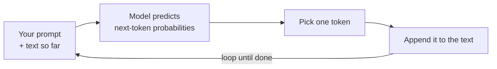

<LevelBadge level="beginner" />

Un **grand modèle de langage** (LLM, pour *Large Language Model*) — la technologie derrière Claude — fait une chose d'une simplicité trompeuse : il lit du texte et **prédit ce qui vient ensuite**, un fragment à la fois. C'est tout. Tout le reste découle du fait qu'il le fasse extraordinairement bien.

<Callout
  type="objectives"
  items={[
    "Saisir le modèle mental en une phrase : un LLM est une saisie semi-automatique très sophistiquée",
    "Voir comment le modèle construit une réponse un token à la fois, en boucle",
    "Comprendre pourquoi ce mécanisme explique à la fois ses forces et ses bizarreries",
    "Savoir ce qu'un LLM N'EST PAS — et comment cela change votre façon de l'utiliser"
  ]}
/>

## Le modèle mental en une phrase

> Un LLM est une saisie semi-automatique très sophistiquée qui a lu une quantité énorme de texte et appris les schémas de la façon dont le langage — et les idées qu'il contient — ont tendance à se poursuivre.

Quand vous posez une question, le modèle ne « cherche » pas une réponse. Il génère la continuation la plus plausible de votre texte, token par token (voir [Tokens et contexte](/docs/foundations/tokens-and-context)). Les continuations plausibles d'une bonne question sont généralement de bonnes réponses — et c'est pour cela que ça fonctionne.

:::tip Analogie : le clavier prédictif sous stéroïdes
Pensez à la saisie semi-automatique de votre téléphone qui suggère le mot suivant. Imaginez maintenant qu'elle ait lu la plupart des livres, articles et codes sur internet — et qu'elle suggère non pas juste le mot suivant, mais tout un essai, une traduction ou un programme qui colle. C'est l'intuition derrière un LLM.
:::

## Un token à la fois

Tout le moteur est une boucle : lire tout ce qui précède, prédire le fragment suivant, l'ajouter, recommencer.

<Steps
  items={[
    {title: "Lire", body: "Le modèle prend votre prompt plus tout ce qui a été généré jusqu'ici comme un seul bloc de texte."},
    {title: "Prédire", body: "Il calcule les probabilités de ce que pourrait être le token suivant."},
    {title: "Choisir", body: "Il sélectionne un token. Que ce soit déterministe ou un peu aléatoire, c'est ce qu'ajustent les contrôles d'échantillonnage comme la température."},
    {title: "Ajouter et recommencer", body: "Le token choisi est ajouté au texte, et le texte légèrement plus long est réinjecté — en bouclant jusqu'à ce que la réponse soit terminée."}
  ]}
/>

Chaque étape ne prédit jamais qu'**un** token, puis réinjecte le texte légèrement plus long. Le modèle n'a aucun plan d'ensemble de la réponse à l'avance — la cohérence émerge du fait de réaliser cette prédiction extrêmement bien, des milliers de fois. La façon dont se comporte l'étape « choisir un token » (glouton ou un peu aléatoire) est ce qu'ajustent les [contrôles d'échantillonnage](/docs/foundations/sampling-controls) comme la température.

## Pourquoi cela explique ses forces

Parce qu'il a appris des schémas à travers l'écriture, le code et le raisonnement, un LLM peut avec fluidité **écrire, résumer, traduire, expliquer et coder** — des tâches qui reviennent toutes à « poursuivre ce texte de façon sensée ». Donnez-lui une amorce claire et il produit une continuation solide. C'est pour cela que le [prompting](/docs/prompting/basics) compte tant : vous façonnez le début du texte qu'il poursuit.

## Pourquoi cela explique ses bizarreries

Le même mécanisme explique les aspérités :

- **Il peut avoir tort avec assurance.** Une continuation qui sonne juste n'est pas toujours vraie — c'est l'[hallucination](/docs/foundations/hallucinations).
- **Il ne « connaît » pas vraiment les faits d'aujourd'hui** à moins que vous ne les lui fournissiez ou qu'il dispose d'un outil pour les chercher.
- **Il n'a aucune mémoire** entre les conversations, à moins que vous ne lui en donniez une.

## Ce qu'un LLM **n'est pas**

:::warning Ajustez vos attentes et vous obtiendrez de meilleurs résultats
- ❌ **Pas une base de données ni un moteur de recherche.** Il génère, il ne récupère pas des enregistrements vérifiés.
- ❌ **Pas une calculatrice.** Il peut raisonner sur les mathématiques mais n'est pas garanti exact — donnez-lui des outils pour cela.
- ❌ **Pas une personne.** Aucun sentiment, aucune intention, aucune mémoire continue. C'est un puissant moteur de texte.
:::

Considérez-le comme un assistant brillant, rapide et cultivé qui se trompe parfois de souvenir — et **vérifiez** ce qui compte.

## Termes clés

<Flashcards
  title="Révisez les concepts fondamentaux"
  cards={[
    {front: "LLM (grand modèle de langage)", back: "La technologie derrière Claude. Il lit du texte et prédit ce qui vient ensuite, un fragment à la fois."},
    {front: "Prédiction du token suivant", back: "La boucle centrale : lire le texte jusqu'ici, prédire le token suivant, l'ajouter, recommencer jusqu'à la fin."},
    {front: "Token", back: "Le fragment de texte que le modèle prédit à chaque étape. Le modèle n'en prédit jamais qu'un à la fois."},
    {front: "Hallucination", back: "Une continuation qui sonne juste mais qui n'est en réalité pas vraie — un effet secondaire du fait de générer, pas de récupérer."},
    {front: "Échantillonnage / température", back: "Contrôle le comportement de l'étape « choisir un token » — glouton ou un peu aléatoire."}
  ]}
/>

<Callout
  type="takeaways"
  items={[
    "Un LLM est une saisie semi-automatique très sophistiquée — il prédit le token suivant, il ne cherche pas une réponse",
    "La cohérence émerge de l'exécution de cette boucle de prédiction un token à la fois, des milliers de fois",
    "Le même mécanisme explique ses forces (écrire, résumer, traduire, expliquer, coder) et ses bizarreries (tort avec assurance, pas de faits en direct, pas de mémoire)",
    "Ce n'est ni une base de données, ni une calculatrice, ni une personne — vérifiez ce qui compte"
  ]}
/>

## Testez-vous

<Quiz
  title="Testez-vous"
  questions={[
    {
      q: "Que fait fondamentalement un LLM quand vous lui posez une question ?",
      options: [
        "Il cherche la réponse dans une base de données de faits vérifiés",
        "Il génère la continuation la plus plausible de votre texte, un token à la fois",
        "Il fouille le web en direct pour trouver la réponse la plus récente"
      ],
      answer: 1,
      explain: "Un LLM ne cherche rien — il génère la continuation la plus plausible de votre texte, token par token."
    },
    {
      q: "Pourquoi un LLM peut-il avoir tort avec assurance ?",
      options: [
        "Une continuation qui sonne juste n'est pas toujours vraie — c'est l'hallucination",
        "Il tombe à court de mémoire en pleine réponse",
        "Il refuse de répondre aux questions qu'il ne connaît pas"
      ],
      answer: 0,
      explain: "Il génère un texte à l'air plausible plutôt que de récupérer des enregistrements vérifiés, donc une continuation fluide peut tout de même être fausse — c'est l'hallucination."
    },
    {
      q: "Quelle affirmation à propos d'un LLM est correcte ?",
      options: [
        "C'est un moteur de recherche qui récupère des enregistrements vérifiés",
        "C'est une calculatrice garantie exacte",
        "Ce n'est pas une personne et il n'a aucune mémoire continue entre les conversations, à moins que vous ne lui en donniez une"
      ],
      answer: 2,
      explain: "Un LLM est un puissant moteur de texte — pas une base de données, ni une calculatrice, ni une personne. Il n'a aucune mémoire entre les conversations à moins que vous ne la lui fournissiez."
    }
  ]}
/>

## Pour aller plus loin

- [Tokens, contexte et mémoire](/docs/foundations/tokens-and-context)
- [Les hallucinations et comment les réduire](/docs/foundations/hallucinations)
- [Les bases du prompting](/docs/prompting/basics)
