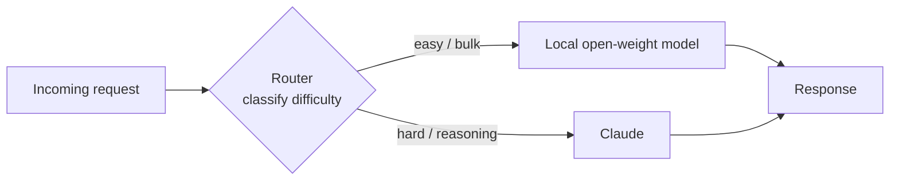

<LevelBadge level="advanced" />

Le cadrage « modèle frontier **ou** modèle local » est un faux dilemme. Les systèmes en production les plus économiques, respectueux de la confidentialité et résilients utilisent **les deux** — un petit modèle open-weight tournant en local pour le travail facile, à fort volume ou sensible, et un modèle frontier comme Claude en tant que **couche intelligente** qui prend en charge le raisonnement difficile. Cette page traite des *patterns* durables qui relient les deux pour que chacun fasse ce qu'il sait faire de mieux. Ces patterns sont neutres vis-à-vis du fournisseur — Claude est simplement un excellent candidat pour le rôle « raisonnement » — et ils survivent à n'importe quel nom de modèle spécifique.

<Callout type="objectives" items={[
  "Comprendre POURQUOI un hybride (frontier + local) l'emporte sur chaque modèle seul en matière de coût, de confidentialité et de résilience",
  "Apprendre les cinq patterns hybrides durables : routeur/big-little, brouillon-puis-affinage, expurgation de la confidentialité, pré/post-traitement en masse et repli hors ligne",
  "Pour chaque pattern : savoir quand y recourir, le compromis que l'on accepte et une esquisse concrète",
  "Concevoir votre propre hybride Claude+local avec une méthode reproductible en quatre étapes",
  "Savoir que ces patterns sont neutres vis-à-vis du fournisseur — Claude s'insère comme « couche intelligente », pas comme un verrouillage",
]} />

## Pourquoi hybride, et non l'un ou l'autre

Un modèle local open-weight (voir [Exécuter des modèles en local avec Ollama](/docs/models/run-models-locally-ollama)) et un modèle frontier sont bons à des choses *différentes* :

- **Le local** est privé (les données ne quittent jamais votre machine), peu coûteux à l'échelle (pas de facture au token), à faible latence pour les petits modèles, et fonctionne hors ligne. Mais il présente un véritable **écart de capacité** sur les tâches de raisonnement les plus difficiles, à long contexte et agentiques.
- **Claude (frontier)** domine précisément sur ces tâches difficiles, mais chaque appel coûte des tokens et envoie des données vers une API cloud.

L'intuition derrière chaque pattern ci-dessous : **la plupart des requêtes sont faciles, et les difficiles sont une minorité.** Si un modèle local bon marché peut traiter le gros du volume et que vous réservez le modèle frontier à la tranche réellement difficile, vous obtenez l'essentiel de la qualité frontier pour une fraction du coût — et vous pouvez garder les données sensibles en local. L'article *Hybrid LLM* de Microsoft a formalisé cela : un routeur appris qui envoie les requêtes faciles vers un petit modèle a effectué **jusqu'à 40 % d'appels en moins** au grand modèle sans baisse de la qualité des réponses ([arXiv 2404.14618](https://arxiv.org/abs/2404.14618)). Le framework open source [RouteLLM](https://github.com/lm-sys/RouteLLM) rapporte des résultats similaires — une qualité proche du frontier pour environ **la moitié du coût** sur les benchmarks courants, en routant à peu près la moitié des requêtes vers le modèle le moins cher.

> Choisissez votre hybride en fonction d'une **contrainte**, pas du buzz. Si vous ne savez pas encore quel modèle convient à quelle tâche, commencez par [Choisir un modèle](/docs/models/choosing-a-model) — puis revenez et décidez *où placer la frontière* entre local et frontier.

---

## Pattern 1 — Routeur / big-little

**L'idée.** Placez un fin **classificateur** devant chaque requête. Il examine la tâche et décide : facile/masse → modèle local ; raisonnement difficile → Claude. Emprunté à la conception de CPU « big.LITTLE », où un téléphone exécute le travail en arrière-plan sur de minuscules cœurs efficaces et ne réveille le gros cœur que pour les charges lourdes.

**Quand l'utiliser.** Vous avez un flux mixte de requêtes — beaucoup de triviales, quelques-unes réellement difficiles — et vous voulez ne payer le prix frontier que pour les difficiles. C'est l'hybride de trait.

**Le compromis.** Le routeur peut se *tromper*. Mal router une tâche difficile vers le modèle local fait chuter la qualité ; mal router une facile vers Claude fait surpayer. Vous ajustez un seuil pour arbitrer entre coût et qualité, et vous devriez **mesurer** ce seuil sur vos propres données avec une petite éval (voir [Évals](/docs/power-user/evals)).

**L'esquisse.** Le routeur peut être aussi simple qu'une couche de règles (longueur, mots-clés, présence de code) ou aussi riche qu'un petit modèle classificateur. Une option bon marché et transparente consiste à demander au modèle **local** lui-même de classer la difficulté, puis de dispatcher :

<PromptCard title="Prompt de classification du routeur (s'exécute sur le modèle local)">{`You are a request router. Classify the user request into exactly one tier.

Return ONLY a JSON object: {"tier": "...", "reason": "..."}

Tiers:
- "local"  → simple, mechanical, or high-volume: short rewrites, formatting,
             single-fact lookup, basic classification/extraction, boilerplate.
- "frontier" → hard reasoning, multi-step planning, long-context synthesis,
             ambiguous instructions, code that must be correct, anything where
             a wrong answer is costly.

Bias toward "local" when in doubt about a CHEAP, low-risk task,
and toward "frontier" when a mistake would be EXPENSIVE.

Request:
"""
{{REQUEST}}
"""`}</PromptCard>

La sortie du routeur est une décision de routage, pas la réponse finale — gardez-la minuscule et rapide. Pour un routage plus riche entre de nombreux outils ou modèles, la même logique classer-puis-dispatcher se généralise (et ressemble à la façon dont les modèles choisissent entre les [outils](/docs/api/tool-use)).

---

## Pattern 2 — Brouillon-puis-affinage

**L'idée.** Le modèle local produit un **premier brouillon bon marché** ; Claude le **peaufine, corrige ou vérifie**. Vous payez des tokens frontier pour l'affinage, pas pour une génération à partir de zéro — et un bon brouillon rend le travail de Claude plus court et plus fiable.

**Quand l'utiliser.** Génération ouverte où un brouillon grossier est bien moins cher qu'un parfait mais où la sortie finale doit être de haute qualité : rédaction longue, code, documents structurés, résumés qui doivent être exactement justes.

**Le compromis.** Deux appels de modèle au lieu d'un ajoutent de la latence, et un *mauvais* brouillon peut ancrer l'affineur sur ses erreurs. Le gain apparaît quand la rédaction est la partie coûteuse et l'affinage comparativement bon marché — vérifiez sur vos données que « brouillon local + affinage frontier » l'emporte réellement sur « le frontier fait tout » sur le coût par sortie acceptable.

**L'esquisse.** Le modèle local rédige → transmettez le brouillon à Claude avec une instruction ciblée : *« Voici un brouillon. Corrige les erreurs, resserre, et vérifie les affirmations ; renvoie la version corrigée. »* C'est la même intuition qui alimente le **décodage spéculatif** au niveau du token — un petit rédacteur propose, le grand modèle vérifie et ne garde que ce qui tient la route ([NVIDIA : décodage spéculatif](https://developer.nvidia.com/blog/an-introduction-to-speculative-decoding-for-reducing-latency-in-ai-inference/)). Au niveau de la tâche, vous faites la même chose à la main : proposition bon marché, vérification coûteuse.

---

## Pattern 3 — Expurgation de la confidentialité

**L'idée.** Un modèle local (ou un outillage NLP local) **retire les PII** du texte *avant* que quoi que ce soit ne soit envoyé à une API cloud. Claude raisonne sur la version expurgée ; vous réinsérez les vraies valeurs en local au retour si nécessaire.

**Quand l'utiliser.** Vous voulez du raisonnement frontier mais vous manipulez des données réglementées ou sensibles (santé, finance, dossiers clients) et les PII brutes **ne doivent pas** quitter votre environnement. L'expurgation vous permet d'utiliser le modèle cloud sur la *forme* du problème sans exposer les personnes qui y figurent.

**Le compromis.** L'expurgation n'est jamais parfaite — une entité oubliée est une fuite, et une sur-expurgation détruit le contexte dont le modèle a besoin pour bien répondre. Traitez l'expurgateur comme un contrôle de sécurité : testez son rappel, et gardez la table de dé-expurgation strictement en local.

**L'esquisse.** Exécutez un détecteur/anonymiseur local sur l'entrée, en remplaçant les entités par des espaces réservés (`[PERSON_1]`, `[EMAIL_1]`), envoyez le texte expurgé à Claude, puis réhydratez les espaces réservés en local. [Presidio](https://github.com/microsoft/presidio), l'outil open source de Microsoft, est le composant de base courant ici — il détecte et anonymise les PII et peut utiliser un backend NLP enfichable, y compris un modèle local pour une seconde passe sur les cas difficiles. Un détail crucial, souvent oublié : expurgez **tout** ce qui atteint le modèle, y compris les documents récupérés et les résultats d'outils — pas seulement le dernier message de l'utilisateur.

---

## Pattern 4 — Pré/post-traitement en masse

**L'idée.** Le modèle local prend en charge le travail **à fort volume et répétitif** — extraction, classification, étiquetage, normalisation sur des milliers d'éléments — et Claude ne traite que les **quelques cas difficiles** que le modèle local signale comme à faible confiance.

**Quand l'utiliser.** Les charges de pipeline : classer 100 k tickets de support, extraire des champs d'une montagne de documents, étiqueter un flot de contenu. Faire passer chaque élément par une API frontier serait lent et coûteux ; la plupart des éléments sont faciles.

**Le compromis.** Vous avez besoin d'un **signal de confiance / d'escalade** fiable pour que les bons éléments soient escaladés. Trop empressé et vous surpayez ; trop timide et la qualité en souffre sur la queue difficile. La confiance auto-déclarée du modèle local est un point de départ, mais validez-la.

**L'esquisse.** Le modèle local traite le lot complet et attache un score de confiance ; les éléments sous un seuil (ou qui échouent à une vérification de schéma/validation) sont escaladés vers Claude pour le jugement difficile. C'est le Pattern 1 appliqué à un lot plutôt qu'à une requête en direct — la même économie « le bon marché traite le gros, le frontier traite la queue » qu'exploitent les cascades, souvent **40 à 70 % d'économies de coût** avec une perte de qualité minimale sur la majorité facile.

---

## Pattern 5 — Repli hors ligne

**L'idée.** Le modèle local est le **filet de sécurité**. Quand l'API cloud est en panne, limitée en débit ou injoignable, les requêtes *basculent* vers le modèle local au lieu d'échouer *purement et simplement*. Des réponses dégradées valent mieux que des pages d'erreur.

**Quand l'utiliser.** Tout ce où la disponibilité compte plus que la qualité toujours optimale : outils internes qui doivent continuer à fonctionner, fonctionnalités on-device, produits qui ne peuvent pas afficher aux utilisateurs une erreur bloquante pendant une panne de fournisseur.

**Le compromis.** Les réponses de repli sont **de qualité inférieure** par définition — vous échangez le plafond frontier contre « ça marche encore ». Rendez la dégradation explicite (étiquetez-la, restreignez l'ensemble des fonctionnalités) plutôt que de servir en silence des réponses plus faibles comme si elles étaient les vraies.

**L'esquisse.** Enveloppez les appels dans une chaîne ordonnée : essayez Claude → en cas d'erreur de disponibilité (timeout, 429/5xx), réessayez avec backoff → si l'échec persiste, routez vers le modèle local. Les passerelles LLM comme LiteLLM et OpenRouter implémentent exactement ce pattern de chaîne de repli, y compris la mise en cache des prompts courants pour qu'un chemin hors ligne puisse tout de même servir quelque chose d'utile. Le principe durable : **gardez un modèle local au chaud comme dernière ligne**, pour qu'une panne dégrade l'expérience au lieu de la casser.

---

## Concevez votre propre hybride Claude+local

<Steps items={[
  {title: "Cartographiez la distribution de vos requêtes", body: "Échantillonnez du trafic réel et étiquetez quelle fraction est réellement difficile vs facile/masse vs sensible. La forme de cette distribution vous dit quel pattern paie — une longue queue facile favorise un routeur ou un pré-traitement en masse ; une petite tranche sensible favorise l'expurgation."},
  {title: "Choisissez le pattern qui correspond à la contrainte", body: "Trafic en direct mixte → Pattern 1 (routeur). Génération de haute qualité à budget serré → Pattern 2 (brouillon-puis-affinage). Données réglementées/sensibles → Pattern 3 (expurgation). Volume pipeline / par lot → Pattern 4 (masse). La disponibilité est critique → Pattern 5 (repli). Beaucoup de systèmes en combinent deux ou trois."},
  {title: "Fixez la frontière, puis mesurez-la", body: "Décidez où le local s'arrête et où Claude commence (un seuil de routeur, un seuil de confiance, une politique d'expurgation). Lancez une petite éval sur VOS données pour chiffrer le compromis coût-vs-qualité. Ne vous fiez pas à un classement ou à l'accroche d'un fournisseur — mesurez sur votre tâche. Voir la page Évals."},
  {title: "Ajoutez de l'observabilité et une soupape de sécurité", body: "Journalisez chaque décision de routage/escalade et son résultat pour pouvoir réajuster la frontière à mesure que les modèles et le trafic changent. Gardez un repli explicite (Pattern 5) pour qu'une panne de fournisseur dégrade en douceur plutôt que de casser."},
]} />

<VerifyNote lastVerified="2026-06-28" source="https://docs.anthropic.com/en/docs/build-with-claude/models">
Les noms de modèles spécifiques, les fenêtres de contexte, les prix au token et les limites de débit changent fréquemment et ne sont **pas** répétés ici volontairement — c'est la partie volatile. Avant de fixer un seuil de coût ou de qualité pour un routeur ou une cascade, vérifiez la gamme et les prix actuels des modèles Claude à la source ci-dessus, et les noms actuels des modèles locaux dans la <a href="https://ollama.com/library">bibliothèque Ollama</a>. Les patterns de cette page sont durables ; les chiffres exacts derrière la frontière ne le sont pas.
</VerifyNote>

<Quiz title="Vérifiez vos acquis" questions={[
  {q: "Quelle est l'intuition économique centrale qui fait fonctionner chaque pattern hybride ?", options: ["Les modèles locaux sont toujours meilleurs que les modèles frontier", "La plupart des requêtes sont faciles ; seule une minorité a vraiment besoin d'un raisonnement frontier", "Les modèles frontier sont moins chers par token que les modèles locaux"], answer: 1, explain: "Le gros du trafic réel est facile. Si un modèle local bon marché traite la majorité facile et que vous réservez le modèle frontier à la minorité difficile, vous obtenez l'essentiel de la qualité pour une fraction du coût. C'est cette asymétrie qu'exploite chacun des patterns présentés ici."},
  {q: "Vous devez utiliser un modèle frontier pour raisonner sur des dossiers clients, mais les PII brutes ne peuvent pas quitter votre environnement. Quel pattern convient ?", options: ["Routeur / big-little", "Expurgation de la confidentialité", "Repli hors ligne"], answer: 1, explain: "L'expurgation de la confidentialité retire les PII en local avant que quoi que ce soit n'atteigne l'API cloud, de sorte que Claude raisonne sur une version expurgée et que les vraies valeurs restent dans votre environnement. Le routeur décide OÙ envoyer le travail ; il ne retire pas les données sensibles."},
  {q: "Quel est le risque principal spécifique au pattern routeur / big-little ?", options: ["Il ne peut jamais utiliser qu'un seul modèle", "Une tâche mal routée coûte de la qualité (difficile envoyée au local) ou de l'argent (facile envoyée au frontier)", "Il exige que l'API cloud soit en ligne en permanence"], answer: 1, explain: "Le routeur est un classificateur et il peut se tromper. Mal router une tâche difficile vers le modèle faible nuit à la qualité ; mal router une facile vers le frontier gaspille de l'argent. C'est pourquoi vous ajustez et mesurez le seuil de routage sur vos propres données."},
  {q: "Pourquoi brouillon-puis-affinage n'en vaut-il PARFOIS pas la peine ?", options: ["Il produit toujours une qualité inférieure à un seul appel frontier", "Deux appels ajoutent de la latence, et un mauvais brouillon local peut ancrer l'affineur sur ses erreurs", "Les modèles frontier ne peuvent pas éditer un texte qu'ils n'ont pas écrit"], answer: 1, explain: "Brouillon-puis-affinage ne l'emporte que lorsque la rédaction est la partie coûteuse et l'affinage bon marché. Deux appels de modèle ajoutent de la latence, et un brouillon faible peut égarer l'affineur — vérifiez donc sur vos données que brouillon-local + affinage-frontier l'emporte réellement sur le-frontier-fait-tout."},
]} />

<Flashcards title="Les cinq patterns hybrides en un coup d'œil" cards={[
  {front: "Routeur / big-little", back: "Classer chaque requête, puis dispatcher : facile/masse → local, raisonnement difficile → Claude. L'hybride de trait. Compromis : le routeur peut mal router — ajustez le seuil sur vos propres données."},
  {front: "Brouillon-puis-affinage", back: "Le modèle local rédige à bas coût ; Claude peaufine/vérifie. Payez des tokens frontier pour l'affinage, pas pour la génération. Compromis : latence supplémentaire, et un mauvais brouillon peut ancrer l'affineur."},
  {front: "Expurgation de la confidentialité", back: "Un modèle local/outil NLP retire les PII avant que quoi que ce soit n'atteigne l'API cloud ; réhydratez en local. Vous permet d'utiliser le raisonnement frontier sur des données sensibles. Compromis : une entité oubliée est une fuite ; expurgez aussi les résultats d'outils et les documents récupérés, pas seulement le message de l'utilisateur."},
  {front: "Pré/post-traitement en masse", back: "Le local prend en charge l'extraction/classification à fort volume sur tout le lot ; Claude ne traite que les escalades à faible confiance. Le Pattern 1 appliqué à un lot. Nécessite un signal de confiance/escalade fiable."},
  {front: "Repli hors ligne", back: "Le modèle local est le filet de sécurité : quand l'API cloud est en panne ou limitée en débit, basculez VERS le local au lieu d'échouer purement et simplement. Des réponses dégradées valent mieux que des erreurs. Rendez la dégradation explicite."},
]} />

<Callout type="takeaways" items={[
  "Frontier vs local est un faux dilemme — les meilleurs systèmes utilisent les deux, avec Claude comme « couche intelligente » neutre vis-à-vis du fournisseur pour la minorité difficile du travail",
  "Les cinq patterns reposent sur une même intuition : la plupart des requêtes sont faciles et bon marché ; réservez la dépense frontier à la tranche réellement difficile",
  "Routeur/big-little est l'hybride de trait ; brouillon-puis-affinage achète de la qualité à budget serré ; l'expurgation débloque les données sensibles ; le pré-traitement en masse fait passer les pipelines à l'échelle ; le repli hors ligne achète de la résilience — et ils se composent",
  "Chaque pattern a une frontière (un seuil, un seuil de confiance, une politique d'expurgation) — mesurez-la sur VOS données avec une petite éval, jamais un classement",
  "Gardez les chiffres volatils (noms de modèles, prix, limites) derrière une étape de vérification ; les patterns sont durables, les spécificités ne le sont pas",
]} />

## Sources et lectures complémentaires

- [Hybrid LLM : Cost-Efficient and Quality-Aware Query Routing (arXiv 2404.14618, ICLR 2024)](https://arxiv.org/abs/2404.14618)
- [RouteLLM — framework open source pour servir et évaluer les routeurs de LLM (GitHub, LMSYS)](https://github.com/lm-sys/RouteLLM)
- [RouteLLM : An Open-Source Framework for Cost-Effective LLM Routing (blog LMSYS)](https://www.lmsys.org/blog/2024-07-01-routellm/)
- [Microsoft Presidio — détecter, expurger et anonymiser les PII (GitHub)](https://github.com/microsoft/presidio)
- [Masquage des PII avec Presidio et LiteLLM — tutoriel](https://docs.litellm.ai/docs/tutorials/presidio_pii_masking)
- [An Introduction to Speculative Decoding (blog technique NVIDIA)](https://developer.nvidia.com/blog/an-introduction-to-speculative-decoding-for-reducing-latency-in-ai-inference/)
- [Repli de modèles — IA fiable avec basculement automatique (documentation OpenRouter)](https://openrouter.ai/docs/guides/routing/model-fallbacks)
- [Anthropic — vue d'ensemble des modèles Claude](https://docs.anthropic.com/en/docs/build-with-claude/models)
