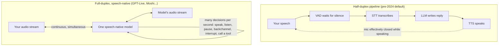

<LevelBadge level="beginner" />

Pendant une décennie, parler à un ordinateur revenait à échanger tour à tour avec un talkie-walkie qui faisait semblant d’être une personne. Le **8 juillet 2026, OpenAI a lancé GPT-Live** — un modèle vocal qui écoute *pendant* qu’il parle — et l’ère du talkie-walkie a officiellement commencé à s’achever. Cette page explique ce qui a réellement changé sous le capot, pourquoi l’ancienne pile vocale était condamnée à paraître robotique, et comment juger l’ensemble du paysage des agents vocaux de 2026 sans le battage médiatique.

<Callout type="objectives" items={[
  "Comprendre pourquoi le pipeline classique STT → LLM → TTS a toujours paru lent — c’est de la physique, pas un défaut de finition",
  "Savoir ce que signifie full-duplex : un seul modèle nativement vocal qui écoute et parle simultanément",
  "Obtenir les faits vérifiés sur GPT-Live et le paysage vocal actuel (OpenAI, Google, ElevenLabs, Anthropic, modèles ouverts)",
  "Savoir quand un agent vocal est vraiment viable aujourd’hui — et ce qui casse encore",
]} />

<VerifyNote lastVerified="2026-07-13" source="https://openai.com/index/introducing-gpt-live/">
GPT-Live a été lancé il y a quelques jours et les détails (paliers de modèles, déploiement, accès API) évoluent vite. Les noms de produits, la disponibilité et les chiffres de latency de cette page sont périssables — vérifiez la page de chaque fournisseur (liens dans Sources) pour la vérité du jour.
</VerifyNote>

## Le problème des 200 millisecondes

Voici le fait qui explique tout le reste de cette page : **les humains se répondent en 0 à 200 millisecondes environ**. Une étude interlinguistique de référence portant sur 10 langues (Stivers et al., *PNAS* 2009) a montré que les intervalles de réponse se regroupent autour de **0 ms** dans toutes les cultures testées — nous commençons couramment à répondre *avant* que l’autre ait fini, parce que notre cerveau anticipe la fin de son tour de parole.

Comparez maintenant avec la pile classique des assistants vocaux. C’était un **pipeline de trois modèles distincts** collés ensemble :

1. la **STT (speech-to-text)** transcrit votre audio en texte,
2. un **LLM** lit la transcription et rédige une réponse,
3. la **TTS (text-to-speech)** retransforme la réponse en audio.

Chaque étape doit (le plus souvent) se terminer avant que la suivante ne commence, donc leurs délais **s’additionnent**. Pire, le pipeline n’a aucune idée du moment où vous avez fini de parler — l’audio n’a pas de bouton « envoyer » — alors les ingénieurs y ont greffé un minuteur de silence, le **VAD (voice activity detection)** : attendre environ une demi-seconde à une seconde de silence, puis *deviner* que le tour est terminé. Ce seul bricolage explique les deux modes d’échec classiques : faites une pause en milieu de phrase pour réfléchir et le bot vous coupe ; terminez nettement et il reste malgré tout à attendre son minuteur de silence. Additionnez le tout et vous obtenez 1 à 3 secondes de blanc là où un humain attend ~0–200 ms — **un ordre de grandeur trop lent**, avant même que le modèle ait prononcé un mot.

Et ça empire : le pipeline est **half-duplex**, comme un talkie-walkie. Pendant que le bot parle, il n’écoute pas. Vous ne pouvez pas l’interrompre (« barge-in ») sans une ingénierie spéciale, le bot ne peut jamais dire « mmh » pendant que *vous* parlez, et tout chevauchement — la partie la plus humaine de la conversation — est tout simplement impossible par construction.

## Ce que « full-duplex » signifie vraiment

**Full-duplex** est un terme de télécom : les deux directions transmettent *en même temps* (un appel téléphonique), par opposition au **half-duplex**, où elles alternent (un talkie-walkie). Appliqué à l’IA vocale :

- **Le modèle écoute et parle simultanément.** Il n’y a pas de machine à états « ton tour / mon tour » — l’audio d’entrée arrive en flux continu pendant que l’audio de sortie s’écoule.
- **Il est nativement vocal.** Un seul modèle consomme et produit de l’audio directement, au lieu de trois modèles qui se passent du texte. Pas d’étape de transcription, pas d’étape de synthèse, pas de latency empilée — et aucune perte d’information (le ton, l’hésitation, l’ironie et l’émotion survivent, parce qu’ils n’ont jamais été aplatis en texte).
- **La gestion des tours devient un comportement appris, pas un minuteur.** Selon la description que fait OpenAI de GPT-Live, le modèle prend des décisions d’interaction « plusieurs fois par seconde » : parler, continuer d’écouter, faire une pause, acquiescer, interrompre ou invoquer un outil. Le bricolage de détection du silence disparaît parce que le modèle *prédit* les fins de tour comme le font les humains.
- **Backchannels et barge-in sont offerts.** Il peut murmurer « mmh » pendant que vous parlez (un **backchannel**), s’arrêter en milieu de phrase à l’instant où vous le coupez (**barge-in**), ou rester silencieux pendant que vous réfléchissez — tout cela impossible ou bricolé dans un pipeline.

Peu de gens le savent : **le full-duplex n’a pas été inventé par OpenAI en 2026.** Le laboratoire français **Kyutai a publié Moshi en open source en 2024** — un modèle vocal full-duplex avec ~160 ms de latency théorique / ~200 ms en pratique, qui modélise *deux flux audio parallèles* (le vôtre et le sien) et utilise un « Inner Monologue » de tokens texte alignés temporellement pour garder sa parole linguistiquement cohérente. Vous pouvez télécharger les poids et l’exécuter localement dès aujourd’hui. Ce qui a changé ce mois-ci, c’est que le full-duplex est passé de démo de recherche à **interface par défaut pour des centaines de millions d’utilisateurs de ChatGPT**.

## GPT-Live : ce qu’OpenAI a réellement livré

Vérifié auprès de l’annonce d’OpenAI et de la couverture du lancement (8 juillet 2026) :

- **Deux modèles : GPT-Live-1 et GPT-Live-1 mini.** Le mini remplace Advanced Voice Mode comme mode vocal par défaut de ChatGPT (y compris pour le palier gratuit) ; le plus grand, GPT-Live-1, est réservé aux paliers payants. TechCrunch rapporte que plus de **150 millions de personnes** utilisent déjà les fonctions vocales de ChatGPT.
- **Véritable architecture full-duplex.** Traitement continu de l’entrée pendant la génération de la sortie, avec des décisions parler/écouter/pause/interrompre/outil prises plusieurs fois par seconde. Il émet des backchannels (« mmh », « ouais »), gère les échanges rapides et — c’est notable — peut **rester silencieux** et se contenter d’absorber le contexte jusqu’à ce qu’on le sollicite.
- **Délégation à un modèle frontier.** Pour la recherche web, un raisonnement plus poussé ou du travail agentique, GPT-Live confie la tâche au modèle frontier d’OpenAI (GPT-5.5 au lancement) **en arrière-plan et continue de vous parler** pendant que le résultat arrive. Le modèle vocal est le front-end conversationnel ; la réflexion lourde se fait ailleurs. Ce partage « parleur rapide + penseur lent » est le motif d’architecture à surveiller.
- **La traduction en direct** découle naturellement de la conception écouter-en-parlant continue — le modèle peut restituer votre phrase dans une autre langue presque au moment où vous la dites. (La couverture du lancement a noté que la qualité de l’accent reste inégale dans certaines langues.)
- **Aucune API développeur au lancement.** GPT-Live est pour l’instant un produit ChatGPT ; OpenAI dit que l’accès API arrive et propose un formulaire d’inscription. Pour les développeurs, **gpt-realtime sur la Realtime API reste le produit développeur actuel** (voir ci-dessous).
- **Limites connues au lancement :** pas de vidéo ni de partage d’écran dans la session vocale, qualité inégale hors des grandes langues, et OpenAI dit surveiller les effets de dépendance émotionnelle.

<VerifyNote lastVerified="2026-07-13" source="https://openai.com/index/introducing-gpt-live/">
La disponibilité par palier, le modèle frontier exact derrière la délégation et le calendrier de l’API sont les affirmations qui évoluent le plus vite ici — revérifiez l’annonce d’OpenAI avant de les répéter.
</VerifyNote>

## Le paysage vocal, vérifié (juillet 2026)

| Acteur | Ce qui existe | Full-duplex ? | Notes |
|---|---|---|---|
| **OpenAI — GPT-Live** | ChatGPT Voice (grand public) | **Oui** — nativement vocal | Délègue les tâches difficiles à un modèle frontier en pleine conversation ; pas encore d’API |
| **OpenAI — Realtime API (gpt-realtime)** | API développeur, GA | Speech-to-speech, modèle unique | Agents vocaux en production : appels téléphoniques SIP, serveurs MCP distants, entrée image |
| **Google — Gemini Live API** | API développeur (AI Studio / Vertex, GA) | Audio natif, en streaming | Barge-in, « proactive audio » (parle seulement quand c’est pertinent), dialogue affectif, usage d’outils + Google Search |
| **ElevenLabs — Agents** | Plateforme d’agents (lancée en mars 2026) | Pile orchestrée avec un modèle propriétaire de gestion des tours | TTS/STT + gestion des tours + appels d’outils ; plus de 70 langues ; revendications de moins de 500 ms au premier tour ; canaux téléphone/web/app |
| **Anthropic — Claude** | [Mode vocal dans les applis Claude](/docs/claude-app/voice-mode) ; `/voice` en push-to-talk dans Claude Code (mars 2026, multilingue sorti de bêta en juin 2026) | **Non** — par tours | Parlez, obtenez des réponses orales avec une transcription enregistrée. Aucun modèle nativement vocal full-duplex annoncé à la date de vérification — ne laissez personne vous dire le contraire |
| **Kyutai — Moshi** | Poids ouverts + code (GitHub, Hugging Face) | **Oui** — la preuve open source | ~160–200 ms de latency, audio en double flux, « Inner Monologue » ; s’exécute localement |

Deux enseignements de ce tableau que la plupart des articles manquent : **(1)** « agent vocal » désigne aujourd’hui deux architectures différentes — des modèles full-duplex authentiquement nativement vocaux (GPT-Live, Moshi, l’audio natif de Gemini) contre des pipelines très rapides et bien orchestrés surmontés d’un modèle appris de gestion des tours (ElevenLabs Agents). Les deux peuvent donner une bonne impression ; seul le premier permet la parole simultanée. **(2)** L’option open source est réelle : Moshi prouve qu’on peut faire tourner du full-duplex sur son propre matériel, ce qui compte si votre cas d’usage ne peut pas envoyer d’audio vers le cloud (voir [Choisir un modèle](/docs/models/choosing-a-model) pour ce cadre de décision).

## Comment se déroule réellement une conversation full-duplex

<Steps items={[
  {title: "L’audio arrive en flux continu", body: "Il n’y a pas d’enregistrer-puis-envoyer. L’audio de votre micro est encodé en tokens image par image (le codec de Moshi utilise des trames de 80 ms) et transmis au modèle à mesure qu’il arrive — même pendant que le modèle est en milieu de phrase."},
  {title: "Le modèle prend des micro-décisions en permanence", body: "Plusieurs fois par seconde, il choisit : continuer à parler, s’arrêter, rester silencieux, glisser un backchannel (« mmh ») ou commencer une réponse. La gestion des tours est une prédiction que le modèle a apprise de vraies conversations, pas un minuteur de silence."},
  {title: "Vous interrompez ; il cède instantanément", body: "Le barge-in est natif : le modèle vous entend dès que vous commencez, parce qu’il n’a jamais cessé d’écouter. Il coupe sa propre phrase, assimile ce que vous avez dit et s’ajuste — aucun mot-clé « stop » nécessaire."},
  {title: "Les questions difficiles sont déléguées, en douceur", body: "Posez une question nécessitant une recherche web ou un vrai raisonnement et GPT-Live la confie au modèle frontier en arrière-plan — tout en maintenant la conversation vivante (« laissez-moi vérifier… donc, bref— »). La réponse est réintégrée dès qu’elle est prête."},
  {title: "Le silence est un coup valable", body: "Un modèle full-duplex peut délibérément ne rien dire — vous laissant réfléchir à voix haute sans vous confisquer le tour de parole. Les bots à pipeline en étaient littéralement incapables ; leur VAD prenait votre pause pour une invitation."},
]} />

## Quand les agents vocaux sont désormais viables — et ce qui casse encore

**Désormais vraiment viable :**

- **Support client et flux téléphoniques.** Une gestion des tours en moins d’une seconde plus le barge-in éliminent les deux principaux motifs de plainte. Le support SIP de la Realtime API et ElevenLabs Agents visent exactement cela.
- **Usages mains libres et yeux occupés.** Conduite, cuisine, travail de terrain, accessibilité — l’interaction suit enfin le rythme de la parole ([le mode vocal des applis Claude](/docs/claude-app/voice-mode) couvre déjà la version capture-et-transcription de cet usage).
- **Traduction en direct et pratique des langues.** Écouter en parlant rend possibles pour la première fois l’interprétation quasi simultanée et des exercices de conversation naturels.
- **La voix comme front-end d’agent.** Le motif de délégation — discuter avec un modèle vocal rapide pendant qu’un modèle frontier lent fait le travail — est le pari annoncé d’OpenAI pour piloter à la voix un « travail agentique de longue haleine ».

**Casse encore :**

- **Hallucinations audio.** Les modèles nativement vocaux peuvent halluciner en *son*, pas seulement sur les faits : dérive vers une mauvaise langue, noms et nombres estropiés, ou accents à côté (la démo de traduction du lancement de GPT-Live a attiré exactement cette critique). Ne faites jamais confiance à un nombre entendu que vous n’avez pas confirmé.
- **Environnements bruyants et diaphonie.** Des micros toujours ouverts entendent tout — conversations à côté, télévision, un second locuteur. Le full-duplex expose le modèle *davantage* à l’audio ambiant, pas moins.
- **Sécurité des actions en temps réel.** Un modèle qui agit à la vitesse de la conversation peut agir sur une phrase mal entendue à la vitesse de la conversation. Tout agent vocal qui touche à de l’argent, à des messages ou à des suppressions a besoin de barrières de confirmation orales explicites et d’un biais vers des défauts en lecture seule — les mêmes règles que pour n’importe quel agent (voir [Fondamentaux](/docs/foundations)), mais avec un canal d’entrée de moindre fidélité.
- **Dépendance émotionnelle.** Un système qui acquiesce, hésite et ne se lasse jamais de vous est conçu pour donner l’impression d’un ami. OpenAI elle-même signale une surveillance sur ce point. Concevez (et utilisez) en conséquence.

<PromptCard title="Squelette de system prompt pour un agent vocal (fonctionne sur les modèles nativement vocaux et les pipelines)">{`You are a voice assistant for {company}. You are SPEAKING, not writing.

Style:
- Short sentences. One idea per sentence. No lists, no markdown, no URLs read aloud.
- If the user interrupts, stop immediately and address what they said.
- If the user pauses mid-thought, stay silent. Do not fill silence.

Safety:
- Before ANY action that sends, buys, deletes, or changes something:
  say back exactly what you will do and wait for a clear spoken "yes".
- Repeat numbers, names, and addresses back for confirmation — always.
- If audio is unclear or noisy, say what you think you heard and ask.
- If asked for something outside {scope}, say so and offer a human handoff.`}</PromptCard>

<Quiz title="Vérifiez vos acquis" questions={[
  {q: "Pourquoi la pile classique STT → LLM → TTS a-t-elle toujours paru lente ?", options: ["Les modèles étaient trop petits", "Trois étapes séquentielles plus un minuteur de détection de silence s’additionnent en 1–3 s de délai, face aux ~0–200 ms attendus par les humains", "Les micros ajoutent de la latency", "Les voix TTS étaient robotiques"], answer: 1, explain: "C’est structurel : chaque étape attend la précédente, et un VAD attend le silence avant que quoi que ce soit ne démarre. Les humains répondent en ~0–200 ms (Stivers et al., PNAS 2009), donc le pipeline était par conception un ordre de grandeur trop lent."},
  {q: "Que peut faire un modèle full-duplex qu’un pipeline half-duplex ne peut pas, par construction ?", options: ["Répondre à des questions factuelles", "Parler plus couramment", "Écouter pendant qu’il parle — ce qui permet barge-in, backchannels et paroles qui se chevauchent", "Utiliser des outils"], answer: 2, explain: "Le half-duplex alterne les tours comme un talkie-walkie : pendant que le bot parle, il n’écoute pas. Écouter et parler simultanément est la propriété qui définit le full-duplex."},
  {q: "Comment GPT-Live gère-t-il une question qui nécessite une recherche web ou un raisonnement profond ?", options: ["Il refuse la voix pour les questions difficiles", "Il met l’appel en pause jusqu’à ce que la réponse soit prête", "Il répond uniquement de mémoire", "Il délègue à un modèle frontier en arrière-plan et maintient la conversation pendant ce temps"], answer: 3, explain: "Le partage « parleur rapide + penseur lent » : le modèle nativement vocal assure la conversation en façade et confie le travail lourd à un modèle frontier (GPT-5.5 au lancement), en réintégrant le résultat dès qu’il est prêt."},
  {q: "Laquelle de ces affirmations était vraie AVANT le lancement de GPT-Live ?", options: ["Un modèle vocal full-duplex avec ~200 ms de latency était déjà open source (Moshi de Kyutai, 2024)", "Aucun modèle ne pouvait être interrompu", "L’IA vocale exigeait légalement une connexion internet", "Claude disposait d’un modèle nativement vocal full-duplex"], answer: 0, explain: "Moshi a publié des poids ouverts en 2024 avec de l’audio full-duplex en double flux et ~160–200 ms de latency. L’importance de GPT-Live tient à la généralisation du full-duplex, pas à son invention. Les fonctions vocales de Claude restent par tours à la date de vérification."},
]} />

<Flashcards title="Vocabulaire de l’IA vocale" cards={[
  {front: "Half-duplex", back: "Communication qui alterne les directions — façon talkie-walkie. L’ancien pipeline des assistants vocaux : pendant que le bot parle, il n’écoute pas."},
  {front: "Full-duplex", back: "Les deux directions à la fois, comme un appel téléphonique. Le modèle écoute et parle simultanément et décide plusieurs fois par seconde s’il doit parler, faire une pause ou céder la parole."},
  {front: "Modèle nativement vocal", back: "Un modèle unique qui consomme et produit de l’audio directement — pas d’étapes STT/TTS, pas de latency empilée, et le ton comme l’émotion survivent parce que la parole n’est jamais aplatie en texte."},
  {front: "Barge-in", back: "Interrompre l’agent en milieu de phrase et le voir s’arrêter et s’adapter instantanément. Natif en full-duplex ; bricolage rapporté dans les pipelines."},
  {front: "Backchannel", back: "Signaux brefs de l’auditeur — « mmh », « ouais », « compris » — émis pendant que l’AUTRE partie parle. Impossible en half-duplex par construction."},
  {front: "VAD / endpointing", back: "Voice activity detection : le minuteur de silence que les vieux pipelines utilisaient pour deviner que vous aviez fini de parler. Cause des échecs de type on-vous-coupe et attente-gênante."},
  {front: "Empilement de latency", back: "Les délais du pipeline s’additionnent : attente VAD + STT + LLM + TTS ≈ 1–3 s. Les humains attendent ~0–200 ms — l’écart qui rendait les bots robotiques."},
  {front: "Délégation (parleur rapide / penseur lent)", back: "Le motif de GPT-Live : un modèle nativement vocal rapide assure la conversation en façade et confie recherche et raisonnement à un modèle frontier en arrière-plan, tout en gardant l’échange vivant."},
]} />

<Callout type="takeaways" items={[
  "L’ancienne pile n’était pas mal construite — elle était structurellement trop lente : latency STT/LLM/TTS empilée plus un minuteur de silence, face aux ~0–200 ms attendus par les humains",
  "Full-duplex = un seul modèle nativement vocal qui écoute en parlant ; barge-in, backchannels et silence délibéré deviennent des comportements appris, pas des bricolages",
  "GPT-Live (8 juillet 2026) généralise le full-duplex dans ChatGPT et inaugure la délégation : modèle vocal rapide en façade, raisonnement du modèle frontier en arrière-plan",
  "Le paysage se scinde en deux : full-duplex nativement vocal (GPT-Live, audio natif de Gemini, Moshi — open source depuis 2024) contre pipelines orchestrés rapides avec gestion des tours apprise (ElevenLabs Agents) ; la voix de Claude reste par tours",
  "Les agents vocaux sont désormais viables pour le support, le mains libres et la traduction — mais les hallucinations audio, les pièces bruyantes et la sécurité des actions en temps réel exigent encore des barrières de confirmation",
]} />

## Suite

- [Le paysage des modèles d’IA : choisir un modèle](/docs/models/choosing-a-model) — le cadre de décision, appliqué à toute modalité
- [Parler à Claude (mode vocal)](/docs/claude-app/voice-mode) — ce que font aujourd’hui les fonctions vocales de Claude
- [Fondamentaux](/docs/foundations) — tokens, contexte et les bases de sécurité des agents dont la voix hérite

## Sources et lectures complémentaires

- [Introducing GPT-Live — OpenAI](https://openai.com/index/introducing-gpt-live/) — l’annonce du lancement (8 juillet 2026)
- [OpenAI releases new voice models for more natural live conversations — TechCrunch](https://techcrunch.com/2026/07/08/openai-releases-new-voice-models-for-more-natural-live-conversations/) — couverture du lancement : paliers, 150 M d’utilisateurs vocaux, réserves sur la démo de traduction
- [Introducing gpt-realtime and Realtime API updates for production voice agents — OpenAI](https://openai.com/index/introducing-gpt-realtime/) — l’actuel produit développeur speech-to-speech (GA)
- [Gemini Live API capabilities — Google AI for Developers](https://ai.google.dev/gemini-api/docs/live-api/capabilities) — audio natif, barge-in, proactive audio, usage d’outils
- [ElevenLabs Agents](https://elevenlabs.io/agents) — la plateforme d’agents : modèle de gestion des tours, canaux, langues
- [Moshi: a speech-text foundation model for real-time dialogue — Kyutai (arXiv 2410.00037)](https://arxiv.org/abs/2410.00037) — l’architecture full-duplex ouverte : double flux, Inner Monologue, 160 ms de latency théorique
- [kyutai-labs/moshi — GitHub](https://github.com/kyutai-labs/moshi) — code et poids pour exécuter le full-duplex en local
- [Universals and cultural variation in turn-taking in conversation — Stivers et al., PNAS 2009](https://www.pnas.org/doi/10.1073/pnas.0903616106) — les preuves de l’intervalle humain de ~0–200 ms
- [Claude Code rolls out a voice mode capability — TechCrunch](https://techcrunch.com/2026/03/03/claude-code-rolls-out-a-voice-mode-capability/) — l’état du mode vocal push-to-talk de Claude
