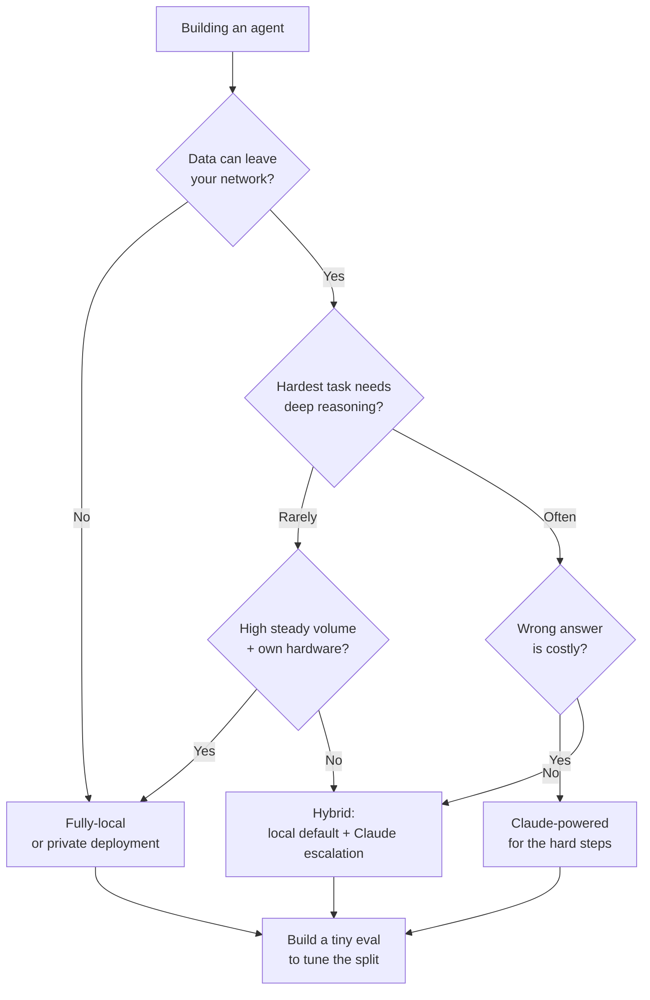

<LevelBadge level="intermediate" />

Vous construisez un agent. La première vraie bifurcation : tourne-t-il sur un modèle open-weight **entièrement local** (privé, gratuit à exécuter, à vous), sur **Claude** (qualité de pointe, hébergé), ou sur un **hybride** des deux ? Cette page est un cadre de décision — les facteurs qui tranchent réellement la question, un flux clair « si X → penche vers Y », et la réalité honnête selon laquelle **l'hybride l'emporte généralement** : le local pour les 90 % faciles/sensibles, Claude pour les 10 % difficiles.

<Callout type="objectives" items={[
  "Nommer les facteurs qui décident réellement entre local, Claude et hybride",
  "Parcourir un flux de décision clair « si X → penche vers Y » pour votre agent",
  "Comprendre pourquoi un hybride (local par défaut + escalade vers Claude) bat souvent chacun des deux extrêmes",
  "Repartir avec une petite éval comme arbitre — et non un classement",
]} />

<VerifyNote lastVerified="2026-06-28" source="https://artificialanalysis.ai/">
Les affirmations durables ici — *un écart de capacité entre les meilleurs modèles open-weight et les modèles de pointe existe mais ne cesse de se réduire*, et *le routage/cascade (modèle bon marché d'abord, escalade sur le difficile) fait économiser du coût tout en préservant la qualité* — sont stables. Mais les **chiffres précis** (l'ampleur de l'écart ce mois-ci, quel modèle open est en tête, les prix Claude par token, le débit exact en tokens/s sur un matériel donné) bougent constamment. Traitez tout chiffre précis comme périssable et vérifiez un tracker en direct comme [Artificial Analysis](https://artificialanalysis.ai/) avant de miser dessus.
</VerifyNote>

## Les trois options, en une phrase

- **Agent entièrement local** — un modèle open-weight (Llama, Qwen, Mistral, DeepSeek, etc.) tournant sur votre propre matériel via Ollama/LM Studio/vLLM. Les données ne quittent jamais votre machine ; aucun coût par appel ; fonctionne hors ligne ; limité par votre matériel et le plafond du modèle. → [Agents IA locaux](/docs/models/local-ai-agents)
- **Agent propulsé par Claude** — appelle l'API Claude. Raisonnement et usage d'outils de pointe, aucune infrastructure à surveiller, mise à l'échelle instantanée ; mais les données quittent votre réseau, vous payez par appel, et vous avez besoin de connectivité.
- **Hybride** — un modèle local gère le gros du travail routinier/sensible ; les étapes difficiles ou à fort enjeu sont escaladées vers Claude. Le schéma vers lequel convergent la plupart des agents en production. → [Claude + modèles locaux](/docs/models/claude-plus-local-models)

## Les facteurs qui tranchent réellement la question

Faites passer votre agent à travers ces facteurs. La plupart des décisions se règlent avec les deux ou trois premiers.

| Facteur | Penche vers **local** quand… | Penche vers **Claude** quand… |
|---|---|---|
| **Sensibilité des données / confidentialité** | Les données sont réglementées ou ne peuvent pas quitter votre réseau | Les données ne sont pas sensibles ou vous disposez d'un accord de traitement conforme |
| **Difficulté de la tâche & profondeur de raisonnement** | Les tâches sont étroites, bien cadrées, répétitives | Les tâches nécessitent un raisonnement multi-étapes approfondi, du contexte long, un usage d'outils délicat |
| **Besoins de fiabilité** | Une nouvelle tentative ou un humain suffit en cas d'erreur | Chaque étape doit être juste ; les échecs coûtent cher |
| **Latence** | Le matériel local répond assez vite | Vous préférez payer pour la vitesse plutôt que de provisionner des GPU |
| **Coût à votre volume** | Volume élevé et régulier — le matériel fixe s'amortit | Volume faible/irrégulier — le paiement par appel bat des GPU au repos |
| **Exigence hors ligne** | Doit fonctionner isolé du réseau / sans connectivité | Toujours en ligne convient |
| **Matériel dont vous disposez** | Vous possédez des GPU capables / de la mémoire unifiée | Vous n'en avez pas et ne voulez pas les acheter/louer |
| **Budget de surveillance** | Vous pouvez le régler, le quantifier, l'évaluer, le maintenir | Vous voulez que « ça marche tout seul » sans ops |

**Les deux qui décident généralement :** si les données *ne peuvent pas* quitter votre réseau, cela seul vous pousse vers le local (ou vers un déploiement privé) indépendamment de tout le reste. Si elles le peuvent, alors la **difficulté de la tâche** est le facteur décisif suivant — le travail facile est bon marché à exécuter localement ; le raisonnement difficile est là où l'[écart de pointe](/docs/models/choosing-a-model) mord encore.

<Callout type="info" items={[
  "L'écart de capacité entre open-weight et modèles de pointe est réel mais se réduit vite — les meilleurs modèles open sont excellents sur le routinier et de nombreuses tâches de code, et restent en retrait pour la plupart sur les travaux agentiques les plus durs, à long horizon et de raisonnement profond.",
  "Cette asymétrie est exactement ce qui rend l'hybride puissant : envoyez la majorité facile/sensible en local, réservez Claude pour la tranche qui a réellement besoin d'un raisonnement de pointe.",
]} />

## Le flux de décision

<Steps items={[
  {title: "Les données peuvent-elles quitter votre réseau ?", body: "Si NON → le local (ou un déploiement privé/VPC) est votre référence. La confidentialité est une contrainte dure, pas une préférence — elle domine les autres facteurs. Si OUI → continuez le flux."},
  {title: "Quelle est la difficulté de la chose la plus difficile que votre agent doit faire ?", body: "Si chaque tâche est étroite et répétitive → un bon modèle local franchit probablement la barre ; penchez vers le local. Si certaines étapes nécessitent un raisonnement profond, un contexte long, ou une orchestration multi-outils délicate → penchez vers Claude au moins pour ces étapes."},
  {title: "Combien coûte une mauvaise réponse ?", body: "Si une erreur ne signifie qu'une nouvelle tentative ou un coup d'œil humain → les tolérances du local conviennent. Si une seule mauvaise étape est coûteuse ou dangereuse → privilégiez la fiabilité de Claude là où ça compte."},
  {title: "Quels sont votre volume et votre matériel ?", body: "Volume élevé et régulier sur du matériel que vous possédez déjà → le local s'amortit magnifiquement. Volume faible ou irrégulier, pas de GPU → le paiement par appel de Claude évite le fer au repos."},
  {title: "Voulez-vous vraiment gérer de l'infrastructure ?", body: "Prêt à quantifier, servir, surveiller et ré-évaluer des modèles → local/hybride est viable. Zéro ops souhaité → Claude, ou un hybride où la partie locale est ultra-simple."},
  {title: "Par défaut, l'hybride, puis prouvez que vous n'en avez pas besoin", body: "Modèle local comme travailleur par défaut ; Claude comme voie d'escalade pour la tranche difficile/à fort enjeu. Commencez ici, sauf si l'étape 1 impose le tout-local ou si la tâche est uniformément difficile (alors tout-Claude)."},
]} />

## Pourquoi l'hybride l'emporte souvent

La plupart des charges de travail réelles sont **asymétriques** : une large majorité des requêtes sont faciles et/ou sensibles, et une petite minorité sont réellement difficiles. Un hybride exploite directement cette forme.

- **Le local gère les 90 % faciles/sensibles** — rapide, gratuit à la marge, privé, capable de fonctionner hors ligne. Le gros de votre trafic ne touche jamais une API.
- **Claude gère les 10 % difficiles** — le raisonnement multi-étapes, les cas limites ambigus, les étapes où être juste importe. Vous payez les prix de pointe uniquement sur la tranche qui a besoin d'une qualité de pointe.

C'est le schéma **cascade / routage** : essayez d'abord le modèle bon marché (local) ; escaladez vers Claude quand un signal de qualité indique que la réponse locale n'est pas assez bonne, ou routez d'emblée via un classifieur de difficulté/sensibilité. C'est une manière bien établie de conserver l'essentiel de la qualité tout en payant une fraction du coût du tout-de-pointe — et elle fait aussi office de frontière de confidentialité, puisque les cas sensibles peuvent être épinglés sur « local uniquement ».

<PromptCard title="Auto-vérification avant de vous engager sur un extrême">{`Answer for YOUR agent:
1. Must any data stay on my machine?            (yes -> local baseline)
2. What % of tasks are genuinely HARD?          (high -> Claude leans heavier)
3. What's a wrong answer cost me?               (high -> Claude on those steps)
4. My volume + hardware?                        (high+own GPU -> local amortizes)
5. Can I babysit infra?                         (no -> Claude or simple hybrid)

If answers conflict -> you've just described a HYBRID.
Now build the tiny eval below and let DATA pick the split.`}</PromptCard>

La mise en garde honnête : l'hybride comporte **plus de pièces mobiles** — deux voies de modèle, un routeur, et un signal de qualité à maintenir. Si votre agent est uniformément simple *ou* uniformément difficile, une configuration à modèle unique est plus simple et probablement la bonne. Optez pour l'hybride quand votre charge de travail est réellement asymétrique.

<Flashcards title="Vocabulaire du guide de décision" cards={[
  {front: "Agent entièrement local", back: "Agent propulsé par un modèle open-weight sur votre propre matériel. Privé, aucun coût par appel, capable de fonctionner hors ligne ; borné par votre matériel et le plafond du modèle."},
  {front: "Agent propulsé par Claude", back: "Agent qui appelle l'API Claude. Raisonnement et usage d'outils de pointe, aucune infra, mise à l'échelle instantanée ; les données quittent votre réseau et vous payez par appel."},
  {front: "Hybride (cascade / routage)", back: "Le modèle local gère la majorité facile/sensible ; Claude gère la minorité difficile/à fort enjeu. Essayer-le-bon-marché-d'abord-puis-escalader, ou router d'emblée par difficulté/sensibilité."},
  {front: "Le facteur décisif, généralement", back: "La sensibilité des données d'abord (peuvent-elles quitter le réseau ?), puis la difficulté de la tâche (quelle est la difficulté de l'étape la plus dure ?). Le reste sont des arbitres."},
  {front: "L'écart de capacité", back: "Les meilleurs modèles open-weight restent en retrait des modèles de pointe surtout sur les tâches de raisonnement/agentiques les plus dures. Réel mais se réduisant — ce qui est exactement pourquoi l'hybride est si efficace."},
]} />

<Quiz title="Vérifiez-vous" questions={[
  {q: "Votre agent traite des données qui, légalement, ne peuvent pas quitter votre réseau. Qu'est-ce que cela implique en premier ?", options: ["Utiliser Claude — il est de meilleure qualité", "Un déploiement entièrement local ou privé est la référence, indépendamment des autres facteurs", "Choisir le moins cher par token"], answer: 1, explain: "La confidentialité est une contrainte dure. Si les données ne peuvent pas quitter le réseau, cela domine la décision — le local (ou un déploiement privé/VPC) est votre référence avant de peser quoi que ce soit d'autre."},
  {q: "Pourquoi un agent hybride l'emporte-t-il souvent pour une charge de travail typique et asymétrique ?", options: ["Les modèles de pointe sont toujours moins chers à grande échelle", "Le local gère la majorité facile/sensible à bas coût et en privé ; Claude est réservé à la minorité difficile qui a besoin d'un raisonnement de pointe", "Il supprime le besoin de toute évaluation"], answer: 1, explain: "La plupart des charges de travail sont asymétriques. Router les 90 % faciles/sensibles vers un modèle local et les 10 % difficiles vers Claude conserve l'essentiel de la qualité à une fraction du coût du tout-de-pointe — et épingle les cas sensibles en local."},
  {q: "Quand une configuration à modèle unique (tout-local OU tout-Claude) est-elle le meilleur choix plutôt que l'hybride ?", options: ["Toujours — l'hybride n'en vaut jamais la peine", "Quand la charge de travail est uniformément simple ou uniformément difficile, de sorte que le routeur supplémentaire et la machinerie de signal de qualité ne rapportent pas leur écot", "Uniquement quand vous n'avez pas de GPU"], answer: 1, explain: "L'hybride ajoute des pièces mobiles (deux voies, un routeur, un signal de qualité). Si vos tâches sont toutes faciles ou toutes difficiles, un seul modèle est plus simple et généralement le bon. L'hybride paie quand la charge de travail est réellement asymétrique."},
]} />

## Puis faites la seule chose qui tranche : testez

Chaque facteur ci-dessus restreint le champ ; **une petite éval désigne le gagnant.** Ne choisissez pas au feeling ni sur un classement public.

- Rassemblez **10 à 50 cas réels** issus de votre charge de travail réelle, avec des réponses de référence (incluez vos cas les plus difficiles et les plus sensibles).
- Faites tourner votre liste restreinte — un modèle local candidat, Claude, et (si pertinent) un routeur hybride — sur les mêmes cas.
- Notez la qualité, puis pesez le **coût et la latence à votre volume réel**. Un gain de qualité de 2 % qui coûte 10× n'en vaut peut-être pas la peine ; un gain de 2 % sur l'étape qui doit être juste peut être non négociable.
- Pour un hybride, l'éval vous indique aussi **où tracer la ligne** — ce qui est escaladé vers Claude et ce qui reste local.

Conservez l'éval. Quand un nouveau modèle open-weight sort ou que les prix changent, la relancer transforme une migration angoissante en une vérification de cinq minutes. → [Évals](/docs/power-user/evals)

<Callout type="takeaways" items={[
  "Décidez dans l'ordre : la sensibilité des données d'abord (peuvent-elles quitter le réseau ?), puis la difficulté de la tâche (quelle est la difficulté de l'étape la plus dure ?). Le reste — latence, volume, matériel, budget de surveillance — sont des arbitres.",
  "Le tout-local l'emporte sur la confidentialité, le hors ligne et le coût à volume élevé et régulier ; Claude l'emporte sur le raisonnement le plus difficile, la fiabilité et la mise à l'échelle zéro-ops.",
  "L'hybride l'emporte généralement pour les charges asymétriques : le local pour les 90 % faciles/sensibles, Claude pour les 10 % difficiles — cascadez/routez et ne payez les prix de pointe que là où ils le méritent.",
  "L'écart open-weight est réel mais se réduit — ce qui est exactement ce qui rend l'hybride si efficace aujourd'hui.",
  "Ne décidez pas au feeling : construisez une petite éval sur VOS données, pesez le coût et la latence à VOTRE volume, et conservez-la pour la prochaine sortie de modèle.",
]} />

## Sources & lectures complémentaires

- [Artificial Analysis](https://artificialanalysis.ai/) — comparaisons indépendantes et fréquemment mises à jour de capacité/prix/vitesse entre modèles open et de pointe (l'endroit où revérifier les détails périssables).
- [Anthropic — Vue d'ensemble des modèles](https://docs.anthropic.com/en/docs/about-claude/models) — la gamme actuelle de Claude, le contexte et les capacités.
- [Anthropic — Tarifs de l'API](https://www.anthropic.com/pricing) — coûts par token actuels pour dimensionner vos calculs à volume.
- [Ollama](https://ollama.com/) · [LM Studio](https://lmstudio.ai/) — exécutez des modèles open-weight localement pour la voie locale/hybride.
- [Meta — Llama](https://www.llama.com/) · [Mistral — Modèles](https://docs.mistral.ai/getting-started/models/) — familles open-weight couramment utilisées dans les agents locaux.

## Suite

- Construire le côté local → [Agents IA locaux](/docs/models/local-ai-agents)
- Câbler l'hybride → [Claude + modèles locaux](/docs/models/claude-plus-local-models)
- Cadrer le choix largement → [Choisir un modèle](/docs/models/choosing-a-model)
- Rendre la décision mesurable → [Évals](/docs/power-user/evals)
