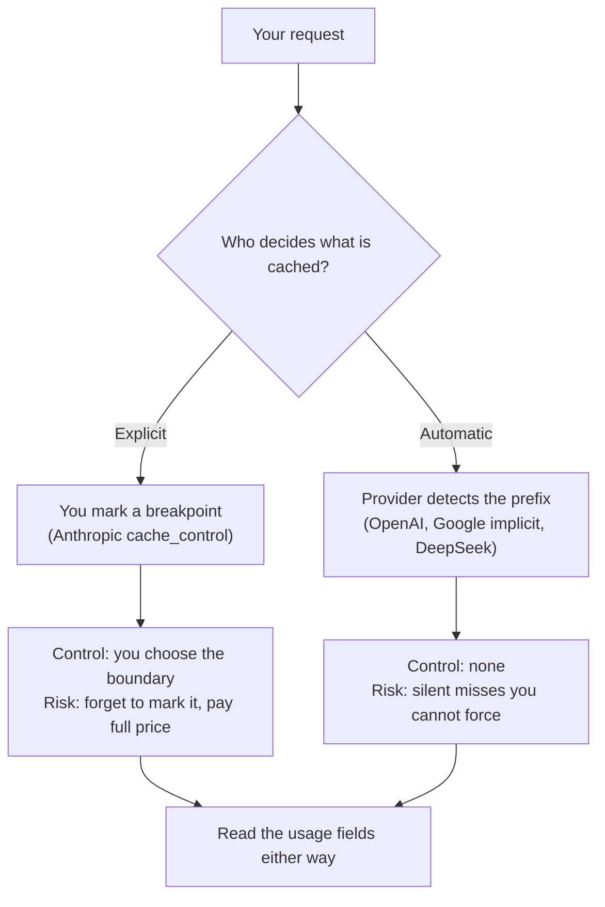

<LevelBadge level="advanced" />

<VerifyNote lastVerified="2026-09-26" source="https://platform.claude.com/docs/en/build-with-claude/prompt-caching">
Chaque chiffre de cette page est un tarif ou un seuil publié que les fournisseurs modifient selon leur propre calendrier — et les prix de la mise en cache de Gemini chez Google ont une hausse programmée au 2027-01-01. Revérifiez la documentation de chaque fournisseur avant d'établir votre budget : [Anthropic](https://platform.claude.com/docs/en/build-with-claude/prompt-caching) · [OpenAI](https://developers.openai.com/api/docs/guides/prompt-caching) · [Google](https://ai.google.dev/gemini-api/docs/caching) · [DeepSeek](https://api-docs.deepseek.com/guides/kv_cache).
</VerifyNote>

La mise en cache des prompts est le plus grand levier de réduction de coûts d'une application LLM en production — typiquement une réduction de plus de 90 % côté entrée. Tous les fournisseurs majeurs l'ont désormais. Cela donne facilement l'impression que c'est la même fonctionnalité partout, et ce n'est pas le cas.

Le mécanisme est identique : le fournisseur réutilise le **préfixe** déjà traité de votre prompt au lieu de le relire. Ce qui diffère, c'est qui décide, combien de temps le cache reste vivant, quelle longueur un préfixe doit atteindre pour être éligible, et — celui qui mord — **si vous payez ou non une prime pour l'écrire**. Une charge de travail réglée sur un fournisseur peut silencieusement cesser de mettre en cache, ou coûter *plus cher* que sans cache du tout, chez le fournisseur suivant.

<Callout type="objectives" items={[
  "Distinguer les deux modèles de contrôle — points d'arrêt explicites vs détection automatique du préfixe — et ce que chacun vous coûte",
  "Lire le tableau comparatif entre fournisseurs : préfixe minimum, TTL, remise en lecture, prime d'écriture, et le champ d'usage qui prouve un hit",
  "Appliquer la règle de rentabilité portable : combien de réutilisations dans le TTL avant que la mise en cache soit rentable",
  "Éviter les cinq pièges qui tuent silencieusement un cache quand vous migrez une charge de travail entre fournisseurs",
  "Vérifier un taux de hit réel sur n'importe quel fournisseur à partir de l'usage renvoyé dans la réponse, pas de la documentation",
]} />

Si vous ne travaillez qu'avec Claude, lisez d'abord [Mise en cache des prompts et optimisation des coûts](/docs/api/prompt-caching) — elle explique en profondeur le mécanisme `cache_control`. Cette page est la couche de portabilité au-dessus.

## Les deux modèles de contrôle

Tout dans ce domaine relève de l'un de ces deux designs, et le design détermine votre mode de défaillance.



**Explicite** (Anthropic) : vous attachez un marqueur au dernier bloc stable. Rien n'est mis en cache tant que vous ne le demandez pas. Vous obtenez un contrôle exact sur la frontière et pouvez en placer plusieurs. Vous héritez aussi du bug : un prompt sans point d'arrêt paie plein tarif pour toujours, et rien ne vous avertit.

**Automatique** (OpenAI, la mise en cache implicite de Google, DeepSeek) : le fournisseur hache votre préfixe et réutilise ce qu'il peut. Rien à configurer, et rien à corriger en cas d'échec. Votre seul levier est la *disposition* du prompt — placer le contenu stable en premier — plus, chez OpenAI, un indice de routage.

:::tip Le levier que vous gardez dans les deux modèles
L'ordre du préfixe est le seul contrôle qui fonctionne partout. **Le contenu stable en premier, le contenu volatil en dernier.** Sur les systèmes explicites, il détermine où votre point d'arrêt peut se placer ; sur les systèmes automatiques, c'est la *seule* chose que vous contrôlez.
:::

## Le tableau comparatif entre fournisseurs

<VerifyNote lastVerified="2026-09-26" source="https://developers.openai.com/api/docs/guides/prompt-caching">
Les ratios de lecture ci-dessous sont des multiples du prix d'entrée de base de chaque fournisseur, pas des montants absolus — c'est ce qui les rend comparables. Les prix absolus se trouvent dans [Modèles et tarifs](/docs/whats-new/models-and-pricing) et sur la page de tarification de chaque fournisseur.
</VerifyNote>

| | Anthropic (Claude) | OpenAI | Google (Gemini) | DeepSeek |
|---|---|---|---|---|
| **Contrôle** | `cache_control` explicite, jusqu'à 4 points d'arrêt | Automatique, correspondance de préfixe | Implicite par défaut ; objets de cache explicites également disponibles | Automatique, sur disque |
| **Préfixe minimum** | 512 tokens sur Fable 5.1 / Mythos 5.1 / Opus 5.5 / Opus 5 / Fable 5 / Mythos 5 ; 1 024 sur Sonnet 5 et Opus 4.8 ; 2 048–4 096 sur les modèles plus anciens | 1 024 tokens sur GPT-5.6 et versions ultérieures ; varie selon les paramètres de requête avant cela | 4 096 tokens sur Gemini 3.5–3.8 Flash et 3.1 Pro Preview ; 2 048 sur Gemini 2.5 Flash / Pro | Non publié comme un nombre de tokens — les unités de cache se situent aux frontières de requête, aux préfixes communs détectés, et à des intervalles de tokens fixes |
| **TTL** | 5 minutes par défaut ; 1 heure en option | 30 minutes par défaut sur GPT-5.6+ via `prompt_cache_options.ttl` ; les modèles antérieurs utilisent `prompt_cache_retention` — en mémoire (typiquement 5–10 min) ou 24h | Pas de valeur par défaut fixe publiée pour la mise en cache implicite | Éviction automatique « en quelques heures à quelques jours » une fois inutilisé |
| **Lecture du cache** | 0,1× le prix d'entrée de base ; 0,05× sur Opus 5.5 ; 0,025× sur Fable 5.1 / Mythos 5.1 | 0,1× le prix d'entrée de base | Publié comme un tarif d'entrée mise en cache séparé (0,1× le tarif standard sur Gemini 3.8 Flash jusqu'au 2026-12-31) | Tarif d'entrée en cas de hit séparé, environ 1/30e du tarif en cas de miss sur `deepseek-v4-pro` |
| **Prime d'écriture du cache** | 1,25× le prix d'entrée de base pour le palier de 5 minutes ; 2× pour le palier d'1 heure | 1,25× le prix d'entrée de base sur GPT-5.6+ | Aucune pour la mise en cache implicite ; la mise en cache explicite facture le **stockage** à 0,50 $ par million de tokens par heure sur Gemini 3.8 Flash jusqu'au 2026-12-31 | Aucune publiée |
| **Preuve d'un hit** | `cache_read_input_tokens` et `cache_creation_input_tokens` dans `usage` | Nombre de tokens mis en cache dans `usage` | `usage.total_cached_tokens` | `prompt_cache_hit_tokens` et `prompt_cache_miss_tokens` |
| **Comptabilité / indice de routage** | Placement du point d'arrêt | `prompt_cache_key` — comptabilité de cache séparée sur GPT-5.6+, routage de cache avant cela | — | — |

Pour les modèles open source auto-hébergés, la même idée existe un niveau plus bas sous forme de **mise en cache de préfixe** dans le moteur de service : vLLM et SGLang réutilisent des blocs de KV-cache pour un préfixe partagé. Il n'y a pas de prix par token, donc pas de seuil de rentabilité à calculer — le coût est la VRAM, et le gain est la latence de prefill, pas la facture. vLLM l'expose via `enable_prefix_caching` ; sur le moteur V1, c'est activé par défaut, donc sur une version actuelle vous êtes plus susceptible de devoir le *désactiver* que l'inverse. Voir [Exécuter des modèles localement avec Ollama](/docs/models/run-models-locally-ollama) et [Une pile IA locale privée](/docs/models/private-local-ai-stack).

## La règle de rentabilité

Voici la partie que la documentation des fournisseurs laisse en exercice. La mise en cache n'est pas gratuite sur les systèmes explicites, et depuis GPT-5.6 elle ne l'est plus non plus chez OpenAI. Une prime d'écriture signifie qu'**un préfixe que vous ne réutilisez qu'une seule fois peut vous coûter plus cher que de ne pas le mettre en cache.**

Soit `P` ce que le préfixe coûterait au tarif d'entrée de base, `w` le multiplicateur d'écriture, `r` le multiplicateur de lecture, et `N` le nombre d'appels qui partagent le préfixe **à l'intérieur d'une même fenêtre de TTL**.

```text
Without caching:  N · P
With caching:     w · P  +  (N − 1) · r · P

Caching wins when:   w + (N − 1) · r  <  N
Which solves to:     N  >  (w − r) / (1 − r)
```

Insérez les multiplicateurs publiés :

| Palier | w | r | N de rentabilité | Réutilisations nécessaires |
|---|---|---|---|---|
| Anthropic 5 minutes, Opus 5.5 | 1,25 | 0,05 | 1,26 | **2 appels** |
| Anthropic 5 minutes, palier de lecture standard | 1,25 | 0,1 | 1,28 | **2 appels** |
| Anthropic 1 heure | 2 | 0,1 | 2,11 | **3 appels** |
| OpenAI GPT-5.6+ | 1,25 | 0,1 | 1,28 | **2 appels** |
| Automatique, sans prime d'écriture | 1 | 0,1 | 0 | **1 appel** — jamais de perte |

La règle empirique tient donc en une phrase : **deux hits à l'intérieur du TTL et vous êtes gagnant ; visez trois avant d'acheter le palier d'1 heure.** En dessous, mettre un préfixe en cache est une petite perte silencieuse.

<Callout type="tip" items={[
  "N compte les appels à l'intérieur d'une même fenêtre de TTL, pas les appels par jour. Un préfixe réutilisé 1 000 fois par jour en rafales espacées de 20 minutes repaie l'écriture à chaque rafale.",
  "Le palier d'1 heure n'est pas une amélioration automatique. Il double la prime d'écriture pour obtenir une fenêtre 12 fois plus longue — cela n'en vaut la peine que si votre trafic est réellement épars."
]} />

### Exemple concret : un préfixe de 50k tokens, 1 000 appels par jour

Sur Claude Opus 5.5 — entrée de base 4 $/MTok, écriture 5 minutes 5 $/MTok, lecture 0,20 $/MTok, tous tirés du tableau de tarification d'Anthropic :

<Steps items={[
  {title: "Aucune mise en cache", body: "50 000 tokens x 1 000 appels = 50M tokens d'entrée. À 4 $/MTok, cela fait 200 $/jour, chaque jour, pour un contenu qui n'a jamais changé."},
  {title: "Trafic uniformément réparti — une seule écriture", body: "1 000 appels par jour, c'est un appel toutes les ~86 secondes, confortablement à l'intérieur du TTL de 5 minutes, donc le cache n'expire jamais. Une écriture (50k à 5 $/MTok = 0,25 $) plus 999 lectures (49,95M à 0,20 $/MTok = 9,99 $) donne environ 10,24 $/jour — une réduction de 95 %."},
  {title: "Trafic en rafales — 100 écritures", body: "Les mêmes 1 000 appels, arrivant en 100 rafales avec des intervalles supérieurs à 5 minutes. Vous payez maintenant 100 écritures (5M à 5 $/MTok = 25 $) plus 900 lectures (45M à 0,20 $/MTok = 9 $) — environ 34 $/jour. Toujours une réduction de 83 %, mais 3,3 fois la facture du trafic uniforme."},
  {title: "Décider pour le palier d'1 heure", body: "Avec 100 rafales par jour espacées en moyenne d'environ 14 minutes, une fenêtre d'1 heure regroupe la plupart de ces 100 écritures en une poignée. La prime d'écriture double, donc vérifiez la ligne d'écriture de l'étape 3 face au nombre d'écritures réduit avant de basculer."}
]} />

Le point pédagogique est l'étape 3 face à l'étape 2 : **le même volume d'appels, le même préfixe, et une différence de facture de 3,3 fois, décidée entièrement par le motif d'arrivée face au TTL.** Le motif d'arrivée est la variable que personne ne met dans le tableur.

## Cinq pièges lors de la migration d'une charge de travail

<Callout type="warning" items={[
  "Écart de TTL : un job qui tourne toutes les 10 minutes obtient un hit sur le TTL par défaut de 30 minutes d'OpenAI et un miss sur le TTL par défaut de 5 minutes d'Anthropic. Même code, même prompt, taux de hit nul.",
  "Écart de seuil : un prompt système de 2 500 tokens se met en cache sur Claude Opus 5.5 (minimum de 512 tokens) et sur GPT-5.6 (1 024) mais pas sur Gemini 3.8 Flash (4 096). L'échec est silencieux — aucune erreur, juste une facture plein tarif.",
  "Écart d'invalidateurs : chaque fournisseur invalide sur un préfixe modifié, mais les déclencheurs non évidents diffèrent. Chez Anthropic, modifier les définitions d'outils, tool_choice, ou (selon le modèle) les paramètres de thinking et d'effort invalide le cache. Chez OpenAI, modifier le modèle, les définitions d'outils, les schémas, l'effort de raisonnement, la verbosité, ou la compaction de contexte le fait.",
  "Écart de prime d'écriture : migrer un préfixe à faible réutilisation d'un fournisseur automatique vers un fournisseur explicite peut le rendre plus coûteux que l'absence de cache. Appliquez la règle de rentabilité ci-dessus avant de marquer un point d'arrêt.",
  "Écart d'observabilité : les noms des champs d'usage ne suivent aucune convention commune. Tout tableau de bord qui analyse les champs de cache d'un fournisseur a besoin d'un adaptateur par fournisseur, sinon votre taux de hit apparaît comme nul après une migration."
]} />

Le seul mécanisme spécifique à Anthropic sans équivalent ailleurs : le cache est recherché sur une **fenêtre de rétrospection de 20 blocs** par point d'arrêt. Une conversation qui grandit régulièrement peut dépasser cette fenêtre et cesser d'obtenir des hits même si le préfixe est inchangé — voir [Économie de la mise en cache des prompts](/docs/frontiers/prompt-caching-economics) pour les règles d'invalidation en détail.

## Vérifiez-le, ne le supposez pas

La documentation décrit une intention ; `usage` décrit ce qui vous a été facturé. Vérifiez le taux de hit réel sur chaque fournisseur que vous utilisez.

<PromptCard title="Auditer le taux de hit de cache d'une charge de travail">{`Audit prompt caching for this codebase.

1. List every place we call an LLM API, with the provider and model.
2. For each call site, identify the prefix that is stable across calls
   and anything volatile that appears BEFORE it (timestamps, user IDs,
   reordered tool lists, freshly serialized JSON with unstable key order).
3. Report the token length of each stable prefix and compare it to that
   provider's minimum cacheable length. Flag any prefix below it.
4. Estimate the typical gap between consecutive calls sharing each prefix
   and compare it to that provider's cache TTL. Flag any gap that exceeds it.
5. Show me where we read the cache fields back from the response usage.
   If we never read them, say so plainly — that is the finding.

Do not change any code. Give me a table of call site, provider, prefix
tokens, minimum, typical gap, TTL, and the fields we read.`}</PromptCard>

Deux signatures d'échec à connaître, car elles se ressemblent sur un tableau de bord mais ont des correctifs opposés :

- **Tokens mis en cache toujours à zéro** sur des requêtes répétées qui devraient partager un préfixe → une valeur volatile se trouve avant votre contenu stable, ou le préfixe est sous le minimum. Comparez les octets du prompt *rendu* entre deux appels.
- **Tokens mis en cache non nuls mais la facture a à peine bougé** → le préfixe est mis en cache mais il est court par rapport à votre suffixe volatil. La mise en cache fonctionne ; ce n'est simplement pas là que va votre argent. Regardez les tokens de sortie et [pourquoi les agents consomment des tokens](/docs/models/why-agents-burn-tokens) à la place.

<Flashcards title="Retenez les termes" cards={[
  {front: "Mise en cache explicite vs automatique", back: "Explicite (Anthropic) : vous marquez un point d'arrêt, rien ne se met en cache tant que vous ne le faites pas. Automatique (OpenAI, Gemini implicite, DeepSeek) : le fournisseur fait la correspondance de préfixe pour vous, et vous ne pouvez pas forcer un hit."},
  {front: "Prime d'écriture", back: "La surtaxe sur l'appel qui alimente le cache — 1,25x le prix d'entrée de base sur le palier de 5 minutes d'Anthropic et sur OpenAI GPT-5.6+, 2x sur le palier d'1 heure d'Anthropic. C'est pourquoi un préfixe réutilisé une seule fois peut coûter plus cher mis en cache que non mis en cache."},
  {front: "N de rentabilité", back: "(w - r) / (1 - r), où w est le multiplicateur d'écriture et r le multiplicateur de lecture. Deux réutilisations à l'intérieur du TTL pour les paliers de 5 minutes, trois pour le palier d'1 heure d'Anthropic."},
  {front: "Fenêtre de TTL", back: "Combien de temps une entrée inutilisée survit. Anthropic 5 minutes (1 heure en option) ; OpenAI 30 minutes par défaut sur GPT-5.6+, avec une option de rétention de 24h sur les modèles antérieurs. N est compté à l'intérieur d'une seule fenêtre, pas par jour."},
  {front: "Facturation du stockage", back: "Propre à la mise en cache explicite de Gemini : vous payez pour conserver le cache par token-heure (0,50 $ par million de tokens par heure sur Gemini 3.8 Flash jusqu'au 2026-12-31), en plus du tarif d'entrée mise en cache. La mise en cache implicite n'a aucun frais de stockage."},
  {front: "Mise en cache de préfixe (auto-hébergée)", back: "La même réutilisation un niveau plus bas, dans vLLM ou SGLang, sur des blocs de KV-cache. Aucun prix par token, donc aucune rentabilité à calculer — vous payez en VRAM et gagnez en latence de prefill."}
]} />

<Quiz title="Vérifiez-vous" questions={[
  {q: "Un préfixe sera réutilisé exactement deux fois à l'intérieur de la fenêtre. Quel palier est le mauvais choix ?", options: ["Le palier de 5 minutes d'Anthropic", "Le palier d'1 heure d'Anthropic", "Un fournisseur automatique sans prime d'écriture"], answer: 1, explain: "La prime d'écriture de 2x du palier d'1 heure nécessite N > 2,11, donc trois réutilisations. À exactement deux, c'est une petite perte. Le palier de 5 minutes atteint la rentabilité à 1,28 et le fournisseur automatique ne perd jamais."},
  {q: "Un prompt système de 2 500 tokens se mettait bien en cache sur Claude et a cessé de le faire après une migration vers Gemini 3.8 Flash. Cause la plus probable ?", options: ["Gemini ne prend pas en charge la mise en cache", "Le préfixe est sous le minimum de 4 096 tokens de Gemini", "Le TTL du cache a expiré en cours de requête"], answer: 1, explain: "Gemini 3.8 Flash exige 4 096 tokens d'entrée pour être éligible au cache ; Claude Opus 5.5 en exige 512. Un préfixe de 2 500 tokens franchit une barre et pas l'autre, sans erreur — juste une facture plein tarif."},
  {q: "Même prompt, mêmes 1 000 appels par jour. Pourquoi la facture triplerait-elle ?", options: ["Le modèle a changé", "Les tokens de sortie ont augmenté", "Les appels sont arrivés en rafales espacées plus largement que le TTL, repayant l'écriture à chaque fois"], answer: 2, explain: "Le N de rentabilité compte les réutilisations à l'intérieur d'une seule fenêtre de TTL. Des rafales espacées plus largement que le TTL laissent l'entrée expirer, donc chaque rafale repaie la prime d'écriture — l'exemple concret ci-dessus passe d'environ 10 $ à environ 34 $ par jour exactement sur ce changement."},
  {q: "Les tokens mis en cache lus sont non nuls, mais la facture a à peine bougé. Que cela vous indique-t-il ?", options: ["Le cache est cassé", "Le préfixe se met en cache, mais il est petit par rapport à la partie volatile de votre dépense", "Vous avez besoin du palier d'1 heure"], answer: 1, explain: "Des tokens mis en cache non nuls prouvent que le cache fonctionne. Si les économies sont faibles, c'est simplement que le préfixe stable n'est pas là où va l'argent — regardez plutôt les tokens de sortie et le suffixe volatil."}
]} />

<Callout type="takeaways" items={[
  "Deux designs, deux modes de défaillance : la mise en cache explicite échoue en n'étant jamais marquée ; la mise en cache automatique échoue silencieusement et vous ne pouvez pas forcer un hit.",
  "La mise en cache n'est pas automatiquement gratuite. Avec une prime d'écriture, il faut N > (w - r) / (1 - r) réutilisations à l'intérieur d'un TTL — deux appels pour les paliers de 5 minutes, trois pour le palier d'1 heure d'Anthropic.",
  "Le motif d'arrivée face au TTL, pas le volume d'appels, décide de la facture : les mêmes 1 000 appels quotidiens coûtent environ 10 $ répartis uniformément et environ 34 $ en rafales sur Opus 5.5.",
  "La longueur minimale de préfixe s'étend de 512 à 4 096 tokens selon les fournisseurs — un prompt qui se met en cache sur Claude peut silencieusement cesser de le faire sur Gemini Flash.",
  "Prouvez le taux de hit à partir de l'usage renvoyé dans la réponse sur chaque fournisseur ; les noms de champs ne suivent aucune convention commune, donc un tableau de bord a besoin d'un adaptateur par fournisseur.",
  "Le contenu stable en premier, le contenu volatil en dernier. C'est le seul levier qui fonctionne sur tous les fournisseurs, y compris la mise en cache de préfixe auto-hébergée.",
]} />

## Sources et lectures complémentaires

- [Anthropic : mise en cache des prompts](https://platform.claude.com/docs/en/build-with-claude/prompt-caching) — longueurs minimales par modèle, la limite de 4 points d'arrêt, les paliers de 5 minutes et d'1 heure, les multiplicateurs d'écriture/lecture, la hiérarchie d'invalidation et la fenêtre de rétrospection de 20 blocs.
- [OpenAI : mise en cache des prompts](https://developers.openai.com/api/docs/guides/prompt-caching) — activée par défaut, le minimum de 1 024 tokens sur GPT-5.6+, `prompt_cache_options.ttl`, `prompt_cache_retention`, `prompt_cache_key`, et les tarifs d'écriture 1,25x / de lecture 0,1x.
- [Google : mise en cache de contexte Gemini](https://ai.google.dev/gemini-api/docs/caching) et [Tarification de l'API Gemini](https://ai.google.dev/gemini-api/docs/pricing) — mise en cache implicite activée par défaut pour 2.5 et versions plus récentes, les minimums de tokens par modèle, `usage.total_cached_tokens`, et les tarifs d'entrée mise en cache plus stockage avec leur hausse du 2027-01-01.
- [DeepSeek : mise en cache de contexte sur disque](https://api-docs.deepseek.com/guides/kv_cache) et [Tarification DeepSeek](https://api-docs.deepseek.com/quick_start/pricing) — automatique pour tous les utilisateurs, où se situent les unités de cache, la fenêtre d'éviction, et la répartition des tokens hit/miss dans la réponse.
- [vLLM : mise en cache automatique de préfixe](https://docs.vllm.ai/en/latest/features/automatic_prefix_caching/) — ce que la mise en cache de préfixe accélère et n'accélère pas quand vous hébergez le modèle vous-même.
- Compagnons AILmanac : [Mise en cache des prompts et optimisation des coûts](/docs/api/prompt-caching) · [Diagnostic du cache](/docs/api/cache-diagnostics) · [Économie de la mise en cache des prompts](/docs/frontiers/prompt-caching-economics) · [Ce que l'IA coûte réellement selon les fournisseurs](/docs/models/what-ai-costs-across-providers)

## Suite

- [Diagnostic du cache](/docs/api/cache-diagnostics) — Anthropic est le seul fournisseur ici à nommer *quelle* partie du préfixe a divergé ; les correctifs qu'il enseigne s'appliquent au reste.
- [Ce que l'IA coûte réellement selon les fournisseurs](/docs/models/what-ai-costs-across-providers) — transformez ces multiplicateurs en une estimation de charge de travail que vous pouvez défendre
- [Pourquoi les agents IA consomment des tokens (et comment plafonner la facture)](/docs/models/why-agents-burn-tokens) — l'autre moitié de la facture, que la mise en cache ne touche pas
- [Porter des prompts entre modèles](/docs/models/porting-prompts-across-models) — ce qui casse d'autre quand le même prompt change de fournisseur
