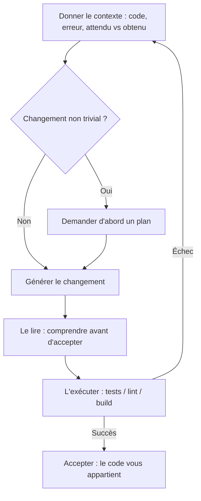

<LevelBadge level="all" />

<Callout type="objectives" items={["Savoir ce que l'IA de codage sait vraiment bien faire — expliquer, générer, refactoriser, déboguer, traduire, réviser", "Exécuter la boucle d'or : contexte, plan, génération, lecture, exécution — et renvoyer les échecs comme contexte frais", "Recourir à des prompts qui portent leur poids au lieu de vagues formules", "Intérioriser les deux règles dures : vérifier en exécutant, et ne jamais coller de secrets"]} />

Que vous appreniez à coder ou que vous livriez du logiciel en production, l'IA change la boucle. Les gagnants la traitent comme un binôme rapide et compétent — et **vérifient tout ce qu'elle produit**.

## Ce qu'elle fait très bien

- **Expliquer** du code inconnu ou des erreurs en langage clair.
- **Générer** du boilerplate, des tests et des premières versions de fonctions.
- **Refactoriser** pour la clarté, et **déboguer** en raisonnant sur une trace de pile.
- **Traduire** entre langages/frameworks.
- **Réviser** un diff pour repérer bugs et odeurs.

Pour de vrais codebases, faites-le *dans* votre dépôt avec [Claude Code](/docs/claude-code/what-is-claude-code), qui peut lire des fichiers, exécuter des tests et éditer avec votre approbation.

## La boucle d'or

1. **Donnez du contexte** — le code pertinent, l'erreur, ce que vous attendiez vs ce que vous avez obtenu. Vague à l'entrée, vague à la sortie.
2. **Demandez un plan** pour les changements non triviaux avant les éditions ([Plan Mode](/docs/claude-code/plan-mode)).
3. **Générez** le changement.
4. **Lisez-le** — comprenez avant d'accepter. Le code vous appartient.
5. **Exécutez-le** — tests/lint/build. *Ne croyez jamais « ça marche » sans l'exécuter.*

L'étape qui sépare les bons résultats des mauvais est la flèche de retour vers le haut : quand un test échoue, vous ne rustinez pas à l'aveugle — vous renvoyez l'échec comme contexte frais.

## Prompts qui portent leur poids

<PromptCard title="Expliquer le code + repérer les cas limites">{`Explain what this function does and any edge cases it mishandles: {code}`}</PromptCard>

<PromptCard title="Générer des tests">{`Write tests for {function}. Cover the happy path and the edge cases. {code}`}</PromptCard>

<PromptCard title="Déboguer depuis une trace de pile">{`This throws {error}. Here's the code and stack trace. Find the root cause and propose a minimal fix. {context}`}</PromptCard>

## Règles dures

:::warning Vérifiez, et protégez vos secrets
- **Exécutez et révisez** le code généré — il peut être subtilement faux ou inventer des API qui n'existent pas.
- **Ne collez jamais de secrets/clés** dans un prompt ([Confidentialité](/docs/foundations/privacy)).
- Pour le codage agentique/automatisé, verrouillez les [permissions](/docs/claude-code/permissions) et lisez [Sécuriser les agents](/docs/security/securing-agents).
:::

<Quiz title="Vérifiez-vous" questions={[{q: "Dans la boucle d'or, qu'est-ce qui distingue le plus les bons résultats de codage IA des mauvais ?", options: ["Utiliser toujours le plus gros modèle disponible", "La flèche de retour vers le haut : renvoyer la sortie d'un test échoué comme contexte frais au lieu de rustiner à l'aveugle", "Accepter la première génération pour gagner du temps"], answer: 1, explain: "La boucle est la méthode. Quand un test échoue, ne devinez pas un patch — renvoyez l'échec comme nouveau contexte pour que la tentative suivante soit ancrée dans ce qui s'est réellement mal passé."}, {q: "Pourquoi lire le code généré avant de l'accepter ?", options: ["La lecture déclenche l'exécuteur de tests", "Il peut être subtilement faux ou inventer des API inexistantes — et le code vous appartient de toute façon", "Le SDK refuse d'exécuter du code que vous n'avez pas ouvert"], answer: 1, explain: "La sortie IA a l'air confiante même quand elle est fausse, et elle appelle parfois des fonctions qui n'existent pas. La lire est le moyen de le détecter avant expédition — et la responsabilité vous incombe quel que soit l'auteur."}, {q: "Lequel de ces éléments ne doit jamais entrer dans un prompt ?", options: ["Le message d'erreur et la trace de pile", "Secrets ou clés d'API", "Ce que vous attendiez vs ce qui s'est réellement passé"], answer: 1, explain: "Erreurs, traces de pile et attendu-vs-réel sont exactement le contexte qui améliore les résultats. Secrets et clés sont la seule chose à garder dehors — les coller, c'est les fuiter."}]} />

<Callout type="takeaways" items={["Traitez l'IA comme un binôme rapide et compétent — puis vérifiez tout ce qu'elle produit en l'exécutant vraiment", "Contexte à l'entrée, qualité à la sortie : donnez le code, l'erreur et attendu-vs-réel, jamais une demande vague", "Demandez un plan avant les éditions non triviales pour valider l'approche avant tout changement de code", "Lisez le code généré avant d'accepter — il peut être subtilement faux ou inventer des API inexistantes", "Ne collez jamais de secrets ou clés dans un prompt, et verrouillez les permissions avant de laisser un agent coder seul"]} />

## Suite

- [Ce qu'est Claude Code](/docs/claude-code/what-is-claude-code)
- [Personnaliser Claude Code pour un vrai dépôt](/docs/walkthroughs/customize-claude-code)
- [Votre premier appel API](/docs/api/first-call)
