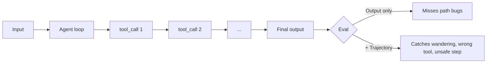

<LevelBadge level="advanced" />

<VerifyNote lastVerified="2026-07-24" source="https://platform.claude.com/docs/en/test-and-evaluate/develop-tests">
Le guide d'évaluation d'Anthropic est la source de vérité pour la méthodologie (critères SMART, exact-match, Likert/binaire noté par LLM). L'évaluation de trajectoire d'agent est une discipline émergente — traitez les noms de frameworks comme illustratifs et confirmez les API dans la documentation de chaque éditeur.
</VerifyNote>

<Callout type="objectives" items={["Comprendre pourquoi les évaluations d'agents diffèrent des évaluations de prompts — la trajectoire compte, pas seulement la réponse finale", "Construire un golden set de 20 à 100 cas réels avec des critères de réussite clairs", "Noter quatre couches : justesse des appels d'outils, qualité de trajectoire, succès de la tâche, dérive en production", "Utiliser LLM-as-judge en toute sécurité : rubrique d'abord, calibrage contre les humains, vérification ponctuelle des verdicts", "Livrer une évaluation qui tourne en CI et fait échouer un mauvais changement avant qu'il n'atteigne les utilisateurs"]} />

Une **évaluation d'agent** répond à une question plus difficile que « le prompt a-t-il renvoyé les bons mots ? ». Elle demande : *un modèle exécuté en boucle a-t-il choisi les bons outils, dans le bon ordre, avec les bons arguments, est-il arrivé au bon résultat — et est-il resté dans les limites de budget et de sécurité ?*

Sautez cette étape et vous livrerez un agent « utile » qui régresse silencieusement chaque fois que vous ajustez le system prompt.

## Pourquoi les agents ont besoin de leurs propres évaluations

Une évaluation de prompt unique note une entrée → une sortie. Un agent produit une **trajectoire** : une chaîne de raisonnement, d'appels d'outils, d'observations intermédiaires et de révisions sur plusieurs tours. Deux modes de défaillance rendent cela difficile :

- **Bonne réponse, mauvais chemin.** L'agent tombe sur la bonne sortie après des boucles inutiles, des actions dangereuses ou des devinettes chanceuses. Les évaluations basées uniquement sur la réponse finale marquent cela comme réussi ; la production ne le fera pas.
- **Mauvaise réponse, chemin plausible.** Chaque étape semble raisonnable isolément, mais l'agent a mal utilisé un outil, ignoré une contrainte ou halluciné un fait intermédiaire. Il faut regarder la trace, pas seulement la réponse.



## Les quatre couches d'évaluation

Empilez-les de la moins coûteuse à la plus coûteuse afin qu'un mauvais changement échoue rapidement sans attendre des correcteurs onéreux.

<Steps items={[
  {title: "Couche 1 — Justesse des appels d'outils (déterministe)", body: "Pour chaque étape attendue, vérifiez que le nom de l'outil correspond, que les paramètres requis sont présents et que les types sont validés. Code pur, millisecondes, aucun modèle nécessaire. Attrape le « a appelé search alors qu'il aurait dû appeler write_file » avant tout le reste."},
  {title: "Couche 2 — Qualité de trajectoire (rubrique + LLM-judge)", body: "Notez la trace complète : l'agent a-t-il suivi un chemin sensé, ou a-t-il erré, bouclé ou fait marche arrière ? Nombre d'étapes vs. minimum nécessaire, appels redondants, retries après erreurs d'outils, s'il s'est arrêté une fois terminé. Utilisez ici un juge LLM avec une rubrique explicite."},
  {title: "Couche 3 — Succès de la tâche (end-to-end)", body: "L'objectif a-t-il été atteint ? Déterministe quand c'est possible (schéma valide, fichier écrit, test qui passe), noté par LLM quand c'est flou (résumé fidèle, réponse utile). C'est votre chiffre phare."},
  {title: "Couche 4 — Dérive & sécurité en production", body: "En prod, échantillonnez de vraies traces et re-notez une tranche. Surveillez le taux d'intervention (à quelle fréquence un humain a dû intervenir), le taux de refus et le coût par tâche réussie. Quand ces valeurs bougent, votre modèle, vos outils ou vos entrées ont changé sous vos pieds."}
]} />

## Les métriques qui prédisent la valeur

Toutes les métriques ne méritent pas leur place sur le dashboard. Ces cinq-là dictent les décisions de mise en production en 2026 :

| Métrique | Ce qu'elle mesure | Pourquoi elle compte |
|---|---|---|
| **Taux de succès des tâches** | % des cas du golden set que l'agent termine correctement | Le chiffre phare. Tout le reste est diagnostique. |
| **Coût par tâche réussie** | $ / cas réussi (tokens in + out, coûts d'outils) | Réussir à 10× le coût est une régression. |
| **Latence (p50 / p95)** | Temps réel par tâche, queue incluse | Le p95 est ce que ressentent les vrais utilisateurs — les moyennes mentent. |
| **Précision des appels d'outils** | % des appels d'outils attendus avec nom + args corrects | Prédit la qualité de trajectoire ; peu coûteux à calculer. |
| **Taux d'intervention** | % des tâches nécessitant une prise en main humaine en prod | Le chiffre d'autonomie. En hausse = confiance en baisse. |

Suivez-les ensemble — l'une qui bouge sans les autres est généralement un signal précurseur, pas du bruit.

## Construire le golden set

<Steps items={[
  {title: "Extraire de vraies entrées", body: "Extrayez 20 à 100 tâches de l'usage réel (logs, tickets de support, requêtes utilisateurs). Couvrez le chemin facile fréquent, le milieu délicat et les cas limites qui vous ont déjà mordu."},
  {title: "Écrire les critères de réussite par cas", body: "Pour chacun : à quoi ressemble « terminé » ? Sortie attendue exacte, faits requis, schéma JSON valide, fichiers qui doivent exister, ou rubrique pour les cas flous. Si vous ne pouvez pas écrire le critère, le cas est inutilisable — coupez-le ou clarifiez-le."},
  {title: "Annoter la trajectoire idéale", body: "Pour un sous-ensemble, esquissez la séquence d'outils qu'un bon agent suivrait. C'est contre cela que la Couche 1 vérifie."},
  {title: "Le figer, le versionner", body: "Committez le set dans votre repo. Ne modifiez jamais un cas sur place — ajoutez v2 à côté de v1 pour que l'historique des scores reste comparable."},
  {title: "Le faire croître à partir des échecs", body: "Chaque bug de prod devient un nouveau cas d'évaluation avant que vous ne le corrigiez. C'est ainsi que le set reste prédictif au lieu de se dégrader."}
]} />

## LLM-as-judge — pas cher, rapide, mais calibrez-le

Noter à la main des sorties floues ne passe pas à l'échelle. Un modèle capable lisant selon une rubrique explicite, si — le propre [guide de méthodologie d'évaluation](https://platform.claude.com/docs/en/test-and-evaluate/develop-tests) d'Anthropic recommande ce pattern pour le ton, la fidélité, l'utilité et la sécurité.

Les juges ont des biais bien documentés : ils préfèrent les réponses plus longues, la première option montrée, et les sorties qui reprennent leurs propres formulations. Trois habitudes les gardent honnêtes :

- **Rubrique, pas ressentis.** « Notez l'utilité de 1 à 5 » est inutile. Ancrez chaque point de l'échelle à un comportement observable.
- **Calibrez sur un échantillon annoté par humains.** Faites noter 30 à 50 cas par des humains ; mesurez l'accord juge-vs-humain (visez un κ de Cohen ≥ 0,6). S'il diverge, resserrez la rubrique.
- **Utilisez un modèle différent comme juge.** Noter avec le même modèle qui a produit la sortie induit du biais dans les deux sens.
- **Vérifiez les verdicts par échantillonnage hebdomadaire.** Lisez 10 scores aléatoires du juge et leur raisonnement. C'est le moyen le moins cher de détecter la dérive.

<PromptCard title="Modèle de rubrique LLM-as-judge">{`You are grading an AI assistant's response against a rubric. Be strict. Cite exact evidence from the response.

<task>{task}</task>
<response>{response}</response>

Rubric (rate 1–5 per dimension):
- Task completion: 1 = ignored task; 3 = partial; 5 = fully done, no gaps.
- Faithfulness: 1 = contains false claims; 3 = mostly grounded, one soft claim; 5 = every claim traceable to input/tools.
- Efficiency: 1 = wandered/looped; 3 = extra steps; 5 = minimum viable path.

Output JSON only:
{"task_completion": N, "faithfulness": N, "efficiency": N, "evidence": "<quote>", "verdict": "pass"|"fail"}`}</PromptCard>

<PromptCard title="Prompt de revue de trajectoire (Couche 2)">{`You are auditing an AI agent's tool-call trajectory. The goal was: {goal}
Expected minimum steps: {n_min}

<trajectory>
{list of tool_name(args) -> result, in order}
</trajectory>

Answer in JSON:
{"steps_taken": N, "wasted_steps": N, "wrong_tool_calls": [<indices>], "unsafe_actions": [<indices>], "verdict": "pass"|"fail", "reason": "<one sentence>"}`}</PromptCard>

<PromptCard title="Générateur de cas adversariaux (faire croître le set)">{`Generate 5 new eval cases that are likely to break an agent whose current failures cluster around: {failure_pattern}.

For each case give: input, expected output OR pass criterion, ideal tool sequence, and why this case is hard.

Return YAML.`}</PromptCard>

## Gate CI : faire échouer le mauvais changement avant qu'il ne parte

L'évaluation ne rapporte que lorsqu'elle bloque automatiquement les régressions. Branchez-la dans la CI comme un check sur chaque changement de prompt / modèle / outil :

```python
# tests/eval_gate.py — runs on every PR
import json, sys
from anthropic import Anthropic
from my_agent import run_agent

client = Anthropic()
golden = json.load(open("evals/golden.v3.json"))

results = []
for case in golden:
    trace = run_agent(case["input"])
    layer1 = tool_calls_match(trace, case["expected_tools"])   # deterministic
    layer3 = judge(client, case, trace.final_output)           # LLM rubric
    results.append({"id": case["id"], "layer1": layer1, "layer3": layer3["verdict"]})

pass_rate = sum(r["layer3"] == "pass" for r in results) / len(results)
tool_acc  = sum(r["layer1"] for r in results) / len(results)

# Gates — tighten over time
assert pass_rate >= 0.85, f"Task success dropped to {pass_rate:.0%}"
assert tool_acc  >= 0.90, f"Tool-call accuracy dropped to {tool_acc:.0%}"
print(f"PASS: task={pass_rate:.0%} tools={tool_acc:.0%}")
```

Stockez les scores par run pour pouvoir tracer la tendance. Une chute de 3+ points entre deux merges est une vraie régression, pas du bruit.

<Callout type="warning" title="Anti-patterns qui font sous-livrer les évaluations" items={["Ne juger que la réponse finale — rate tous les bugs de trajectoire. Notez aussi les Couches 1 et 2.", "Golden set statique — s'il ne grandit pas avec chaque échec de prod, il cesse de prédire la prod. Budgétez du temps chaque mois.", "Même modèle comme agent et juge — biais dans les deux sens. Faites tourner vers un modèle différent pour la notation.", "Pas de coût ni de latence dans le gate — un tweak de prompt qui ajoute 8 appels d'outils peut « passer » l'évaluation tout en multipliant la facture par 10.", "Notation aux ressentis uniquement — « ça semble mieux » n'est pas une métrique. Si vous ne pouvez pas différencier deux nombres, vous ne pouvez pas livrer avec confiance."]} />

<Callout type="takeaways" items={["Les agents produisent des trajectoires, pas des réponses — évaluez le chemin, pas seulement le résultat", "Empilez les couches du moins cher au plus cher : justesse des appels d'outils → qualité de trajectoire → succès de la tâche → dérive en production", "Les cinq métriques qui décident du ship : taux de succès des tâches, coût par succès, latence p50/p95, précision des appels d'outils, taux d'intervention", "LLM-as-judge passe à l'échelle, mais seulement avec une rubrique explicite, un modèle différent et un calibrage contre des annotations humaines", "Un golden set qui ne grandit pas à partir des échecs de prod cesse de prédire la prod — faites-le croître chaque mois", "Branchez l'évaluation dans la CI comme un gate strict — le check qui attrape une régression avant les utilisateurs"]} />

## Testez-vous

<Quiz title="Testez-vous" questions={[
  {
    q: "Pourquoi les agents ont-ils besoin d'évaluations de trajectoire, pas seulement d'évaluations de la réponse finale ?",
    options: [
      "Les évaluations de réponse finale sont trop lentes pour tourner en CI",
      "Un agent peut arriver à la bonne réponse via des errances ou des étapes dangereuses (bonne réponse, mauvais chemin) — et produire un chemin plausible menant à une mauvaise réponse",
      "Les évaluations de trajectoire sont les seules à supporter LLM-as-judge",
      "Les évaluations de réponse finale ne fonctionnent que pour les tâches de classification"
    ],
    answer: 1,
    explain: "Deux modes de défaillance se cachent d'un scoring basé uniquement sur la sortie : bonne réponse via un mauvais chemin (marqué réussi, régressera en prod) et mauvaise réponse via un chemin plausible (échoue silencieusement). Il faut noter la trajectoire ainsi que le résultat."
  },
  {
    q: "Vous empilez vos évaluations en couches. Quel ordre est du moins cher au plus cher et correct ?",
    options: [
      "Succès de la tâche noté par LLM → checks déterministes des appels d'outils → dérive en production → rubrique de trajectoire",
      "Justesse déterministe des appels d'outils → qualité de trajectoire (LLM-judge) → succès de la tâche → dérive en production",
      "Dérive en production → succès de la tâche → rubrique de trajectoire → checks des appels d'outils",
      "Rubrique de trajectoire → succès de la tâche → checks des appels d'outils → dérive en production"
    ],
    answer: 1,
    explain: "La Couche 1 (checks déterministes des appels d'outils) tourne en millisecondes sans modèle, elle fait donc échouer rapidement les mauvais changements. Puis les couches de trajectoire et de succès de tâche notées par LLM, puis le monitoring de dérive en production."
  },
  {
    q: "Quelle paire d'habitudes maintient réellement LLM-as-judge digne de confiance dans le temps ?",
    options: [
      "Noter avec le même modèle que l'agent, et réécrire la rubrique à chaque run",
      "Utiliser une rubrique avec des ancres observables, et calibrer le juge contre un échantillon annoté par humains",
      "Préférer les prompts au ressenti pour éviter la sur-spécification, et ne jamais vérifier les verdicts par échantillonnage",
      "Toujours utiliser le plus grand modèle disponible comme juge, aucun calibrage nécessaire"
    ],
    answer: 1,
    explain: "Des rubriques ancrées retirent au juge la liberté d'inventer des critères, et le calibrage humain (κ de Cohen ≥ 0,6 est une cible courante) prouve que le juge est d'accord avec votre vérité terrain. Utiliser un modèle différent et faire des vérifications ponctuelles hebdomadaires complètent le tableau."
  },
  {
    q: "Votre gate CI passe le taux de succès des tâches mais la latence et le coût par tâche ont doublé. Quel est le bon choix ?",
    options: [
      "Livrer — le succès de la tâche est la métrique phare",
      "Faire échouer le gate : les cinq métriques de ship bougent ensemble, et un changement 2× en coût/latence est une régression même si le taux de réussite tient",
      "Relancer l'évaluation — les chiffres doivent être du bruit",
      "Assouplir le seuil du taux de réussite pour justifier le ship"
    ],
    answer: 1,
    explain: "Les cinq métriques décident du ship ensemble. Un tweak de prompt qui garde le taux de réussite plat tout en doublant coût ou latence est exactement l'échec que le gate existe pour attraper — les régressions de facture et d'UX frappent les utilisateurs aussi durement que les baisses de précision."
  }
]} />

<Flashcards cards={[
  {front: "Trajectoire (en évaluation d'agents)", back: "La chaîne complète et ordonnée d'appels d'outils, arguments, observations et étapes de raisonnement qu'un agent effectue sur une tâche — ce que vous évaluez en plus de la sortie finale."},
  {front: "Golden set", back: "Une collection figée et versionnée de 20 à 100 tâches réelles avec des critères de réussite explicites (et, pour un sous-ensemble, des trajectoires idéales) contre laquelle chaque changement de prompt/modèle/outil est noté."},
  {front: "Précision des appels d'outils", back: "% d'invocations d'outils attendues où le nom correspond et les paramètres requis sont validés. Déterministe, peu coûteux et un fort indicateur précurseur de la qualité de trajectoire."},
  {front: "LLM-as-judge", back: "Pattern de notation où un modèle capable (différent) note les sorties contre une rubrique explicite. Rapide et scalable, mais doit être calibré contre des annotations humaines pour être digne de confiance."},
  {front: "Taux d'intervention", back: "% des tâches en production ayant nécessité qu'un humain prenne le relais. Taux d'intervention en hausse = autonomie en baisse, même quand les scores offline semblent bons."},
  {front: "Coût par tâche réussie", back: "Coût total de tokens + outils divisé par le nombre de tâches que l'agent a terminées correctement. Attrape les régressions où « fonctionne toujours » cache « 10× plus cher »."},
  {front: "Gate d'évaluation CI", back: "Un check automatisé sur chaque PR qui exécute le golden set et fait échouer le build durement sous les seuils (par ex. taux de réussite < 85 %, précision des outils < 90 %). Bloque les régressions silencieuses avant le merge."}
]} />

## Suite

- [Construire des agents sur l'API](/docs/api/building-agents) · [Évaluations (fondamentaux)](/docs/foundations/evals)
- [Sécuriser les agents & les outils](/docs/security/securing-agents) · [Hallucinations & comment les réduire](/docs/foundations/hallucinations)
- [Headless & Agent SDK](/docs/claude-code/headless-and-agent-sdk) · [Managed Agents](/docs/api/managed-agents)
