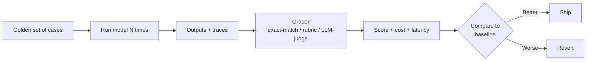

<LevelBadge level="intermediate" />

<VerifyNote lastVerified="2026-07-25" source="https://platform.claude.com/docs/en/test-and-evaluate/develop-tests">
La méthodologie (conception test-driven de prompts/agents, critères SMART, grille exact-match vs. LLM-notée) suit le guide officiel « Develop tests » d'Anthropic. Les concepts ici sont agnostiques du modèle et s'appliquent également à OpenAI, Gemini et aux modèles open-weight.
</VerifyNote>

<Callout type="objectives" items={[
  "Comprendre ce qu'est vraiment une eval — un test reproductible qui note la sortie du modèle contre une grille fixe",
  "Savoir quand un vibe check suffit et quand seule une eval convient",
  "Reconnaître les quatre types d'eval que vous utiliserez vraiment, et quand chacun s'applique",
  "Construire une eval minimum viable — 20 cas, une grille, un script — en un après-midi",
  "Éviter les six pièges qui font mentir les evals"
]} />

Si vous prenez une seule habitude de ce site, prenez celle-ci. Prompt-craft, choix de modèle, câblage d'outils — rien ne compose tant que vous ne pouvez pas *mesurer* si un changement a rendu le système meilleur ou pire. Une fois que vous le pouvez, chaque décision future — prendre Sonnet 5 ou Fable 5, ajouter un outil, resserrer un prompt système, augmenter le budget thinking — devient un contrôle de cinq minutes au lieu d'une semaine de débat.

Les evals sont ainsi comment vous remplacez « on dirait que c'est plus malin » par un nombre qui survit au désaccord.

## Ce qu'est vraiment une eval

Une **eval**, ce sont trois choses vissées ensemble :

1. Un **ensemble fixe d'entrées** — d'habitude 20 à quelques centaines de cas tirés de l'usage réel.
2. Une **grille ou vérité terrain** — pour chaque cas, à quoi ressemble « correct » ?
3. Une **boucle de notation** — un script qui lance le modèle sur chaque cas, compare la sortie à la grille, et rapporte pass/fail (ou un score gradué) plus coût et latence.

Tout le reste — tableaux de bord, juges LLM, portes CI — est un échafaudage optionnel autour de ce noyau.

Relancez cette boucle à chaque changement. C'est tout le jeu.

## Quand un vibe check suffit — et quand non

Tous les prompts n'ont pas besoin d'une eval. Faites preuve de jugement.

| Situation | Vibe check OK | Construire une eval |
|---|---|---|
| Script à usage unique pour vous-même | Oui | — |
| Un prompt que vous livrerez à cinq collègues | Oui (léger) | Si la fiabilité compte |
| Tout ce qui est user-facing, à toute échelle | — | Oui |
| Tout ce qui tourne sans surveillance (agents, batches) | — | Oui |
| Toute décision d'échanger modèle ou fournisseur | — | Oui (sinon vous devinez) |
| Tout où une mauvaise réponse a un coût (argent, sécurité, légal) | — | Oui (non négociable) |

Règle du pouce : **la première fois que vous vous surprenez à dire « la nouvelle version *semble*-t-elle meilleure ? », arrêtez-vous et construisez l'eval.** Les dix changements suivants la rembourseront.

## Les quatre types d'eval que vous utiliserez

<Steps items={[
  {title: "Exact-match / vérifications structurelles", body: "La sortie doit égaler une chaîne spécifique, matcher une regex, parser en JSON valide, ou matcher un schéma. Bon marché, rapide, sans ambiguïté. Utilisez pour classification, extraction, code qui doit compiler, appels d'outils, sortie structurée."},
  {title: "Notation par grille (juge humain ou LLM)", body: "La sortie est notée contre une grille explicite — « le résumé est-il fidèle à la source ? O/N », « le ton est-il approprié ? 1–5 avec ancres ». Utilisez pour écriture, résumés, explications, partout où la qualité est floue."},
  {title: "Comparaison référence-basée", body: "Comparez contre une bonne réponse connue via similarité sémantique, BLEU/ROUGE, ou un LLM à qui l'on demande « A transmet-il la même information que B ? ». Utilisez pour traduction, paraphrase, réponses augmentées par récupération."},
  {title: "Trajectoire / eval de processus", body: "Pour les agents : a-t-il appelé les bons outils dans un ordre sensé, sans dériver ni étape dangereuse ? Notez la trace, pas juste la réponse finale. Voir le playbook spécifique aux agents pour les mécaniques."}
]} />

Les systèmes réels mixent tout ça — une vérification de schéma JSON conditionne une note par grille, qui conditionne une vérification de trajectoire end-to-end. Les couches bon marché échouent vite ; les couches chères ne tournent que quand les bon marché passent.

## Construisez votre eval minimum viable

Vous pouvez avoir une eval fonctionnelle en un après-midi. Sautez tout le reste de cette liste en premier.

<Steps items={[
  {title: "Attrapez 20 vraies entrées", body: "Des logs, tickets de support, ou de votre usage. Couvrez le chemin facile courant, le milieu délicat, et deux ou trois cas qui vous ont déjà brûlé. Vingt suffit pour détecter une vraie régression ; les centaines sont pour plus tard."},
  {title: "Écrivez les critères de passage par cas", body: "Une phrase : « la sortie doit inclure le numéro de commande du client et un statut de remboursement pending/approved/denied » — ou « la sortie doit être un JSON valide matchant le schéma X ». Si vous ne pouvez pas l'écrire, le cas n'est pas testable — coupez ou clarifiez."},
  {title: "Écrivez un script de 50 lignes", body: "Pour chaque cas : envoyez l'entrée au modèle, capturez sortie et compteurs de tokens, lancez le noteur, enregistrez pass/fail plus coût. Un CSV de résultats convient — pas besoin d'UI."},
  {title: "Établissez une baseline", body: "Lancez le prompt d'aujourd'hui contre l'ensemble. Enregistrez le score. C'est votre barre. Chaque changement futur est mesuré contre elle."},
  {title: "Gatez un workflow dessus", body: "Câblez le script dans CI ou en pré-déploiement. Tout changement qui fait baisser le score casse le build. Maintenant l'eval se défend seule — personne n'a besoin de se souvenir de la lancer."}
]} />

C'est tout. Tout après ceci — juges LLM, calibration, dashboards, tracking de coût, découpage par métrique — est amorti sur une eval qui existe déjà et bloque déjà les mauvais changements.

## Les six pièges qui font mentir les evals

<PromptCard title="Piège 1 — Le golden set est bidon">
Cas inventés par l'équipe, pas échantillonnés depuis l'usage réel. L'eval passe ; les utilisateurs frappent des entrées que l'eval n'a jamais vues.

**Correctif :** Minez des cas depuis les vrais logs. Chaque bug prod devient un nouveau cas *avant* que vous le corrigiez.
</PromptCard>

<PromptCard title="Piège 2 — La grille est au feeling">
« Notez la qualité 1–5 » sans ancres. Deux noteurs — humain ou LLM — sont en désaccord fort, et le score sautille au relancement.

**Correctif :** Ancrez chaque point sur l'échelle à un comportement observable. « 5 = chaque affirmation traçable jusqu'à la source ; 3 = une affirmation non étayée ; 1 = trois affirmations non étayées ou plus. »
</PromptCard>

<PromptCard title="Piège 3 — Le juge LLM n'est pas calibré">
Vous faites confiance à un modèle pour noter parce que c'est bon marché. Les juges ont des biais connus : ils préfèrent les réponses plus longues, les premières options, et les sorties qui font écho à leur propre phrasé.

**Correctif :** Faites noter 30–50 cas par des humains. Mesurez l'accord juge-vs-humain (kappa de Cohen au moins 0,6). Randomisez l'ordre des options. Contrôlez les verdicts par sondage chaque semaine.
</PromptCard>

<PromptCard title="Piège 4 — L'eval sur-adapte">
Vous continuez à peaufiner le prompt jusqu'à saturer le score — sur les mêmes 20 cas. La prod plonge.

**Correctif :** Découpez en dev et holdout. Ne regardez jamais les scores holdout pendant que vous itérez. Faites croître l'ensemble depuis les vrais échecs, pas des variations synthétiques.
</PromptCard>

<PromptCard title="Piège 5 — Un nombre, pas de coût">
Le score monte ; la facture de tokens double. Ou la latence saute à huit secondes. Vous avez « livré une amélioration » qui a régressé le produit.

**Correctif :** Chaque lancement rapporte score, coût par cas, et latence p50/p95 ensemble. Un changement n'est « meilleur » que s'il ne fait pas silencieusement régresser deux des trois.
</PromptCard>

<PromptCard title="Piège 6 — Dérive de version de modèle">
Vous verrouillez le prompt mais pas le modèle. Le fournisseur pousse une mise à jour silencieuse ; votre score marche.

**Correctif :** Épinglez la version du modèle explicitement (un snapshot daté spécifique, pas un alias flottant). Relancez l'eval à chaque bump de modèle. Voir [Models & Pricing](/docs/whats-new/models-and-pricing) pour les familles actuellement épinglées.
</PromptCard>

## Outils qui baissent l'effort

Vous n'avez besoin d'aucun de ceux-ci pour commencer — un script Python et un CSV suffisent — mais une fois que vous avez une eval fonctionnelle, ceux-ci font gagner du temps :

- **Le guide d'évaluation d'Anthropic** — la méthodologie canonique, alignée avec [Develop your test cases](https://platform.claude.com/docs/en/test-and-evaluate/develop-tests). Commencez ici même si vous utilisez un autre fournisseur.
- **promptfoo** — suites d'eval définies en YAML, marche pour Anthropic, OpenAI, Google et modèles ouverts. Bon pour comparaison de modèles côte à côte.
- **Braintrust / LangSmith / Humanloop** — plateformes d'eval hébergées avec UI, tracking de coût et versioning de datasets. Utiles une fois que vous notez des centaines de cas par semaine.
- **Scripts custom** — reste l'option la plus flexible, surtout quand votre noteur est déterministe ou spécifique au domaine.

Quel que soit ce que vous prenez, gardez les *cas* dans votre propre repo, versionnés. L'outillage est fongible ; un golden set curé est l'actif.

## Note cross-modèle

Une eval construite une fois vous achète la **portabilité modèle gratuitement.** Les mêmes 20 cas plus noteur plus script qui ont noté Claude Sonnet notent aussi Fable 5, GPT-5, Gemini 3.6, ou un Qwen local — avec une ligne changée. C'est pourquoi quiconque fait de la sélection de modèle sérieuse vit dans son eval, pas dans les leaderboards de benchmarks.

Les benchmarks publics répondent à « quel modèle domine SWE-bench ? ». Votre eval répond à « quel modèle gère les tickets de *mes* utilisateurs, sur *mon* budget, sans dériver ». Seule la seconde question livre du produit.

## Quiz — vérifiez-vous

<Quiz questions={[
  {
    q: "Vous voulez savoir si un nouveau prompt est meilleur que l'ancien. Quelle est l'eval minimum viable ?",
    options: [
      "Demander à trois collègues « ça a l'air mieux ? »",
      "20 vrais cas, critères de passage explicites par cas, un script qui lance les deux prompts et rapporte pass rate + coût + latence, comparaison à la baseline",
      "Lancer les deux prompts sur un exemple dont vous vous souvenez la semaine dernière",
      "Publier les deux et A/B tester sur des utilisateurs live"
    ],
    answer: 1,
    explain: "Le pif ne survit pas au désaccord, et l'A/B en production est cher et lent. Vingt cas curés avec une grille explicite bat les trois."
  },
  {
    q: "La grille de votre équipe dit « notez l'utilité 1–5 ». Les scores oscillent de plus ou moins 1 point à chaque relancement. Quel est le correctif ?",
    options: [
      "Relancer trois fois et faire la moyenne",
      "Ancrer chaque score à un comportement observable — « 5 = chaque affirmation traçable ; 3 = une affirmation non étayée ; 1 = trois affirmations non étayées ou plus »",
      "Passer à un modèle juge plus gros",
      "Ajouter plus de cas"
    ],
    answer: 1,
    explain: "Les grilles au pif produisent des scores au pif. Ancrer chaque point rend le noteur — humain ou LLM — reproductible."
  },
  {
    q: "Le score d'eval a monté de 8 points. Rien d'autre dans le rapport n'a changé. On livre ?",
    options: [
      "Oui — c'est fait pour ça, l'eval",
      "Non — vérifiez le coût par cas et la latence p50/p95 aussi avant d'appeler ça une amélioration",
      "Non — attendez une revue humaine",
      "Oui mais uniquement en région UE d'abord"
    ],
    answer: 1,
    explain: "Un gain de qualité qui double la facture de tokens ou pousse la latence p95 à 8 secondes est une régression en production. Score, coût et latence bougent ensemble — ou vous vous trompez vous-même."
  }
]} />

## Points clés

<Callout type="takeaways" items={[
  "Une eval est un ensemble fixe de cas + une grille + une boucle de notation — tout le reste est de l'échafaudage",
  "Vingt vrais cas avec des critères de passage clairs valent mieux que deux cents synthétiques",
  "Score, coût et latence ensemble — améliorer l'un aux dépens des autres est une régression",
  "Ancrez les grilles à un comportement observable ; calibrez les juges LLM contre des humains",
  "Épinglez les versions de modèle ; relancez à chaque mise à jour du fournisseur — la dérive silencieuse est réelle",
  "Une bonne eval est portable : elle vous laisse comparer Claude, GPT, Gemini et modèles locaux sur VOTRE tâche, pas sur les benchmarks"
]} />

## Suite

- Evals d'agents au niveau opérateur avec notation de trajectoire → [Évaluer votre agent IA](/docs/playbooks/evaluating-agents)
- Les quatre niveaux d'hallucination et comment détecter chacun → [Hallucinations](/docs/foundations/hallucinations)
- Choisir un modèle sur données, pas au pif → [Choisir un modèle](/docs/models/choosing-a-model)
- Coût par tâche réussie, contrôlé → [Réduire votre usage de tokens](/docs/power-user/token-economy)
