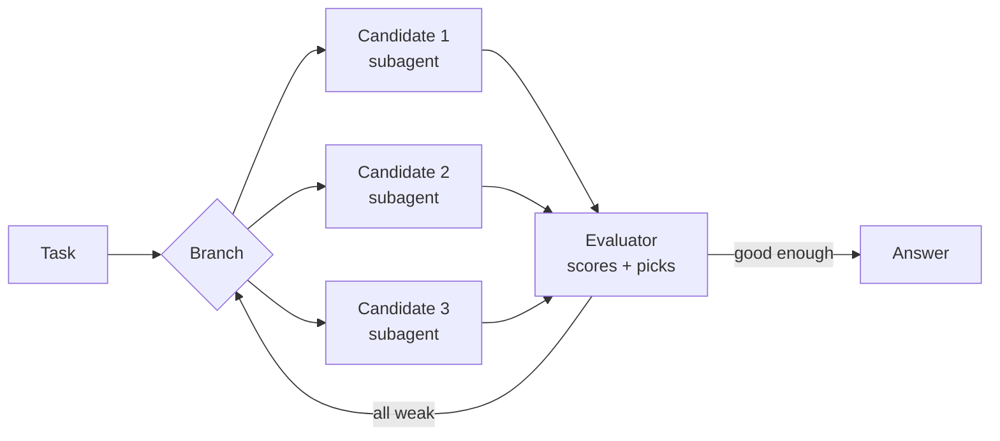
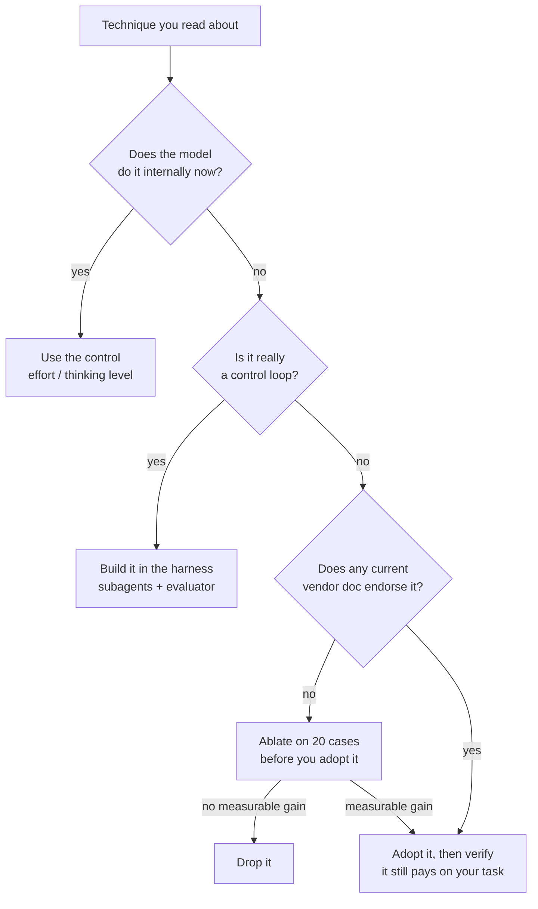

<LevelBadge level="intermediate" />

<Callout type="objectives" items={[
  "Ce qu'était réellement chaque technique de prompting célèbre, en une ligne",
  "Lesquelles le modèle fait désormais à votre place, et lesquelles le harnais prend en charge",
  "Les trois techniques aujourd'hui activement déconseillées par les recommandations officielles des fournisseurs",
  "Là où les fournisseurs se contredisent ouvertement — et comment trancher pour votre propre charge de travail",
]} />

Ouvrez n'importe quel guide de prompt engineering et vous tombez sur une liste de techniques nommées : Chain-of-Thought, Tree of Thoughts, Self-Consistency, ReAct, Reflexion, Least-to-Most. Presque toutes ont été publiées entre 2022 et 2023, pour des modèles qui **ne savaient pas raisonner à moins qu'on les y force**.

Cette contrainte a disparu. Les modèles de pointe d'aujourd'hui raisonnent en interne avant de répondre, et les harnais d'agents bouclent sur les outils tout seuls. Donc la plupart de ces techniques n'ont pas été réfutées — elles ont été **absorbées**, soit par le modèle, soit par le harnais. Quelques-unes sont désormais de francs pièges.

Cette page nomme chacune d'elles, dit à quoi elle servait, et rend son verdict.

## La seule chose qui a changé

Chaque verdict ci-dessous découle du même basculement : le raisonnement a quitté votre prompt pour passer dans la passe avant du modèle lui-même. Les trois grands fournisseurs le disent désormais dans leur propre documentation.

| Fournisseur | Ce que disent leurs recommandations actuelles |
|---|---|
| **Anthropic** | La réflexion étendue « automatise le raisonnement structuré », et lorsqu'elle est disponible elle est « généralement préférable au prompting manuel de chain of thought ». |
| **OpenAI** | « Évitez les prompts de chain-of-thought : puisque ces modèles raisonnent en interne, leur demander de “think step by step” ou d'“explain your reasoning” est inutile. » |
| **Google** | Si vous utilisiez « du prompt engineering complexe (comme le chain of thought) pour forcer Gemini 2.5 à raisonner », utilisez plutôt le niveau de réflexion du modèle. |

<VerifyNote lastVerified="2026-10-03" source="https://claude.com/blog/best-practices-for-prompt-engineering">
Citations vérifiées auprès des [bonnes pratiques de prompt engineering 2026 d'Anthropic](https://claude.com/blog/best-practices-for-prompt-engineering), des [bonnes pratiques de raisonnement d'OpenAI](https://developers.openai.com/api/docs/guides/reasoning-best-practices) et du [guide développeur Gemini 3 de Google](https://ai.google.dev/gemini-api/docs/gemini-3). Les recommandations des fournisseurs sont révisées indépendamment et souvent — relisez la source avant de réécrire un prompt de production sur cette base.
</VerifyNote>

## Le tableau des verdicts

| Technique | Ce qu'elle était | Verdict |
|---|---|---|
| **Instruction claire et spécifique** | Énoncer l'objectif, le public, le format, les contraintes | ✅ **Toujours l'essentiel du jeu** |
| **Contrat de sortie** | « Réponds uniquement avec le JSON » / forme exacte | ✅ **Toujours essentiel** |
| **Chaînage de prompts / décomposition** | Découper une tâche difficile en plusieurs appels | ✅ **Toujours essentiel** |
| **Autorisation de s'abstenir** | « Dis que tu ne sais pas plutôt que de deviner » | ✅ **Toujours essentiel** |
| **Contexte + motivation** | Expliquer *pourquoi* une contrainte compte | ✅ **A gagné en valeur** |
| **Méta-prompting / APE** | Faire écrire ou améliorer le prompt par un modèle | ✅ **Sous-estimé, bien vivant** |
| **Chain-of-Thought** | « Réfléchis étape par étape » avant de répondre | 🔁 **Passé dans le modèle** |
| **Least-to-Most** | Résoudre d'abord les sous-problèmes faciles, dans l'ordre | 🔁 **Passé dans le modèle** |
| **ReAct** | Alterner `Thought:` / `Action:` / `Observation:` | 🔁 **Passé dans le harnais** |
| **Reflexion** | Autocritique, puis nouvelle tentative en gardant la leçon | 🔁 **Passé dans la couche mémoire** |
| **Tree of Thoughts** | Ramifier, évaluer, revenir en arrière sur des réponses partielles | 🔁 **Passé dans le harnais** |
| **Exemples few-shot** | Montrer 3 à 5 exemples résolus | ⚠️ **Contesté — les fournisseurs divergent** |
| **Rôle / persona** | « Tu es un fiscaliste senior avec 20 ans d'expérience… » | ⚠️ **Rétrogradé, gardez la version mince** |
| **Self-Consistency** | Échantillonner N réponses, vote majoritaire | ⚠️ **Situationnel, à payer N×** |
| **Échafaudage XML lourd** | Baliser chaque partie de chaque prompt | ⚠️ **Désormais optionnel, plus par défaut** |
| **Graph of Thoughts** | Graphe arbitraire d'étapes de raisonnement | 🧪 **Recherche, aucun fournisseur ne le recommande** |
| **Réglage de la température** | Monter ou baisser la créativité | ⛔ **Rejeté d'emblée sur les modèles actuels** |
| **Pression émotionnelle / pourboire** | « C'est très important pour ma carrière » | ⛔ **Aucun guide fournisseur actuel ne l'approuve** |
| **Répétition d'instruction / MAJUSCULES** | Le dire trois fois, et fort | ⛔ **Retiré** |

Le reste de cette page explique les lignes intéressantes.

## Passé dans le modèle

### Chain-of-Thought

[Wei et al. (2022)](https://arxiv.org/abs/2201.11903) ont montré qu'un modèle invité à produire des étapes de raisonnement intermédiaires résolvait bien plus de problèmes de maths et de logique. [Kojima et al. (2022)](https://arxiv.org/abs/2205.11916) ont ensuite découvert qu'on pouvait déclencher l'essentiel de cet effet avec cinq mots — « Let's think step by step. » Pendant quatre ans, ce fut l'astuce la plus rentable du prompting.

Les modèles de pointe le font désormais sans qu'on le leur demande, et y consacrent un *budget* que vous contrôlez via l'effort ou le niveau de réflexion plutôt que par des phrases dans votre prompt. Voir [Réflexion étendue et effort](/docs/api/thinking-and-effort) et [Réglage de l'effort](/docs/api/effort-tuning).

L'instruction n'est donc plus gratuite. Elle coûte des tokens, elle ajoute une instruction que le modèle doit respecter en plus de la vraie, et sur un modèle à réflexion elle peut pousser le raisonnement *dans la réponse visible* — exactement là où vous n'en vouliez pas.

<PromptCard title="Habitude de 2023 — ne la reportez pas">{`You are an expert mathematician with 20 years of experience. This is very
important to my career, so please take a deep breath and work through this
step by step, explaining your reasoning carefully before giving the final
answer. Let's think step by step.

Are there infinitely many primes p with p mod 4 == 3?`}</PromptCard>

<PromptCard title="Version 2026 — même question, rien de gaspillé">{`Are there infinitely many primes p with p mod 4 == 3?

Give the proof sketch, then the one-line answer. If the result is open, say so.`}</PromptCard>

Le second prompt est plus court, ne contient aucune instruction que le modèle doive concilier avec une autre, et dépense son budget sur la preuve plutôt que sur la narration. La profondeur du raisonnement vient du réglage d'effort de la requête, pas de la formulation.

**Gardez le Chain-of-Thought manuel quand :** vous êtes sur un petit modèle ou un modèle local sans mode réflexion (voir [Exécuter des modèles en local](/docs/models/run-models-locally-ollama)), ou que vous avez spécifiquement besoin du raisonnement *dans la sortie visible* pour qu'un humain puisse l'auditer.

### Least-to-Most

[Zhou et al. (2022)](https://arxiv.org/abs/2205.10625) — faire énumérer les sous-problèmes au modèle, puis les résoudre dans l'ordre. Même histoire que pour le Chain-of-Thought : c'est un plan, et planifier est désormais la première chose qu'un modèle à réflexion fait de lui-même. Reste utile comme habitude *humaine* lorsque vous décomposez le travail sur plusieurs appels, ce qui n'est rien d'autre que du [chaînage de prompts](/docs/prompting/pattern-library).

## Passé dans le harnais

### ReAct

[Yao et al. (2022)](https://arxiv.org/abs/2210.03629) alternaient raisonnement et appels d'outils en faisant émettre au modèle du texte dans un format fixe `Thought:` / `Action:` / `Observation:` que votre code analysait avec des expressions régulières.

Relisez cette description : c'est un contournement par protocole textuel pour une API qui n'avait pas d'appels d'outils. L'API en a maintenant. L'[utilisation native des outils](/docs/api/tool-use), plus la réflexion entre les appels d'outils, *c'est* ReAct — implémenté par le fournisseur, typé et streamé. Bricoler le protocole textuel à la main en 2026 revient à réintroduire un parseur qui peut casser sur un deux-points égaré.

**La seule chose à retenir de ReAct :** l'idée que le modèle doit pouvoir *réfléchir au résultat d'un outil avant de choisir le suivant*. C'est désormais une fonctionnalité de plateforme, pas un prompt.

### Tree of Thoughts

[Yao et al. (2023)](https://arxiv.org/abs/2305.10601) ont généralisé le Chain-of-Thought en une recherche : générer plusieurs étapes candidates, les noter, garder les branches prometteuses, revenir en arrière depuis les impasses.

Comme *prompt* (« explore trois approches en parallèle, puis choisis »), c'est faible — un modèle dans une seule fenêtre de contexte jouant le rôle d'un arbre de recherche produit surtout trois paragraphes similaires suivis d'un choix assuré. Comme *architecture*, ça prospère, sous d'autres noms :

Voilà Tree of Thoughts avec les branches en tant que véritables agents parallèles et l'évaluateur en tant que véritable étape de notation. Construisez-le avec des [sous-agents](/docs/claude-code/subagents) ou des [équipes d'agents](/docs/api/cowork-and-agent-teams), et notez-le avec des [evals](/docs/foundations/evals) — pas avec un paragraphe habile.

### Reflexion

[Shinn et al. (2023)](https://arxiv.org/abs/2303.11366) faisaient écrire à l'agent un court post-mortem verbal après une tentative échouée, puis reportaient cette note dans la tentative suivante — apprendre sans toucher aux poids.

L'idée était juste et elle a gagné. Elle a simplement cessé de vivre dans le prompt : elle vit désormais dans la **couche mémoire**. Voir [Mémoire et édition du contexte](/docs/api/memory-and-context-editing) et [Managed Agent Memory Stores](/docs/api/managed-agents-memory-stores). La version moderne de « réfléchis à ton échec », c'est un agent qui écrit une leçon dans un stockage durable qui survit à la [compaction](/docs/api/compaction).

**Faites quand même la version bon marché à la main :** après une mauvaise exécution, demandez au modèle ce qui, dans le prompt ou dans le jeu d'outils, l'a induit en erreur, puis corrigez *cela*. Le fruit d'une réflexion a sa place dans votre prompt système, pas dans le tour suivant.

### Graph of Thoughts

[Besta et al. (2023)](https://arxiv.org/abs/2308.09687) ont remplacé l'arbre par un graphe arbitraire — fusionner des branches, raffiner des nœuds sur place, boucler. Recherche réellement intéressante ; aucun fournisseur ne la recommande, aucun harnais courant ne l'implémente, et le coût en tokens est brutal. Connaissez le nom ; ne construisez pas dessus jusqu'à ce que quelque chose change.

## Contesté : les exemples few-shot

C'est le point honnête. Les trois fournisseurs donnent trois réponses différentes, par écrit, à l'heure actuelle :

| Fournisseur | Recommandation sur les exemples |
|---|---|
| **OpenAI** | « Essayez d'abord le zero-shot… Les modèles de raisonnement n'ont souvent pas besoin d'exemples few-shot pour produire de bons résultats. » |
| **Anthropic** | « Commencez par un exemple (one-shot). N'ajoutez d'autres exemples (few-shot) que si la sortie ne correspond toujours pas à vos besoins. » |
| **Google** | « Les prompts sans exemples few-shot risquent d'être moins efficaces » — et recommande d'en inclure systématiquement. |

Ne réglez pas cela en choisissant le fournisseur que vous préférez. Le désaccord est réel et il reflète de vraies différences dans la façon dont ces modèles ont été entraînés. Réglez-le par une ablation sur votre propre tâche — c'est un travail de 20 minutes et il bat les conseils de n'importe qui, y compris ceux de cette page.

<Steps items={[
  {title: "Figez un jeu de test", body: "Rassemblez 20 entrées réelles avec des sorties de référence. Pas 3 — 3 ne permettent pas de distinguer un écart de 15 % du bruit. Voir /docs/foundations/evals."},
  {title: "Écrivez la version zero-shot", body: "Instruction, contraintes, contrat de sortie. Aucun exemple."},
  {title: "Ajoutez exactement un exemple", body: "Choisissez l'entrée que votre version zero-shot a le plus mal traitée, et montrez-en la sortie idéale."},
  {title: "Ajoutez-en trois de plus", body: "Couvrez les formes sur lesquelles votre tâche varie réellement — pas quatre versions du cas facile."},
  {title: "Notez les trois variantes sur les mêmes 20 entrées", body: "Même modèle, mêmes réglages, une seule variable modifiée. Relevez les tokens autant que la qualité."},
  {title: "Déployez la variante la moins chère qui passe votre barre", body: "Si le one-shot égale le zero-shot, déployez le zero-shot : moins de tokens, moins de verrouillage de motif, rien à maintenir."},
]} />

Le mode de défaillance qui mérite un nom : trop d'exemples provoquent un **verrouillage de motif** (pattern lock), où le modèle reproduit la forme de surface de vos exemples sur des entrées qui demandaient une autre forme. Si les sorties paraissent étrangement uniformes, retirez des exemples avant d'ajouter des instructions. Plus de détails dans [Le few-shot bien fait](/docs/prompting/few-shot).

## Rétrogradé : rôles et personas

« Tu es un fiscaliste senior de classe mondiale avec 20 ans d'expérience dans un cabinet de premier plan » était la pratique standard. Les recommandations actuelles d'Anthropic sont plus brutales : « Des rôles trop spécifiques peuvent limiter l'utilité de l'IA. »

La partie utile d'un rôle n'a jamais été la biographie — c'était le **vocabulaire et le public**. Gardez cela, jetez le CV :

- ⛔ « Tu es un ingénieur 10x légendaire qui n'écrit jamais de bugs. »
- ✅ « Relis ce code pour un service Python 3.12 qui tourne dans Lambda. Signale tout ce qui échouerait lors de démarrages à froid concurrents. »

Le second apprend au modèle quelque chose qu'il ne savait pas. Le premier lui dit d'être confiant, ce qui est l'exact opposé de ce qu'on attend d'un relecteur. Voir [Prompts système](/docs/prompting/system-prompts) et [Rôles](/docs/foundations/roles).

## Situationnel : la self-consistency

[Wang et al. (2022)](https://arxiv.org/abs/2203.11171) — échantillonner N fois la même question et retenir la réponse majoritaire. Ça marche, et ça marche toujours. Le problème, c'est la facture : N× tokens et N× latence pour une seule réponse.

Sur un modèle de pointe, augmenter l'effort ou le budget de réflexion sur **un** appel achète généralement plus de précision par token que trois appels bon marché suivis d'un vote. La self-consistency reste le bon outil quand :

- La réponse est courte et vérifiable (un nombre, une étiquette, un oui/non), si bien que le vote est bien défini.
- Vous êtes sur un modèle bon marché ou local où trois appels coûtent encore moins qu'un appel de pointe.
- Vous avez besoin d'un *signal de confiance* — un partage 3-0 et un partage 2-1 ne disent pas la même chose, et c'est difficile à obtenir autrement.

C'est le mauvais outil pour les essais, le code, et tout ce où « majoritaire » n'a pas de sens.

## Retiré

- **Réglage de la température.** Pas seulement déconseillé — **rejeté**. Sur les modèles Claude de pointe actuels, une valeur non par défaut de `temperature`, `top_p` ou `top_k` renvoie une erreur 400 à chaque requête. Google « recommande fortement de conserver le paramètre de température à sa valeur par défaut de `1.0` » pour tous les modèles Gemini 3, en avertissant que la baisser « peut conduire à un comportement inattendu, comme des boucles ou des performances dégradées ». Façonnez le comportement avec le prompt et le réglage d'effort. Quels modèles exposent quels boutons est une cible mouvante — vérifiez [Modèles et tarifs](/docs/whats-new/models-and-pricing) et [Contrôles d'échantillonnage](/docs/foundations/sampling-controls).
- **Pression émotionnelle.** [Li et al. (2023)](https://arxiv.org/abs/2307.11760) ont bel et bien mesuré des gains avec « c'est très important pour ma carrière » sur les modèles de l'époque 2023, et la variante de la promesse de pourboire a beaucoup circulé. Aucun guide fournisseur actuel ne recommande l'une ou l'autre. Traitez l'effet mesuré comme une propriété des modèles sur lesquels il a été mesuré, pas comme une loi du prompting — et notez que personne n'a publié de réplication sur un modèle de pointe.
- **Répétition d'instruction et MAJUSCULES.** Ceinture et bretelles pour des modèles qui laissaient tomber les instructions placées au milieu de longs prompts. Reformuler la demande après un très long document reste pertinent ([Long contexte](/docs/prompting/long-context)) ; le dire trois fois dans un prompt de 200 tokens ne fait que dépenser du contexte et créer des conflits à résoudre.
- **Préremplir le tour de l'assistant.** C'était la méthode fiable pour imposer un format de sortie à Claude. Retiré — les modèles actuels renvoient une erreur 400 sur un dernier tour assistant prérempli. Utilisez un contrat de sortie ou la [sortie structurée](/docs/api/structured-output).

## Comment trancher pour n'importe quelle technique

Toute la page se compresse en ce diagramme. Une technique nommée est une hypothèse sur l'endroit où une capacité doit vivre — dans le prompt, dans le modèle ou dans le harnais. Quand la capacité se déplace, le domicile de la technique se déplace avec elle.

<Flashcards title="Connaître le canon" cards={[
  {front: "Chain-of-Thought (2022)", back: "Demander au modèle de produire des étapes de raisonnement intermédiaires avant de répondre. Désormais interne aux modèles à réflexion — contrôlez-le par l'effort, pas par la formulation."},
  {front: "Zero-shot CoT", back: "« Let's think step by step » — déclenche le raisonnement sans aucun exemple. Le prompt le plus copié de l'ère 2022-2024 ; désormais redondant sur les modèles à réflexion."},
  {front: "Self-Consistency (2022)", back: "Échantillonner N chemins de raisonnement, retenir la réponse majoritaire. Toujours valable ; coûte N×. Idéal pour les réponses courtes et vérifiables et les signaux de confiance."},
  {front: "Least-to-Most (2022)", back: "Énumérer les sous-problèmes, puis les résoudre dans l'ordre. Absorbé par la planification interne ; survit côté humain comme chaînage de prompts."},
  {front: "ReAct (2022)", back: "Alterner Thought / Action / Observation sous forme de texte analysé. Remplacé par l'utilisation native des outils plus la réflexion entre les appels d'outils."},
  {front: "Reflexion (2023)", back: "Autocritique verbale après un échec, reportée dans la tentative suivante. Passé dans la couche mémoire — écrivez la leçon dans un endroit durable."},
  {front: "Tree of Thoughts (2023)", back: "Ramifier, noter, revenir en arrière sur des solutions partielles. Faible comme prompt ; fort comme architecture — des sous-agents parallèles plus un évaluateur."},
  {front: "Graph of Thoughts (2023)", back: "Graphe arbitraire d'étapes de raisonnement avec fusions et boucles. Recherche uniquement ; aucun fournisseur ni harnais courant ne l'implémente."},
  {front: "Pattern lock (verrouillage de motif)", back: "Le mode de défaillance de trop d'exemples few-shot : les sorties copient la forme de surface des exemples même quand l'entrée en demandait une autre."},
  {front: "La règle de l'absorption", back: "Les techniques ne sont pas réfutées, elles sont absorbées — par le modèle ou par le harnais. Demandez-vous où vit désormais la capacité."},
]} />

<Quiz title="Testez-vous" questions={[
  {q: "Pourquoi ajouter « think step by step » à un prompt destiné à un modèle à réflexion est-il désormais un coût plutôt qu'un gain ?", options: ["Cela rend le modèle plus lent à commencer à streamer", "Le modèle raisonne déjà en interne, donc l'instruction ajoute des tokens et une instruction supplémentaire à concilier — et peut pousser le raisonnement dans la réponse visible", "Cela désactive l'utilisation des outils", "Cela augmente la température"], answer: 1, explain: "Les modèles de pointe raisonnent en interne et en budgètent la quantité via l'effort ou le niveau de réflexion. L'instruction dépense des tokens, entre en concurrence avec votre vraie demande, et peut déplacer le raisonnement dans la sortie que vous vouliez propre."},
  {q: "Quel est le bon domicile moderne pour Tree of Thoughts ?", options: ["Un prompt qui demande au modèle d'explorer trois approches", "Un harnais qui exécute les branches candidates comme des sous-agents parallèles et les note avec un évaluateur", "Un réglage de température plus élevé", "Un prompt système plus long"], answer: 1, explain: "Comme prompt, il produit surtout trois paragraphes similaires et un choix assuré. Comme architecture — des branches parallèles plus une véritable étape de notation — il prospère."},
  {q: "Les trois grands fournisseurs donnent actuellement des conseils écrits différents sur les exemples few-shot. Que recommande cette page ?", options: ["Suivre Google, puisque c'est le plus favorable aux exemples", "Suivre OpenAI, puisque le zero-shot est le moins cher", "Faire une ablation sur 20 de vos propres cas et déployer la variante la moins chère qui passe votre barre", "Éviter complètement les exemples pour rester portable"], answer: 2, explain: "Le désaccord est réel et reflète des différences d'entraînement. Une ablation sur 20 cas de votre propre tâche bat le conseil général de n'importe quel fournisseur."},
  {q: "Que se passe-t-il si vous envoyez une température non par défaut à un modèle Claude de pointe actuel ?", options: ["Elle est ignorée silencieusement", "La requête renvoie une erreur 400", "La sortie devient non déterministe", "La réflexion est désactivée"], answer: 1, explain: "Sur les modèles Claude de pointe actuels, une valeur non par défaut de temperature, top_p ou top_k renvoie une erreur 400 à chaque requête. Façonnez plutôt le comportement avec le prompt et le réglage d'effort."},
]} />

<Callout type="takeaways" items={[
  "Les techniques nommées sont des hypothèses sur l'endroit où une capacité doit vivre — dans le prompt, dans le modèle ou dans le harnais. Quand la capacité se déplace, la technique aussi.",
  "Le Chain-of-Thought manuel et le Least-to-Most sont passés dans le modèle : utilisez l'effort et le niveau de réflexion plutôt que la formulation.",
  "ReAct et Tree of Thoughts sont passés dans le harnais : utilisation native des outils, sous-agents parallèles et un véritable évaluateur.",
  "Reflexion est passé dans la couche mémoire : écrivez la leçon dans un endroit durable, pas dans le tour suivant.",
  "Le few-shot est réellement contesté entre fournisseurs — faites une ablation sur 20 de vos propres cas plutôt que de faire confiance à un guide.",
  "Le réglage de la température et la pression émotionnelle sont retirés. Gardez le cadrage de rôle mince : vocabulaire et public, jamais le CV.",
]} />

## Suite

- Les fondamentaux sur lesquels reposent toutes les techniques ci-dessus → [Les bases du prompting](/docs/prompting/basics)
- Trancher la question du few-shot pour votre propre tâche → [Le few-shot bien fait](/docs/prompting/few-shot)
- Le contrôle du raisonnement qui a remplacé « think step by step » → [Réflexion étendue et effort](/docs/api/thinking-and-effort)
- Porter un prompt chez un autre fournisseur sans tout réapprendre → [Traduction de prompts entre IA](/docs/prompting/cross-ai-translation)
