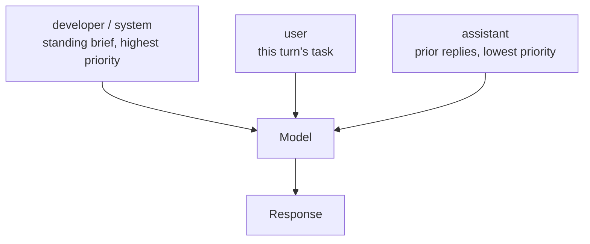

<LevelBadge level="intermediate" />

<Callout type="objectives" items={["Définir correctement un prompt système sur les quatre surfaces — le paramètre system d'Anthropic, le rôle developer d'OpenAI, system_instruction de Gemini et les cinq flags de Claude Code", "Savoir ce qui appartient au briefing permanent et ce qui doit en rester dehors", "Arrêter d'en rajouter : pourquoi « CRITICAL: you MUST » se retourne désormais contre les modèles actuels", "Placer le prompt système là où le cache de prompts peut le réutiliser, et en extraire la partie volatile", "Choisir entre compléter et remplacer le prompt par défaut de Claude Code — et comprendre ce que le remplacement fait perdre"]} />

Chaque modèle possède une couche qui cadre toute la conversation. C'est le levier le moins cher que vous ayez — défini une fois, appliqué à chaque tour — et c'est celui que la plupart des gens remplissent avec la mauvaise matière. [Les rôles](/docs/foundations/roles) expliquent *pourquoi* cela compte. Cette leçon est la version opérateur : noms de paramètres exacts, dosage de l'insistance, et interactions avec le cache.

## Une idée, quatre surfaces

Le concept se transpose partout. La plomberie, non.

| Surface | Comment la définir | Forme |
|---|---|---|
| **Messages API d'Anthropic** | `system` — un **paramètre de requête de premier niveau**, pas une entrée de `messages` | Chaîne, ou tableau de blocs de contenu |
| **Responses API d'OpenAI** | le paramètre `instructions`, ou un message avec le rôle **`developer`** | S'applique à la requête en cours ; `instructions` n'est pas repris quand vous enchaînez avec `previous_response_id` |
| **API Google Gemini** | `system_instruction` sur la requête (`systemInstruction` en Java, `SystemInstruction` en Go) | Défini par interaction |
| **Claude Code** | cinq flags CLI (ci-dessous), plus [`CLAUDE.md`](/docs/claude-code/claude-md) et les [styles de sortie](/docs/claude-code/output-styles) | Remplacer ou compléter |
| **Applications de chat** | [instructions personnalisées](/docs/claude-app/custom-instructions) sur votre compte | Persistantes d'une conversation à l'autre |

<VerifyNote lastVerified="2026-09-30" source="https://platform.claude.com/docs/en/build-with-claude/prompt-engineering/claude-prompting-best-practices">
Noms de paramètres vérifiés auprès de la référence des bonnes pratiques de prompting d'Anthropic, du [guide de génération de texte d'OpenAI](https://developers.openai.com/api/docs/guides/text) (le rôle `developer` et le paramètre `instructions`) et du [guide de génération de texte Gemini de Google](https://ai.google.dev/gemini-api/docs/text-generation) (`system_instruction`). Les surfaces d'API des fournisseurs évoluent — vérifiez sur les docs liées avant de mettre en production.
</VerifyNote>

Le bug de portage le plus fréquent consiste à traiter le `system` d'Anthropic comme un message. Ce n'en est pas un : il se place à côté de `messages`, pas dedans. Dans l'autre sens, la hiérarchie d'OpenAI est explicite — **les instructions developer prévalent sur les instructions user, qui prévalent sur les tours précédents de l'assistant.** Leur propre analogie : le message developer est la définition de la fonction, le message user est les arguments qu'on lui passe.

<PromptCard title="Anthropic : system est un paramètre de premier niveau">{`curl https://api.anthropic.com/v1/messages \\
  -H "content-type: application/json" \\
  -H "x-api-key: $ANTHROPIC_API_KEY" \\
  -H "anthropic-version: 2023-06-01" \\
  -d '{
    "model": "claude-sonnet-5-5",
    "max_tokens": 1024,
    "system": "You are a precise financial analyst. Show your assumptions. Never invent numbers.",
    "messages": [{"role": "user", "content": "Summarize this filing."}]
  }'`}</PromptCard>

## Ce qui a sa place dedans

Triez chaque ligne de votre prompt selon **sa fréquence de changement**. Ce qui reste vrai pour toute la conversation remonte dans le briefing permanent. Ce qui change à chaque tour reste dans le tour utilisateur.

<Steps items={[
  {title: "Identité et périmètre — oui", body: "Une phrase de rôle suffit à déplacer le ton et le focus. Les docs d'Anthropic sont explicites : même une seule phrase fait une différence ; elles mettent aussi en garde contre un rôle trop contraint, parce que les modèles actuels n'ont pas besoin d'un lourd échafaudage de persona."},
  {title: "Règles dures et limites de refus — oui", body: "Ce que le modèle ne doit jamais faire, ce qu'il doit toujours inclure, ce qu'il doit faire en cas de doute. Donnez-lui explicitement la permission de dire « je ne sais pas » — cette seule ligne réduit mesurablement les réponses inventées."},
  {title: "Contrat de sortie — oui", body: "La forme d'une réponse valide : sections, longueur, langue, préambule autorisé ou non. « Respond directly, without preamble » a sa place ici, pas dans chaque tour utilisateur."},
  {title: "Politique d'outils — oui", body: "Quand recourir à un outil et quand répondre directement. C'est là que vous réglez l'empressement (voir ci-dessous)."},
  {title: "Faits volatils — non", body: "Les données du jour, le fichier courant, les documents récupérés, l'état en direct. Tout cela appartient au tour utilisateur ou au contexte de récupération. Enterrez-les dans le prompt système et vous invalidez votre cache tout en enseignant au modèle des faits périmés."},
  {title: "Longs documents de référence — non", body: "Les gros documents vont en tête du tour utilisateur, au-dessus de la question. Voir /docs/prompting/long-context."}
]} />

## Jusqu'où insister

C'est ici que les prompts écrits pour d'anciens modèles font activement du mal. Les recommandations d'Anthropic pour la génération Opus 4.5/4.6 et au-delà sont sans détour : ces modèles sont **plus réactifs au prompt système que leurs prédécesseurs**, donc les prompts durcis contre un modèle qui *sous*-déclenchait les outils vont maintenant le faire *sur*-déclencher. Le correctif consiste à baisser le volume — `Use this tool when…` au lieu de `CRITICAL: you MUST use this tool when…`.

<Callout type="warning" items={["Les MAJUSCULES, « CRITICAL », « you MUST » et les formulations menaçantes sont un héritage des modèles qui ignoraient les instructions douces. Sur les modèles actuels, elles provoquent du surdéclenchement et des appels d'outils trop empressés.", "Les personas trop contraints (« you are a world-class 10x expert who never makes mistakes ») ajoutent des tokens et n'achètent rien. Demandez plutôt la perspective que vous voulez réellement.", "Des couches contradictoires sont pires qu'un briefing mince. Si le prompt système dit « be concise » et qu'une skill dit « always explain your reasoning », le modèle doit deviner.", "Empiler toutes les techniques d'un coup — rôle, XML, few-shot, chaîne de raisonnement, schéma de sortie — est la forme la plus courante de sur-ingénierie. Ajoutez-en une, mesurez, gardez-la seulement si elle a aidé."]} />

L'empressement est un potentiomètre, pas un trait figé, et le prompt système est l'endroit où vous le réglez. Enveloppez la politique dans une balise nommée pour pouvoir la retrouver et la modifier plus tard :

<PromptCard title="Pousser vers l'action">{`<default_to_action>
Implement changes rather than only proposing them. If intent is ambiguous, infer the
most useful action and proceed, using tools to find the details you are missing instead
of guessing.
</default_to_action>`}</PromptCard>

<PromptCard title="Pousser à demander d'abord">{`<do_not_act_before_instructions>
Do not modify files or start an implementation unless you are clearly asked to. When
intent is ambiguous, research and recommend instead of acting. Make changes only on an
explicit request.
</do_not_act_before_instructions>`}</PromptCard>

<VerifyNote lastVerified="2026-09-30" source="https://platform.claude.com/docs/en/build-with-claude/prompt-engineering/claude-prompting-best-practices">
Les recommandations sur le surdéclenchement et les deux motifs d'empressement suivent la section outils d'Anthropic pour la génération Opus 4.5/4.6 et au-delà. Le comportement spécifique à chaque modèle change à chaque version — revérifiez les recommandations par modèle en haut de cette page.
</VerifyNote>

## Le prompt système est votre préfixe de cache

C'est la partie qui se voit sur la facture. Anthropic construit le préfixe cachable dans un ordre fixe — **`tools`, puis `system`, puis `messages`** — et le cache couvre tout jusqu'au bloc que vous marquez, inclus. Le prompt système occupe donc la position de cache la plus rentable de toute la requête : stable, réutilisé à chaque appel, et placé devant la conversation.

Deux conséquences :

- **Gardez le prompt système stable au byte près.** Un horodatage, un nom d'utilisateur ou un identifiant de session interpolé à l'intérieur change le préfixe et rate le cache à chaque requête.
- **Si une partie doit varier, mettez la partie stable en premier** et coupez le cache après elle, pour que la queue variable soit la seule chose relue.

Les longueurs minimales cachables diffèrent selon le modèle — certains modèles actuels cachent à partir de 512 tokens, les plus anciens en exigent jusqu'à 4 096 — et un prompt sous le seuil est traité silencieusement sans cache, sans aucune erreur. Vérifiez le tableau à jour avant de compter dessus.

<VerifyNote lastVerified="2026-09-30" source="https://platform.claude.com/docs/en/build-with-claude/prompt-caching">
L'ordre du préfixe (`tools`, `system`, `messages`) et les longueurs minimales cachables par modèle viennent des docs de mise en cache de prompts d'Anthropic ; ces minimums sont spécifiques à chaque modèle et changent à chaque version. Voir aussi [Mise en cache de prompts](/docs/api/prompt-caching) et [Modèles et tarifs](/docs/whats-new/models-and-pricing).
</VerifyNote>

Claude Code livre une version taillée sur mesure de cette séparation. Quand votre prompt de remplacement mélange des instructions fixes et du contexte propre à l'exécution, placez entre les deux une ligne contenant uniquement `__SYSTEM_PROMPT_DYNAMIC_BOUNDARY__` : Claude Code coupe à la première ligne de ce type et la supprime, en gardant en cache tout ce qui se trouve au-dessus tandis que la partie en dessous change (v2.1.275+). Pour des exécutions scriptées multi-utilisateurs, `--exclude-dynamic-system-prompt-sections` déplace le contexte propre à chaque utilisateur hors du prompt, vers le premier message utilisateur, afin que plusieurs machines partagent un même préfixe mis en cache.

## Claude Code : compléter ou remplacer

Cinq flags définissent le prompt. Quatre d'entre eux posent du texte ; le cinquième contrôle si une conversation conserve le texte avec lequel elle a démarré.

| Flag | Ce qu'il fait |
|---|---|
| `--system-prompt` | Remplace tout le prompt par défaut par votre texte |
| `--system-prompt-file` | Le remplace par le contenu d'un fichier |
| `--append-system-prompt` | Ajoute votre texte au prompt par défaut |
| `--append-system-prompt-file` | Ajoute le contenu d'un fichier au prompt par défaut |
| `--system-prompt-snapshot` | `off` reconstruit le prompt à chaque requête au lieu de réutiliser celui enregistré à la première requête |

`--system-prompt` et `--system-prompt-file` sont mutuellement exclusifs ; chacun des flags d'ajout peut être combiné avec l'un ou l'autre des flags de remplacement.

La règle de décision porte sur **ce que vous êtes prêt à assumer** :

<Steps items={[
  {title: "Compléter quand Claude doit rester un assistant de code", body: "L'ajout préserve les recommandations d'outils par défaut, les instructions de sécurité et les conventions de code, donc vous ne fournissez que ce qui diffère — règles propres à l'invocation, format de sortie, contexte métier pour un script -p."},
  {title: "Remplacer quand l'identité ou le modèle de permissions est réellement différent", body: "Un agent non dédié au code dans un pipeline sans surveillance, par exemple. Le remplacement supprime tout le prompt par défaut — y compris les recommandations d'outils et les instructions de sécurité — donc tout ce dont votre tâche a encore besoin devient votre responsabilité."},
  {title: "Saisir le bon levier en premier", body: "Les conventions de projet que Claude doit toujours suivre ont leur place dans CLAUDE.md. Un persona que vous alternez et partagez a sa place dans un style de sortie. Un flag, c'est pour une seule invocation."}
]} />

<PromptCard title="Ajouter une règle pour une seule exécution headless">{`claude -p --append-system-prompt "Cite file:line for every claim." "audit the auth flow"`}</PromptCard>

Un piège qui coûte un vrai temps de débogage : par défaut, Claude Code construit le prompt système **une seule fois**, à la première requête d'une conversation, et l'enregistre. Chaque requête ultérieure de cette conversation réutilise le prompt enregistré — y compris après `--resume` ou `--continue`. Changez le texte du flag à un lancement ultérieur et rien ne se passe jusqu'à ce que la conversation soit compactée ou que vous en démarriez une nouvelle. Pendant que vous itérez sur la formulation, passez `--system-prompt-snapshot off` (v2.1.257+) pour le reconstruire à chaque requête.

<VerifyNote lastVerified="2026-09-30" source="https://code.claude.com/docs/en/cli-reference">
Les cinq flags de prompt système, les recommandations compléter-ou-remplacer, le marqueur `__SYSTEM_PROMPT_DYNAMIC_BOUNDARY__` (v2.1.275+) et le comportement d'enregistrement de l'instantané (v2.1.257+) viennent de la référence CLI de Claude Code. Les comportements conditionnés par la version changent souvent — consultez le [changelog](https://code.claude.com/docs/en/changelog).
</VerifyNote>

## Un avant/après travaillé

**Avant** — tout à volume maximal, faits volatils intégrés, aucun contrat de sortie :

<PromptCard title="Trop insistant et hostile au cache">{`You are THE BEST code reviewer in the world. You are a 10x engineer.
CRITICAL: You MUST ALWAYS use the search tool before answering. NEVER skip this.
IT IS EXTREMELY IMPORTANT that you are thorough.
The current date is 2026-09-30 and the user is reviewing PR #4412 on branch fix/auth-race.`}</PromptCard>

Quatre problèmes distincts : les superlatifs n'achètent rien, les cris vont pousser le modèle à sur-appeler ses outils, il n'y a aucune définition d'une réponse valide, et la dernière ligne change à chaque exécution donc le préfixe ne se met jamais en cache.

**Après** — une phrase de rôle, un vrai contrat de sortie, une porte de sortie pour l'incertitude, les faits volatils déplacés dans le tour utilisateur :

<PromptCard title="Calme, contrat d'abord, cachable">{`You are a code reviewer for a TypeScript monorepo.

Rules:
- Search the codebase before claiming a symbol is unused.
- If you cannot verify a claim from the diff or the code, say so instead of guessing.

Output: a Summary section, then Risks, then Suggested changes. No preamble.`}</PromptCard>

La date, le numéro de PR et la branche vont dans le tour utilisateur, là où ils ont leur place. Même comportement, un préfixe de cache stable, et environ un tiers des tokens.

## Ce qu'il ne faut plus utiliser

Le prefilling — commencer soi-même le tour de l'assistant pour que le modèle continue dans votre format — était la méthode de référence pour forcer du JSON ou sauter un préambule. **Sur Claude 4.6 et au-delà, un dernier tour assistant pré-rempli renvoie une erreur 400.** Les remplacements vivent tous dans le prompt système ou juste à côté : une instruction directe « respond without preamble », les [sorties structurées](/docs/api/structured-output), ou un outil avec un champ enum pour la classification. Les messages assistant situés *ailleurs* dans la conversation ne sont pas affectés, donc les [exemples few-shot](/docs/prompting/few-shot) fonctionnent exactement comme avant.

<VerifyNote lastVerified="2026-09-30" source="https://platform.claude.com/docs/en/build-with-claude/prompt-engineering/claude-prompting-best-practices">
La référence de prompting d'Anthropic indique que les réponses pré-remplies sur le dernier tour assistant ne sont plus prises en charge à partir des modèles Claude 4.6, que de telles requêtes renvoient une erreur 400, et que les modèles antérieurs acceptent toujours les prefills. Voir aussi [Porter des prompts entre modèles](/docs/models/porting-prompts-across-models).
</VerifyNote>

<Flashcards title="Prompt système : référence rapide" cards={[
  {front: "Anthropic : où va le prompt système ?", back: "Le paramètre de requête de premier niveau `system` — à côté de `messages`, jamais dedans. Accepte une chaîne ou un tableau de blocs de contenu."},
  {front: "OpenAI : nom du rôle et paramètre ?", back: "Le rôle `developer` (et non `system`) pour les messages, ou le paramètre `instructions` sur la Responses API. `instructions` ne s'applique qu'à la requête en cours."},
  {front: "Gemini : nom du paramètre ?", back: "`system_instruction` sur la requête — `systemInstruction` en Java, `SystemInstruction` en Go."},
  {front: "Hiérarchie des instructions", back: "Developer/system prévaut sur user, qui prévaut sur les tours précédents de l'assistant. L'analogie d'OpenAI : message developer = définition de fonction, message user = arguments."},
  {front: "Ordre du préfixe de cache", back: "`tools`, puis `system`, puis `messages`. Le prompt système est la position de cache la plus rentable de la requête — gardez-le stable au byte près."},
  {front: "Compléter vs remplacer dans Claude Code", back: "Compléter conserve les recommandations d'outils et les instructions de sécurité par défaut. Remplacer supprime tout cela, donc tout ce dont votre tâche a besoin devient votre responsabilité."},
  {front: "Pourquoi « CRITICAL: you MUST » se retourne contre vous", back: "Les modèles actuels sont plus réactifs au prompt système que ceux pour lesquels ce style de prompt a été écrit, donc un langage durci provoque désormais du surdéclenchement. Utilisez une formulation normale."},
  {front: "Pré-remplir le dernier tour assistant", back: "Renvoie une erreur 400 sur Claude 4.6 et au-delà. Utilisez plutôt une instruction « no preamble », les sorties structurées, ou un outil avec un enum."}
]} />

<Callout type="takeaways" items={["Même concept, plomberie différente : le paramètre `system` d'Anthropic, le rôle `developer` / `instructions` d'OpenAI, `system_instruction` de Gemini, les cinq flags de Claude Code.", "Triez par fréquence de changement — les règles durables vont dans le briefing permanent, les faits volatils dans le tour utilisateur.", "Baissez le volume. Les modèles actuels sur-déclenchent sur des prompts durcis pour des modèles qui sous-déclenchaient.", "Le prompt système se trouve dans le préfixe de cache (tools → system → messages) : gardez-le stable au byte près, et détachez la queue variable.", "Dans Claude Code, compléter préserve les instructions de sécurité et les recommandations d'outils par défaut ; remplacer vous confie toute la responsabilité.", "Les derniers tours assistant pré-remplis donnent une erreur 400 sur Claude 4.6+ — utilisez un contrat de sortie, les sorties structurées, ou des outils."]} />

<Quiz title="Vérifiez vos acquis" questions={[
  {q: "Dans la Messages API d'Anthropic, où vit le prompt système ?", options: ["Comme première entrée du tableau `messages` avec le rôle `system`", "Comme paramètre de requête de premier niveau `system`, à côté de `messages`", "Comme message de rôle `developer`", "Dans le paramètre `instructions`"], answer: 1, explain: "Le `system` d'Anthropic est un paramètre de requête de premier niveau, pas un message. Le traiter comme une entrée de `messages` est le bug de portage le plus fréquent."},
  {q: "Votre prompt dit « CRITICAL: You MUST ALWAYS call the search tool. » Sur un modèle Claude actuel, quel est l'effet probable ?", options: ["Rien — l'emphase est ignorée", "Le modèle appelle l'outil plus souvent que vous ne le souhaitez, parce qu'il est plus réactif au prompt système que les modèles plus anciens", "La requête est rejetée", "Le modèle refuse la tâche"], answer: 1, explain: "Les recommandations d'Anthropic pour la génération Opus 4.5/4.6 et au-delà sont de modérer le langage agressif : ces modèles sont plus réactifs au prompt système, donc les prompts écrits contre le sous-déclenchement provoquent maintenant du surdéclenchement."},
  {q: "Pourquoi interpoler l'horodatage courant dans votre prompt système coûte-t-il de l'argent ?", options: ["Les horodatages consomment des tokens de sortie supplémentaires", "Cela change le préfixe cachable, donc chaque requête rate le cache de prompts", "L'API rejette les prompts système non statiques", "Cela force le modèle en réflexion étendue"], answer: 1, explain: "Le préfixe de cache est construit dans l'ordre tools → system → messages. Toute modification du texte système l'invalide, donc un horodatage par requête signifie que vous payez le plein tarif d'entrée à chaque appel."},
  {q: "Vous passez `--system-prompt` dans Claude Code au lieu de `--append-system-prompt`. Qu'avez-vous abandonné ?", options: ["Rien, les flags sont équivalents", "Les recommandations d'outils et les instructions de sécurité du prompt par défaut, que vous devez désormais fournir vous-même", "La possibilité d'utiliser CLAUDE.md", "La mise en cache de prompts"], answer: 1, explain: "Remplacer supprime tout le prompt par défaut, y compris les recommandations d'outils et les instructions de sécurité. Compléter les conserve et n'ajoute que ce qui diffère."}
]} />

## Suite

- [Prompter Claude spécifiquement](/docs/prompting/prompting-claude)
- [Prompter pour le contexte long](/docs/prompting/long-context)
- [Mise en cache de prompts](/docs/api/prompt-caching)
