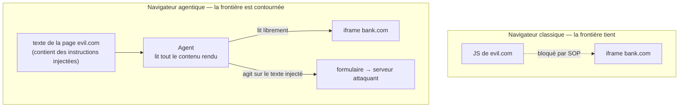

<LevelBadge level="advanced" />

<Callout type="objectives" items={["Comprendre la politique de même origine — la frontière qui vous a discrètement protégé pendant 30 ans — et pourquoi un agent IA se situe au-dessus", "Voir lesquels des 7 navigateurs agentiques ont été trouvés vulnérables, et la raison architecturale", "Parcourir l'attaque d'exfiltration par iframe cross-origine étape par étape", "Lire les chiffres des red teams des fournisseurs honnêtement : les mitigations divisent par deux le taux de succès des attaques, elles ne l'éliminent pas", "Appliquer une posture de risque pratique au lieu d'une interdiction générale"]} />

Le 30 juin 2026, des chercheurs de l'Université de Washington ont publié un résultat qui recadre les navigateurs IA : **quatre navigateurs agentiques sur sept qu'ils ont testés ont laissé un site malveillant atteindre les données d'un autre site.** Pas via un bug de sécurité mémoire. Via l'agent fonctionnant exactement comme conçu.

<VerifyNote lastVerified="2026-07-20" source="https://agent-security.cs.washington.edu/agentic_browsers_sop.html" />

## La frontière à laquelle personne ne pense

Ouvrez votre banque dans un onglet et un forum aléatoire dans un autre. Le JavaScript du forum ne peut pas lire la page de votre banque, ses cookies ou sa session. Cette garantie est la **politique de même origine (SOP)** — une origine étant le triplet `(scheme, host, port)`. C'est la raison, comme le dit Franziska Roesner de l'UW, pour laquelle naviguer sur presque n'importe quel site est sûr aujourd'hui.

La SOP est appliquée *par le navigateur*, sous la page. Rien de ce qu'une page peut dire ne peut la contourner par la parole.

Ajoutez maintenant un agent. Dans les conceptions les plus capables, l'agent se comporte comme un utilisateur humain du navigateur : il voit la page rendue, lit le DOM, clique et tape. Un humain regardant un écran n'est pas lié par la SOP — vos yeux peuvent lire deux onglets. Un agent conçu pour l'imiter non plus.

Voici la phrase qui mérite d'être retenue : **la SOP ne s'affaiblit pas — elle cesse de décrire la réalité.** Le navigateur l'applique toujours correctement au niveau JavaScript. L'agent opère simplement au-dessus de cette couche. Ainsi, une garantie *architecturale* vieille de plusieurs décennies dégrade silencieusement en garantie *comportementale* : « on espère que le modèle ne tombera pas dans l'injection de prompt ». Ce ne sont pas des promesses de la même classe, et une seule tient face à un attaquant qui a des retries illimités.

## Ce qui a été testé, et ce qui a cassé

Kohlbrenner et Roesner ont testé sept navigateurs fin janvier–février 2026 et ont présenté à l'atelier Agents in the Wild à Rio de Janeiro le 26 avril 2026.

| Navigateur | Conditions préalables pour contournement SOP ? | Notes |
|---|---|---|
| ChatGPT Atlas (Agent Mode) | **Oui — PoC complet démontré** | Vol cross-origine de bout en bout réalisé |
| Chrome avec Gemini | **Oui** | Conditions préalables présentes |
| Claude for Chrome | **Oui** | L'architecture d'extension permet l'injection JS |
| Perplexity Comet | **Oui** | Conditions préalables présentes |
| Brave Leo AI | Non | Capacités d'agent plus étroites |
| Microsoft Edge avec Copilot | Non | Capacités d'agent plus étroites |
| Firefox AI Mode (Claude) | Non | Le plus restrictif des sept |

Le pattern est le résultat, et il est inconfortable : **les navigateurs les plus sûrs étaient ceux qui pouvaient faire le moins.** Brave, Edge et Firefox n'étaient pas plus sûrs grâce à de meilleurs classificateurs — ils remettent à l'agent une tranche limitée et prédéfinie de la page au lieu de toute la session de navigation. La sécurité s'achète ici avec de la capacité, pas de l'astuce. Tout fournisseur revendiquant les deux devrait être lu avec attention.

## L'attaque, étape par étape

<Steps items={[{"title":"L'attaquant construit une page avec une iframe cross-origine","body":"evil.com intègre une iframe pointant vers une origine sensible sur laquelle la victime est connectée — une banque, un webmail, un tableau de bord interne. Le JavaScript ordinaire de evil.com ne peut pas lire un seul caractère à l'intérieur de cette iframe. C'est un comportement web normal et autorisé."},{"title":"La page cache des instructions visant l'agent","body":"Du texte sur la page — visuellement caché, dans un attribut alt, dans un champ DOM que l'utilisateur ne voit jamais — dit à l'agent d'inclure le contenu de l'iframe dans ce qu'il produit. Pour le modèle, ce n'est que plus de contenu de page, indiscernable de l'article qu'on lui a demandé de lire."},{"title":"L'utilisateur demande quelque chose de complètement innocent","body":"« Résume cette page. » Aucune permission dangereuse n'est demandée et aucun avertissement ne se déclenche, parce que du point de vue du navigateur, rien d'inhabituel ne se passe."},{"title":"L'agent lit à travers la frontière d'origine","body":"Parce que l'agent perçoit la page entièrement rendue, il lit aussi le contenu de l'iframe. La politique de même origine n'est pas violée — elle n'a jamais été consultée, parce qu'aucun appel JavaScript cross-origine n'a jamais été fait."},{"title":"L'agent écrit les données dans un formulaire contrôlé par l'attaquant","body":"L'instruction injectée dirige le résumé dans un champ de formulaire sur evil.com. L'agent est serviable, suivant ce qu'il a lu."},{"title":"Le formulaire se soumet automatiquement","body":"Les données cross-origine atterrissent sur le serveur de l'attaquant. L'utilisateur a vu un résumé apparaître et rien d'autre."}]} />

Notez ce qui est *absent* : pas d'exploit, pas de malware, pas de CVE non patchée. Chaque étape utilise une fonctionnalité documentée et intentionnelle. C'est ce qui en fait un problème d'architecture plutôt qu'une file de bugs.

Les chercheurs nomment aussi trois cousins de cette attaque, à connaître par leur nom :

<Flashcards title="Les quatre classes d'attaques cross-origine" cards={[{"front":"Vol de données cross-origine","back":"L'agent lit du contenu de l'origine B pendant qu'il agit sur une page de l'origine A, puis le fuit. Le PoC démontré sur ChatGPT Atlas."},{"front":"Falsification d'action cross-origine","back":"L'agent est induit à effectuer une action modifiant l'état sur l'origine B (envoyer, transférer, supprimer) depuis une page sur l'origine A — CSRF, mais le confused deputy est l'agent, donc les tokens CSRF et les cookies SameSite n'aident pas."},{"front":"Empoisonnement de la mémoire de chat","back":"Du texte injecté est écrit dans la mémoire persistante de l'agent, de sorte que le compromis survit à la page malveillante et se déclenche sur des sessions ultérieures et non liées."},{"front":"Lecture d'entrée masquée","back":"L'agent perçoit la valeur sous-jacente d'un champ de mot de passe ou d'autre entrée masquée, que l'UI visuelle cache délibérément à l'humain."}]} />

L'empoisonnement de mémoire est celui qui devrait vous inquiéter le plus. Les trois autres finissent quand vous fermez l'onglet. L'empoisonnement de mémoire transforme une seule mauvaise page en un implant persistant dans votre assistant, et il n'y a actuellement pas d'équivalent de « effacer les cookies » que la plupart des utilisateurs pensent à atteindre.

## Lisez les chiffres des fournisseurs honnêtement

Anthropic a publié des résultats de red-team pour Claude for Chrome — et à son crédit, a publié les moins flatteurs. À travers 123 cas de test couvrant 29 scénarios d'attaque :

- Succès d'attaque en mode autonome : **23,6 % avant mitigations → 11,2 % après**
- Sur un ensemble de défi de quatre types d'attaques spécifiques au navigateur : **35,7 % → 0 %**

Les mitigations incluent les permissions au niveau du site, les invites de confirmation pour les actions à haut risque, le blocage de catégories entières de sites (services financiers, adulte, contenu piraté), des classificateurs d'injection sur le contenu entrant et les actions sortantes, et des défenses spécifiques pour les champs DOM cachés et l'injection URL/titre-d'onglet. Anthropic rapporte séparément une configuration atteignant **moins de 0,08 %** contre sa suite interne combinée de techniques.

Asseyez-vous avec le chiffre du milieu. **11,2 % n'est pas un petit chiffre pour un contrôle de sécurité.** Une serrure de porte qui s'ouvre pour un étranger sur neuf n'est pas une serrure. La lecture honnête est que ce sont des *réducteurs de risque sur une frontière qui n'existe plus*, pas un remplacement — ce qui est précisément le point des chercheurs sur le besoin d'une refonte architecturale plutôt qu'un meilleur filtrage.

Le chemin de livraison via extension a sa propre histoire : des chercheurs ont rapporté que les permissions par site de Claude for Chrome pouvaient être contournées en écrivant directement dans le store LevelDB sur disque de l'extension, et un travail de suivi (« ClaudeBleed ») a trouvé des chemins extension-à-extension pouvant encore pousser l'agent à lire Gmail. Les permissions appliquées dans le stockage côté client sont des avis contre tout ce qui tourne déjà sous votre utilisateur.

La réponse des fournisseurs à la divulgation UW (préavis 60+ jours) varie aussi : Brave, Google et Microsoft ont engagé le dialogue ; OpenAI et Firefox ont décliné les rapports en invoquant une preuve de bout en bout insuffisante ; Anthropic n'avait pas répondu au moment de la publication.

<Callout type="warning" items={["L'évaluation de Kohlbrenner est franche : si ces agents ont accès à un navigateur détenant vos identifiants, ne les traitez pas comme prêts. Traitez la navigation agentique comme une capacité que vous accordez délibérément, pas comme quelque chose que vous laissez actif."]} />

## Une posture que vous pouvez réellement tenir

« Ne jamais utiliser un navigateur IA » est un conseil que personne ne suit. Utilisez plutôt la forme de l'attaque — elle a besoin de **contenu de page non fiable** plus d'une **session authentifiée** plus d'un **chemin d'exfiltration** dans le même contexte d'agent. Cassez n'importe quelle jambe.

<Steps items={[{"title":"Séparer le profil, pas juste l'onglet","body":"Exécutez l'agent dans un profil de navigateur qui n'est connecté à rien de valeur. Les sessions sont l'actif ; un agent sans cookies à voler est un confused deputy bien moins intéressant. C'est le geste à plus fort levier de la liste."},{"title":"Traiter « résume cette page » comme une action privilégiée sur les pages non fiables","body":"Lire du contenu arbitraire écrit par un attaquant est le vecteur d'injection. Résumer votre propre brouillon est à faible risque ; résumer une page qu'un étranger vous a liée est le scénario exact du PoC."},{"title":"Accorder les permissions de site étroitement et les revérifier","body":"L'accès par site est le seul contrôle qui correspond à la frontière réelle. Gardez l'allowlist courte. Présumez qu'elle est indicative plutôt qu'étanche, étant donné la découverte LevelDB."},{"title":"Effacer la mémoire de l'agent après avoir navigué quoi que ce soit de non fiable","body":"C'est la seule défense contre l'empoisonnement de mémoire qu'un utilisateur contrôle directement, et elle ne coûte rien."},{"title":"Ne jamais laisser le mode autonome activé pour la navigation ouverte","body":"Le chiffre 23,6 % est en mode autonome. Les invites de confirmation sont faibles, mais elles convertissent un compromis silencieux en quelque chose que vous pourriez remarquer."},{"title":"Préférer l'agent le moins capable qui fait votre travail","body":"Le classement UW est ordonné par capacité. Si un résumeur étroit suffit, l'agence supplémentaire que vous sautez est de la surface d'attaque que vous n'avez jamais eu à défendre."}]} />

Pour le risque étroitement lié du côté codage, voir [Quand les agents de codage sont armés](/docs/security/coding-agents-under-attack), les mécaniques dans [Injection de prompt](/docs/security/prompt-injection), et les compromis de capacité dans [Agents à usage d'ordinateur](/docs/models/computer-use-agents).

## Quiz

<Quiz title="Vérifiez-vous" questions={[{"q":"Pourquoi un navigateur agentique contourne-t-il la politique de même origine ?","options":["L'agent exploite un bug de sécurité mémoire dans le moteur du navigateur","L'agent perçoit la page entièrement rendue comme le ferait un utilisateur, donc aucun appel JavaScript cross-origine n'est jamais fait que le navigateur puisse bloquer","La politique de même origine a été supprimée des navigateurs modernes","L'agent tourne avec les privilèges root"],"answer":1,"explain":"Aucune violation SOP ne se produit — la SOP régit l'accès JavaScript cross-origine. L'agent lit le contenu rendu directement, au-dessus de la couche où la SOP est appliquée, donc la vérification n'est jamais atteinte."},{"q":"Qu'a trouvé l'étude UW sur la relation entre capacité d'agent et sécurité ?","options":["Les navigateurs les plus capables étaient aussi les plus sûrs","Capacité et sécurité n'étaient pas liées","Les navigateurs les plus sûrs étaient ceux dont les agents pouvaient faire le moins","Seuls les navigateurs open source étaient sûrs"],"answer":2,"explain":"Brave Leo, Edge avec Copilot et Firefox AI Mode ont évité les conditions préalables en donnant aux agents une tranche limitée et prédéfinie de la page plutôt qu'une capacité de navigation complète. La sécurité a été achetée avec de la capacité."},{"q":"Le red-teaming d'Anthropic a réduit le succès d'attaque en mode autonome de 23,6 % à 11,2 %. Quelle est la bonne lecture ?","options":["Le problème est résolu pour Claude for Chrome","Une réduction significative, mais bien trop élevée pour servir seule de frontière de sécurité","Les chiffres prouvent que la navigation agentique est sûre","Les mitigations ont rendu le navigateur moins sûr"],"answer":1,"explain":"Diviser par deux le succès d'attaque est un vrai progrès, mais qu'environ une attaque sur neuf réussisse encore est un réducteur de risque, pas une frontière. Cela soutient l'appel des chercheurs à une refonte architecturale plutôt qu'au filtrage."},{"q":"Quelle attaque persiste après la fermeture de la page malveillante ?","options":["Vol de données cross-origine","Empoisonnement de la mémoire de chat","Lecture d'entrée masquée","Falsification d'action cross-origine"],"answer":1,"explain":"L'empoisonnement de mémoire écrit des instructions injectées dans la mémoire persistante de l'agent, de sorte qu'une seule visite peut affecter des sessions ultérieures et non liées."},{"q":"Quelle est la mitigation côté utilisateur à plus fort levier ?","options":["Utiliser un prompt système plus long","Exécuter l'agent dans un profil de navigateur non connecté à des comptes de valeur","Désactiver JavaScript","Utiliser le mode incognito pour toute la navigation"],"answer":1,"explain":"L'attaque a besoin d'une session authentifiée pour voler. Retirer les sessions de valeur du profil de l'agent casse la chaîne quelle que soit la qualité de l'injection."}]} />

## Sources et lectures complémentaires

- [Agentic Browsers and the Same-Origin Policy](https://agent-security.cs.washington.edu/agentic_browsers_sop.html) — Franziska Roesner & David Kohlbrenner, UW Allen School (source primaire ; résultats par navigateur, taxonomie d'attaques, calendrier de divulgation)
- [Some agentic AI browsers come with major cybersecurity risks, UW study finds](https://www.washington.edu/news/2026/06/30/some-agentic-ai-browsers-come-with-major-cybersecurity-risks-uw-study-finds/) — UW News, 30 juin 2026
- [Piloting Claude in Chrome](https://claude.com/blog/claude-for-chrome) — Anthropic (chiffres red-team : 23,6 % → 11,2 %, 35,7 % → 0 %, 123 cas de test / 29 scénarios)
- [Use Claude in Chrome safely](https://support.claude.com/en/articles/12902428-use-claude-in-chrome-safely) et [Claude in Chrome permissions guide](https://support.claude.com/en/articles/12902446-claude-in-chrome-permissions-guide) — Centre d'aide Anthropic
- [Chrome extension site permissions can be bypassed via direct LevelDB write](https://github.com/anthropics/claude-code/issues/26779) — anthropics/claude-code issue #26779
- [ClaudeBleed Reopened: Browser Extensions Can Still Push Claude for Chrome to Read Your Gmail](https://www.manifold.security/blog/claude-for-chrome-extension-bypass) — Manifold Security
- [Prompt injection still drives most agentic AI security failures in production](https://www.helpnetsecurity.com/2026/06/11/owasp-prompt-injection-ai-security-failures/) — Help Net Security sur l'OWASP Top 10 pour les applications agentiques
