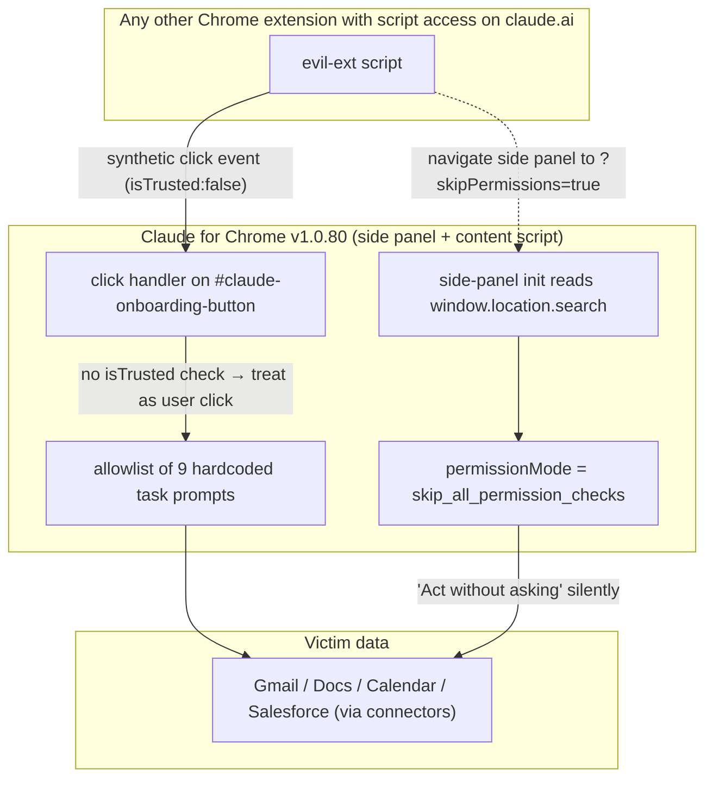

<LevelBadge level="advanced" />

<Callout type="objectives" items={["Comprendre les deux contournements dans Claude for Chrome — un contrôle event.isTrusted manquant et un paramètre d'URL qui auto-élève le panneau latéral", "Voir pourquoi le fait qu'Anthropic ait marqué le ticket « Résolu » avant le 9 juin, puis ait publié huit versions supplémentaires (v1.0.73 → v1.0.80) sans changement, est la vraie histoire ici", "Apprendre le modèle défensif général : les allowlists côté client uniquement ne constituent pas une frontière de sécurité quand une autre extension partage votre origine", "Appliquer trois mesures d'atténuation concrètes en moins de deux minutes dès maintenant"]} />

Le **7 juillet 2026**, Anthropic a publié **Claude for Chrome v1.0.80**. Manifold Security l'a testé le jour même et a constaté que leurs deux rapports de bugs de mai étaient toujours reproductibles octet par octet depuis la v1.0.72. Toute autre extension de votre navigateur disposant d'un accès script sur `claude.ai` — une permission demandée par des milliers d'extensions Chrome — peut silencieusement demander à Claude d'ouvrir Gmail, de lire un message et d'agir en conséquence. Aucun dialogue d'approbation. Aucun geste de l'utilisateur.

<VerifyNote lastVerified="2026-07-22" source="https://www.manifold.security/blog/claude-for-chrome-extension-bypass" />

L'histoire n'est pas « une extension avait un bug ». Les extensions Chrome publient des bugs en permanence. L'histoire, c'est qu'un produit de navigateur agentique déjà en production, après neuf mois de scrutin et un incident public « ClaudeBleed » derrière lui, applique encore son modèle de permissions à un endroit qu'un attaquant contrôle totalement — le client — et marque le ticket de suivi **Résolu** sans que le code n'ait changé.

## Les deux failles en une seule image

Deux bugs indépendants. **L'un ou l'autre à lui seul** suffit à déclencher toutes les tâches en dur. Ensemble, l'un vous donne le déclencheur (faux clic) et l'autre vous donne l'exécution silencieuse (auto-élévation).

## Faille n°1 — le contrôle `isTrusted` manquant

Chaque événement qu'un navigateur envoie possède un booléen `isTrusted`. Les vraies actions utilisateur — un clic physique, une frappe au clavier, un toucher — arrivent avec `isTrusted: true`. Tout ce que JavaScript synthétise via `dispatchEvent(new MouseEvent(...))` arrive avec `isTrusted: false`. C'est le seul signal fiable du navigateur pour distinguer *l'utilisateur du code*, et il existe précisément pour que les gestionnaires sensibles à la sécurité puissent les différencier.

Le script de contenu de Claude for Chrome écoute les clics sur l'élément d'id `#claude-onboarding-button` et, si le clic correspond à l'un des neuf ID de tâches autorisés (`usecase-gmail`, `usecase-gdocs`, `usecase-calendar`, `usecase-salesforce`, plus DoorDash, Zillow et trois défis d'onboarding), transmet le prompt correspondant au panneau latéral de Claude pour exécution.

Le gestionnaire ne vérifie jamais `event.isTrusted`. Selon les mots des chercheurs : du point de vue de l'extension, un faux clic et un vrai clic sont indiscernables.

Cela compte à cause d'un point architectural facile à manquer : **toute autre extension Chrome que vous avez installée avec des `content_scripts` correspondant à `https://claude.ai/*` partage l'origine de Claude du point de vue de Chrome, et peut injecter un script dans la page.** Cette permission n'a rien d'exotique — gestionnaires de mots de passe, découpeurs de notes, outils de traduction, bloqueurs de publicité et d'innombrables extensions de « productivité » la demandent par principe. Une fois qu'un script tourne dans cette page, dispatcher un clic synthétique sur `#claude-onboarding-button` représente environ six lignes de code. Le rapport de Manifold rappelle précisément cette taille pour souligner un point : le correctif tient en une instruction `if`, et l'exploit en un seul appel `dispatch`.

L'allowlist de neuf prompts était l'atténuation *précédente* d'Anthropic pour ClaudeBleed — l'idée étant « même si un clic est falsifié, seule une liste fixe de tâches sûres peut s'exécuter ». Ce modèle s'effondre dès que « exécuter l'intégration Gmail » figure sur la liste. Lire Gmail et agir en son nom n'est pas une tâche sûre.

<Callout type="tip" items={["La leçon n'est pas « ajoutez isTrusted » — c'est la leçon en dessous : une allowlist de tâches d'agent « sûres » n'est aussi sûre que la tâche la moins sûre qui y figure. Un consentement utilisateur fin, par intégration, doit accompagner chacun de ces déclencheurs, pas seulement les déclencheurs libres non fiables."]} />

## Faille n°2 — `?skipPermissions=true` dans l'URL du panneau

Les panneaux latéraux d'extension Chrome ont leur propre URL, et la chaîne de requête de cette URL est lisible dans le panneau via `window.location.search`. Le panneau latéral de Claude lit un paramètre `skipPermissions`. S'il vaut `"true"`, le panneau s'initialise avec `permissionMode = "skip_all_permission_checks"` — le même mode interne que lorsqu'un utilisateur active manuellement *Agir sans demander*.

C'est une escalade de privilèges côté client, en libre-service. Le panneau se demande à lui-même la permission et se répond oui sur la base d'une valeur que le panneau lui-même a reçue dans son URL — que tout ce qui peut faire `chrome.sidePanel.open({...})` ou naviguer sur le panneau peut fournir.

Manifold classe ce scénario **CVSS 9,6 Critique**, car dans ce mode il n'y a aucune boîte d'approbation : les neuf prompts autorisés s'exécutent silencieusement. La faille du clic synthétique seule (avec la boîte d'approbation normale encore visible) est classée 7,7 Élevée, car un utilisateur pourrait en principe remarquer le dialogue avant d'appuyer sur Entrée.

La bonne forme du correctif n'est pas « assainir le paramètre d'URL ». C'est que les transitions entre modes de permission devraient exiger un geste utilisateur explicite et `isTrusted` sur un vrai contrôle d'interface après le chargement du panneau — jamais une valeur que le panneau lit dans sa propre URL, son propre stockage ou un canal de messages sur lequel une autre extension peut publier. C'est la même contrainte architecturale que les navigateurs appliquent déjà aux permissions plein écran, caméra et presse-papiers, et pour la même raison.

## Pourquoi « Résolu » ≠ corrigé — l'échec de processus

La chronologie est ce qui fait de cela une histoire de gouvernance, et pas seulement une histoire de code :

<Steps items={[
{ "title": "21 mai 2026 — Manifold signale les deux problèmes", "body": "Deux rapports de bugs distincts déposés chez Anthropic contre la v1.0.72." },
{ "title": "22 mai — accusés de réception et clos", "body": "Anthropic a accusé réception des deux. Le rapport n°1 a été clos en tant que doublon d'un ticket existant ; le rapport n°2 rejeté comme « informatif » au motif que le paramètre d'URL est « seulement utilisé par l'extension elle-même » — ce qui est exactement l'hypothèse que le bug viole." },
{ "title": "Avant le 9 juin — ticket interne marqué « Résolu »", "body": "Le ticket global « ClaudeBleed » a été basculé en Résolu dans le suivi interne d'Anthropic — apparemment sur la base de l'atténuation par allowlist de neuf prompts, et non d'un correctif des deux bugs sous-jacents." },
{ "title": "7 juillet — la v1.0.80 sort, code identique octet pour octet", "body": "Huit versions (v1.0.73 → v1.0.80) sont sorties entre le rapport et maintenant. Les chercheurs ont revérifié : le gestionnaire de clic et l'initialisation du panneau sont inchangés par rapport à la version qu'ils avaient initialement testée." },
{ "title": "14 juillet — divulgation publique", "body": "Pas de CVE. Pas d'avis d'Anthropic. Article de blog public + Hacker News + couverture de la presse spécialisée. À la date de cette page : toujours non corrigé." }
]} />

Deux modes d'échec à intérioriser, car ils sont fréquents hors de cette histoire :

1. **Effondrement d'atténuation.** Une atténuation qui change la forme d'un exploit (« il faut maintenant cliquer sur l'un des neuf boutons ») est traitée comme un correctif. Quand le déclencheur de ces boutons est lui-même falsifiable, l'atténuation n'ajoute aucune sécurité — elle ne fait que modifier la recette de l'attaque.
2. **Dérive du « résolu par conception ».** Le bug n°2 a été clos sur la théorie que seule l'extension elle-même définit `skipPermissions`. C'est une description de l'*intention*, pas de *l'application réelle par le navigateur*. Tout ce qui a accès à `sidePanel` ou une redirection via l'URL du panneau peut aussi le définir.

Les deux motifs figurent sur les listes d'anti-patterns de revue de sécurité pour une raison. Guettez-les dans votre propre code.

## Ce qui s'exécute, et à quelles données cela peut accéder

Les neuf ID de tâches en dur, d'après le rapport de Manifold :

| Catégorie | ID de tâches | Ce que le prompt demande à peu près à Claude de faire |
| --- | --- | --- |
| Google | `usecase-gmail`, `usecase-gdocs`, `usecase-calendar` | Lire Gmail (y compris un flux « se désabonner des e-mails promotionnels » qui itère sur la boîte de réception), lire les commentaires Google Docs, lire les disponibilités Calendar et créer des réunions |
| CRM / commerce | `usecase-salesforce`, `usecase-doordash`, `usecase-zillow` | Lire les leads Salesforce et les convertir en opportunités ; parcourir les flux DoorDash / Zillow |
| Onboarding | trois défis d'onboarding | Prompts de visite guidée |

La portée dépend des connecteurs que la victime a activés. Si Gmail est connecté, `usecase-gmail` lit Gmail. Si Salesforce est connecté, `usecase-salesforce` touche le CRM. Le panneau fait ce qu'un utilisateur lui a demandé de faire — juste pas *cet* utilisateur, et pas maintenant.

<Callout type="warning" items={["« Agir sans demander » n'est pas un mode développeur spécial. C'est une case à cocher dans les paramètres de Claude for Chrome. Si elle est activée, la faille n°1 seule déclenche de vraies lectures Gmail / Docs / Calendar / Salesforce. Si elle est désactivée, la faille n°2 (?skipPermissions=true) peut la réactiver silencieusement pour la durée de vie du panneau."]} />

## Trois choses à faire maintenant (deux minutes)

<Steps items={[
{ "title": "Désactivez Agir sans demander", "body": "Paramètres Claude for Chrome → désactivez « Agir sans demander ». Les invites d'approbation sont pénibles, mais elles sont le seul signal visible pour l'utilisateur que la faille n°1 seule vous laisse." },
{ "title": "Auditez quelles extensions peuvent toucher claude.ai", "body": "chrome://extensions → Détails pour chacune → Accès au site. Toute extension réglée sur Tous les sites ou qui liste claude.ai peut injecter un script de contenu dans la page Claude. Restreignez ou supprimez celles auxquelles vous ne faites pas activement confiance. Les gestionnaires de mots de passe et les découpeurs de notes sont les deux catégories qui méritent une double vérification." },
{ "title": "Élaguez les connecteurs que vous n'utilisez pas", "body": "Dans Claude → Paramètres → Connecteurs, déconnectez les intégrations Gmail / Docs / Calendar / Salesforce dont vous ne dépendez pas. Les neuf tâches en dur ne sont dangereuses que contre des connecteurs effectivement connectés." }
]} />

Si vous gérez des extensions agentiques pour toute une équipe, ajoutez un quatrième point : **observation en temps réel de ce que les agents exécutent réellement** — pas seulement des permissions qu'ils détiennent. Les deux failles passent un audit de permissions et échouent à une observation comportementale, parce qu'elles amènent l'agent à *faire* des choses que l'utilisateur n'a jamais demandées. C'est dans cet écart que se situe la propre recommandation de Manifold, et elle se généralise bien au-delà de ce seul produit.

<PromptCard title="Prompt d'audit d'extensions Chrome pour Claude">
{`Here is my current chrome://extensions export (or a list I'll paste): {LIST}.

For each extension:
1. Is its "site access" set to "All sites" or does it match claude.ai? Flag those.
2. From its Chrome Web Store description, what content_scripts permissions does it plausibly require? Is claude.ai a required domain for its stated function?
3. Rate each on a "trust to run a script inside my Claude tab" scale from 1 (dedicated password manager from a known vendor) to 5 (random productivity extension with <10k installs).
4. Give me a two-column recommendation: KEEP AS-IS / RESTRICT TO SPECIFIC SITES / REMOVE — with a one-line reason per row.

Do not soften. If something looks sketchy, say sketchy.`}
</PromptCard>

## Le motif plus large — allowlists côté client uniquement, portée agentique

Prenez du recul par rapport à Claude for Chrome. La même forme apparaît dans un nombre croissant de produits agentiques :

- Une UI de confiance (extension, application de bureau, plugin d'IDE) expose un agent qui peut effectuer de vraies actions sur les données utilisateur.
- Pour limiter le risque, le fournisseur ajoute une **allowlist** de tâches/prompts/outils que l'agent peut exécuter sans approbation.
- Le **déclencheur** des entrées de l'allowlist reste *à l'intérieur du client* — un clic, une URL, un paramètre stocké, un message sur un canal partagé par d'autres composants.
- Tout autre code dans la même zone de confiance (même hôte d'extension, même origine, même bus IPC) peut falsifier le déclencheur.

La leçon que chaque tour enseigne est la même. Cf. également `docs/security/agentic-browsers-same-origin.mdx` (l'agent lit au-dessus de la SOP), `docs/security/coding-agents-under-attack.mdx` (l'auto-approbation est la nouvelle surface d'attaque) et `docs/security/prompt-injection.mdx` (un contenu non fiable devient des instructions non fiables). Chacun de ces cas illustre *une frontière tracée là où l'attaquant se tient déjà*.

Deux invariants à écrire sur un post-it :

1. **Un contrôle de permission que l'attaquant peut appeler n'est pas un contrôle de permission.** Si « n'importe quel script sur cette page », « n'importe quel paramètre d'URL », « n'importe quelle valeur de stockage » ou « n'importe quel postMessage d'origine inconnue » peut faire basculer votre agent de *demander* à *agir*, ce basculement doit se trouver derrière un geste `isTrusted` sur un vrai élément DOM que vous avez rendu.
2. **Les allowlists ne sont pas un substitut au consentement.** Si une seule tâche de la liste surprendrait l'utilisateur si elle était exécutée sans invite (`lire mon Gmail` en fait partie), l'allowlist réduit le choix de l'attaquant mais pas son impact.

## Vérification rapide

<Quiz questions={[
  {
    "q": "Dans Claude for Chrome v1.0.80, pourquoi une extension Chrome ordinaire disposant d'un accès script à claude.ai suffit-elle à déclencher les neuf tâches autorisées ?",
    "options": [
      "Parce que l'extension peut appeler directement l'API de Claude en utilisant le cookie de session de l'utilisateur.",
      "Parce que le gestionnaire de clic sur #claude-onboarding-button ne vérifie pas event.isTrusted, donc un clic synthétique de n'importe quel script dans la page est traité comme une entrée utilisateur.",
      "Parce que Chrome expose la clé privée de l'extension aux scripts de même origine.",
      "Parce que Claude charge le code de l'extension attaquante dans son propre processus."
    ],
    "answer": 1,
    "explain": "Le bug est le contrôle isTrusted manquant. Un MouseEvent synthétique dispatché depuis n'importe quel script tournant dans la page Claude passe par le gestionnaire comme si l'utilisateur avait cliqué. Aucune exposition de clé API ni traversée de processus requise — juste un accès script à la page."
  },
  {
    "q": "Quel est le mécanisme réel du contournement ?skipPermissions=true ?",
    "options": [
      "Le paramètre d'URL est envoyé au serveur d'Anthropic, qui renvoie un jeton d'administration.",
      "Le panneau latéral lit lui-même window.location.search et, si skipPermissions vaut \"true\", définit son permissionMode sur skip_all_permission_checks localement — aucun serveur impliqué.",
      "Il désactive la politique de même origine de Chrome pour le panneau.",
      "Il accorde au panneau la permission de débogueur de Chrome."
    ],
    "answer": 1,
    "explain": "C'est une escalade de privilèges côté client uniquement, en libre-service. Le panneau se demande à lui-même une permission élevée et lit la réponse dans sa propre URL — que tout ce qui peut ouvrir ou naviguer sur le panneau contrôle."
  },
  {
    "q": "Anthropic a marqué le ticket sous-jacent « Résolu » avant le 9 juin 2026, or la v1.0.80 (7 juillet) est identique octet pour octet à la v1.0.72. Quel mode d'échec cela illustre-t-il le mieux ?",
    "options": [
      "Une compromission de la chaîne d'approvisionnement du pipeline de build de l'extension.",
      "Effondrement d'atténuation : l'allowlist de neuf prompts a été traitée comme un correctif, mais le déclencheur de ces prompts est lui-même falsifiable, donc l'allowlist change la forme de l'exploit sans réduire son impact.",
      "Un bug dans le modèle de permissions du manifeste v3 de Chrome.",
      "Anthropic révoquant l'accord de divulgation de Manifold."
    ],
    "answer": 1,
    "explain": "L'allowlist était l'atténuation antérieure d'Anthropic pour ClaudeBleed. Elle n'aide que si le déclencheur pour sélectionner une entrée est digne de confiance. Le contrôle isTrusted manquant rend le déclencheur falsifiable, donc l'atténuation réduit le choix de l'attaquant, pas son impact — mais le ticket a été clos comme s'il s'agissait d'un correctif."
  },
  {
    "q": "Laquelle de ces mesures est la plus forte, appliquée seule, qu'un utilisateur de Claude for Chrome peut mettre en œuvre dès maintenant ?",
    "options": [
      "Désactiver JavaScript sur claude.ai.",
      "Désinstaller Google Chrome.",
      "Désactiver « Agir sans demander » et auditer quelles autres extensions ont un accès script à claude.ai.",
      "Faire tourner la clé d'API Anthropic."
    ],
    "answer": 2,
    "explain": "Désactiver « Agir sans demander » restaure l'invite d'approbation (la faille n°1 seule devient donc visible pour l'utilisateur), et élaguer les extensions avec un accès script à claude.ai supprime la partie qui peut dispatcher le clic synthétique en premier lieu. Faire tourner une clé d'API ne fait rien ici — l'attaque chevauche la session UI de l'utilisateur, pas un identifiant d'API."
  }
]}/>

<Callout type="takeaways" items={["La v1.0.80 de Claude for Chrome (7 juillet 2026) reste vulnérable aux deux bugs de Manifold initialement signalés sur la v1.0.72 en mai — contournement par clic synthétique de l'allowlist de neuf prompts, et auto-élévation via ?skipPermissions=true dans l'URL du panneau.", "Les deux bugs sont des contrôles de permission côté client uniquement. « Résolu » dans le ticket faisait référence à une atténuation (l'allowlist), pas aux lacunes d'application sous-jacentes.", "Dès maintenant : désactivez Agir sans demander, auditez quelles autres extensions Chrome peuvent injecter des scripts dans claude.ai, et déconnectez les connecteurs que vous n'utilisez pas.", "Règle générale : un contrôle de permission que n'importe quel script sur la page peut appeler n'est pas un contrôle de permission. Les transitions de mode doivent reposer sur un geste isTrusted sur un vrai élément d'interface, pas sur une valeur d'URL / de stockage / de message."]} />

## Sources et lectures complémentaires

- Manifold Security — [ClaudeBleed Reopened: browser extensions can still push Claude for Chrome to read your Gmail](https://www.manifold.security/blog/claude-for-chrome-extension-bypass) (analyse technique principale ; chronologie, notations CVSS, l'observation du code identique octet pour octet)
- The Hacker News — [Researchers Say Claude for Chrome Flaw Lets Rogue Extensions Trigger Gmail Reads](https://thehackernews.com/2026/07/claude-for-chrome-flaw-lets-other.html) (couverture spécialisée ; réponse publique d'Anthropic)
- BleepingComputer — [Claude Chrome extension flaw lets malicious extensions trigger AI actions](https://www.bleepingcomputer.com/news/security/claude-chrome-extension-flaw-lets-malicious-extensions-trigger-ai-actions/) (surface d'attaque, exigences de permissions)
- TechRadar — [The bypass is still six lines of JavaScript](https://www.techradar.com/pro/the-bypass-is-still-six-lines-of-javascript-security-experts-warn-that-claude-for-chrome-browser-extension-could-be-hijacked-despite-it-alerting-anthropic-several-times-that-something-was-wrong) (contexte sur pourquoi le correctif est une seule condition)
- Sur AILmanac : [Les navigateurs agentiques cassent la politique de même origine](/docs/security/agentic-browsers-same-origin), [Quand les agents de code sont armés](/docs/security/coding-agents-under-attack), [Injection de prompt : le modèle de sécurité que vous ne pouvez ignorer](/docs/security/prompt-injection)
- OWASP — [Top 10 for LLM Applications](https://genai.owasp.org/llm-top-10/) (LLM01 Injection de prompt & LLM06 Agence excessive sont les deux catégories auxquelles ces bugs correspondent)
