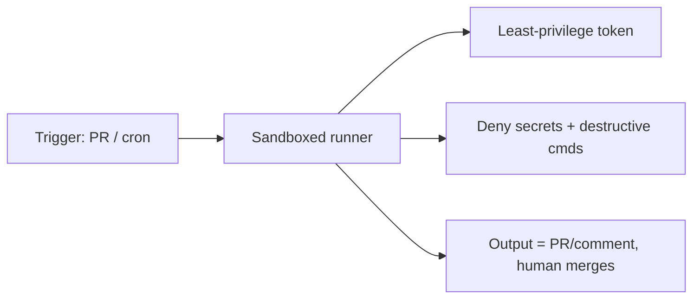

<LevelBadge level="advanced" />

Exécuter Claude en mode [headless](/docs/claude-code/headless-and-agent-sdk) ou sur une [planification](/docs/claude-code/background-tasks) — en CI, dans une tâche cron, dans un hook de pre-commit — supprime l'humain qui repérerait normalement une mauvaise action. C'est précisément cette commodité qui impose à ces exécutions les garde-fous les plus stricts.

## Les risques propres aux exécutions sans surveillance

- **Personne pour dire « non »** à un appel d'outil risqué sur le moment.
- **Identifiants ambiants.** La CI dispose souvent de jetons puissants (déploiement, registre de paquets, cloud). Un agent qui s'y exécute en hérite.
- **Entrées non fiables.** Une exécution déclenchée par une PR ou une issue peut traiter du contenu rédigé par un attaquant ([injection](/docs/security/prompt-injection)).

## Une checklist de renforcement

- **Refusez les secrets explicitement.** Bloquez la lecture de `.env`, des fichiers de clés et des chemins d'identifiants via des [règles de refus de permission](/docs/claude-code/permissions). Ne comptez pas sur le modèle pour les éviter.
- **N'utilisez jamais le mode bypass/yolo sur une machine disposant d'un accès réel.** Réservez le « ignorer toutes les invites » aux bacs à sable jetables.
- **Restreignez le jeton.** Donnez à l'exécution un jeton à moindre privilège (en lecture seule lorsque c'est possible), et non vos identifiants à accès complet.
- **Bac à sable et éphémère.** Exécutez dans un conteneur détruit après usage ; aucun accès persistant à la production.
- **Mettez commandes et domaines en liste blanche.** Autorisez vos commandes de test/lint/build ; refusez celles qui sont réseau ou destructrices.
- **Plafonnez.** Nombre maximal d'itérations, budget de temps, budget de jetons/coût — pour qu'une boucle ou un agent manipulé ne puisse pas s'emballer.
- **Rendez les sorties révisables, pas appliquées automatiquement.** Préférez « ouvrir une PR / publier un commentaire » à « pousser sur main ». C'est un humain qui fusionne.

## Exemple : un relecteur de CI sûr

Un bot de relecture de PR devrait : récupérer le code en lecture seule, n'avoir **aucun** accès aux secrets ni au déploiement, s'exécuter dans un conteneur, et **commenter** ses constatations — sans jamais modifier les branches protégées. Voir le [guide pas à pas de la relecture de PR](/docs/walkthroughs/pr-review-action).

## Pour aller plus loin

- [Permissions et modes de permission](/docs/claude-code/permissions)
- [Sécuriser les agents et les outils](/docs/security/securing-agents)
- [Mode headless et le SDK Agent](/docs/claude-code/headless-and-agent-sdk)
