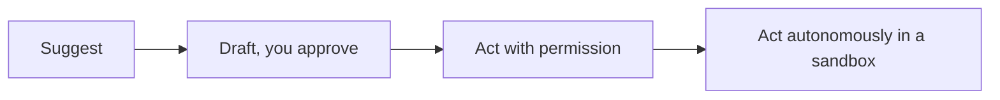

<LevelBadge level="all" />

Tirer le meilleur de l'IA passe aussi par un usage *responsable*. Cette page est courte, pratique et s'adresse à tous — du débutant au concepteur.

## L'état d'esprit de vérification

L'habitude la plus importante de toutes : **adaptez votre vérification aux enjeux.**

| Enjeux | Exemple | Niveau de vérification |
|---|---|---|
| Faibles | Brainstorming, brouillons rapides | Faites confiance librement, survolez |
| Moyens | Un e-mail professionnel, un résumé | Lisez-le, vérifiez la cohérence des faits |
| Élevés | Statistiques publiées, code que vous exécuterez, domaines juridique/médical/financier | Vérifiez chaque affirmation auprès d'une source fiable |

L'IA est un premier brouillon rapide, jamais une autorité finale — voir [Hallucinations](/docs/foundations/hallucinations).

## L'échelle d'autonomie

Accordez plus d'indépendance à l'IA uniquement à mesure que la confiance se gagne :

Commencez par « propose, j'approuve » ([mode Plan](/docs/claude-code/plan-mode)) ; réservez l'autonomie complète aux travaux à faible risque, en bac à sable et réversibles ([Renforcer les exécutions autonomes](/docs/security/hardening-autonomous-runs)).

## Confidentialité et données

- Ne collez pas de secrets, d'identifiants ou de données personnelles d'autrui dans un outil que vous n'avez pas évalué.
- Renseignez-vous sur la politique de traitement des données et d'entraînement de votre fournisseur avant de partager du contenu sensible — voir [Confidentialité et traitement des données](/docs/foundations/privacy).
- Pour les données réglementées ou confidentielles, utilisez les paramètres entreprise/contrôlés appropriés.

## Biais, équité et limites

Les modèles reflètent les schémas présents dans leurs données d'entraînement, qui peuvent comporter des **biais**. Soyez particulièrement vigilant lorsque la sortie de l'IA influence des décisions concernant des personnes (recrutement, octroi de crédit, modération). Gardez un humain responsable des décisions lourdes de conséquences, et considérez l'IA comme une aide au jugement, pas comme un substitut.

## Ne déléguez pas votre réflexion

:::tip Servez-vous de l'IA pour mieux réfléchir, pas pour réfléchir moins
Les meilleurs utilisateurs restent engagés — ils questionnent les sorties, en tirent des enseignements et assument le résultat. Pour apprendre, cela signifie la [boucle de restitution](/docs/playbooks/learning), pas le copier-coller. Vous êtes responsable de ce que vous livrez avec l'aide de l'IA.
:::

## Sécurité, en bref

Dès que l'IA lit du contenu non fiable (pages web, e-mails, documents) ou passe à l'action, vous héritez d'un modèle de sécurité. Lisez [L'injection de prompt](/docs/security/prompt-injection) et [Sécuriser les agents](/docs/security/securing-agents).

## Pour aller plus loin

- [L'injection de prompt expliquée](/docs/security/prompt-injection)
- [Les hallucinations et comment les réduire](/docs/foundations/hallucinations)
- [Confidentialité et traitement des données](/docs/foundations/privacy)
