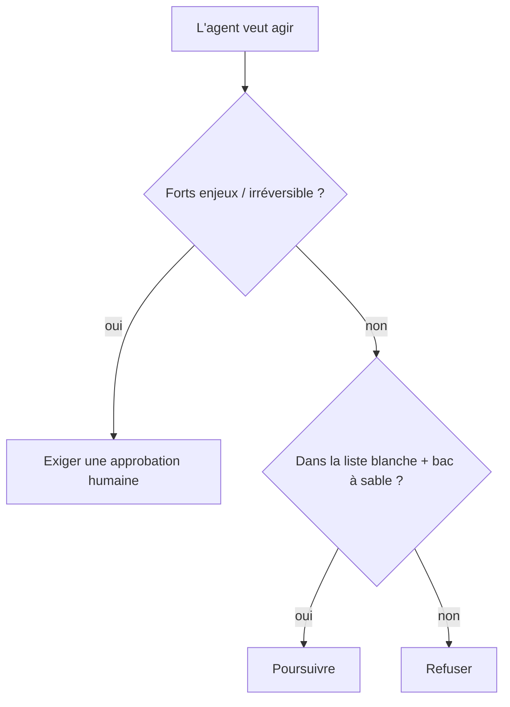

<LevelBadge level="advanced" />

<Callout type="objectives" items={["Appliquer le moindre privilège — n'accorder à un agent que l'accès dont son travail a besoin", "Reconnaître le problème du député confus : un agent emprunte votre autorité", "Superposer les cinq défenses qui réduisent le rayon d'impact lorsqu'un agent est piégé", "Décider quelles actions exigent un humain dans la boucle", "Valider les entrées des outils pour qu'un argument erroné ou manipulé ne puisse pas s'exécuter"]} />

Dès qu'une IA peut **passer à l'action** (appeler des outils, exécuter du code, interroger des API), elle hérite d'un modèle de sécurité. L'objectif n'est pas de rendre le modèle impossible à tromper — c'est de garantir que **même s'il est trompé, il ne puisse pas causer beaucoup de dégâts**.

## Le principe fondamental : le moindre privilège

Donnez à un agent l'accès **minimum** qu'exige sa tâche, rien de plus.

- Un agent qui résume des documents a besoin de la **lecture**, pas de l'écriture ni du réseau.
- Un relecteur a besoin de lire le code et de publier un commentaire — pas de pousser ni de déployer.
- Restreignez les outils, les clés d'API et l'accès aux fichiers tâche par tâche. Un agent au périmètre étroit qui subit une [injection](/docs/security/prompt-injection) ne peut causer que des dégâts limités.

## Le problème du député confus

Un agent agit souvent **avec votre autorité** (vos jetons, vos sessions). Si une entrée contrôlée par un attaquant l'oriente, l'attaquant emprunte vos privilèges — un « député confus ». Défense : ne confiez pas à l'agent une autorité ambiante dont il n'a pas besoin, et exigez des identifiants explicites et restreints pour les outils sensibles.

## Les couches de défense

Empilez-les — aucune seule ne suffit. Chaque couche suppose que celles au-dessus d'elle pourraient échouer.

<Steps items={[
  {title: "Mettez en bac à sable l'exécution et l'accès aux fichiers", body: "Exécutez le code et les opérations sur les fichiers dans des conteneurs ou des répertoires éphémères sans accès au système plus large ni aux secrets. Si l'agent est trompé, il joue dans une boîte."},
  {title: "Mettez en liste blanche la surface dangereuse", body: "Décidez quelles commandes, quels domaines et quels chemins sont autorisés — refusez le reste. Dans Claude Code, ce sont les permissions (/docs/claude-code/permissions)."},
  {title: "Humain dans la boucle pour les forts enjeux", body: "Exigez une approbation explicite pour les actions irréversibles ou sensibles : envoyer de l'argent, envoyer un e-mail, supprimer, déployer ou modifier la configuration de production."},
  {title: "Séparez les zones de confiance", body: "Ne laissez pas un même agent détenir simultanément des secrets, lire du contenu non fiable et effectuer des appels sortants arbitraires — cette combinaison est la voie d'exfiltration."},
  {title: "Journalisez et relisez les appels d'outils", body: "Enregistrez quels outils l'agent a réellement invoqués et avec quels arguments, afin de pouvoir auditer le comportement et détecter les dérives."}
]} />

## Mettez une liste blanche par écrit

« Mettre en liste blanche la surface dangereuse » est facile à approuver d'un signe de tête et facile à sauter. Dans Claude Code, c'est concret : un `settings.json` qui autorise l'ensemble restreint de commandes et de domaines dont la tâche a besoin et refuse le reste. Commencez de manière restrictive et n'élargissez que lorsqu'une tâche réelle est bloquée.

<PromptCard title="Un bloc de permissions Claude Code au moindre privilège">{`{
  "permissions": {
    "allow": [
      "Read",
      "Edit",
      "Bash(npm test:*)",
      "Bash(npm run build:*)",
      "Bash(git status)",
      "Bash(git diff:*)"
    ],
    "deny": [
      "Bash(git push:*)",
      "Bash(rm:*)",
      "Bash(curl:*)",
      "Read(./.env)",
      "Read(./secrets/**)"
    ]
  }
}`}</PromptCard>

La liste `deny` l'emporte sur `allow`, donc bloquer `.env` et `secrets/**` tient même si un `Read` large est accordé. Consultez [permissions](/docs/claude-code/permissions) pour la syntaxe complète des règles et leur préséance.

## Les outils ont des schémas — validez-les

Les entrées d'outils produites par le modèle peuvent être erronées ou manipulées. **Validez** les arguments avant d'exécuter, et **renvoyez les erreurs sous forme de résultats** pour que l'agent se rétablisse au lieu de réessayer aveuglément.

<Flashcards title="Révisez les termes clés" cards={[{front: "Moindre privilège", back: "N'accordez à un agent que l'accès dont sa tâche spécifique a besoin — rien de plus. Un agent au périmètre étroit qui se fait tromper ne peut causer que des dégâts limités."}, {front: "Député confus", back: "Un agent agit avec votre autorité (vos jetons, vos sessions). Si une entrée contrôlée par un attaquant l'oriente, l'attaquant emprunte vos privilèges."}, {front: "Bac à sable", back: "Exécutez le code et l'accès aux fichiers dans un conteneur isolé ou un répertoire éphémère sans voie vers le système plus large ni les secrets, afin qu'un agent trompé reste enfermé."}, {front: "Zones de confiance", back: "Gardez les secrets, le contenu non fiable et le réseau sortant dans des agents séparés. Un seul agent détenant les trois est une voie d'exfiltration."}, {front: "Humain dans la boucle", back: "Une porte d'approbation humaine obligatoire avant les actions irréversibles ou sensibles — envoyer de l'argent, supprimer, déployer, modifier la configuration de production."}]} />

<Quiz title="Testez-vous" questions={[
  {
    q: "Que vous demande de faire le principe du moindre privilège lors de la configuration d'un agent ?",
    options: ["Lui donner un accès large pour qu'il ne soit jamais bloqué en cours de tâche", "Ne lui donner que l'accès qu'exige sa tâche spécifique", "Lui donner les mêmes permissions que l'humain qui l'exécute"],
    answer: 1,
    explain: "Le moindre privilège, c'est l'accès minimum dont la tâche a besoin. Un agent au périmètre étroit qui subit une injection ne peut causer que des dégâts limités."
  },
  {
    q: "Pourquoi un agent qui agit avec vos jetons présente-t-il un risque de « député confus » ?",
    options: ["Il confond quel modèle appeler", "Une entrée contrôlée par un attaquant peut l'orienter pour utiliser vos privilèges", "Il délègue à d'autres agents sans demander"],
    answer: 1,
    explain: "L'agent détient votre autorité. Si une entrée contrôlée par un attaquant l'oriente, l'attaquant emprunte de fait vos privilèges — le problème du député confus."
  },
  {
    q: "Dans un bloc de permissions Claude Code, quelle entrée empêche de façon fiable l'agent de lire un fichier de secrets ?",
    options: ["Une entrée allow pour Read", "Une entrée deny pour le chemin des secrets, puisque deny l'emporte sur allow", "Supprimer l'outil Bash"],
    answer: 1,
    explain: "Deny a la préséance sur allow, donc un deny sur secrets/** tient même quand un Read large est accordé."
  }
]} />

<Callout type="takeaways" items={["Le moindre privilège d'abord : restreignez les outils, les clés et l'accès aux fichiers tâche par tâche pour qu'un agent trompé ne puisse causer que des dégâts limités", "Un agent agit avec votre autorité — ne lui confiez pas de privilèges ambiants dont il n'a pas besoin (le problème du député confus)", "Empilez les cinq couches : bac à sable, liste blanche, humain dans la boucle, séparation des zones de confiance, journalisation et relecture", "Dans Claude Code, les règles deny battent les règles allow — bloquez explicitement les chemins .env et secrets", "Validez les arguments des outils avant d'exécuter, et renvoyez les erreurs sous forme de résultats pour que l'agent se rétablisse au lieu de réessayer aveuglément"]} />

## Pour aller plus loin

- [L'injection de prompt expliquée](/docs/security/prompt-injection)
- [Renforcer les exécutions autonomes](/docs/security/hardening-autonomous-runs)
- [Relire le code tiers](/docs/security/reviewing-third-party-code)
