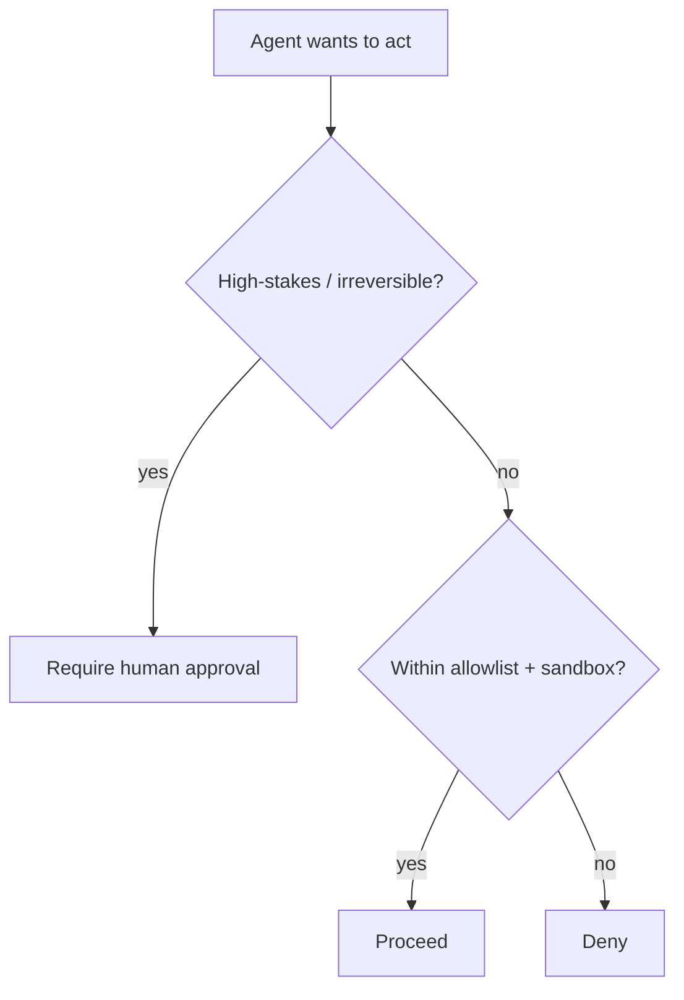

<LevelBadge level="advanced" />

Dès qu'une IA peut **passer à l'action** (appeler des outils, exécuter du code, interroger des API), elle hérite d'un modèle de sécurité. L'objectif n'est pas de rendre le modèle impossible à tromper — c'est de garantir que **même s'il est trompé, il ne puisse pas causer beaucoup de dégâts**.

## Le principe fondamental : le moindre privilège

Donnez à un agent l'accès **minimum** qu'exige sa tâche, rien de plus.

- Un agent qui résume des documents a besoin de la **lecture**, pas de l'écriture ni du réseau.
- Un relecteur a besoin de lire le code et de publier un commentaire — pas de pousser ni de déployer.
- Restreignez les outils, les clés d'API et l'accès aux fichiers tâche par tâche. Un agent au périmètre étroit qui subit une [injection](/docs/security/prompt-injection) ne peut causer que des dégâts limités.

## Le problème du député confus

Un agent agit souvent **avec votre autorité** (vos jetons, vos sessions). Si une entrée contrôlée par un attaquant l'oriente, l'attaquant emprunte vos privilèges — un « député confus ». Défense : ne confiez pas à l'agent une autorité ambiante dont il n'a pas besoin, et exigez des identifiants explicites et restreints pour les outils sensibles.

## Les couches de défense

1. **Mettez en bac à sable** l'exécution du code et l'accès aux fichiers — conteneurs, répertoires éphémères, aucun accès au système plus large ni aux secrets.
2. **Mettez en liste blanche** la surface dangereuse : quelles commandes, quels domaines, quels chemins. Refusez le reste. (Dans Claude Code, ce sont les [permissions](/docs/claude-code/permissions).)
3. **Humain dans la boucle** pour les actions irréversibles ou à fort enjeu : envoyer de l'argent, des e-mails, supprimer, déployer, modifier la configuration de production.
4. **Séparez les zones de confiance.** Ne laissez pas un même agent détenir simultanément des secrets, lire du contenu non fiable et effectuer des appels sortants arbitraires.
5. **Journalisez et relisez** les outils que l'agent a réellement appelés.

## Les outils ont des schémas — validez-les

Les entrées d'outils produites par le modèle peuvent être erronées ou manipulées. **Validez** les arguments avant d'exécuter, et **renvoyez les erreurs sous forme de résultats** pour que l'agent se rétablisse au lieu de réessayer aveuglément.

## Pour aller plus loin

- [L'injection de prompt expliquée](/docs/security/prompt-injection)
- [Renforcer les exécutions autonomes](/docs/security/hardening-autonomous-runs)
- [Relire le code tiers](/docs/security/reviewing-third-party-code)
