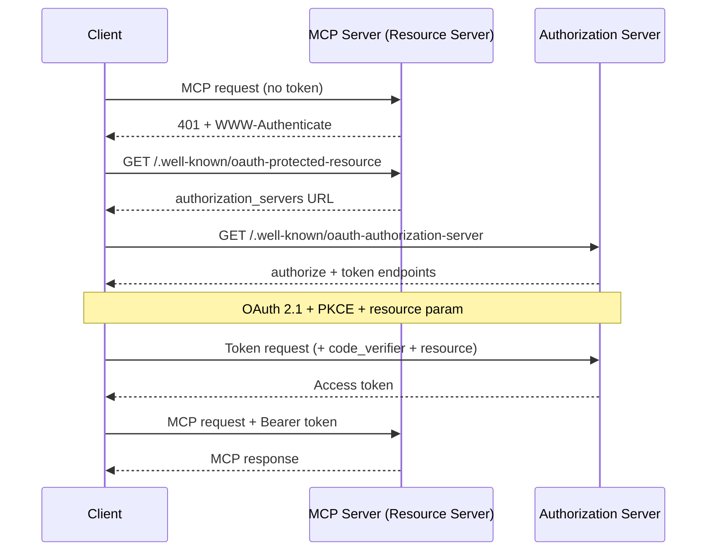
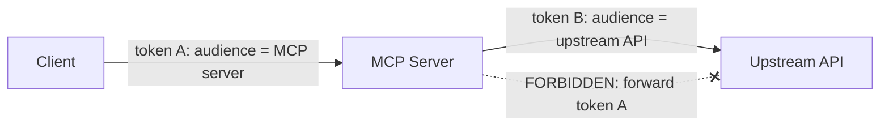

<LevelBadge level="advanced" />

<Callout type="objectives" items={["Comprendre pourquoi un serveur MCP distant (HTTP) est un serveur de ressources OAuth 2.1, et pas seulement un point d'accès à clé API", "Suivre le handshake de découverte : 401 → Protected Resource Metadata → Authorization Server Metadata → jeton", "Expliquer la liaison d'audience des jetons (RFC 8707) et pourquoi elle empêche le jeton d'un service de fonctionner sur un autre", "Nommer le piège du député confus et l'unique règle qui le referme : ne jamais transférer le jeton d'un client vers une API en amont", "Appliquer une courte liste de durcissement avant d'exposer un serveur MCP sur Internet"]} />

[MCP](/docs/claude-code/mcp) est passé de curiosité à la manière par défaut dont les agents atteignent les outils — ce qui signifie que les serveurs MCP se trouvent désormais devant des données réelles et des actions réelles. Un serveur local que vous lancez via **STDIO** fait confiance à son environnement : il lit les identifiants depuis les variables d'environnement et il n'y a aucune frontière réseau à défendre. Dès l'instant où vous rendez ce même serveur **distant** (HTTP), quiconque peut atteindre l'URL peut tenter de l'appeler. Cela le transforme en un problème d'autorisation, et la spécification MCP y répond avec **OAuth 2.1** — pas avec un schéma de clé API sur mesure.

Cette page concerne le cas distant. Si votre serveur est uniquement STDIO, la spécification dit explicitement de *ne pas* suivre le flux OAuth — récupérez les identifiants depuis l'environnement et passez à autre chose.

<VerifyNote lastVerified="2026-07-07" source="https://modelcontextprotocol.io/specification/2025-06-18/basic/authorization" />

## Les trois rôles

OAuth découpe le problème en trois parties. MCP s'y projette proprement :

<Flashcards title="Qui est qui dans un flux OAuth MCP" cards={[{front: "Serveur MCP = serveur de ressources", back: "La chose protégée. Il accepte les requêtes portant un jeton d'accès, valide le jeton, et renvoie des données — ou un 401 si le jeton est absent ou incorrect. Il ne connecte PAS l'utilisateur."}, {front: "Client MCP = client OAuth", back: "Votre hôte d'agent (Claude Code, l'application de bureau, votre propre code). Il obtient un jeton au nom de l'utilisateur et l'attache à chaque requête comme en-tête Bearer."}, {front: "Serveur d'autorisation (AS)", back: "La partie qui parle réellement à l'utilisateur, obtient son consentement et émet les jetons. Peut être hébergé avec le serveur ou être un fournisseur d'identité distinct. Ses rouages internes sortent du périmètre de MCP."}]} />

Le glissement mental clé : **le serveur MCP ne gère jamais lui-même la connexion.** Il ne fait que valider des jetons émis par quelqu'un d'autre. C'est cette séparation qui vous permet de placer un fournisseur d'identité prêt à l'emploi devant un serveur que vous avez écrit.

## Le handshake de découverte

Un client ne devrait pas avoir besoin d'être préconfiguré avec l'endroit où s'authentifier. MCP rend la découverte automatique, pilotée par un `401` :

<Steps items={[
  {title: "Le client appelle le serveur sans jeton", body: "La toute première requête part à nu. Le serveur la rejette avec HTTP 401 Unauthorized et un en-tête WWW-Authenticate pointant vers son URL de resource-metadata."},
  {title: "Le client récupère les Protected Resource Metadata (RFC 9728)", body: "Il fait un GET sur /.well-known/oauth-protected-resource du serveur. Le champ authorization_servers du document nomme au moins un serveur d'autorisation que le client peut utiliser."},
  {title: "Le client récupère les Authorization Server Metadata (RFC 8414)", body: "Il fait un GET sur /.well-known/oauth-authorization-server de l'AS pour connaître les points d'accès authorize et token ainsi que les capacités prises en charge."},
  {title: "Optionnel : Dynamic Client Registration (RFC 7591)", body: "Si le client n'a pas d'identifiant client pour cet AS, il peut faire un POST sur /register pour en obtenir un sans intervention humaine — crucial car un client ne peut pas connaître tous les serveurs MCP à l'avance."},
  {title: "Autorisation OAuth 2.1 avec PKCE + resource", body: "Le client génère un vérificateur/défi PKCE, ouvre le navigateur sur l'URL authorize incluant le paramètre resource, l'utilisateur donne son consentement, et le client échange le code renvoyé (avec le vérificateur) contre un jeton d'accès."},
  {title: "Le client réessaie avec le jeton", body: "Désormais chaque requête porte Authorization: Bearer <token>. Le serveur le valide et répond."}
]} />

Remarquez qu'il n'y a **aucune config d'authentification codée en dur** du côté client — le `401` amorce tout. C'est tout l'intérêt : un agent peut se connecter à un serveur qu'il n'a jamais vu et déterminer comment s'authentifier.

## Liaison d'audience : la règle porteuse

Voici le mode de défaillance que la liaison d'audience existe pour empêcher. Disons qu'un utilisateur possède un jeton émis pour `calendar.example.com`. Un serveur MCP malveillant (ou simplement négligent) à `evil.example.com` trompe le client pour qu'il lui envoie *ce* jeton. Si `evil` l'accepte, il peut désormais se retourner et appeler l'API du calendrier en tant que l'utilisateur. Le jeton d'un service a fonctionné sur un autre. La frontière de sécurité d'OAuth vient de s'effondrer.

Le correctif, ce sont les **Resource Indicators (RFC 8707)** :

<Steps items={[
  {title: "Le client déclare la cible", body: "À la fois sur la requête d'autorisation et sur la requête de jeton, le client DOIT inclure un paramètre resource fixé à l'URI canonique du serveur MCP qu'il compte appeler — par ex. resource=https://mcp.example.com. Il l'envoie même s'il n'est pas sûr que l'AS le prenne en charge."},
  {title: "L'AS lie le jeton à cette audience", body: "Lorsqu'il est pris en charge, l'AS estampille le jeton pour qu'il ne soit valide que pour ce serveur de ressources précis."},
  {title: "Le serveur valide l'audience", body: "Avant tout travail, le serveur MCP DOIT vérifier que le jeton a été émis pour LUI — en contrôlant la revendication d'audience (RFC 9068). Un jeton frappé pour quelqu'un d'autre reçoit un 401, point final."}
]} />

<PromptCard title="Paramètre resource sur la requête d'autorisation (encodé en URL)">{`&resource=https%3A%2F%2Fmcp.example.com`}</PromptCard>

Les URI canoniques sont strictes : `https://mcp.example.com` et `https://mcp.example.com:8443/mcp` sont valides ; `mcp.example.com` (sans schéma) et `https://mcp.example.com#frag` (fragment) ne le sont pas. Préférez la forme sans barre oblique finale pour l'interopérabilité.

## Le député confus : ne jamais transférer le jeton

C'est l'erreur qui transforme un serveur MCP bien intentionné en proxy pour un attaquant. C'est le même [problème du député confus](/docs/security/securing-agents) issu de la sécurité des agents, affûté en une règle concrète.

Un serveur MCP a souvent besoin d'appeler une **API en amont** (GitHub, un service de base de données, un autre SaaS). La tentation est de prendre le jeton que le client vous a remis et de le transférer en amont. **Ne le faites pas.** La spécification est catégorique : le serveur MCP **NE DOIT PAS** transférer le jeton qu'il a reçu du client.

Pourquoi c'est dangereux : le jeton du client a été émis pour *votre* serveur comme audience. Si vous le transférez, l'API en amont peut lui faire confiance comme s'il venait de vous, ou supposer que vous l'avez déjà validé — et voilà qu'un jeton limité à un saut effectue du travail deux sauts plus loin, hors du modèle de consentement de qui que ce soit.

<Callout type="warning" items={["Si votre serveur MCP appelle une API en amont, il agit comme un client OAuth DISTINCT vis-à-vis de cette API et obtient son PROPRE jeton auprès du serveur d'autorisation en amont. Deux jetons indépendants, deux audiences indépendantes. Le jeton du client s'arrête à votre porte."]} />

## Une liste de durcissement pré-vol

Avant qu'un serveur MCP distant touche l'Internet public :

<Steps items={[
  {title: "Servez tout via HTTPS", body: "Tous les points d'accès de l'AS DOIVENT être en HTTPS. Les redirect URIs DOIVENT être en HTTPS ou localhost — rien d'autre."},
  {title: "Validez l'audience à chaque requête", body: "Rejetez tout jeton non émis spécifiquement pour ce serveur. C'est l'unique contrôle qui stoppe la réutilisation inter-services des jetons."},
  {title: "Exigez PKCE", body: "Les clients DOIVENT utiliser PKCE pour qu'un code d'autorisation intercepté soit inutile sans le vérificateur correspondant."},
  {title: "Épinglez des redirect URIs exactes", body: "L'AS DOIT faire correspondre les redirect URIs exactement à des valeurs préenregistrées, et les clients DEVRAIENT utiliser et vérifier le paramètre state — les deux défendent contre le phishing par open-redirect."},
  {title: "Jetons de courte durée + rotation des refresh", body: "Émettez des jetons d'accès de courte durée pour limiter les dégâts d'une fuite ; pour les clients publics, faites tourner les refresh tokens. Stockez les jetons de façon sécurisée et ne les journalisez jamais."},
  {title: "Ne mettez jamais les jetons dans l'URL", body: "Les jetons vont dans l'en-tête Authorization, jamais dans la query string, où ils atterriraient dans les journaux et les referrers."},
  {title: "Superposez les bases de la sécurité des agents", body: "La liaison d'audience est le portail de transport ; appliquez tout de même le moindre privilège, le sandboxing et l'humain dans la boucle depuis /docs/security/securing-agents. L'authentification dit QUI — elle ne dit pas que la requête est sûre."}
]} />

## Vérifiez vos acquis

<Quiz title="Vérifiez vos acquis" questions={[
  {
    q: "Un serveur MCP distant reçoit une requête sans jeton d'accès. Que la spécification lui impose-t-elle de faire en premier ?",
    options: [
      "Demander à l'utilisateur un nom d'utilisateur et un mot de passe",
      "Renvoyer un HTTP 401 avec un en-tête WWW-Authenticate pointant vers son URL de resource-metadata",
      "Relayer silencieusement la requête vers son API en amont",
      "Émettre lui-même un jeton pour le client"
    ],
    answer: 1,
    explain: "Le serveur est un serveur de ressources, pas une page de connexion. Il répond à une requête sans jeton par un 401 + WWW-Authenticate, ce qui amorce la découverte du serveur d'autorisation par le client."
  },
  {
    q: "Contre quoi la liaison d'audience des jetons (RFC 8707) protège-t-elle ?",
    options: [
      "Une validation de jeton lente",
      "Un jeton émis pour un service accepté et réutilisé sur un service différent",
      "Les utilisateurs qui oublient leurs mots de passe",
      "Les grandes fenêtres de contexte"
    ],
    answer: 1,
    explain: "Le paramètre resource lie un jeton au serveur précis pour lequel il a été frappé. Le serveur valide ensuite la revendication d'audience et rejette tout jeton émis pour quelqu'un d'autre — refermant la faille de réutilisation inter-services."
  },
  {
    q: "Votre serveur MCP doit appeler une API GitHub en amont. Que doit-il faire du jeton d'accès que le client lui a envoyé ?",
    options: [
      "Transférer ce même jeton à GitHub pour économiser un aller-retour",
      "Rien avec GitHub — obtenir son propre jeton distinct en tant que client OAuth vis-à-vis de GitHub, et ne jamais transférer le jeton du client",
      "Journaliser le jeton pour pouvoir le rejouer plus tard",
      "Mettre le jeton dans l'URL de la requête GitHub"
    ],
    answer: 1,
    explain: "Transférer le jeton du client en amont est le piège du député confus et est explicitement interdit. Le serveur agit comme son propre client OAuth vis-à-vis de l'API en amont avec un jeton distinct lié à l'audience de cette API."
  },
  {
    q: "Pour un serveur MCP STDIO (local), comment la spécification dit-elle de gérer les identifiants ?",
    options: [
      "Exécuter le flux navigateur OAuth 2.1 complet à chaque lancement",
      "Les récupérer depuis l'environnement — le flux d'autorisation OAuth est pour les transports HTTP, pas STDIO",
      "Les coder en dur dans le client",
      "Sauter entièrement l'authentification pour tous les transports"
    ],
    answer: 1,
    explain: "La spécification dit que les transports STDIO NE DEVRAIENT PAS suivre le flux d'autorisation HTTP et devraient plutôt lire les identifiants depuis l'environnement. OAuth ici est spécifiquement pour les serveurs distants basés sur HTTP."
  }
]} />

## Sources et lectures complémentaires

- [Spécification d'autorisation MCP (2025-06-18)](https://modelcontextprotocol.io/specification/2025-06-18/basic/authorization) — le flux normatif, les rôles et les exigences MUST/SHOULD que cette page résume.
- [MCP Security Best Practices](https://modelcontextprotocol.io/specification/2025-06-18/basic/security_best_practices) — transfert de jeton, député confus, et pourquoi ils sont interdits.
- [RFC 8707 — Resource Indicators for OAuth 2.0](https://www.rfc-editor.org/rfc/rfc8707.html) — le paramètre `resource` et la liaison d'audience.
- [RFC 9728 — OAuth 2.0 Protected Resource Metadata](https://datatracker.ietf.org/doc/html/rfc9728) — comment un serveur de ressources annonce ses serveurs d'autorisation.
- [RFC 8414 — OAuth 2.0 Authorization Server Metadata](https://datatracker.ietf.org/doc/html/rfc8414) et [RFC 7591 — Dynamic Client Registration](https://datatracker.ietf.org/doc/html/rfc7591).
- [OAuth 2.1 draft](https://datatracker.ietf.org/doc/html/draft-ietf-oauth-v2-1-13) — PKCE, sécurité des communications et exigences de gestion des jetons.
- En lien sur AILmanac : [Sécuriser les agents et les outils](/docs/security/securing-agents) · [Injection de prompt](/docs/security/prompt-injection) · [MCP dans Claude Code](/docs/claude-code/mcp).
