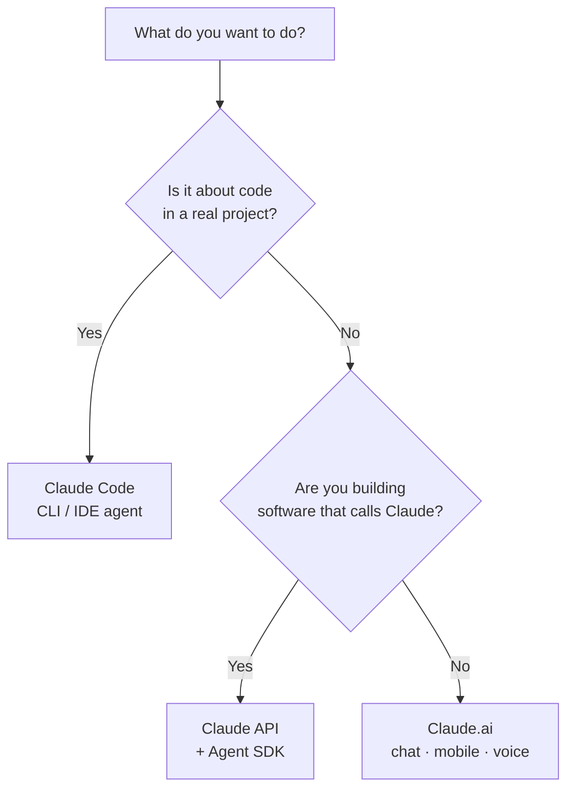

<LevelBadge level="beginner" />

« Claude » se décline en plusieurs variantes. Choisissez selon **ce que vous cherchez à faire**, pas selon celle dont vous avez entendu parler.

## La décision en 30 secondes

## Claude.ai — les applications de discussion

**Pour :** la rédaction, la recherche, l'analyse, l'apprentissage, la planification, les questions du quotidien. **Pour qui :** tout le monde, sans configuration.

Vous l'avez aussi sur **mobile** ([iOS/Android](/docs/claude-app/mobile)) et par la **[voix](/docs/claude-app/voice-mode)** — idéal pour capturer des idées en déplacement. Boostez-le avec les [Projects](/docs/claude-app/projects), les [instructions personnalisées](/docs/claude-app/custom-instructions) et les [Artifacts](/docs/claude-app/artifacts). → Commencez par [Premiers pas avec Claude.ai](/docs/claude-app/getting-started).

## Claude Code — l'outil de codage agentique

**Pour :** travailler *dans une base de code* — lire, modifier, exécuter des commandes, corriger des tests. **Pour qui :** les développeurs (et les curieux techniques). Il agit sur vos fichiers avec votre permission. → [Ce qu'est Claude Code](/docs/claude-code/what-is-claude-code).

## L'API & l'Agent SDK — intégrez Claude dans votre propre logiciel

**Pour :** les applications, automatisations et agents qui appellent Claude de façon programmatique. **Pour qui :** les développeurs qui livrent un produit ou un pipeline. → [Votre premier appel API](/docs/api/first-call).

## Ils fonctionnent ensemble

Ce ne sont pas des produits rivaux — la plupart des gens passent de l'un à l'autre :

| Vous voulez… | Utilisez |
|---|---|
| Rédiger un e-mail, résumer un PDF, brainstormer | Claude.ai (ou la voix/le mobile) |
| Refactoriser un module, ajouter des tests, corriger un bug | Claude Code |
| Ajouter une fonctionnalité IA à *votre* application | L'API / l'Agent SDK |

:::tip Vous hésitez ? Commencez par le chat
[Claude.ai](/docs/claude-app/getting-started) ne demande aucune configuration et vous apprend comment Claude « réfléchit ». Les compétences se transposent partout ailleurs.
:::

## Suite

- [Vos 5 premières minutes](/docs/start-here/your-first-5-minutes)
- [Parcours d'apprentissage](/docs/start-here/learning-paths)
- [Choisir un modèle Claude](/docs/api/choosing-a-model) (une fois que vous construisez)
