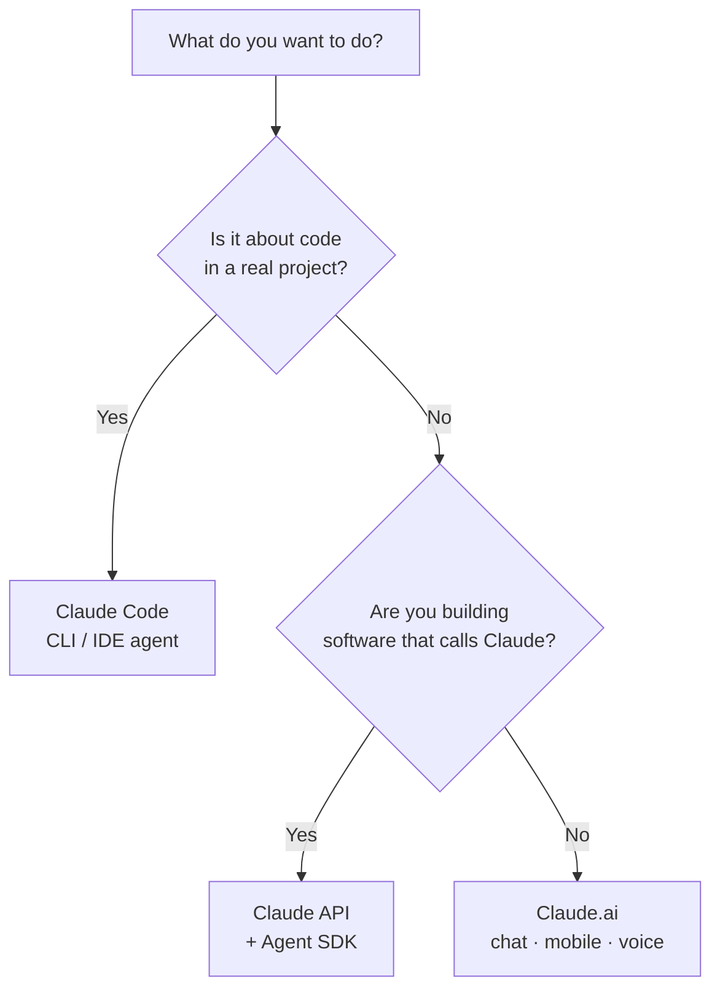

<LevelBadge level="beginner" />

« Claude » se décline en plusieurs variantes. Choisissez selon **ce que vous cherchez à faire**, pas selon celle dont vous avez entendu parler.

<Callout type="objectives" items={[
  "Faire correspondre votre objectif à la bonne surface Claude : le chat, Claude Code ou l'API",
  "Savoir quand le mobile et la voix trouvent leur place",
  "Comprendre comment les trois surfaces se complètent à mesure que vous montez en niveau",
  "Avoir un premier repère sur le modèle à choisir une fois que vous commencez à construire"
]} />

## La décision en 30 secondes

## Les trois surfaces en un coup d'œil

| Surface | Idéale pour | Pour qui | Commencer ici |
|---|---|---|---|
| **Claude.ai** | Rédaction, recherche, analyse, apprentissage, planification, questions du quotidien | Tout le monde, sans configuration | [Premiers pas avec Claude.ai](/docs/claude-app/getting-started) |
| **Claude Code** | Travailler *dans une base de code* — lire, modifier, exécuter des commandes, corriger des tests | Développeurs (et curieux techniques) | [Ce qu'est Claude Code](/docs/claude-code/what-is-claude-code) |
| **API & Agent SDK** | Applications, automatisations et agents qui appellent Claude de façon programmatique | Développeurs qui livrent un produit ou un pipeline | [Votre premier appel API](/docs/api/first-call) |

### Claude.ai — les applications de discussion

Claude.ai est le point de départ sans configuration pour tout le monde. Vous l'avez aussi sur **mobile** ([iOS/Android](/docs/claude-app/mobile)) et par la **[voix](/docs/claude-app/voice-mode)** — idéal pour capturer des idées en déplacement. Boostez-le avec les [Projects](/docs/claude-app/projects), les [instructions personnalisées](/docs/claude-app/custom-instructions) et les [Artifacts](/docs/claude-app/artifacts).

### Claude Code — l'outil de codage agentique

Claude Code travaille *dans* votre projet. Il lit, modifie, exécute des commandes et corrige des tests — agissant sur vos fichiers avec votre permission.

### L'API & l'Agent SDK — intégrez Claude dans votre propre logiciel

L'API et l'Agent SDK permettent à votre propre logiciel d'appeler Claude de façon programmatique, pour livrer des fonctionnalités IA, des automatisations et des agents.

## Ils fonctionnent ensemble

Ce ne sont pas des produits rivaux — la plupart des gens passent de l'un à l'autre :

| Vous voulez… | Utilisez |
|---|---|
| Rédiger un e-mail, résumer un PDF, brainstormer | Claude.ai (ou la voix/le mobile) |
| Refactoriser un module, ajouter des tests, corriger un bug | Claude Code |
| Ajouter une fonctionnalité IA à *votre* application | L'API / l'Agent SDK |

:::tip Vous hésitez ? Commencez par le chat
[Claude.ai](/docs/claude-app/getting-started) ne demande aucune configuration et vous apprend comment Claude « réfléchit ». Les compétences se transposent partout ailleurs.
:::

## Quel modèle, une fois que vous construisez ?

Choisir une *surface* est la première étape. Quand vous passez à Claude Code ou à l'API, vous choisissez aussi un *modèle* — Haiku, Sonnet ou Opus. Répondez à trois questions rapides et ce sélecteur vous suggère un point de départ :

<ModelPicker />

:::note Ne codez pas les noms en dur
Les gammes de modèles et les prix changent. Confirmez toujours les identifiants de modèles actuels sur la page [Choisir un modèle Claude](/docs/api/choosing-a-model) avant de livrer.
:::

## Vérifiez vos acquis

<Quiz title="Vérifiez vos acquis" questions={[
  {
    q: "Vous voulez rédiger un e-mail et résumer un PDF — sans configuration. Quelle surface ?",
    options: ["Claude Code", "Claude.ai (chat / mobile / voix)", "L'API & l'Agent SDK"],
    answer: 1,
    explain: "Claude.ai est la surface de chat sans configuration pour la rédaction, la recherche et les questions du quotidien — disponible sur le web, le mobile et par la voix."
  },
  {
    q: "Vous devez refactoriser un module et corriger des tests qui échouent dans un vrai projet. Quelle surface ?",
    options: ["Claude.ai", "Claude Code", "L'API & l'Agent SDK"],
    answer: 1,
    explain: "Claude Code travaille dans votre base de code — lire, modifier, exécuter des commandes et corriger des tests avec votre permission."
  },
  {
    q: "Où devriez-vous confirmer les noms et les prix actuels des modèles ?",
    options: ["Cette page", "La page Choisir un modèle Claude", "Le diagramme Mermaid ci-dessus"],
    answer: 1,
    explain: "Les gammes de modèles changent, donc cette page ne les code pas en dur — consultez la page Choisir un modèle Claude pour les identifiants et les prix actuels."
  }
]} />

<Callout type="takeaways" items={[
  "Claude.ai : chat sans configuration pour la rédaction, la recherche et le travail quotidien — aussi sur mobile et par la voix",
  "Claude Code : un agent qui agit dans votre base de code",
  "API & Agent SDK : intégrez Claude dans votre propre logiciel",
  "Ils se composent — la plupart des gens commencent par le chat puis passent à Code et à l'API",
  "Choisissez un modèle (Haiku / Sonnet / Opus) seulement une fois que vous construisez, et vérifiez les identifiants actuels avant de livrer"
]} />

## Suite

- [Vos 5 premières minutes](/docs/start-here/your-first-5-minutes)
- [Parcours d'apprentissage](/docs/start-here/learning-paths)
- [Choisir un modèle Claude](/docs/api/choosing-a-model) (une fois que vous construisez)
