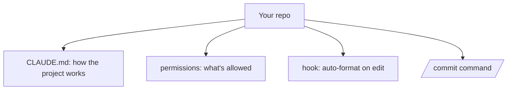

<LevelBadge level="intermediate" />

<Callout type="objectives" items={["Transformer un checkout tout neuf en une configuration Claude Code ajustée en une vingtaine de minutes", "Comprendre POURQUOI chacune des quatre personnalisations gagne sa place — CLAUDE.md, permissions, un hook, une commande", "Écrire des règles de permissions qui réduisent les interruptions sur les actions sûres et bloquent net les actions risquées", "Vérifier que chaque pièce fonctionne réellement au lieu de le supposer"]} />

Transformons un checkout tout neuf en une configuration Claude Code qui *connaît votre projet et respecte vos règles* — en une vingtaine de minutes. Nous allons enchaîner les fonctionnalités clés avec le raisonnement derrière chacune.

## L'état final



## Étape 1 — Générer et élaguer CLAUDE.md

Lancez `/init` pour rédiger un [CLAUDE.md](/docs/claude-code/claude-md), puis **réduisez-le** à ce qui est vrai : la stack, comment lancer/tester/linter, les vraies conventions et les garde-fous (« lance les tests avant de considérer terminé », « ne touche pas à `/generated` »). *Pourquoi :* c'est la personnalisation au plus fort effet de levier — Claude le lit à chaque session.

Récupérez un modèle de départ dans les [Modèles CLAUDE.md](/docs/templates/claude-md).

## Étape 2 — Définir les permissions

Ajoutez un `.claude/settings.json` ([référence](/docs/claude-code/settings)) qui pré-autorise les commandes sûres et répétitives et refuse les dangereuses :

```json
{
  "permissions": {
    "allow": ["Read", "Bash(npm run test:*)", "Bash(npm run lint)", "Bash(git diff:*)"],
    "ask": ["Write", "Bash(npm install:*)"],
    "deny": ["Read(./.env)", "Bash(git push --force:*)"]
  }
}
```

*Pourquoi :* moins d'interruptions sur les actions sûres, des arrêts nets sur les actions risquées. Voir [Permissions](/docs/claude-code/permissions).

## Étape 3 — Ajouter un hook de formatage

Formatez automatiquement après chaque édition ([hooks](/docs/claude-code/hooks)) :

```json
{ "hooks": { "PostToolUse": [ { "matcher": "Edit|Write",
  "hooks": [ { "type": "command", "command": "npx prettier --write \"$CLAUDE_FILE_PATH\" 2>/dev/null || true" } ] } ] } }
```

*Pourquoi :* un formatage cohérent, garanti — pas un « pense à le faire ».

## Étape 4 — Ajouter une commande `/commit`

Déposez la recette `/commit` de la [Bibliothèque de commandes slash](/docs/templates/slash-commands) dans `.claude/commands/`. *Pourquoi :* un seul mot pour un workflow répétable.

## Étape 5 — Utiliser le mode Plan pour la première vraie tâche

Donnez un vrai objectif en [mode Plan](/docs/claude-code/plan-mode), passez le plan en revue, puis laissez-le s'exécuter. *Pourquoi :* construire la confiance en séparant la réflexion de l'action.

## Vérifiez que ça marche

Ne supposez rien — testez chaque pièce indépendamment. Chaque test isole une personnalisation, donc un échec vous dit exactement quel fichier corriger.

<Steps items={[{title: "CLAUDE.md fonctionne", body: "Démarrez une NOUVELLE session et donnez une tâche normale. Claude devrait faire référence à vos conventions spontanément, sans que vous les colliez."}, {title: "Le hook fonctionne", body: "Éditez un fichier et laissez Claude l'écrire. Il devrait revenir formaté — sans aucun rappel de votre part."}, {title: "Les permissions fonctionnent", body: "Essayez une commande risquée. Claude devrait demander, ou refuser carrément, plutôt que de simplement l'exécuter."}, {title: "La commande fonctionne", body: "Lancez /commit. Vous devriez obtenir un message de commit conventionnel propre à partir d'un seul mot."}]} />

<PromptCard title="Lancer la première vraie tâche en mode Plan">{`Add pagination to the users list endpoint. Plan it first — I want to review before you touch anything.`}</PromptCard>

<Callout type="takeaways" items={["CLAUDE.md est la personnalisation au plus fort effet de levier parce que Claude le lit à chaque session — générez-le avec /init, puis réduisez-le à ce qui est réellement vrai", "Les permissions sont un outil à double tranchant : pré-autorisez les commandes sûres et répétitives pour réduire les interruptions, et refusez les dangereuses pour obtenir des arrêts nets", "Un hook rend le formatage garanti plutôt qu'un « pense à le faire » — un comportement imposé par le harness l'emporte sur un comportement demandé dans un prompt", "Une commande slash transforme un workflow répétable en un seul mot", "Le mode Plan sépare la réflexion de l'action, ce qui est la façon de construire la confiance avant de céder plus d'autonomie", "Vérifiez chaque personnalisation avec son propre test pour qu'un échec pointe vers un seul fichier"]} />

<Quiz title="Testez-vous" questions={[{q: "Pourquoi CLAUDE.md est-il appelé la personnalisation au plus fort effet de levier ?", options: ["C'est le seul fichier dans lequel Claude Code peut écrire", "Claude le lit à chaque session, il façonne donc chaque tâche sans que vous vous répétiez", "Il prend le pas sur les règles de permissions"], answer: 1, explain: "Claude lit CLAUDE.md à chaque session. C'est là l'effet de levier — stack, commandes, conventions et garde-fous arrivent automatiquement dans le contexte au lieu d'être recollés. C'est aussi pourquoi vous le réduisez à ce qui est seulement vrai."}, {q: "Vous voulez que le formatage automatique soit garanti, pas simplement demandé. Quel est le bon mécanisme ?", options: ["Une ligne dans CLAUDE.md disant « toujours formater après édition »", "Un hook PostToolUse correspondant à Edit|Write qui lance votre formateur", "Une règle de permission allow pour la commande du formateur"], answer: 1, explain: "Un hook est imposé par le harness — il s'exécute que le modèle s'en souvienne ou non. Une instruction dans CLAUDE.md est une demande que le modèle peut manquer ; une règle de permission gouverne seulement si une commande est AUTORISÉE, pas si elle s'exécute."}, {q: "Dans l'exemple settings.json, pourquoi certaines commandes sont-elles dans « allow » et d'autres dans « ask » ?", options: ["Les commandes « ask » sont dangereuses et devraient plutôt être dans « deny »", "Pré-autoriser les commandes sûres et répétitives réduit les interruptions, tandis que « ask » garde un humain dans la boucle pour les actions à effets de bord", "« allow » ne sert qu'aux opérations de lecture"], answer: 1, explain: "La répartition est une question de coût d'interruption face au risque. Les choses sûres et répétitives comme Read et les lancements de tests sont pré-autorisées pour ne jamais vous interrompre ; les choses à vrais effets de bord comme Write ou npm install vont dans « ask » ; et les vraiment dangereuses comme le force-push vont dans « deny » comme arrêt net."}]} />

## Suite

- [Écrire votre première Skill](/docs/walkthroughs/first-skill)
- [Recettes hooks & settings.json](/docs/templates/hooks-settings)
- [Coder & développement logiciel](/docs/playbooks/coding)
