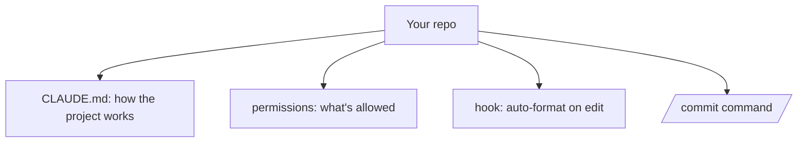

<LevelBadge level="intermediate" />

Transformons un nouveau checkout en une configuration Claude Code qui *connaît votre projet et respecte vos règles* — en une vingtaine de minutes. Nous allons enchaîner les fonctionnalités essentielles en expliquant la raison de chacune.

## L'état final



## Étape 1 — Générer et élaguer CLAUDE.md

Lancez `/init` pour rédiger un brouillon de [CLAUDE.md](/docs/claude-code/claude-md), puis **réduisez-le** à ce qui est vrai : la stack, comment exécuter/tester/linter, les conventions réelles et les garde-fous (« exécuter les tests avant de finir », « ne pas toucher à `/generated` »). *Pourquoi :* c'est la personnalisation au plus fort effet de levier — Claude le lit à chaque session.

Récupérez un point de départ dans [Modèles de CLAUDE.md](/docs/templates/claude-md).

## Étape 2 — Définir les permissions

Ajoutez un fichier `.claude/settings.json` ([référence](/docs/claude-code/settings)) qui autorise à l'avance les commandes sûres et répétitives et refuse les commandes dangereuses :

```json
{
  "permissions": {
    "allow": ["Read", "Bash(npm run test:*)", "Bash(npm run lint)", "Bash(git diff:*)"],
    "ask": ["Write", "Bash(npm install:*)"],
    "deny": ["Read(./.env)", "Bash(git push --force:*)"]
  }
}
```

*Pourquoi :* moins d'interruptions sur les actions sûres, des blocages nets sur les actions risquées. Voir [Permissions](/docs/claude-code/permissions).

## Étape 3 — Ajouter un hook de formatage

Formatez automatiquement après chaque édition ([hooks](/docs/claude-code/hooks)) :

```json
{ "hooks": { "PostToolUse": [ { "matcher": "Edit|Write",
  "hooks": [ { "type": "command", "command": "npx prettier --write \"$CLAUDE_FILE_PATH\" 2>/dev/null || true" } ] } ] } }
```

*Pourquoi :* un formatage cohérent, garanti — pas un simple « merci de penser à ».

## Étape 4 — Ajouter une commande `/commit`

Déposez la recette `/commit` de la [Bibliothèque de commandes slash](/docs/templates/slash-commands) dans `.claude/commands/`. *Pourquoi :* un seul mot pour un workflow reproductible.

## Étape 5 — Utiliser le mode Plan pour la première vraie tâche

Donnez un objectif réel en [mode Plan](/docs/claude-code/plan-mode), passez le plan en revue, puis laissez-le s'exécuter. *Pourquoi :* construire la confiance en séparant la réflexion de l'action.

## Vérifier que ça marche

- Nouvelle session → Claude se réfère à vos conventions sans qu'on le lui demande (CLAUDE.md fonctionne).
- Édition d'un fichier → il est formaté (le hook fonctionne).
- Une commande risquée → il demande ou refuse (les permissions fonctionnent).
- `/commit` → un message Conventional Commit propre (la commande fonctionne).

## Suite

- [Écrire votre première Skill](/docs/walkthroughs/first-skill)
- [Recettes pour les hooks et settings.json](/docs/templates/hooks-settings)
- [Codage et développement logiciel](/docs/playbooks/coding)
