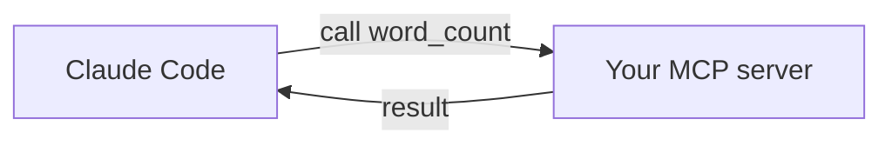

<LevelBadge level="advanced" />

<VerifyNote lastVerified="2026-06-20" source="https://modelcontextprotocol.io">
Les API du SDK MCP et la configuration évoluent — vérifiez par rapport à la documentation officielle MCP et à la documentation MCP de Claude Code.
</VerifyNote>

Exposons un outil personnalisé à Claude en construisant un tout petit serveur [MCP](/docs/claude-code/mcp) et en le connectant. Nous le garderons minimal pour que le *branchement* soit clair — vous y intégrerez ensuite votre véritable logique.

## Ce que nous construisons

Un serveur stdio doté d'un seul outil, `word_count`, que Claude peut appeler. Le même schéma se généralise à « interroge ma base de données », « ouvre un ticket », etc.



## Étape 1 — Le serveur

`server.py` (Python ; une version TypeScript se trouve dans [Modèles de structure MCP](/docs/templates/mcp-config)) :

```python
from mcp.server.fastmcp import FastMCP

mcp = FastMCP("text-tools")

@mcp.tool()
def word_count(text: str) -> int:
    """Count the words in a piece of text."""
    return len(text.split())

if __name__ == "__main__":
    mcp.run()  # stdio transport
```

## Étape 2 — Le déclarer

Ajoutez ceci à `.mcp.json` à la racine de votre dépôt :

```json
{ "mcpServers": {
  "text-tools": { "command": "python", "args": ["server.py"] }
} }
```

## Étape 3 — Connecter et tester

Démarrez Claude Code dans le dépôt. Demandez : *« Utilise le serveur text-tools pour compter les mots de : "the quick brown fox". »* Claude devrait appeler `word_count` et renvoyer `4`. S'il ne voit pas l'outil, vérifiez que le serveur démarre correctement par lui-même et que le chemin dans `.mcp.json` est correct.

## Étape 4 — Le rendre réel

Remplacez `word_count` par votre véritable capacité — une requête en base de données, un appel à une API interne, une opération sur des fichiers. Ajoutez la validation des entrées et renvoyez les erreurs sous forme de résultats.

## Liste de contrôle sécurité

:::warning Un serveur, c'est du code + des accès
- **Moindre privilège** — uniquement les données/actions dont il a besoin ([Sécuriser les agents](/docs/security/securing-agents)).
- **Validez les entrées** que le modèle envoie.
- Les données non fiables qu'il renvoie peuvent véhiculer une [injection de prompt](/docs/security/prompt-injection).
- **Examinez** tout serveur tiers avant de le connecter.
:::

## Suite

- [Serveurs MCP dans Claude Code](/docs/claude-code/mcp)
- [Configuration MCP et structures de serveurs](/docs/templates/mcp-config)
- [Utilisation d'outils / Appel de fonctions](/docs/api/tool-use)
