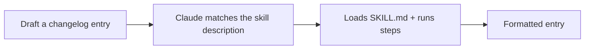

<LevelBadge level="intermediate" />

<VerifyNote lastVerified="2026-06-20" source="https://docs.anthropic.com/en/docs/claude-code/skills">
La structure des Skills et leur découverte peuvent changer — vérifiez par rapport à la documentation officielle des Skills.
</VerifyNote>

Construisons une [Skill](/docs/claude-code/skills) fonctionnelle à partir de zéro et prouvons qu'elle s'active. Nous allons créer une petite Skill « entrée de changelog » — générique et réutilisable.

## Étape 1 — Créer le dossier

```bash
mkdir -p .claude/skills/changelog-entry
```

(Utilisez `~/.claude/skills/…` pour une Skill personnelle valable dans tous les projets.)

## Étape 2 — Écrire SKILL.md

`.claude/skills/changelog-entry/SKILL.md` :

```markdown
---
name: changelog-entry
description: Use when the user wants to turn recent git commits into a Keep a Changelog entry.
---

# Changelog Entry

When asked for a changelog entry:
1. Run `git log --oneline -20` to see recent commits.
2. Group them into Added / Changed / Fixed / Removed (Keep a Changelog style).
3. Write concise, user-facing bullets (not raw commit messages).
4. Output only the formatted entry.
```

La **`description` est le déclencheur** — rédigez-la sous la forme « Use when… » pour que Claude la charge au bon moment.

## Étape 3 — (Facultatif) ajouter un script d'aide

Les Skills peuvent embarquer des scripts. Ajoutez `scripts/recent.sh` et référencez-le depuis SKILL.md si vous souhaitez une collecte de données déterministe :

```bash
#!/usr/bin/env bash
git log --oneline -20
```

## Étape 4 — Prouver qu'elle se déclenche

Démarrez une session et dites : *« Rédige une entrée de changelog pour les travaux récents. »* Claude devrait reconnaître l'intention, charger la Skill et suivre ses étapes. Si elle ne s'active pas, c'est probablement que votre `description` n'est pas assez précise sur le *moment* où l'utiliser — affinez-la.



## Étape 5 — La partager

Empaquetez-la (avec d'autres) dans un [plugin](/docs/claude-code/plugins-marketplaces) pour que votre équipe l'installe en une seule étape — ou contribuez-la aux [packs de Skills](/docs/templates/skills) d'AILmanac.

## Pièges

- **Description vague** → ne se déclenche jamais (ou se déclenche toujours). Soyez précis.
- **Trop de choses dans une seule Skill** → cantonnez-la à une seule tâche claire.
- **Secrets dans une Skill partagée** → jamais ; voir [Examiner du code tiers](/docs/security/reviewing-third-party-code).

## Suite

- [Skills : une expertise à la demande](/docs/claude-code/skills)
- [Modèles de SKILL.md](/docs/templates/skills)
- [Construire et brancher votre premier serveur MCP](/docs/walkthroughs/first-mcp-server)
