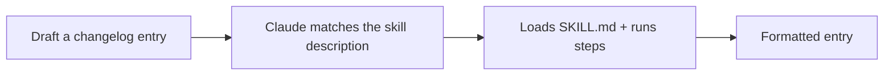

<LevelBadge level="intermediate" />

<Callout type="objectives" items={["Construire une Skill fonctionnelle de zéro et prouver qu'elle s'active vraiment", "Écrire une description qui se déclenche au bon moment — le seul champ qui décide si une skill s'exécute un jour", "Décider quand ajouter un script d'aide pour une collecte de données déterministe", "Diagnostiquer une skill qui ne se déclenche jamais, et connaître les trois pièges qui en sont la cause"]} />

<VerifyNote lastVerified="2026-06-20" source="https://code.claude.com/docs/en/skills">
La structure et la découverte des skills peuvent changer — vérifiez par rapport à la documentation officielle des Skills.
</VerifyNote>

Construisons une [Skill](/docs/claude-code/skills) fonctionnelle de zéro et prouvons qu'elle s'active. Nous allons créer une petite skill « entrée de changelog » — générique et réutilisable.

## Étape 1 — Créer le dossier

<PromptCard title="Créer le dossier de la skill">{`mkdir -p .claude/skills/changelog-entry`}</PromptCard>

(Utilisez `~/.claude/skills/…` pour une skill personnelle valable dans tous les projets.)

## Étape 2 — Écrire SKILL.md

`.claude/skills/changelog-entry/SKILL.md` :

```markdown
---
name: changelog-entry
description: Use when the user wants to turn recent git commits into a Keep a Changelog entry.
---

# Changelog Entry

When asked for a changelog entry:
1. Run `git log --oneline -20` to see recent commits.
2. Group them into Added / Changed / Fixed / Removed (Keep a Changelog style).
3. Write concise, user-facing bullets (not raw commit messages).
4. Output only the formatted entry.
```

La **`description` est le déclencheur** — écrivez-la comme « Use when… » pour que Claude la charge au bon moment.

## Étape 3 — (Optionnel) ajouter un script d'aide

Les skills peuvent embarquer des scripts. Ajoutez `scripts/recent.sh` et référencez-le depuis SKILL.md si vous voulez une collecte de données déterministe :

```bash
#!/usr/bin/env bash
git log --oneline -20
```

## Étape 4 — Prouver qu'elle se déclenche

Démarrez une session et essayez le prompt ci-dessous. Claude devrait reconnaître l'intention, charger la skill et suivre ses étapes. Si elle ne s'active pas, votre `description` n'est probablement pas assez précise sur le *moment* où l'utiliser — affinez-la.

<PromptCard title="Prouver que la skill se déclenche">{`Draft a changelog entry for recent work.`}</PromptCard>



## Étape 5 — La partager

Regroupez-la (avec d'autres) dans un [plugin](/docs/claude-code/plugins-marketplaces) pour que votre équipe l'installe en une seule étape — ou contribuez-la aux [packs de skills](/docs/templates/skills) d'AILmanac.

## Pièges

- **Description vague** → ne se déclenche jamais (ou se déclenche toujours). Soyez précis.
- **Trop de choses dans une seule skill** → gardez un seul rôle clair.
- **Secrets dans une skill partagée** → jamais ; voir [Relire du code tiers](/docs/security/reviewing-third-party-code).

<Callout type="takeaways" items={["Une skill est un dossier plus un SKILL.md — .claude/skills/<name>/ pour le projet, ~/.claude/skills/ pour tous les projets", "La description est le déclencheur. Écrivez-la comme « Use when… » pour que Claude la charge au bon moment", "Les skills peuvent embarquer des scripts — utilisez-en un quand vous voulez une collecte de données déterministe plutôt que de laisser Claude improviser la commande", "Prouvez que ça marche en formulant l'intention, pas en nommant la skill. Si elle ne se déclenche pas, la description n'est pas assez précise sur le QUAND", "Gardez une skill pour un seul rôle clair, et ne mettez jamais de secrets dans une skill que vous partagez"]} />

<Quiz title="Testez-vous" questions={[{q: "Votre skill ne s'active jamais, quoi que vous demandiez. Quel champ est presque certainement le problème ?", options: ["name — il doit correspondre exactement au dossier", "description — elle n'est pas assez précise sur le QUAND utiliser la skill", "Le script d'aide n'a pas le bit d'exécution"], answer: 1, explain: "La description est le déclencheur. Écrite comme « Use when… » et précise sur la situation, elle indique à Claude quand charger la skill. Les descriptions vagues ne se déclenchent jamais — ou se déclenchent constamment."}, {q: "Vous voulez une skill de changelog disponible dans chaque projet sur lequel vous travaillez, pas seulement celui-ci. Où va-t-elle ?", options: [".claude/skills/changelog-entry/ dans chaque dépôt", "~/.claude/skills/changelog-entry/", "Elle doit d'abord être publiée comme plugin"], answer: 1, explain: "Utilisez ~/.claude/skills/… pour une skill personnelle qui s'applique à tous les projets. Le chemin .claude/skills/ dans le dépôt limite une skill à ce projet."}, {q: "Pourquoi embarquer un script d'aide comme scripts/recent.sh avec une skill ?", options: ["Les skills ne peuvent pas exécuter de commandes shell sans cela", "Pour une collecte de données déterministe — le script s'exécute de la même façon à chaque fois au lieu que Claude improvise", "Ça fait charger la skill plus vite"], answer: 1, explain: "Les skills peuvent embarquer des scripts, et en référencer un depuis SKILL.md vous donne une collecte de données déterministe. C'est optionnel — vous l'ajouteriez quand vous voulez exactement la même commande à chaque exécution plutôt que de la laisser au modèle."}]} />

## Suite

- [Skills : de l'expertise à la demande](/docs/claude-code/skills)
- [Modèles SKILL.md](/docs/templates/skills)
- [Construire & câbler votre premier serveur MCP](/docs/walkthroughs/first-mcp-server)
