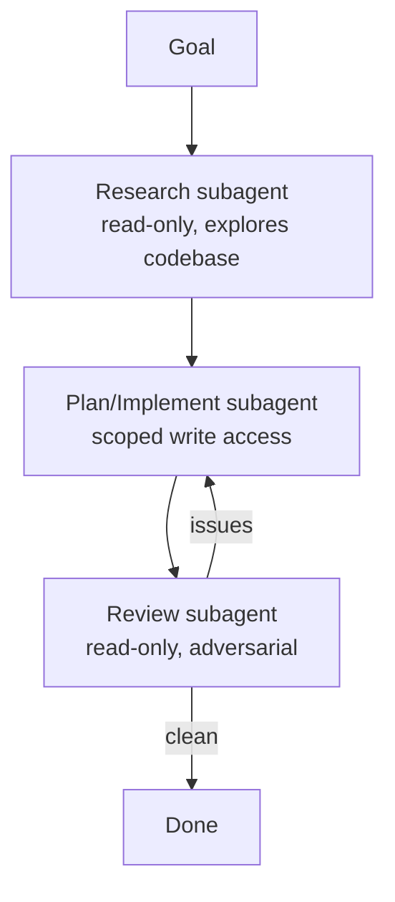

<LevelBadge level="advanced" />

Les tâches d'envergure se passent mieux lorsqu'on les répartit entre des [sous-agents](/docs/claude-code/subagents) ciblés plutôt que de tout entasser dans un seul contexte. Concevons un pipeline recherche → implémentation → revue.

## La structure

Chaque sous-agent dispose de son **propre contexte** et d'un **jeu d'outils sur mesure** — et seul le *résultat* remonte vers la session principale, ce qui la garde propre.

## Étape 1 — Définir les agents

Via l'interface `/agents`, définissez-en trois, chacun avec une `description` resserrée (pour que l'agent principal délègue correctement) et des outils délimités :

- **researcher** — lecture/recherche uniquement. Cartographie le code pertinent et renvoie ses conclusions.
- **implementer** — peut éditer des fichiers et exécuter des tests ; reçoit en entrée les conclusions du researcher.
- **reviewer** — lecture seule, adversarial : recherche bugs, cas manquants et violations de conventions.

## Étape 2 — Orchestrer avec des passages de relais

La session principale transmet la sortie de chaque étape à la suivante : recherche → implémentation (en s'appuyant sur la recherche) → revue (de l'implémentation). Ajoutez un **point de contrôle de revue** : si le reviewer détecte des problèmes, repassez la main à l'implementer avant de terminer.

## Étape 3 — Savoir quand NE PAS faire cela

:::warning Le parallélisme / multi-agent n'est pas gratuit
- Les **dépendances séquentielles** (l'implémentation a besoin de la recherche) restent séquentielles — ne ventilez pas là où l'ordre compte.
- Les **écritures de fichiers partagées** peuvent entrer en conflit — isolez-les avec des [git worktrees](/docs/claude-code/worktrees) ou sérialisez-les.
- Pour les petites tâches, la surcharge de coordination dépasse le bénéfice. Réservez cela aux travaux **conséquents et décomposables**.
:::

## Étape 4 — Vérifier

Une bonne exécution multi-agents montre : un contexte principal ciblé (la lecture intensive a eu lieu chez le researcher), une implémentation qui reflète la recherche et une revue qui a réellement détecté quelque chose (ou validé de manière crédible). Si le reviewer n'est qu'un tampon, rendez son prompt **adversarial** (« essaie de trouver ce qui ne va pas »).

## Aller plus loin

Le même schéma, mais de façon programmatique, c'est [Construire des agents sur l'API](/docs/api/building-agents) et des produits comme [Cowork et équipes d'agents](/docs/api/cowork-and-agent-teams).

## Suite

- [Sous-agents et agents parallèles](/docs/claude-code/subagents)
- [Git Worktrees](/docs/claude-code/worktrees)
- [Construire des agents sur l'API](/docs/api/building-agents)
