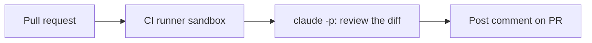

<LevelBadge level="advanced" />

<VerifyNote lastVerified="2026-06-20" source="https://code.claude.com/docs/en/sdk">
Les options du mode headless et les détails d'intégration CI évoluent — vérifiez par rapport à la documentation officielle Claude Code / Agent SDK.
</VerifyNote>

Une automatisation classique à forte valeur : faire en sorte que Claude **relise chaque pull request** et publie ses conclusions en commentaire — en s'exécutant en [headless](/docs/claude-code/headless-and-agent-sdk) dans la CI. Voici la structure, avec les garde-fous qui la maintiennent sûre.

## Ce qu'elle fait

Sur chaque PR : récupérer le diff, demander à Claude de le relire à la recherche de bugs/cas limites/problèmes de conventions, puis publier un commentaire. Les humains décident toujours ; Claude se contente d'offrir un premier passage rapide.



## Le workflow (esquisse)

```yaml
name: Claude PR review
on: pull_request
permissions:
  contents: read
  pull-requests: write   # to comment — NOT write to code
jobs:
  review:
    runs-on: ubuntu-latest
    steps:
      - uses: actions/checkout@v4
        with: { fetch-depth: 0 }
      - name: Review the diff
        env:
          ANTHROPIC_API_KEY: ${{ secrets.ANTHROPIC_API_KEY }}
        run: |
          git diff origin/${{ github.base_ref }}...HEAD > /tmp/diff.patch
          claude -p "Review this diff for correctness bugs, missing edge cases, and
          security issues. Report ONLY high-confidence findings as a Markdown
          checklist with file:line. Diff:" < /tmp/diff.patch > /tmp/review.md
      # then post /tmp/review.md as a PR comment (e.g. with the gh CLI or an action)
```

(L'invocation exacte en headless peut différer — voir la documentation. Le principe est : fournir le diff, capturer du Markdown, le publier.)

## Les garde-fous (lisez [Durcir les exécutions autonomes](/docs/security/hardening-autonomous-runs))

:::warning Moindre privilège dans la CI
- **Commentaire uniquement.** Accordez `pull-requests: write`, **pas** `contents: write` — le bot ne doit pas pousser de code.
- **Délimitez le token** ; n'exposez jamais d'accès aux déploiements/secrets à un job qui lit du contenu de PR non fiable.
- **Traitez le contenu des PR comme non fiable** — il peut véhiculer une [injection de prompt](/docs/security/prompt-injection) ; ne laissez pas le job entreprendre des actions à conséquences.
- **Plafonnez le coût** — les gros diffs coûtent des [tokens](/docs/api/tokens-and-pricing) ; envisagez de ne relire que les fichiers modifiés.
:::

## Le rendre utile, pas bruyant

- Demandez **uniquement des conclusions à forte confiance** — un mur de chinoiseries est ignoré.
- Gardez-le comme **premier passage**, l'humain décidant du merge.

## Suite

- [Mode headless et Agent SDK](/docs/claude-code/headless-and-agent-sdk)
- [Durcir les exécutions autonomes](/docs/security/hardening-autonomous-runs)
- [Codage et développement logiciel](/docs/playbooks/coding)
