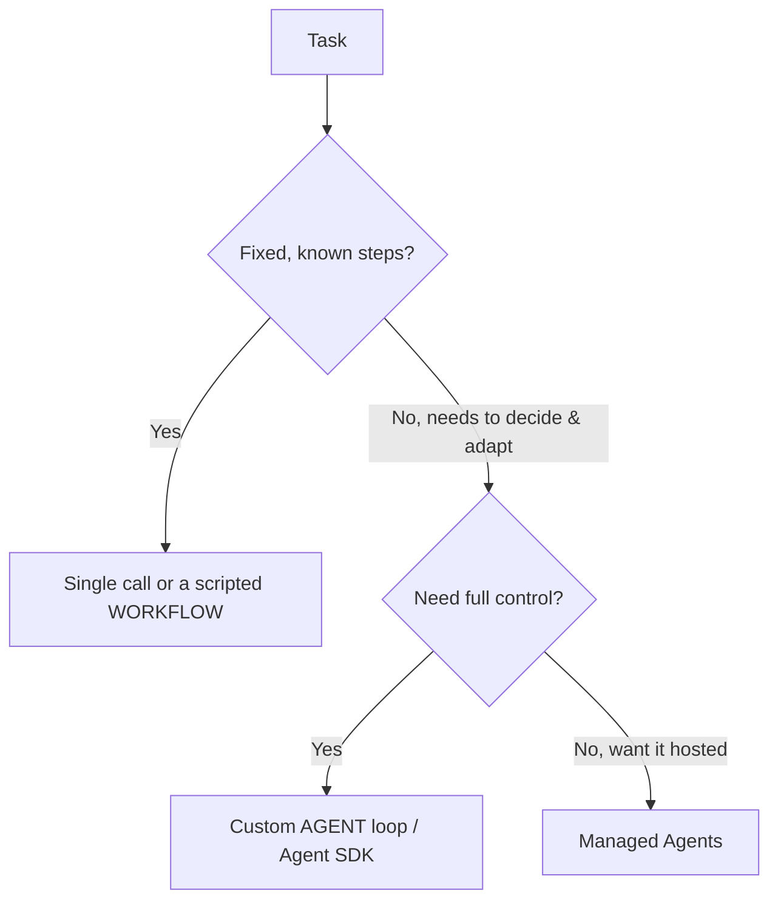

<LevelBadge level="advanced" />

<VerifyNote lastVerified="2026-07-21" source="https://platform.claude.com/docs/en/agents-and-tools/tool-use/overview">
एजेंट टूलिंग (Agent SDK, मैनेज्ड विकल्प) तेज़ी से विकसित होती है — मौजूदा विकल्पों की पुष्टि आधिकारिक दस्तावेज़ों में करें।
</VerifyNote>

<Callout type="objectives" items={["परिभाषित करें कि एजेंट वास्तव में क्या है: एक लूप में चलने वाला मॉडल", "सिंगल कॉल बनाम वर्कफ़्लो बनाम एजेंट चुनने के लिए निर्णय परीक्षण लागू करें", "सही गार्डरेल्स के साथ एक न्यूनतम एजेंट लूप डिज़ाइन करें", "जानें कि खुद से हाथ से बनाने के बजाय Claude Agent SDK का सहारा कब लेना है", "एजेंट को मज़बूत बनाएँ: इसे सीमित करें, विफलताओं को संभालें, विशेषाधिकार प्रतिबंधित करें, इसका मूल्यांकन करें"]} />

एक **एजेंट** एक लूप में चलने वाला मॉडल है: यह [टूल](/docs/api/tool-use) कॉल करके, परिणामों का अवलोकन करके, और काम पूरा होने तक अगला कदम तय करके किसी लक्ष्य का पीछा करता है। इसे बनाने से पहले, *सबसे सरल चीज़ जो काम करे* चुनें।

## निर्णय परीक्षण (ज़रूरत से ज़्यादा न बनाएँ)

हर काम के लिए एजेंट की ज़रूरत नहीं होती। पहले इस पेड़ पर चलें — ज़्यादातर काम शीर्ष पर ही रुक जाते हैं।

तीन विकल्प, सबसे सरल पहले:

- **सिंगल कॉल** — एक ही प्रॉम्प्ट से जवाब मिल जाता है। ज़्यादातर काम। सबसे सस्ता, सबसे विश्वसनीय।
- **वर्कफ़्लो** — आप कोड में कॉल्स का एक निश्चित क्रम ऑर्केस्ट्रेट करते हैं (डिटरमिनिस्टिक कंट्रोल फ़्लो)। तब उपयोग करें जब चरण ज्ञात हों।
- **एजेंट** — मॉडल चरणों को गतिशील रूप से तय करता है। केवल तभी उपयोग करें जब रास्ते को वास्तव में हार्डकोड नहीं किया जा सकता।

<Callout type="warning">
एजेंट तब चुनें जब अनुकूलनशीलता ही मुद्दा हो — इसलिए नहीं कि यह प्रभावशाली लगता है। आपके नियंत्रण वाला वर्कफ़्लो परखना और डीबग करना आसान होता है।
</Callout>

## लूप डिज़ाइन करना

एक न्यूनतम कस्टम एजेंट केवल चार गतिशील भागों से बना होता है। उन्हें इसी क्रम में बनाएँ:

<Steps items={[
  {title: "सिस्टम प्रॉम्प्ट", body: "लक्ष्य, बाधाएँ, और उपलब्ध टूल बताएँ। यही वह है जिसके विरुद्ध मॉडल हर बारी पर तर्क करता है।"},
  {title: "लूप", body: "संदेश भेजें → यदि प्रतिक्रिया एक tool_use है, तो टूल चलाएँ, एक tool_result जोड़ें, और दोहराएँ → जब तक कोई अंतिम उत्तर या रुकने की शर्त न आ जाए।"},
  {title: "गार्डरेल्स", body: "एक अधिकतम-इटरेशन सीमा, एक टोकन/लागत बजट, और कुछ भी चलने से पहले टूल इनपुट का सत्यापन जोड़ें।"},
  {title: "कॉन्टेक्स्ट प्रबंधन", body: "जैसे-जैसे इतिहास बढ़े, सारांशित करें या छँटाई करें — वही विचार जो कॉन्टेक्स्ट प्रबंधन (/docs/claude-code/context-management) में शामिल है।"}
]} />

**[Claude Agent SDK](/docs/claude-code/headless-and-agent-sdk)** आपको यह लूप देता है — टूल, अनुमतियाँ, कॉन्टेक्स्ट हैंडलिंग — सब कुछ शामिल, ताकि आपको इसे खुद से हाथ से न बनाना पड़े।

<Callout type="tip">
अपना खुद का लूप लिखने से पहले, पूछें कि क्या Agent SDK इसे पहले से कवर करता है। यह लूप, अनुमतियाँ, और कॉन्टेक्स्ट हैंडलिंग के साथ आता है ताकि आप टूल और लक्ष्य पर ध्यान केंद्रित कर सकें।
</Callout>

## इसे मज़बूत बनाएँ

जो लूप टूल कॉल कर सकता है, वह गलत व्यवहार भी कर सकता है। चार आदतें एजेंट को भरोसेमंद बनाए रखती हैं:

- **हर चीज़ को सीमित करें**: इटरेशन, समय, लागत। एजेंट लूप में फँस सकते हैं।
- **टूल विफलताओं को** सहजता से संभालें (त्रुटि को परिणाम के रूप में लौटाएँ)।
- जोखिमपूर्ण क्रियाओं के लिए **न्यूनतम विशेषाधिकार + ह्यूमन-इन-द-लूप** — देखें [एजेंट सुरक्षित करना](/docs/security/securing-agents)।
- भरोसा करने से पहले इसे वास्तविक मामलों पर **मूल्यांकित करें** — देखें [Evals](/docs/foundations/evals)।

<Callout type="takeaways" items={["एक एजेंट एक लूप में चलने वाला मॉडल है जो किसी लक्ष्य की ओर टूल कॉल करता है — इसका उपयोग केवल तभी करें जब रास्ते को हार्डकोड न किया जा सके", "निर्णय क्रम: सिंगल कॉल → वर्कफ़्लो → एजेंट → मैनेज्ड एजेंट; सबसे सरल विकल्प को प्राथमिकता दें जो काम करे", "एक न्यूनतम लूप = सिस्टम प्रॉम्प्ट + tool_use/tool_result लूप + गार्डरेल्स + कॉन्टेक्स्ट प्रबंधन", "Claude Agent SDK आपके लिए लूप, टूल, अनुमतियाँ, और कॉन्टेक्स्ट हैंडलिंग के साथ आता है", "मज़बूती = इटरेशन/समय/लागत को सीमित करना, टूल विफलताओं को संभालना, न्यूनतम विशेषाधिकार + ह्यूमन-इन-द-लूप, और भरोसा करने से पहले मूल्यांकन करना"]} />

## स्वयं को जाँचें

<Quiz title="स्वयं को जाँचें" questions={[
  {
    q: "इस संदर्भ में एजेंट का सबसे अच्छा वर्णन क्या है?",
    options: [
      "एक एकल प्रॉम्प्ट जो पूरा उत्तर लौटाता है",
      "एक लूप में चलने वाला मॉडल, जो टूल कॉल करता है और काम पूरा होने तक अगला कदम तय करता है",
      "API कॉल्स का एक निश्चित क्रम जिसे आप कोड में ऑर्केस्ट्रेट करते हैं",
      "एक होस्टेड सेवा जिसमें किसी कॉन्फ़िगरेशन की आवश्यकता नहीं होती"
    ],
    answer: 1,
    explain: "एक एजेंट एक लूप में चलने वाला मॉडल है: यह टूल कॉल करके, परिणामों का अवलोकन करके, और काम पूरा होने तक अगला कदम तय करके किसी लक्ष्य का पीछा करता है।"
  },
  {
    q: "काम में निश्चित, ज्ञात चरण हैं। आपको किसका सहारा लेना चाहिए?",
    options: [
      "अधिकतम नियंत्रण के लिए एक कस्टम एजेंट लूप",
      "मैनेज्ड एजेंट, ताकि यह होस्टेड हो",
      "एक सिंगल कॉल या एक स्क्रिप्टेड वर्कफ़्लो",
      "एक मल्टी-एजेंट टीम"
    ],
    answer: 2,
    explain: "जब चरण निश्चित और ज्ञात हों, तो एक सिंगल कॉल या एक स्क्रिप्टेड वर्कफ़्लो (डिटरमिनिस्टिक कंट्रोल फ़्लो) सही, सबसे सरल विकल्प है।"
  },
  {
    q: "कस्टम एजेंट वास्तव में कब उचित होता है?",
    options: [
      "जब भी यह वर्कफ़्लो से ज़्यादा प्रभावशाली लगे",
      "जब अनुकूलनशीलता ही मुद्दा हो और रास्ते को वास्तव में हार्डकोड न किया जा सके",
      "हर उस काम के लिए जो एक से ज़्यादा टूल कॉल करता है",
      "केवल तभी जब आप Agent SDK का उपयोग नहीं कर सकते"
    ],
    answer: 1,
    explain: "एजेंट तब चुनें जब अनुकूलनशीलता ही मुद्दा हो — इसलिए नहीं कि यह प्रभावशाली लगता है। आपके नियंत्रण वाला वर्कफ़्लो परखना और डीबग करना आसान होता है।"
  },
  {
    q: "लूप में, जब मॉडल एक tool_use के साथ प्रतिक्रिया देता है तो क्या होता है?",
    options: [
      "आप लूप रोक देते हैं और आंशिक उत्तर लौटाते हैं",
      "आप टूल चलाते हैं, एक tool_result जोड़ते हैं, और दोहराते हैं",
      "आप संदेश को हटा देते हैं और सिस्टम प्रॉम्प्ट को फिर से भेजते हैं",
      "आप तुरंत इतिहास का सारांश बनाते हैं"
    ],
    answer: 1,
    explain: "लूप: संदेश भेजें → यदि tool_use, तो टूल चलाएँ, tool_result जोड़ें, दोहराएँ → जब तक कोई अंतिम उत्तर या रुकने की शर्त न आ जाए।"
  },
  {
    q: "एजेंट को मज़बूत बनाने वाले गार्डरेल्स में से कौन सा शामिल नहीं है?",
    options: [
      "एक अधिकतम-इटरेशन सीमा और एक टोकन/लागत बजट",
      "त्रुटि को परिणाम के रूप में लौटाकर टूल विफलताओं को संभालना",
      "एजेंट को पूर्ण विशेषाधिकार देना ताकि वह कभी अवरुद्ध न हो",
      "जोखिमपूर्ण क्रियाओं के लिए न्यूनतम विशेषाधिकार साथ में ह्यूमन-इन-द-लूप"
    ],
    answer: 2,
    explain: "मज़बूत एजेंट जोखिमपूर्ण क्रियाओं के लिए न्यूनतम विशेषाधिकार साथ में ह्यूमन-इन-द-लूप का उपयोग करते हैं — पूर्ण विशेषाधिकार देने के विपरीत। आप इटरेशन/समय/लागत को भी सीमित करते हैं, टूल विफलताओं को सहजता से संभालते हैं, और भरोसा करने से पहले मूल्यांकन करते हैं।"
  }
]} />

## आगे

- [टूल उपयोग](/docs/api/tool-use) · [Headless & Agent SDK](/docs/claude-code/headless-and-agent-sdk)
- [मैनेज्ड एजेंट](/docs/api/managed-agents) · [Cowork & Agent Teams](/docs/api/cowork-and-agent-teams)
- [एजेंट और टूल सुरक्षित करना](/docs/security/securing-agents)
