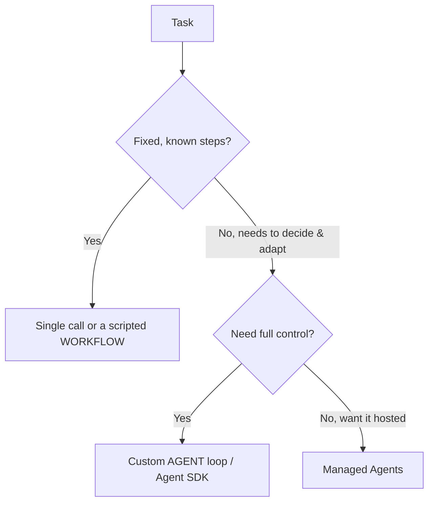

<LevelBadge level="advanced" />

<VerifyNote lastVerified="2026-06-20" source="https://docs.anthropic.com/en/docs/agents-and-tools">
एजेंट टूलिंग (Agent SDK, मैनेज्ड विकल्प) तेज़ी से विकसित होती है — आधिकारिक दस्तावेज़ों में मौजूदा विकल्पों की पुष्टि करें।
</VerifyNote>

एक **एजेंट** एक लूप में चलने वाला मॉडल है: यह [टूल](/docs/api/tool-use) कॉल करके, परिणामों का अवलोकन करके, और काम पूरा होने तक अगला कदम तय करके किसी लक्ष्य का पीछा करता है। इसे बनाने से पहले, *सबसे सरल चीज़ जो काम करे* चुनें।

## निर्णय परीक्षण (ज़रूरत से ज़्यादा न बनाएँ)

- **सिंगल कॉल** — एक ही प्रॉम्प्ट से जवाब मिल जाता है। ज़्यादातर काम। सबसे सस्ता, सबसे विश्वसनीय।
- **वर्कफ़्लो** — आप कोड में कॉल्स का एक निश्चित क्रम ऑर्केस्ट्रेट करते हैं (डिटरमिनिस्टिक कंट्रोल फ़्लो)। तब उपयोग करें जब चरण ज्ञात हों।
- **एजेंट** — मॉडल चरणों को गतिशील रूप से तय करता है। केवल तभी उपयोग करें जब रास्ते को वास्तव में हार्डकोड नहीं किया जा सकता।

> एजेंट तब चुनें जब अनुकूलनशीलता ही मुद्दा हो — इसलिए नहीं कि यह प्रभावशाली लगता है। आपके नियंत्रण वाला वर्कफ़्लो परखना और डीबग करना आसान होता है।

## लूप डिज़ाइन करना

एक न्यूनतम कस्टम एजेंट:

1. **सिस्टम प्रॉम्प्ट**: लक्ष्य, बाधाएँ, और उपलब्ध टूल।
2. **लूप**: संदेश भेजें → यदि `tool_use` है, तो टूल चलाएँ, `tool_result` जोड़ें, दोहराएँ → जब तक कोई अंतिम उत्तर या रुकने की शर्त न आ जाए।
3. **गार्डरेल्स**: अधिकतम-इटरेशन सीमा, एक टोकन/लागत बजट, और टूल इनपुट का सत्यापन।
4. **कॉन्टेक्स्ट प्रबंधन**: जैसे-जैसे इतिहास बढ़े, सारांशित/छंटाई करें (वही विचार जो [कॉन्टेक्स्ट प्रबंधन](/docs/claude-code/context-management) में है)।

**[Claude Agent SDK](/docs/claude-code/headless-and-agent-sdk)** आपको यह लूप देता है — टूल, अनुमतियाँ, कॉन्टेक्स्ट हैंडलिंग — सब कुछ शामिल, ताकि आपको इसे खुद से न बनाना पड़े।

## इसे मज़बूत बनाएँ

- **हर चीज़ को सीमित करें**: इटरेशन, समय, लागत। एजेंट लूप में फँस सकते हैं।
- जोखिमपूर्ण क्रियाओं के लिए **टूल विफलताओं को** सहजता से संभालें (त्रुटि को परिणाम के रूप में लौटाएँ)।
- जोखिमपूर्ण क्रियाओं के लिए **न्यूनतम विशेषाधिकार + ह्यूमन-इन-द-लूप** — देखें [एजेंट सुरक्षित करना](/docs/security/securing-agents)।
- भरोसा करने से पहले इसे वास्तविक मामलों पर **मूल्यांकित करें** — देखें [Evals](/docs/foundations/evals)।

## आगे

- [टूल उपयोग](/docs/api/tool-use) · [Headless & Agent SDK](/docs/claude-code/headless-and-agent-sdk)
- [मैनेज्ड एजेंट](/docs/api/managed-agents) · [Cowork & Agent Teams](/docs/api/cowork-and-agent-teams)
- [एजेंट और टूल सुरक्षित करना](/docs/security/securing-agents)
