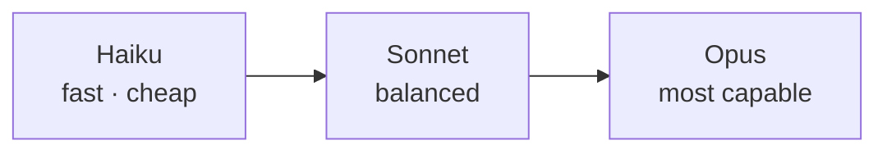

<LevelBadge level="beginner" />

Anthropic विभिन्न क्षमता/लागत/गति बिंदुओं पर मॉडलों का एक परिवार प्रदान करता है। अच्छी तरह चुनना मुख्य रूप से मॉडल को काम के अनुरूप मिलाने के बारे में है — और उस क्षमता के लिए अधिक भुगतान न करने के बारे में जिसकी आपको ज़रूरत नहीं है।

## मौजूदा मॉडल

<ModelTable />

## इसे आज़माएँ: कौन-सा मॉडल फिट बैठता है?

तीन प्रश्नों के उत्तर दें और एक शुरुआती सिफ़ारिश पाएँ:

<ModelPicker />

## मानसिक मॉडल: एक क्षमता सीढ़ी

- **Sonnet से शुरू करें।** यह डिफ़ॉल्ट कार्यघोड़ा है — समझदार लागत पर मज़बूत तर्क और कोडिंग। ज़्यादातर काम यहीं से शुरू होने चाहिए।
- **Opus तक बढ़ें** केवल तभी जब Sonnet संघर्ष करे और गुणवत्ता लागत से ज़्यादा मायने रखे (कठिन तर्क, पेचीदा एजेंट, जटिल कोड)।
- **Haiku तक उतरें** अधिक-मात्रा वाले, लेटेंसी-संवेदनशील, या सरल काम के लिए (वर्गीकरण, निष्कर्षण, रूटिंग, सस्ते सब-एजेंट)।

## वास्तव में कैसे चुनें

1. **Sonnet को डिफ़ॉल्ट रखें** और शिप करें।
2. **गुणवत्ता की सीमा तक पहुँच रहे हैं?** केवल कठिन उपसमूह पर Opus आज़माएँ।
3. **लागत या लेटेंसी परेशान कर रही है?** देखें कि क्या उस चरण के लिए Haiku पर्याप्त रूप से अच्छा है।
4. **मॉडल मिलाएँ।** सस्ते प्री/पोस्ट-प्रोसेसिंग के लिए Haiku और कठिन कोर के लिए Sonnet/Opus का उपयोग करें। यह "मॉडल टियरिंग" लागत के सबसे बड़े लीवरों में से एक है — देखें [लागत और लेटेंसी](/docs/foundations/cost-and-latency)।

:::tip केवल बेंचमार्क से न चुनें
सार्वजनिक बेंचमार्क एक शुरुआती संकेत हैं, *आपके* काम के लिए कोई फ़ैसला नहीं। दो मॉडलों पर अपने कुछ वास्तविक इनपुट्स पर एक छोटा [eval](/docs/foundations/evals) चलाएँ — इसमें मिनट लगते हैं और यह अनुमान लगाने से बेहतर है।
:::

## सटीक मॉडल ID देखना

हमेशा मौजूदा API मॉडल ID पास करें (उदा. आपके `messages.create` कॉल में)। इसे [ऊपर दी गई मॉडल तालिका](/docs/whats-new/models-and-pricing) या आधिकारिक मॉडल पेज से प्राप्त करें — और इसे कई जगहों पर हार्ड-कोड करने के बजाय कॉन्फ़िग से पढ़ना बेहतर है, ताकि मॉडल अपग्रेड एक-लाइन का बदलाव हो।

## आगे

- [टोकन, कॉन्टेक्स्ट और मूल्य निर्धारण](/docs/api/tokens-and-pricing)
- [आपकी पहली API कॉल](/docs/api/first-call)
- [मौजूदा मॉडल और मूल्य निर्धारण](/docs/whats-new/models-and-pricing)
