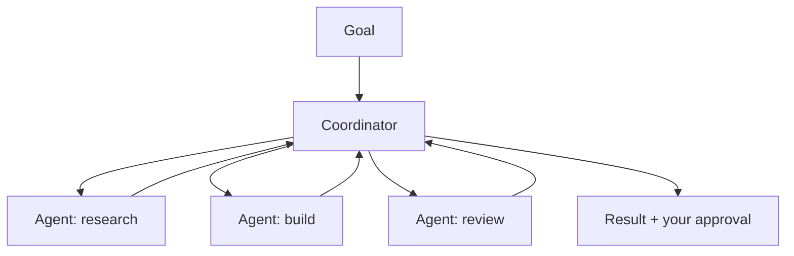

<LevelBadge level="advanced" />

<VerifyNote lastVerified="2026-06-20" source="https://platform.claude.com/docs">
Cowork और Agent Teams तेज़ी से बदलते 2026 सतह हैं — नाम, उपलब्धता और क्षमताएँ अक्सर बदलती रहती हैं। मौजूदा विवरणों की पुष्टि आधिकारिक Anthropic दस्तावेज़ों/घोषणाओं में करें।
</VerifyNote>

एकल एजेंट से आगे बढ़कर, Anthropic एजेंटों को निरंतर, सहयोगी काम करने देने के लिए **उत्पाद-स्तरीय** सतहें शिप करता रहा है: **Cowork** (एक एजेंटिक डेस्कटॉप वर्कस्पेस) और **Agent Teams** (कई एजेंट सहयोग करते हुए)। यह पेज एक उच्च-स्तरीय नक्शा है — विशिष्ट बातों को आधिकारिक दस्तावेज़ों के विरुद्ध सत्यापित करें, क्योंकि ये तेज़ी से विकसित होते हैं।

## Claude Cowork

इसे एक ऐसे **वर्कस्पेस के रूप में सोचें जहाँ एक एजेंट आपके साथ वास्तविक, बहु-चरणीय काम करता है** — एकल चैट टर्न की तुलना में लंबे क्षितिज पर फ़ाइलों और टूल पर काम करते हुए, जबकि आप पर्यवेक्षण करते हैं। यह API पर एजेंट बनाने का उपभोक्ता/प्रो-केंद्रित चचेरा भाई है: लूप प्रदान किया जाता है, आप लक्ष्यों का निर्देशन करते हैं।

## Agent Teams

जहाँ एक एजेंट पर्याप्त नहीं है, वहाँ **कई एजेंट सहयोग करते हैं** — एक लक्ष्य को बाँटते हुए, प्रत्येक की एक भूमिका और टूल होते हैं, परिणाम की ओर समन्वय करते हुए। अवधारणात्मक रूप से यह Claude Code के [सब-एजेंट](/docs/claude-code/subagents) को दर्शाता है, लेकिन एक एकल सौंपे गए उप-कार्य के बजाय निरंतर, मल्टी-एजेंट सहयोग के लिए एक उत्पाद सतह के रूप में।

## यह साइट के बाक़ी हिस्से से कैसे संबंधित है

- इसे स्वयं, प्रोग्रामेटिक रूप से बनाना → [एजेंट बनाना](/docs/api/building-agents) + [Agent SDK](/docs/claude-code/headless-and-agent-sdk)।
- कोडिंग सत्र के भीतर प्रत्यायोजन → [सब-एजेंट](/docs/claude-code/subagents)।
- होस्टेड लूप/स्टेट/शेड्यूलिंग → [मैनेज्ड एजेंट](/docs/api/managed-agents)।

## स्थिरांक: पर्यवेक्षण

:::warning अधिक स्वायत्तता, अधिक सावधानी
मल्टी-एजेंट, लंबे-क्षितिज वाला काम मूल्य *और* जोखिम दोनों को बढ़ाता है। परिणामी क्रियाओं पर मनुष्यों को लूप में रखें, टूल एक्सेस को कसकर सीमित करें, और आउटपुट सत्यापित करें — देखें [ज़िम्मेदार उपयोग](/docs/security/responsible-use) और [एजेंट सुरक्षित करना](/docs/security/securing-agents)।
:::

## आगे

- [सब-एजेंट और समानांतर एजेंट](/docs/claude-code/subagents)
- [मैनेज्ड एजेंट](/docs/api/managed-agents)
- [ज़िम्मेदार उपयोग, नैतिकता और सत्यापन](/docs/security/responsible-use)
