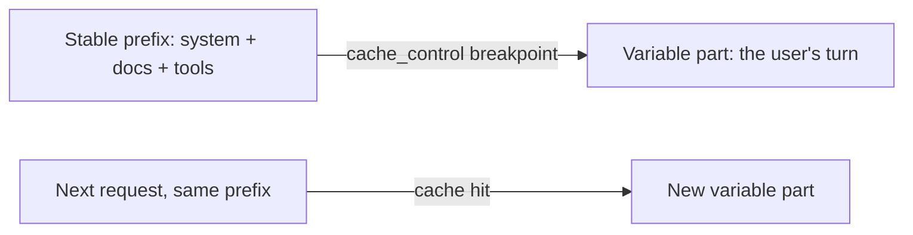

<LevelBadge level="advanced" />

<VerifyNote lastVerified="2026-06-20" source="https://docs.anthropic.com/en/docs/build-with-claude/prompt-caching">
कैश यांत्रिकी, पात्रता, और कैश्ड बनाम ताज़ा टोकन का मूल्य निर्धारण बदलता रहता है — आधिकारिक प्रॉम्प्ट-कैशिंग दस्तावेज़ों में पुष्टि करें।
</VerifyNote>

यदि आपके कई अनुरोध एक बड़ा, अपरिवर्तनीय हिस्सा साझा करते हैं — एक लंबा सिस्टम प्रॉम्प्ट, एक बड़ा दस्तावेज़, एक टूल कैटलॉग — तो **प्रॉम्प्ट कैशिंग** API को हर कॉल पर उसे फिर से पढ़ने के बजाय संसाधित प्रीफ़िक्स का पुनः उपयोग करने देती है। यह कैश्ड हिस्से पर **लागत** और **लेटेंसी** दोनों घटाती है।

## यह कैसे काम करता है (मानसिक मॉडल)

आप स्थिर प्रीफ़िक्स के बाद एक **कैश ब्रेकपॉइंट** चिह्नित करते हैं। पहली कॉल पर इसे संसाधित और कैश किया जाता है; आगे की कॉल्स जो **बिल्कुल वही प्रीफ़िक्स** साझा करती हैं, वे कैश हिट करती हैं और उसके लिए बहुत कम भुगतान करती हैं।

## वह अपरिवर्तनीय नियम जो इसे बनाता या बिगाड़ता है

:::warning कैशिंग प्रीफ़िक्स-सटीक होती है
एक कैश हिट के लिए ज़रूरी है कि कैश्ड प्रीफ़िक्स **बाइट-दर-बाइट समान** हो। सबसे आम बग: प्रॉम्प्ट के शीर्ष के पास एक *मौन अमान्यकर्ता* — एक टाइमस्टैम्प, एक बदलता यूज़र नाम, एक पुनः-व्यवस्थित टूल सूची — जो प्रीफ़िक्स को बदल देता है और चुपचाप आपकी हिट दर को शून्य कर देता है।
:::

**हर स्थिर चीज़ को पहले रखें, हर परिवर्तनशील चीज़ को अंत में,** और प्रीफ़िक्स को वास्तव में स्थिर रखें।

## यह सबसे ज़्यादा कहाँ फ़ायदेमंद है

- उपयोगकर्ताओं भर में पुनः उपयोग किए जाने वाले लंबे **सिस्टम प्रॉम्प्ट**।
- **RAG / दस्तावेज़ Q&A** जहाँ वही स्रोत पाठ बार-बार क्वेरी किया जाता है।
- कई टर्न में एक निश्चित टूल कैटलॉग और निर्देशों वाले **एजेंट**।

ऑफ़लाइन वर्कलोड के लिए कैशिंग को **बैचिंग** के साथ, और सबसे बड़ी संयुक्त बचत के लिए मॉडल का सही आकार चुनने ([एक मॉडल चुनना](/docs/api/choosing-a-model)) के साथ जोड़ें — देखें [लागत और लेटेंसी](/docs/foundations/cost-and-latency)।

## आगे

- [टोकन, कॉन्टेक्स्ट और मूल्य निर्धारण](/docs/api/tokens-and-pricing)
- [स्ट्रीमिंग और मल्टी-टर्न](/docs/api/streaming)
- [API पर एजेंट बनाना](/docs/api/building-agents)
