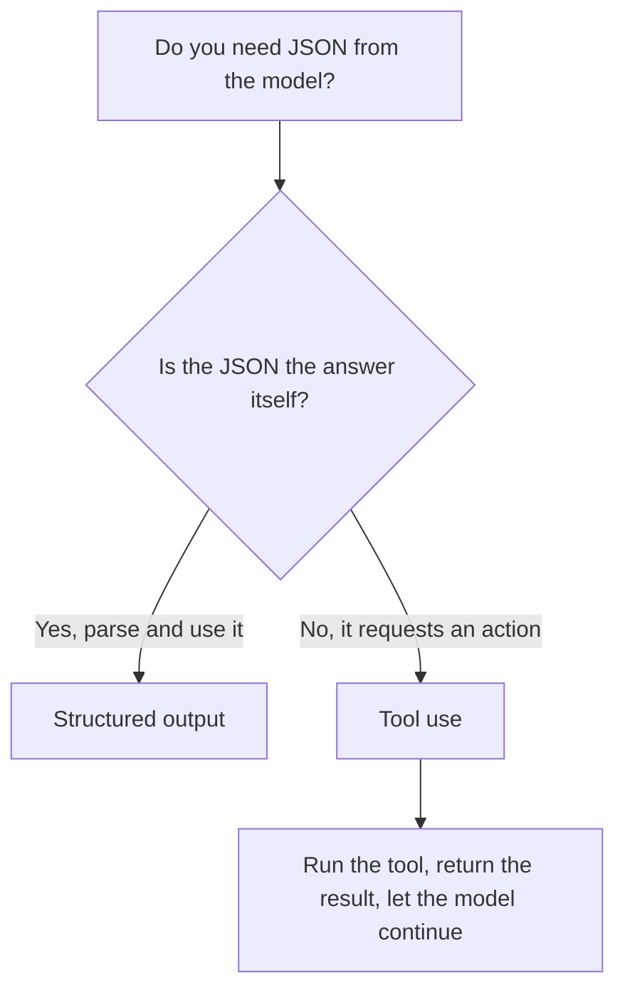

<LevelBadge level="intermediate" />

<VerifyNote lastVerified="2026-06-20" source="https://platform.claude.com/docs/en/docs/build-with-claude/structured-outputs">
स्कीमा को लागू करने की सटीक प्रणाली विकसित होती रहती है — आधिकारिक docs में मौजूदा तरीका (output config / parse helpers) ज़रूर जाँच लें।
</VerifyNote>

<Callout type="objectives" items={["समझाएँ कि JSON के लिए प्रॉम्प्ट करके उम्मीद लगाने से बेहतर स्कीमा-लागू आउटपुट क्यों होता है", "एक JSON Schema प्रदान करें और रिस्पॉन्स को एक टाइप्ड ऑब्जेक्ट (Pydantic / Zod) में पार्स करें", "संरचित आउटपुट को टूल उपयोग से इरादे के आधार पर पहचानें, प्रणाली के आधार पर नहीं", "मज़बूत, भरोसेमंद स्कीमा के लिए चार सुझाव लागू करें", "एक-सवाल वाले अंगूठे के नियम से सही टूल चुनें"]} />

जब Claude का आउटपुट दूसरे सॉफ़्टवेयर को फ़ीड होता है, तो आपको **भरोसेमंद संरचना** चाहिए — हर बार एक ज्ञात आकार से मेल खाता वैध JSON। "JSON में जवाब दो" पर भरोसा करके उम्मीद मत लगाइए; प्लेटफ़ॉर्म के संरचित-आउटपुट समर्थन का उपयोग करें।

यह पाठ आपको *प्रॉम्प्ट-और-दुआ क्यों विफल होती है* से लेकर *स्कीमा को कैसे लागू करें और उसे एक टाइप्ड ऑब्जेक्ट में पार्स करें* तक ले जाता है — और जब संरचित आउटपुट और टूल उपयोग एक जैसे दिखते हों, तब उन्हें कैसे अलग पहचानें। इसे ऊपर से नीचे तक पढ़ें, फिर अंत के पास मौजूद क्विज़ से खुद को परखें।

## भरोसेमंद तरीका

आउटपुट के लिए एक **JSON Schema** प्रदान करें और API/SDK को उसे लागू करने दें, फिर उसे एक टाइप्ड ऑब्जेक्ट (जैसे Python में Pydantic, TypeScript में Zod) में पार्स करें। SDK के parse helpers आपको एक टाइप्ड परिणाम सौंपते हैं, बजाय किसी ऐसी स्ट्रिंग के जिसे आपको खुद `JSON.parse` करके मान्य करना पड़े।

<Steps items={[
  {title: "आकार परिभाषित करें", body: "आपको जिस आउटपुट की ज़रूरत है उसे एक JSON Schema के रूप में मॉडल करें — Python में Pydantic BaseModel के ज़रिए, TypeScript में Zod schema के ज़रिए।"},
  {title: "स्कीमा-अनुरूप आउटपुट का अनुरोध करें", body: "मॉडल से ऐसा डेटा लौटाने को कहें जो उस स्कीमा के अनुरूप हो, ताकि API/SDK उसे लागू करे, न कि उसे संयोग पर छोड़ दे।"},
  {title: "एक टाइप्ड ऑब्जेक्ट में पार्स करें", body: "सीधे टाइप्ड परिणाम पाने के लिए SDK के parse helpers का उपयोग करें — न कोई मैन्युअल JSON.parse और न ही हाथ से लिखा गया वैलिडेशन।"}
]} />

```python
# Conceptual shape — see the official docs for the current API surface.
from pydantic import BaseModel

class Ticket(BaseModel):
    title: str
    priority: str   # "low" | "medium" | "high"
    tags: list[str]

# Request the model to return data conforming to Ticket's JSON schema,
# then parse the response into a Ticket instance.
```

ढालने के लिए कोई ठोस अनुरोध चाहिए? यहाँ उसका आकार है जो आप मॉडल को सौंपते हैं — मॉडल को अपने खुद के स्कीमा से बदल दें।

<PromptCard title="स्कीमा-अनुरूप आउटपुट माँगें">{`Return the data conforming to this JSON Schema:

{
  "title": "string",
  "priority": "low | medium | high",
  "tags": ["string"]
}

Do not include any prose outside the JSON.`}</PromptCard>

## सिर्फ़ JSON के लिए प्रॉम्प्ट क्यों न करें?

आप प्रॉम्प्ट में JSON माँग *सकते* हैं, और सरल मामलों में यह काम करता है — पर यह भटक सकता है: इधर-उधर बिखरा हुआ गद्य, एक अतिरिक्त (trailing) कॉमा, एक गायब फ़ील्ड। स्कीमा-लागू आउटपुट उस तरह के बग को ख़त्म कर देता है, जो उसी पल मायने रखने लगता है जब कोई downstream सिस्टम उस पर निर्भर हो।

<Callout type="warning" items={["प्रॉम्प्ट किया गया JSON डेमो में चलता है और प्रोडक्शन में टूट जाता है: विफलता तभी सामने आती है जब कोई downstream सिस्टम उसे पार्स करता है।", "तीन क्लासिक भटकाव जिन पर नज़र रखें: JSON के आसपास बिखरा गद्य, एक trailing कॉमा, और एक गायब अनिवार्य फ़ील्ड।"]} />

## संरचित आउटपुट बनाम टूल उपयोग

दोनों ही फ़ीचर मॉडल को एक **JSON Schema** सौंपते हैं, इसलिए वे एक जैसे दिखते हैं — और लोग ग़लत वाला चुन लेते हैं। फ़र्क़ *इरादे* का है, प्रणाली का नहीं:

| | **संरचित आउटपुट** | **[टूल उपयोग](/docs/api/tool-use)** |
|---|---|---|
| आप क्या चाहते हैं | एक तय आकार में **अंतिम जवाब** | मॉडल किसी **क्षमता को आह्वान करे** (कोई फ़ंक्शन कॉल करे, डेटा लाए, कोई कार्रवाई करे) |
| इसका उपभोक्ता कौन | आपका कोड, सीधे | आपका कोड टूल चलाता है, फिर परिणाम वापस मॉडल को फ़ीड करता है |
| टर्न का आकार | एक रिस्पॉन्स, काम पूरा | एक लूप: मॉडल पूछता है, आप निष्पादित करते हैं, मॉडल जारी रखता है |
| सामान्य उपयोग | निष्कर्षण (extraction), वर्गीकरण, पार्सिंग | एजेंट, लाइव लुकअप, साइड इफ़ेक्ट |

एक त्वरित अंगूठे का नियम:



अगर JSON *ही* सुपुर्द की जाने वाली चीज़ है, तो संरचित आउटपुट का उपयोग करें। अगर JSON वह है जिसमें मॉडल आपके कोड से कुछ *करने* को कह रहा है, तो वह टूल उपयोग है। एजेंट अक्सर दोनों का उपयोग करते हैं: कार्रवाई के लिए टूल, और एक साफ़ अंतिम परिणाम लौटाने के लिए संरचित आउटपुट।

## सुझाव

<Callout type="tip" items={["स्कीमा को मज़बूत रखें — तय विकल्पों के लिए enums का उपयोग करें; अनिवार्य फ़ील्ड्स को चिह्नित करें।", "फ़ील्ड्स का वर्णन करें — फ़ील्ड विवरण मॉडल को मिनी-प्रॉम्प्ट की तरह मार्गदर्शन देते हैं।", "फिर भी सीमा (boundary) पर मान्य करें — बचावात्मक पार्सिंग एक सस्ता बीमा है।", "निष्कर्षण कार्यों के लिए, संरचित आउटपुट + एक स्पष्ट स्कीमा हर बार फ़्रीफ़ॉर्म से बेहतर है।"]} />

<Callout type="takeaways" items={["API/SDK को एक JSON Schema सौंपें और एक टाइप्ड ऑब्जेक्ट में पार्स करें — प्रॉम्प्ट-और-दुआ मत कीजिए।", "JSON के लिए प्रॉम्प्ट करना भटक सकता है (बिखरा गद्य, trailing कॉमा, गायब फ़ील्ड); स्कीमा लागू करना उस बग-श्रेणी को ख़त्म कर देता है।", "संरचित आउटपुट बनाम टूल उपयोग इरादे से अलग हैं: JSON ही जवाब है, बनाम JSON किसी कार्रवाई का अनुरोध करता है।", "मज़बूत स्कीमा, वर्णित फ़ील्ड्स और सीमा-वैलिडेशन निष्कर्षण व वर्गीकरण को भरोसेमंद बनाते हैं।"]} />

## शब्दावली पक्की करें

<Flashcards cards={[
  {front: "संरचित आउटपुट (Structured output)", back: "आप API/SDK को अंतिम जवाब के लिए एक JSON Schema सौंपते हैं और रिस्पॉन्स को एक टाइप्ड ऑब्जेक्ट (Pydantic / Zod) में पार्स करते हैं। JSON ही सुपुर्द की जाने वाली चीज़ है।"},
  {front: "टूल उपयोग (Tool use)", back: "आप मॉडल को एक JSON Schema सौंपते हैं ताकि वह किसी क्षमता को आह्वान कर सके। आपका कोड टूल चलाता है, फिर परिणाम वापस फ़ीड करता है — यह एक लूप है, एक-शॉट जवाब नहीं।"},
  {front: "JSON Schema", back: "वह आकार जिस पर दोनों फ़ीचर निर्भर करते हैं। Python में आप इसे Pydantic BaseModel से मॉडल करते हैं; TypeScript में Zod schema से।"},
  {front: "Parse helpers", back: "SDK के helpers जो सीधे एक टाइप्ड परिणाम लौटाते हैं, ताकि आप मैन्युअल JSON.parse और हाथ से लिखे वैलिडेशन को छोड़ सकें।"},
  {front: "एक-सवाल वाला अंगूठे का नियम", back: "क्या JSON ही जवाब है? हाँ → संरचित आउटपुट। नहीं, यह किसी कार्रवाई का अनुरोध करता है → टूल उपयोग।"}
]} />

<Quiz title="खुद को परखें" questions={[
  {
    q: "Claude से संरचित JSON पाने का भरोसेमंद तरीका क्या है?",
    options: [
      "प्रॉम्प्ट में 'JSON में जवाब दो' माँगें और विफलताओं पर फिर से कोशिश करें",
      "एक JSON Schema प्रदान करें, API/SDK को उसे लागू करने दें, फिर एक टाइप्ड ऑब्जेक्ट में पार्स करें",
      "मुक्त टेक्स्ट जनरेट करें और फ़ील्ड्स निकालने के लिए एक regex लिखें"
    ],
    answer: 1,
    explain: "एक JSON Schema प्रदान करें और API/SDK को उसे लागू करने दें, फिर उसे Pydantic (Python) या Zod (TypeScript) जैसे टाइप्ड ऑब्जेक्ट में पार्स करें।"
  },
  {
    q: "किसी downstream सिस्टम के उस पर निर्भर हो जाने के बाद JSON के लिए प्रॉम्प्ट करना जोखिम भरा क्यों है?",
    options: [
      "यह स्कीमा लागू करने से धीमा है",
      "यह भटक सकता है — बिखरा गद्य, एक trailing कॉमा, या एक गायब फ़ील्ड",
      "इसमें टूल उपयोग से ज़्यादा टोकन लगते हैं"
    ],
    answer: 1,
    explain: "प्रॉम्प्ट किया गया JSON सरल मामलों में चलता है पर भटक सकता है; स्कीमा-लागू आउटपुट उस तरह के बग को ख़त्म कर देता है।"
  },
  {
    q: "संरचित आउटपुट को टूल उपयोग से असल में क्या अलग करता है?",
    options: [
      "संरचित आउटपुट JSON Schema का उपयोग करता है; टूल उपयोग नहीं करता",
      "इरादा: संरचित आउटपुट एक तय आकार में अंतिम जवाब है, टूल उपयोग किसी क्षमता को आह्वान करता है",
      "टूल उपयोग Python के लिए है और संरचित आउटपुट TypeScript के लिए"
    ],
    answer: 1,
    explain: "दोनों मॉडल को एक JSON Schema सौंपते हैं, इसलिए वे एक जैसे दिखते हैं। फ़र्क़ इरादे का है, प्रणाली का नहीं — अंतिम जवाब बनाम किसी क्षमता को आह्वान करना।"
  },
  {
    q: "स्कीमा डिज़ाइन करने के लिए कौन-सी सलाह सही है?",
    options: [
      "लचीलेपन के लिए फ़ील्ड्स को वैकल्पिक छोड़ें और enums छोड़ दें",
      "तय विकल्पों के लिए enums का उपयोग करें, अनिवार्य फ़ील्ड्स चिह्नित करें, और फिर भी सीमा पर मान्य करें",
      "स्कीमा पर भरोसा करें और पार्स किए गए आउटपुट को कभी मान्य न करें"
    ],
    answer: 1,
    explain: "स्कीमा को मज़बूत रखें (enums, अनिवार्य फ़ील्ड्स), फ़ील्ड्स को मिनी-प्रॉम्प्ट की तरह वर्णित करें, और फिर भी सस्ते बीमे के रूप में सीमा पर मान्य करें।"
  }
]} />

## आगे

- [टूल उपयोग / फ़ंक्शन कॉलिंग](/docs/api/tool-use) — टूल भी JSON schemas का उपयोग करते हैं
- [आपका पहला API कॉल](/docs/api/first-call)
- [पुन: उपयोग योग्य प्रॉम्प्ट टेम्पलेट](/docs/templates/prompts)
