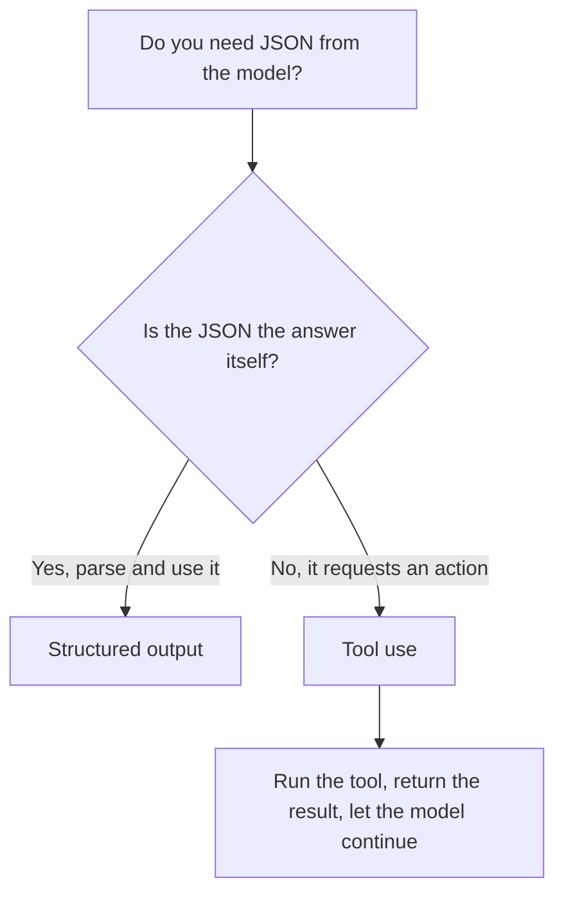

<LevelBadge level="intermediate" />

<VerifyNote lastVerified="2026-06-20" source="https://docs.anthropic.com/en/docs/build-with-claude/structured-outputs">
स्कीमा लागू करने का सटीक तंत्र विकसित होता रहता है — मौजूदा तरीक़े (आउटपुट कॉन्फ़िग / पार्स हेल्पर्स) की पुष्टि आधिकारिक दस्तावेज़ों में करें।
</VerifyNote>

जब Claude का आउटपुट दूसरे सॉफ़्टवेयर को फ़ीड करता है, तो आपको **विश्वसनीय संरचना** चाहिए — हर बार एक ज्ञात आकार से मेल खाता मान्य JSON। "JSON में जवाब दो" पर भरोसा कर के उम्मीद न करें; प्लेटफ़ॉर्म के स्ट्रक्चर्ड-आउटपुट समर्थन का उपयोग करें।

## विश्वसनीय तरीक़ा

आउटपुट के लिए एक **JSON स्कीमा** प्रदान करें और API/SDK को इसे लागू करने दें, फिर इसे एक टाइप्ड ऑब्जेक्ट में पार्स करें (उदा. Python में Pydantic, TypeScript में Zod)। SDK पार्स हेल्पर्स आपको एक टाइप्ड परिणाम सौंपते हैं, बजाय एक ऐसी स्ट्रिंग के जिसे आपको ख़ुद `JSON.parse` और सत्यापित करना पड़े।

```python
# Conceptual shape — see the official docs for the current API surface.
from pydantic import BaseModel

class Ticket(BaseModel):
    title: str
    priority: str   # "low" | "medium" | "high"
    tags: list[str]

# Request the model to return data conforming to Ticket's JSON schema,
# then parse the response into a Ticket instance.
```

## केवल JSON के लिए प्रॉम्प्ट क्यों न करें?

आप *कर सकते हैं* कि प्रॉम्प्ट में JSON माँगें, और सरल मामलों के लिए यह काम करता है — लेकिन यह भटक सकता है: इधर-उधर का गद्य, एक ट्रेलिंग कॉमा, एक छूटा हुआ फ़ील्ड। स्कीमा-लागू आउटपुट उस वर्ग के बग को हटा देता है, जो उस क्षण मायने रखता है जब कोई डाउनस्ट्रीम सिस्टम इस पर निर्भर करता है।

## स्ट्रक्चर्ड आउटपुट बनाम टूल उपयोग

दोनों ही फ़ीचर मॉडल को एक **JSON Schema** सौंपते हैं, इसलिए वे एक जैसे दिखते हैं — और लोग ग़लत वाला चुन लेते हैं। अंतर *मंशा* का है, तंत्र का नहीं:

| | **स्ट्रक्चर्ड आउटपुट** | **[टूल उपयोग](/docs/api/tool-use)** |
|---|---|---|
| आप क्या चाहते हैं | एक निश्चित आकार में **अंतिम उत्तर** | मॉडल किसी **क्षमता को लागू करे** (फ़ंक्शन कॉल करे, डेटा लाए, कोई क्रिया करे) |
| इसे कौन उपयोग करता है | सीधे आपका कोड | आपका कोड टूल चलाता है, फिर परिणाम वापस मॉडल को फ़ीड करता है |
| टर्न का आकार | एक प्रतिक्रिया, हो गया | एक लूप: मॉडल पूछता है, आप निष्पादित करते हैं, मॉडल जारी रखता है |
| सामान्य उपयोग | निष्कर्षण, वर्गीकरण, पार्सिंग | एजेंट, लाइव लुकअप, साइड इफ़ेक्ट |

एक त्वरित नियम:



अगर JSON *ही* डिलिवरेबल है, तो स्ट्रक्चर्ड आउटपुट का उपयोग करें। अगर JSON मॉडल का आपके कोड से कुछ *करने* के लिए कहना है, तो वह टूल उपयोग है। एजेंट अक्सर दोनों का उपयोग करते हैं: क्रिया करने के लिए टूल, और एक साफ़ अंतिम परिणाम लौटाने के लिए स्ट्रक्चर्ड आउटपुट।

## टिप्स

- **स्कीमा को कसा हुआ रखें।** निश्चित विकल्पों के लिए enums का उपयोग करें; आवश्यक फ़ील्ड चिह्नित करें।
- **फ़ील्ड का वर्णन करें।** फ़ील्ड विवरण मॉडल को मिनी-प्रॉम्प्ट की तरह मार्गदर्शन देते हैं।
- सीमा पर **फिर भी सत्यापित करें** — रक्षात्मक पार्सिंग एक सस्ता बीमा है।
- **निष्कर्षण** कार्यों के लिए, स्ट्रक्चर्ड आउटपुट + एक स्पष्ट स्कीमा हर बार फ़्रीफ़ॉर्म को मात देता है।

## आगे

- [टूल उपयोग / फ़ंक्शन कॉलिंग](/docs/api/tool-use) — टूल भी JSON स्कीमा का उपयोग करते हैं
- [आपकी पहली API कॉल](/docs/api/first-call)
- [पुन: प्रयोज्य प्रॉम्प्ट टेम्पलेट](/docs/templates/prompts)
