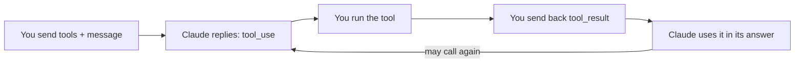

import Tabs from '@theme/Tabs';
import TabItem from '@theme/TabItem';

<LevelBadge level="intermediate" />

<VerifyNote lastVerified="2026-06-20" source="https://platform.claude.com/docs/en/docs/build-with-claude/tool-use">
टूल-उपयोग अनुरोध/प्रतिक्रिया संरचनाएँ स्थिर हैं लेकिन विकसित होती रहती हैं — फ़ील्ड्स की पुष्टि आधिकारिक टूल-उपयोग दस्तावेज़ों में करें।
</VerifyNote>

**टूल उपयोग** Claude को *आपके* द्वारा परिभाषित फ़ंक्शन कॉल करने देता है — खोज, एक कैलकुलेटर, आपका डेटाबेस, कोई भी API — और परिणामों का उपयोग करने देता है। यह हर [एजेंट](/docs/api/building-agents) की नींव है।

<Callout type="objectives" items={["चार-चरणीय एजेंटिक लूप कैसे काम करता है, टूल परिभाषाओं से लेकर अंतिम जवाब तक","Python में किसी टूल को नाम, विवरण और JSON-स्कीमा इनपुट के साथ कैसे परिभाषित करें","टूल विवरण प्रॉम्प्ट की तरह क्यों काम करते हैं जो आकार देते हैं कि Claude उन्हें कब और कैसे कॉल करता है","इनपुट को कैसे सत्यापित करें, त्रुटियों को परिणाम के रूप में कैसे लौटाएँ, और सर्वर-साइड टूल का सुरक्षित रूप से उपयोग कैसे करें"]} />

## लूप

टूल उपयोग एक बातचीत है, एकल कॉल नहीं। आप Claude को टूल का एक मेन्यू सौंपते हैं; Claude एक चुनता है और रुक जाता है; आप उसे चलाते हैं और वापस रिपोर्ट करते हैं; Claude परिणाम को अपने जवाब में समाहित कर लेता है — आवश्यकतानुसार इसे दोहराते हुए।

<Steps items={[{title: "मेन्यू भेजें", body: "आप टूल परिभाषाओं की एक सूची शामिल करते हैं — प्रत्येक में एक नाम, एक विवरण, और एक JSON-स्कीमा इनपुट होता है।"}, {title: "Claude एक टूल चुनता है", body: "यदि Claude किसी एक का उपयोग करने का निर्णय लेता है, तो यह तर्कों के साथ एक tool_use ब्लॉक लौटाता है और रुक जाता है।"}, {title: "आप निष्पादित करते हैं", body: "आप स्वयं टूल चलाते हैं और आउटपुट को एक tool_result के रूप में वापस भेजते हैं।"}, {title: "Claude जारी रखता है", body: "Claude जारी रखता है, संभवतः और टूल कॉल करते हुए, जब तक यह जवाब न दे दे।"}]} />

## एक टूल परिभाषित करना (Python)

एक टूल परिभाषा बस एक नाम, एक सादा-भाषा विवरण, और इनपुट के लिए एक JSON-स्कीमा है। इसे `tools` में पास करें, फिर यह जानने के लिए `stop_reason` जाँचें कि Claude कब कार्य करना चाहता है।

<PromptCard title="get_weather टूल + पहली कॉल">{`tools = [{
    "name": "get_weather",
    "description": "Get current weather for a city.",
    "input_schema": {
        "type": "object",
        "properties": {"city": {"type": "string"}},
        "required": ["city"],
    },
}]

msg = client.messages.create(
    model="claude-sonnet-4-6", max_tokens=1024,
    tools=tools,
    messages=[{"role": "user", "content": "What's the weather in Rome?"}],
)
# If msg.stop_reason == "tool_use": run the tool, then send a tool_result back.`}</PromptCard>

## टिप्स

आप टूल को कैसे परिभाषित और संभालते हैं, इसमें किए गए छोटे चुनाव विश्वसनीयता में बड़ा अंतर पैदा करते हैं।

- **विवरण प्रॉम्प्ट होते हैं।** एक स्पष्ट टूल `description` और पैरामीटर दस्तावेज़ इस बात को बहुत बेहतर बनाते हैं कि Claude इसे कब/कैसे कॉल करता है।
- निष्पादित करने से पहले प्राप्त किए गए **इनपुट को सत्यापित करें** — कभी उन पर आँख मूँदकर भरोसा न करें।
- **त्रुटियों को परिणाम के रूप में लौटाएँ।** यदि कोई टूल विफल होता है, तो त्रुटि का वर्णन करता एक `tool_result` भेजें ताकि Claude उबर सके।
- **सर्वर-साइड टूल।** Anthropic बिल्ट-इन टूल भी प्रदान करता है (उदा. वेब सर्च, कोड एक्ज़ीक्यूशन, कंप्यूटर उपयोग) — मौजूदा मेन्यू के लिए दस्तावेज़ जाँचें।

:::warning टूल = क्रियाएँ = जोखिम
एक टूल जो वास्तविक क्रियाएँ करता है, एक सुरक्षा मॉडल विरासत में पाता है। न्यूनतम विशेषाधिकार लागू करें और जोखिमपूर्ण कॉल्स के लिए एक मानव को लूप में रखें — देखें [एजेंट और टूल सुरक्षित करना](/docs/security/securing-agents)।
:::

<Flashcards title="टूल-उपयोग शब्दावली" cards={[{front: "tool_use ब्लॉक", back: "जब Claude किसी टूल को कॉल करने का निर्णय लेता है तो यही लौटाता है — तर्कों सहित — जिसके बाद यह रुक जाता है और आपका इंतज़ार करता है।"}, {front: "tool_result", back: "वह संदेश जो आप वापस भेजते हैं, जिसमें टूल का आउटपुट (या एक त्रुटि का वर्णन ताकि Claude उबर सके) होता है।"}, {front: "input_schema", back: "किसी टूल के इनपुट का वर्णन करता JSON-स्कीमा: प्रकार, गुण, और कौन-से फ़ील्ड आवश्यक हैं।"}, {front: "सर्वर-साइड टूल", back: "Anthropic द्वारा प्रदान किए जाने वाले बिल्ट-इन टूल, उदा. वेब सर्च, कोड एक्ज़ीक्यूशन, कंप्यूटर उपयोग — मौजूदा मेन्यू के लिए दस्तावेज़ जाँचें।"}]} />

<Quiz title="स्वयं को परखें" questions={[{q: "Claude द्वारा एक tool_use ब्लॉक लौटाने के बाद, टूल को कौन चलाता है?", options: ["Claude इसे Anthropic के सर्वर पर स्वचालित रूप से चलाता है", "आप इसे निष्पादित करते हैं और आउटपुट को एक tool_result के रूप में वापस भेजते हैं", "JSON-स्कीमा इसे निष्पादित करता है"], answer: 1, explain: "Claude एक tool_use ब्लॉक लौटाता है और रुक जाता है; आप टूल को निष्पादित करते हैं और परिणाम को एक tool_result के रूप में वापस भेजते हैं।"}, {q: "आपके द्वारा परिभाषित कोई टूल रनटाइम पर विफल हो जाता है। अनुशंसित कदम क्या है?", options: ["सफल होने तक चुपचाप पुनः प्रयास करें", "एक tool_result भेजें जो त्रुटि का वर्णन करे ताकि Claude उबर सके", "बातचीत रोक दें"], answer: 1, explain: "त्रुटियों को परिणाम के रूप में लौटाएँ — विफलता का वर्णन करता एक tool_result Claude को उबरने देता है।"}, {q: "एक स्पष्ट टूल विवरण इतना अधिक मायने क्यों रखता है?", options: ["यह केवल दस्तावेज़ीकरण के लिए है और Claude इसे अनदेखा कर देता है", "विवरण प्रॉम्प्ट होते हैं — वे आकार देते हैं कि Claude टूल को कब और कैसे कॉल करता है", "यह JSON-स्कीमा सत्यापन नियमों को बदल देता है"], answer: 1, explain: "विवरण प्रॉम्प्ट होते हैं: एक स्पष्ट विवरण और पैरामीटर दस्तावेज़ इस बात को बहुत बेहतर बनाते हैं कि Claude किसी टूल को कब और कैसे कॉल करता है।"}]} />

<Callout type="takeaways" items={["टूल उपयोग एक लूप है: टूल परिभाषाएँ भेजें, Claude एक tool_use ब्लॉक लौटाता है और रुक जाता है, आप निष्पादित करते हैं और एक tool_result लौटाते हैं, Claude तब तक जारी रखता है जब तक यह जवाब न दे दे।","एक टूल परिभाषा एक नाम, एक विवरण, और एक JSON-स्कीमा इनपुट है — इसे tools में पास करें और stop_reason == tool_use जाँचें।","विवरण प्रॉम्प्ट होते हैं; निष्पादित करने से पहले इनपुट सत्यापित करें; विफलताओं को tool_result त्रुटियों के रूप में लौटाएँ ताकि Claude उबर सके।","Anthropic सर्वर-साइड टूल भी प्रदान करता है, और कोई भी टूल जो वास्तविक क्रियाएँ करता है उसे न्यूनतम विशेषाधिकार के साथ-साथ एक मानव को लूप में रखने की आवश्यकता होती है।"]} />

## आगे

- [API पर एजेंट बनाना](/docs/api/building-agents)
- [स्ट्रक्चर्ड आउटपुट](/docs/api/structured-output)
- [MCP और टूल से जुड़ना](/docs/api/mcp)
