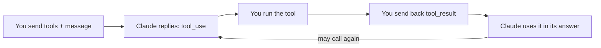

<LevelBadge level="intermediate" />

**टूल उपयोग** Claude को *आपके* द्वारा परिभाषित फ़ंक्शन कॉल करने देता है — खोज, एक कैलकुलेटर, आपका डेटाबेस, कोई भी API — और परिणामों का उपयोग करने देता है। यह हर [एजेंट](/docs/api/building-agents) की नींव है।

ज़्यादातर टूल-उपयोग ट्यूटोरियल चार-चरणीय लूप के बाद रुक जाते हैं। लूप आसान हिस्सा है। प्रोडक्शन इंटीग्रेशन को वास्तव में जो तोड़ता है वह उससे संकीर्ण है और उस पर कम चर्चा होती है: वे संदेश-संरचनाएँ जो `400` लौटाती हैं, वह त्रुटि फ़ील्ड जो Claude को माफ़ी माँगने के बजाय उबरने देता है, और यह तथ्य कि **नवीनतम Claude मॉडलों पर टूल कॉल को बाध्य करना अब काम नहीं करता**। यह पेज इन सबको कवर करता है।

<Callout type="objectives" items={["चार-चरणीय एजेंटिक लूप कैसे काम करता है, टूल परिभाषाओं से लेकर अंतिम जवाब तक","टूल परिभाषा कैसे लिखें — और ऐसे विवरण जो वास्तव में दिशा देते हैं कि Claude उसे कब कॉल करता है","वे तीन संदेश-संरचना नियम जो 400 लौटाते हैं, और वह त्रुटि संदेश जो बताता है कि आपने कौन-सा तोड़ा","नवीनतम मॉडलों पर tool_choice \"any\" और \"tool\" अब क्यों विफल होते हैं, और उनके दो विकल्प","strict: true के साथ स्कीमा-मान्य टूल इनपुट की गारंटी कैसे दें","टूल परिणाम ही वह जगह क्यों हैं जहाँ से किसी प्रॉम्प्ट इंजेक्शन के आपके एजेंट तक पहुँचने की सबसे अधिक संभावना है"]} />

<VerifyNote lastVerified="2026-09-29" source="https://platform.claude.com/docs/en/agents-and-tools/tool-use/define-tools">
टूल परिभाषा फ़ील्ड्स, `tool_choice` सपोर्ट मैट्रिक्स, `tool_result` फ़ॉर्मैटिंग नियम, `is_error`
व्यवहार और `strict: true` सिमैंटिक्स की पुष्टि 29 सितंबर 2026 को Anthropic के "Define
tools", "Handle tool calls" और "Strict tool use" पेजों के विरुद्ध की गई। बाध्य टूल उपयोग के लिए मॉडल सपोर्ट
हर रिलीज़ के साथ बदलता है — उस पर भरोसा करने से पहले Define tools पेज पर सपोर्ट मैट्रिक्स दोबारा जाँचें, और
मौजूदा लाइनअप के लिए [मौजूदा मॉडल और मूल्य निर्धारण](/docs/whats-new/models-and-pricing) देखें।
</VerifyNote>

## लूप

टूल उपयोग एक बातचीत है, एकल कॉल नहीं। आप Claude को टूल का एक मेन्यू सौंपते हैं; Claude एक चुनता है और रुक जाता है; आप उसे चलाते हैं और वापस रिपोर्ट करते हैं; Claude परिणाम को अपने जवाब में समाहित कर लेता है — आवश्यकतानुसार इसे दोहराते हुए।


```mermaid
flowchart LR
  A[You send tools + message] --> B[Claude replies: tool_use]
  B --> C[You run the tool]
  C --> D[You send back tool_result]
  D --> E[Claude uses it in its answer]
  E -->|may call again| B
```

<Steps items={[{title: "मेन्यू भेजें", body: "आप टूल परिभाषाओं की एक सूची शामिल करते हैं — प्रत्येक में एक नाम, एक विवरण, और एक JSON-स्कीमा इनपुट होता है।"}, {title: "Claude एक टूल चुनता है", body: "यदि Claude किसी एक का उपयोग करने का निर्णय लेता है, तो प्रतिक्रिया stop_reason \"tool_use\" और एक या अधिक tool_use ब्लॉक्स के साथ वापस आती है, जिनमें से प्रत्येक एक id, एक name, और एक input ऑब्जेक्ट लिए होता है।"}, {title: "आप निष्पादित करते हैं", body: "आप स्वयं टूल चलाते हैं और आउटपुट को एक ऐसे tool_result के रूप में वापस भेजते हैं जो tool_use id का संदर्भ देता है।"}, {title: "Claude जारी रखता है", body: "Claude जारी रखता है, संभवतः और टूल कॉल करते हुए, जब तक यह एक सामान्य stop_reason के साथ जवाब न दे दे।"}]} />

चरण 2 में बहुवचन पर ध्यान दें: Claude **एक ही प्रतिक्रिया में कई `tool_use` ब्लॉक्स** लौटा सकता है। `content[0]` मान लेने के बजाय प्रत्येक ब्लॉक के `type` फ़ील्ड पर डिस्पैच करें — एक प्रतिक्रिया आमतौर पर एक `text` ब्लॉक से शुरू होती है, और नवीनतम मॉडलों पर यह इसके बजाय `thinking` ब्लॉक्स से शुरू हो सकती है।

## एक टूल परिभाषित करना

एक टूल परिभाषा एक नाम, एक सादा-भाषा विवरण, और इनपुट के लिए एक JSON Schema है।

| फ़ील्ड | आवश्यक | टिप्पणियाँ |
| --- | --- | --- |
| `name` | हाँ | रेगेक्स `^[a-zA-Z0-9_-]{1,128}$` से मेल खाना चाहिए |
| `description` | हाँ | यह क्या करता है, कब इसका उपयोग करें, कब *नहीं*। कम से कम 3–4 वाक्यों का लक्ष्य रखें |
| `input_schema` | हाँ | पैरामीटर्स का वर्णन करता एक JSON Schema ऑब्जेक्ट |
| `input_examples` | नहीं | उदाहरण इनपुट ऑब्जेक्ट्स का एक ऐरे, प्रत्येक स्कीमा के विरुद्ध मान्य |
| `strict` | नहीं | स्कीमा-मान्य इनपुट बाध्य करने के लिए `true` सेट करें — नीचे देखें |
| `cache_control` | नहीं | परिभाषा को टर्न्स के बीच कैश करें (देखें [प्रॉम्प्ट कैशिंग](/docs/api/prompt-caching)) |

<PromptCard title="get_weather टूल + पहली कॉल (Python)">{`tools = [{
    "name": "get_weather",
    "description": (
        "Get the current weather for a city. Use this when the user asks about "
        "present conditions or temperature in a named place. Returns temperature "
        "in the requested unit plus a one-word sky condition. It does NOT return "
        "forecasts — use get_forecast for anything in the future."
    ),
    "input_schema": {
        "type": "object",
        "properties": {
            "city": {"type": "string", "description": "City and region, e.g. 'Rome, IT'"},
            "unit": {"type": "string", "enum": ["celsius", "fahrenheit"]},
        },
        "required": ["city"],
        "additionalProperties": False,
    },
}]

msg = client.messages.create(
    model="claude-opus-5-5", max_tokens=1024,
    tools=tools,
    messages=[{"role": "user", "content": "What's the weather in Rome?"}],
)

if msg.stop_reason == "tool_use":
    for block in msg.content:            # iterate — never index content[0]
        if block.type == "tool_use":
            result = run_tool(block.name, block.input)
            # send back a tool_result carrying block.id`}</PromptCard>

### विवरण प्रॉम्प्ट होते हैं

`description` फ़ील्ड टूल-उपयोग की गुणवत्ता पर कहीं सबसे मज़बूत लीवर है — इसे मॉडल पढ़ता है, आपके साथी नहीं। Anthropic का अपना मार्गदर्शन इस बारे में स्पष्ट है कि एक अच्छे विवरण को क्या अलग बनाता है:

- **बताएँ कि इसका उपयोग कब *नहीं* करना है।** ज़्यादातर गलत चयन यही होते हैं कि किसी टूल को उस काम के लिए कॉल किया जाता है जो किसी पड़ोसी टूल का है।
- **बढ़ाने के बजाय समेकित करें।** `create_pr`, `review_pr`, `merge_pr` के बजाय एक `action` पैरामीटर वाला एक टूल भेजें। कम और व्यापक टूल चयन की अस्पष्टता घटाते हैं।
- **सेवाओं के बीच नेमस्पेस दें।** जैसे ही आपका टूल सरफ़ेस बढ़ता है, `github_list_prs` और `slack_send_message`, `list_prs` और `send_message` से बेहतर साबित होते हैं।
- **उच्च-सिग्नल परिणाम लौटाएँ।** स्थिर, सिमैंटिक आइडेंटिफ़ायर (slugs, UUIDs) और केवल वे फ़ील्ड्स जो Claude को अपना अगला कदम चुनने के लिए चाहिए। फूला हुआ टूल आउटपुट कॉन्टेक्स्ट जलाता है और सिग्नल को दबा देता है।
- **पेचीदा इनपुट के लिए `input_examples` जोड़ें।** स्कीमा-सत्यापित उदाहरण सरल ऑब्जेक्ट्स के लिए प्रत्येक लगभग 20–50 टोकन और जटिल नेस्टेड ऑब्जेक्ट्स के लिए 100–200 टोकन खर्च करते हैं, और एक अमान्य उदाहरण 400 लौटाता है।

## प्रतिक्रिया संभालना: वे तीन नियम जो 400 लौटाते हैं

यहीं काम करता हुआ कोड आमतौर पर टूटता है। एक `tool_result` एक सामान्य `user` संदेश है, लेकिन API तीन प्लेसमेंट नियम लागू करता है।

<Steps items={[{title: "परिणाम अपने tool_use के तुरंत बाद आने चाहिए", body: "असिस्टेंट के tool_use संदेश और आपके tool_result संदेश के बीच कोई संदेश नहीं आ सकता। इसे तोड़ें और API बताता है: tool_use ids were found without tool_result blocks immediately after."}, {title: "content ऐरे में tool_result ब्लॉक्स सबसे पहले आते हैं", body: "आप जो भी टेक्स्ट जोड़ें वह हर tool_result के बाद आना चाहिए। किसी tool_result से पहले एक text ब्लॉक एक 400 है।"}, {title: "यदि कोई सर्वर टूल कॉल अभी अनसुलझी है, तो केवल tool_result ब्लॉक्स भेजें", body: "जब उसी असिस्टेंट टर्न ने एक ऐसा सर्वर टूल भी कॉल किया हो जिसका अभी कोई परिणाम नहीं है, तो अंत में टेक्स्ट जोड़ना टर्न को समय से पहले समाप्त कर देता है और अनुरोध एक ऐसे 400 के साथ विफल होता है जो अनसुलझे सर्वर टूल का नाम बताता है।"}]} />

```json
// ❌ 400 — text before tool_result
{"role": "user", "content": [
  {"type": "text", "text": "Here are the results:"},
  {"type": "tool_result", "tool_use_id": "toolu_01", "content": "15 degrees"}
]}

// ✅ correct — results first, text after (client tools only)
{"role": "user", "content": [
  {"type": "tool_result", "tool_use_id": "toolu_01", "content": "15 degrees"},
  {"type": "text", "text": "What should I do next?"}
]}
```

एक `tool_result` का `content` एक सादा स्ट्रिंग हो सकता है, या `text`, `image`, `document`, या `search_result` ब्लॉक्स की एक सूची। जो टूल कुछ नहीं लौटाता, उसके लिए इसे पूरी तरह छोड़ा भी जा सकता है।

### विफलताओं को परिणाम के रूप में लौटाएँ, अपवाद के रूप में नहीं

जब कोई टूल अपवाद फेंकता है, तो लूप को रद्द न करें — विफलता को `is_error` के साथ वापस सौंपें:

```json
{"role": "user", "content": [{
  "type": "tool_result",
  "tool_use_id": "toolu_01A09q90qw90lq917835lq9",
  "content": "Rate limit exceeded. Retry after 60 seconds.",
  "is_error": true
}]}
```

संदेश उस पाठक के लिए लिखें जिसे यह तय करना है कि आगे क्या करना है। `"failed"` Claude को कुछ नहीं बताता; `"Rate limit exceeded. Retry after 60 seconds."` उसे तुरंत पुनः प्रयास करने के बजाय इंतज़ार करने को कहता है। जब कोई टूल कॉल अमान्य हो या उसमें कोई पैरामीटर अनुपस्थित हो, तो Claude आमतौर पर हार मानकर उपयोगकर्ता से माफ़ी माँगने से पहले सुधारों के साथ दो से तीन बार पुनः प्रयास करता है — इसलिए एक निर्देशात्मक त्रुटि अक्सर उबरने और एक मृत अंत के बीच का अंतर होती है।

## स्कीमा-मान्य इनपुट की गारंटी: `strict: true`

किसी टूल परिभाषा पर `strict: true` सेट करना मॉडल की टोकन सैंपलिंग को स्कीमा-मान्य आउटपुट तक सीमित कर देता है (ग्रामर-कंस्ट्रेन्ड सैंपलिंग)। तब प्रत्येक `tool_use` ब्लॉक का `input` प्रमाणित रूप से आपके `input_schema` से मेल खाता है, और `name` हमेशा एक वास्तविक टूल होता है — जहाँ आपको `2` चाहिए था वहाँ `"2"` नहीं, कोई अनुपस्थित आवश्यक फ़ील्ड नहीं, कोई सत्यापित-करें-और-पुनः-प्रयास-करें लेयर नहीं।

<PromptCard title="सख़्त टूल परिभाषा">{`{
  "name": "search_flights",
  "description": "Search bookable flights for a route and date.",
  "strict": true,
  "input_schema": {
    "type": "object",
    "properties": {
      "destination": {"type": "string"},
      "departure_date": {"type": "string", "format": "date"},
      "passengers": {"type": "integer", "enum": [1, 2, 3, 4, 5, 6]}
    },
    "required": ["destination", "departure_date"],
    "additionalProperties": false
  }
}`}</PromptCard>

इसे हर जगह चालू करने से पहले जानने योग्य तीन चेतावनियाँ:

- स्कीमा को समर्थित JSON Schema सबसेट के भीतर रहना चाहिए — वही जो [स्ट्रक्चर्ड आउटपुट](/docs/api/structured-output) उपयोग करता है।
- कंप्यूटर उपयोग और ब्राउज़र उपयोग की **toolset** एंट्रीज़ `strict: true` को अस्वीकार करती हैं; ऐसा अनुरोध जो इनमें से किसी पर भी इसे सेट करता है, अस्वीकार कर दिया जाता है।
- संकलित स्कीमा संदेश सामग्री से अलग 24 घंटे तक कैश किए जाते हैं। Anthropic का मार्गदर्शन स्पष्ट है: **स्कीमा में संरक्षित स्वास्थ्य जानकारी न डालें** — न प्रॉपर्टी नामों में, न `enum` मानों में, न `const` मानों में, और न `pattern` रेगेक्स में। PHI की जगह संदेश सामग्री है, जिसमें वे HIPAA सुरक्षा उपाय लागू होते हैं जो कैश किए गए स्कीमा पर नहीं होते।

## `tool_choice` — और टूल को बाध्य करना अब क्यों विफल होता है

`tool_choice` यह नियंत्रित करता है कि Claude कोई टूल कॉल *कर सकता है*, *करना ही चाहिए*, या *नहीं कर सकता*। यह चार मान लेता है:

| मान | अर्थ |
| --- | --- |
| `auto` | Claude तय करता है। जब भी `tools` मौजूद हो, यही डिफ़ॉल्ट है |
| `any` | Claude को आपके किसी एक टूल को कॉल करना ही चाहिए, लेकिन कौन-सा, यह वह चुनता है |
| `tool` | Claude को नामित टूल कॉल करना ही चाहिए |
| `none` | Claude कोई भी टूल कॉल नहीं कर सकता। जब कोई `tools` मौजूद न हो, यही डिफ़ॉल्ट है |

यहाँ वह हिस्सा है जो बाकी हर टूल-उपयोग गाइड में अभी गायब है। **`any` और `tool` सार्वभौमिक रूप से समर्थित नहीं हैं, और नवीनतम मॉडलों पर ये एक 400 लौटाते हैं।**

| मॉडल या सेटिंग | प्रतिबंध | इसके बजाय उपयोग करें |
| --- | --- | --- |
| मैनुअल एक्सटेंडेड थिंकिंग (`thinking` टाइप `enabled`) | `any` और `tool` त्रुटि देते हैं | `auto` या `none`। अडैप्टिव थिंकिंग अपने आप में बाध्य टूल उपयोग को ब्लॉक *नहीं* करती |
| Claude Opus 5.5, Sonnet 5.5, Fable 5.1, Mythos 5.1 | थिंकिंग सेटिंग्स की परवाह किए बिना `any` और `tool` एक 400 लौटाते हैं | `auto` के साथ `strict: true`, या [स्ट्रक्चर्ड आउटपुट](/docs/api/structured-output)। `none` अभी भी काम करता है |

त्रुटि स्पष्ट है:

```text
tool_choice: type "tool" and "any" are not supported for this model.
```

यही सत्यापन टोकन-काउंटिंग एंडपॉइंट पर भी लागू होता है, इसलिए जो अनुरोध टोकन काउंटिंग पास कर लेता है वह बाद में आपको चौंकाएगा नहीं।

### इसके बजाय क्या करें

दोनों प्रेरणाओं को अलग-अलग कर देने से माइग्रेशन स्पष्ट हो जाता है, क्योंकि बाध्य टूल उपयोग दो असंबंधित काम कर रहा था:

- **"मुझे स्कीमा-मान्य JSON चाहिए।"** यह असल में कभी कॉल बाध्य करने के बारे में नहीं था। `tool_choice` को `auto` पर रखें और `strict: true` सेट करें, या यदि आप कॉल के बजाय एक प्रतिक्रिया चाहते हैं तो स्कीमा को [स्ट्रक्चर्ड आउटपुट](/docs/api/structured-output) पर ले जाएँ।
- **"मुझे चाहिए कि यह टूल कॉल करे, मुझसे बातें न करे।"** प्रॉम्प्ट में ऐसा ही कहें। टूल कब लागू होता है यह बताना — "मौजूदा स्थितियों के बारे में किसी भी सवाल के लिए `get_weather` का उपयोग करें" — अभी भी यह दिशा देता है कि `auto` कौन-सा टूल चुनता है।

बाध्य टूल उपयोग छोड़ने में एक बोनस है: `any` और `tool` असिस्टेंट संदेश को प्रीफ़िल करके काम करते थे, जो `tool_use` ब्लॉक्स से पहले किसी भी प्राकृतिक-भाषा प्रस्तावना को दबा देता था। `auto` के तहत, Claude समझा सकता है कि वह क्या करने जा रहा है — और उपयोगकर्ता-सामने वाले एजेंट में आमतौर पर आप यही चाहते हैं।

:::tip कैशिंग का पेच
बातचीत के बीच `tool_choice` बदलना **कैश किए गए संदेश ब्लॉक्स को अमान्य कर देता है**। टूल परिभाषाएँ और सिस्टम प्रॉम्प्ट कैश में बने रहते हैं, लेकिन संदेश सामग्री को दोबारा प्रोसेस करना पड़ता है। यदि आप हर टर्न पर `tool_choice` टॉगल कर रहे थे, तो वह चुपचाप आपको महँगा पड़ रहा था — देखें [प्रॉम्प्ट कैशिंग](/docs/api/prompt-caching)।
:::

## क्लाइंट टूल बनाम सर्वर टूल

हर टूल को आपके कोडबेस में एक हैंडलर की ज़रूरत नहीं होती।

- **क्लाइंट टूल** — आपके। आप स्कीमा परिभाषित करते हैं, आप निष्पादित करते हैं, आप एक `tool_result` लौटाते हैं। ऊपर दिया गया लूप।
- **Anthropic-स्कीमा क्लाइंट टूल** — bash, टेक्स्ट एडिटर, मेमोरी। स्कीमा पहले से निर्धारित है, लेकिन इन्हें निष्पादित अब भी *आपका* ऐप करता है।
- **सर्वर टूल** — वेब सर्च, वेब फ़ेच, कोड एक्ज़ीक्यूशन, टूल सर्च। ये Anthropic के इंफ़्रास्ट्रक्चर पर चलते हैं, आपकी तरफ़ कोई हैंडलर कोड नहीं होता, और त्रुटियाँ पारदर्शी रूप से संभाली जाती हैं: किसी सर्वर टूल के लिए आप कभी `is_error` नहीं लौटाते।
- **क्लाइंट टूलसेट** — कंप्यूटर उपयोग और ब्राउज़र उपयोग एक ही एंट्री हैं जिसमें कोई `name` नहीं होता और जो सदस्य टूल का एक निश्चित सेट घोषित करती है। इनके `tool_use` ब्लॉक्स एक अतिरिक्त `toolset_name` फ़ील्ड लिए होते हैं (`"computer"` या `"browser"`), और `name` वह सदस्य होता है जिसे कॉल किया जा रहा है, जैसे `screenshot` या `navigate`। **दोनों फ़ील्ड्स पर डिस्पैच करें**, और परिणाम पर `toolset_name` वापस भेजें — ऐसा सदस्य परिणाम जो इसे छोड़ देता है, अस्वीकार कर दिया जाता है।

## सामान्य गलतियाँ

- **`content[0]` को इंडेक्स करना** — इटरेट करके `type` पर स्विच करने के बजाय। प्रतिक्रियाएँ आम तौर पर एक `text` ब्लॉक से शुरू होती हैं, और नवीनतम मॉडलों पर `thinking` ब्लॉक्स से।
- **प्रति प्रतिक्रिया केवल एक `tool_use` संभालना।** Claude एक टर्न में कई टूल कॉल कर सकता है; ऐसा लूप जो पहले का जवाब देकर बाकी को छोड़ देता है, `tool_use` ids को परिणामों के बिना छोड़ देता है, जो अगले अनुरोध पर एक 400 है।
- **अपनी टिप्पणी परिणामों से पहले रखना।** `tool_result` ब्लॉक्स हमेशा सबसे पहले आते हैं।
- **टूल अपवादों को निगल जाना।** आपके हैंडलर में एक अपवाद लूप समाप्त कर देता है; एक `is_error` परिणाम Claude को अनुकूल होने देता है।
- **आदतन `tool_choice: "any"` की तरफ़ हाथ बढ़ाना।** मौजूदा फ़्लैगशिप मॉडलों पर यह एक 400 है — और वैसे भी `strict: true` बेहतर जवाब था।
- **टूल आउटपुट को भरोसेमंद मानना।** नीचे देखें।

:::warning टूल परिणाम आपके एजेंट का सबसे बड़ा इंजेक्शन सरफ़ेस हैं
टूल परिणाम नियमित रूप से ऐसी सामग्री लिए होते हैं जिस पर आपका नियंत्रण नहीं है: वेब पेज, आने वाले ईमेल, उपयोगकर्ता अपलोड, तीसरे-पक्ष के API। जो हमलावर इनमें से किसी को भी प्रभावित कर सकता है, वह आपके मॉडल पर निशाना साधे निर्देश अंतर्निहित कर सकता है — अप्रत्यक्ष प्रॉम्प्ट इंजेक्शन। अविश्वसनीय सामग्री को **`tool_result` ब्लॉक्स के भीतर** रखें, उसे कभी `system` प्रॉम्प्ट या किसी सादे उपयोगकर्ता `text` ब्लॉक में न जोड़ें, और [प्रॉम्प्ट इंजेक्शन](/docs/security/prompt-injection) तथा [एजेंट और टूल सुरक्षित करना](/docs/security/securing-agents) पढ़ें। ऐसा टूल जो वास्तविक क्रियाएँ करता है, एक सुरक्षा मॉडल भी विरासत में पाता है: न्यूनतम विशेषाधिकार, और किसी भी अपरिवर्तनीय चीज़ के लिए लूप में एक मानव।
:::

<Flashcards title="टूल-उपयोग शब्दावली" cards={[{front: "tool_use ब्लॉक", back: "जब Claude किसी टूल को कॉल करने का निर्णय लेता है तो यही लौटाता है — इसमें id, name और input होते हैं — जिसके बाद यह रुक जाता है और आपका इंतज़ार करता है। एक प्रतिक्रिया में कई हो सकते हैं।"}, {front: "tool_result", back: "एक उपयोगकर्ता-संदेश ब्लॉक जो किसी टूल का आउटपुट लिए होता है, tool_use id से जुड़ा हुआ। यह content ऐरे में सबसे पहले आना चाहिए, असिस्टेंट के tool_use संदेश के तुरंत बाद।"}, {front: "is_error", back: "tool_result पर एक वैकल्पिक बूलियन जो कॉल को विफल चिह्नित करता है। Claude संदेश पढ़ता है और अनुकूल होता है — आमतौर पर माफ़ी माँगने से पहले दो से तीन बार पुनः प्रयास करता है।"}, {front: "strict: true", back: "किसी टूल परिभाषा पर ग्रामर-कंस्ट्रेन्ड सैंपलिंग: टूल इनपुट प्रमाणित रूप से आपके input_schema से मेल खाता है। इसके लिए additionalProperties false आवश्यक है; कंप्यूटर/ब्राउज़र toolset एंट्रीज़ पर अस्वीकार किया जाता है; PHI को स्कीमा से बाहर रखें।"}, {front: "tool_choice", back: "auto | any | tool | none। tools मौजूद होने पर auto डिफ़ॉल्ट है, न होने पर none। Opus 5.5, Sonnet 5.5, Fable 5.1 और Mythos 5.1 पर any और tool एक 400 लौटाते हैं।"}, {front: "toolset_name", back: "कंप्यूटर उपयोग और ब्राउज़र उपयोग के सदस्य ब्लॉक्स पर एक अतिरिक्त फ़ील्ड (\"computer\" या \"browser\")। name के साथ-साथ इस पर डिस्पैच करें, और परिणाम पर इसे वापस भेजें, वरना परिणाम अस्वीकार कर दिया जाता है।"}]} />

<Quiz title="स्वयं को परखें" questions={[{q: "आप claude-opus-5-5 पर tool_choice को {\"type\": \"tool\", \"name\": \"get_weather\"} सेट करते हैं। क्या होता है?", options: ["Claude को get_weather कॉल करने के लिए बाध्य किया जाता है", "अनुरोध एक 400 लौटाता है — उस मॉडल पर बाध्य टूल उपयोग समर्थित नहीं है", "Claude tool_choice को अनदेखा करता है और टेक्स्ट में जवाब देता है"], answer: 1, explain: "Opus 5.5, Sonnet 5.5, Fable 5.1 और Mythos 5.1 पर, थिंकिंग सेटिंग्स की परवाह किए बिना tool_choice टाइप \"any\" और \"tool\" एक 400 लौटाते हैं। strict: true के साथ auto का उपयोग करें, या स्ट्रक्चर्ड आउटपुट।"}, {q: "आपके उपयोगकर्ता संदेश में परिणामों को समझाता एक text ब्लॉक है, जिसके बाद दो tool_result ब्लॉक्स हैं। API क्या करता है?", options: ["इसे स्वीकार करता है — क्रम से फ़र्क नहीं पड़ता", "एक 400 लौटाता है: tool_result ब्लॉक्स पहले आने चाहिए, टेक्स्ट बाद में", "चुपचाप text ब्लॉक को हटा देता है"], answer: 1, explain: "tool_result ब्लॉक्स को content ऐरे में सबसे पहले आना चाहिए; कोई भी टेक्स्ट उन सभी के बाद आना चाहिए।"}, {q: "आपके द्वारा परिभाषित कोई टूल रनटाइम पर एक कनेक्शन त्रुटि फेंकता है। अनुशंसित कदम क्या है?", options: ["अपवाद उठाएँ और बातचीत समाप्त कर दें", "सफल होने तक चुपचाप पुनः प्रयास करें", "is_error true और एक निर्देशात्मक संदेश जैसे 'Rate limit exceeded. Retry after 60 seconds.' के साथ एक tool_result भेजें"], answer: 2, explain: "विफलता को is_error true के साथ एक tool_result के रूप में लौटाएँ। एक निर्देशात्मक संदेश Claude को बताता है कि आगे क्या करना है; एक सामान्य 'failed' उसे कुछ नहीं बताता।"}, {q: "अविश्वसनीय वेब सामग्री को सिस्टम प्रॉम्प्ट में चिपकाने के बजाय एक tool_result ब्लॉक के भीतर क्यों रहना चाहिए?", options: ["tool_result ब्लॉक्स टोकन में सस्ते होते हैं", "यह अप्रत्यक्ष प्रॉम्प्ट इंजेक्शन को सीमित करता है — tool_result में सामग्री डेटा के रूप में फ़्रेम होती है, निर्देशों के रूप में नहीं", "सिस्टम प्रॉम्प्ट की एक लंबाई सीमा होती है"], answer: 1, explain: "टूल परिणाम ऐसी सामग्री लिए होते हैं जिस पर आपका नियंत्रण नहीं है। उसे सिस्टम प्रॉम्प्ट या सादे उपयोगकर्ता टेक्स्ट के बजाय tool_result ब्लॉक्स में रखना अप्रत्यक्ष प्रॉम्प्ट इंजेक्शन के लिए Anthropic की अनुशंसित रोकथाम है।"}]} />

<Callout type="takeaways" items={["टूल उपयोग एक लूप है: टूल परिभाषाएँ भेजें, Claude एक या अधिक tool_use ब्लॉक्स लौटाता है और रुक जाता है, आप निष्पादित करते हैं और tool_results लौटाते हैं, Claude जारी रखता है। कॉन्टेंट ब्लॉक्स पर type के अनुसार इटरेट करें — कभी content[0] को इंडेक्स न करें।","तीन प्लेसमेंट नियम ज़्यादातर 400 की वजह बनते हैं: परिणाम अपने tool_use के तुरंत बाद आने चाहिए, content ऐरे में tool_result ब्लॉक्स सबसे पहले आते हैं, और एक अनसुलझी सर्वर टूल कॉल का मतलब है केवल-परिणाम।","नवीनतम मॉडलों पर बाध्य टूल उपयोग खत्म हो गया है: Opus 5.5, Sonnet 5.5, Fable 5.1 और Mythos 5.1 पर tool_choice \"any\" और \"tool\" एक 400 लौटाते हैं। strict: true के साथ auto, या स्ट्रक्चर्ड आउटपुट का उपयोग करें, और टूल चयन को प्रॉम्प्ट से दिशा दें।","strict: true ग्रामर-कंस्ट्रेन्ड सैंपलिंग के ज़रिए स्कीमा-मान्य इनपुट की गारंटी देता है — लेकिन PHI को स्कीमा से बाहर रखें और इसे कंप्यूटर/ब्राउज़र toolset एंट्रीज़ पर सेट न करें।","विफलताओं को is_error और एक निर्देशात्मक संदेश के साथ tool_results के रूप में लौटाएँ ताकि Claude माफ़ी माँगने के बजाय अनुकूल हो सके।","अप्रत्यक्ष प्रॉम्प्ट इंजेक्शन के आपके एजेंट तक पहुँचने का सबसे संभावित रास्ता टूल परिणाम हैं — अविश्वसनीय सामग्री को उनके भीतर रखें, न्यूनतम विशेषाधिकार लागू करें, और अपरिवर्तनीय क्रियाओं को एक मानव पर गेट करें।"]} />

## आगे

- [प्रोग्रामैटिक टूल कॉलिंग](/docs/api/programmatic-tool-calling) — Claude को इन्हीं टूल को एक सैंडबॉक्स के भीतर Python से कॉल करने दें, जिससे राउंड-ट्रिप घटते हैं और मध्यवर्ती परिणाम कॉन्टेक्स्ट से बाहर रहते हैं
- [स्ट्रक्चर्ड आउटपुट](/docs/api/structured-output) — बाध्य-टूल-उपयोग के विकल्प का दूसरा आधा हिस्सा, जब आप कॉल के बजाय एक JSON प्रतिक्रिया चाहते हैं
- [API पर एजेंट बनाना](/docs/api/building-agents) — लूप को एक वास्तविक एजेंट में लपेटें
- [Claude Opus 5.5: फ़ील्ड गाइड](/docs/models/opus-5-5-field-guide) — बाध्य-टूल-उपयोग हटाए जाने के पीछे की पूरी माइग्रेशन कहानी
- [MCP और टूल से जुड़ना](/docs/api/mcp) — टूल खुद परिभाषित करने के बजाय उन्हें एक सर्वर से प्राप्त करें
