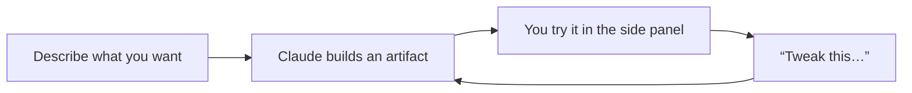

<LevelBadge level="beginner" />

<VerifyNote lastVerified="2026-06-20" source="https://www.anthropic.com">
आर्टिफ़ैक्ट की क्षमताएँ (इंटरैक्टिविटी, स्थायित्व, वे क्या कॉल कर सकते हैं) तेज़ी से विकसित होती हैं — मौजूदा व्यवहार की पुष्टि ऐप/हेल्प सेंटर में करें।
</VerifyNote>

**आर्टिफ़ैक्ट्स** वे आउटपुट हैं जिन्हें Claude चैट के बगल में एक **साइड पैनल** में रेंडर करता है — एक डॉक्युमेंट, एक चार्ट, एक चलता हुआ ऐप, एक डायग्राम — जिसे आप देख सकते हैं, उपयोग कर सकते हैं और बातचीत के टेक्स्ट से अलग, उस पर काम कर सकते हैं।

## आप क्या बना सकते हैं

- **मिनी वेब ऐप्स और टूल्स** — एक कैलकुलेटर, एक क्विज़, एक फ़ॉर्म, एक छोटा इंटरैक्टिव डेमो।
- **डॉक्युमेंट** — संरचित लेख जिन्हें आप परिष्कृत और एक्सपोर्ट कर सकते हैं।
- **विज़ुअल** — चार्ट, डायग्राम और सरल डेटा डैशबोर्ड।
- **कोड** जिसे आप पढ़ और चला सकते हैं।

## यह गैर-डेवलपर्स के लिए क्यों शक्तिशाली है

आप कुछ *उपयोगी* बना सकते हैं — "मेरे लिए एक ग्रुप डिनर के लिए टिप कैलकुलेटर बनाओ," "इस CSV से एक डैशबोर्ड" — इसे वर्णित करके, फिर बातचीत में इसे परिष्कृत करके ("एक सर्विस-चार्ज फ़ील्ड जोड़ो," "बटन बड़े करो")। यह **खुद कोड लिखे बिना AI के साथ कुछ बनाने** का सबसे स्पष्ट उदाहरण है।

## आर्टिफ़ैक्ट्स के साथ कैसे काम करें

1. **उस चीज़ के लिए कहें**, विशिष्टताओं के साथ (उद्देश्य, इनपुट, रूप-रंग)।
2. **सरल भाषा में दोहराएँ** — Claude उसी आर्टिफ़ैक्ट को अपडेट करता है।
3. पैनल में **उसका उपयोग करें**; जहाँ समर्थित हो वहाँ **एक्सपोर्ट/शेयर करें**।

## सुझाव

- इनपुट/आउटपुट और दर्शकों के बारे में **ठोस रहें** — अच्छी [प्रॉम्प्टिंग](/docs/prompting/basics) के समान।
- **छोटे-छोटे बदलाव करें।** एक बार में एक बदलाव सही करना आसान होता है।
- महत्वपूर्ण उपयोगों के लिए किसी आर्टिफ़ैक्ट द्वारा गणना किए गए **किसी भी लॉजिक/संख्या की पुष्टि करें** ([हैल्युसिनेशन](/docs/foundations/hallucinations))।

## अगला

- [असली फ़ाइलें बनाना (docx/pptx/xlsx/pdf)](/docs/claude-app/generating-files)
- [Claude.ai के साथ शुरुआत](/docs/claude-app/getting-started)
- [डेटा विश्लेषण प्लेबुक](/docs/playbooks/data-analysis)
