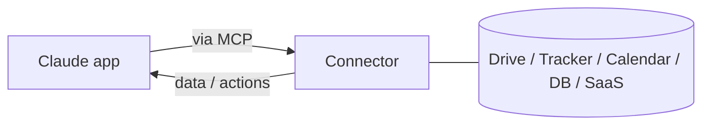

<LevelBadge level="intermediate" />

<VerifyNote lastVerified="2026-06-20" source="https://docs.anthropic.com">
कौन से कनेक्टर मौजूद हैं, और प्लान के अनुसार उपलब्धता, अक्सर बदलती रहती है — मौजूदा विकल्पों की पुष्टि ऐप/हेल्प सेंटर में करें।
</VerifyNote>

**कनेक्टर** Claude ऐप्स को **चैट के बाहर** — आपके टूल्स और डेटा (ड्राइव, इश्यू ट्रैकर, कैलेंडर, डेटाबेस, और बहुत कुछ) — तक पहुँचने देते हैं, ताकि Claude वास्तविक सिस्टम से जवाब दे सके और उन पर कार्रवाई कर सके। पर्दे के पीछे ये ओपन **[Model Context Protocol (MCP)](/docs/claude-code/mcp)** द्वारा संचालित होते हैं।

## वे क्या करते हैं

कनेक्टर के बिना, Claude केवल वही जानता है जो बातचीत में है। एक कनेक्टर के साथ, यह (आपकी अनुमति से) किसी कनेक्टेड सेवा से प्रासंगिक जानकारी निकाल सकता है — जैसे कोई डॉक्युमेंट ढूँढना, हाल के इश्यू पढ़ना, एक कैलेंडर जाँचना — और उसे अपने जवाब में उपयोग कर सकता है।

## वही मानक, हर जगह

कनेक्टर MCP का **ऐप-सामने वाला** रूप हैं। ठीक यही प्रोटोकॉल [Claude Code में MCP](/docs/claude-code/mcp) और [API पर](/docs/api/mcp) को संचालित करता है। अवधारणा एक बार सीखें; यह सभी सतहों पर लागू होती है।

## सेटअप और उपयोग

1. सेवा को **कनेक्ट करें** (जहाँ समर्थित हो वहाँ OAuth के ज़रिए अधिकृत करें)।
2. **न्यूनतम विशेषाधिकार दें** — केवल वही पहुँच जो कार्य को चाहिए।
3. **स्वाभाविक रूप से पूछें** — "मेरा Q3 प्लानिंग डॉक ढूँढो और जोखिमों का सारांश दो।"

## सुरक्षा

:::warning एक कनेक्टर पहुँच + (कभी-कभी) कार्रवाइयाँ है
- केवल उन्हीं सेवाओं और स्कोप को अधिकृत करें जिन पर आप भरोसा करते हैं।
- बाहरी स्रोतों से निकाली गई सामग्री [प्रॉम्प्ट इंजेक्शन](/docs/security/prompt-injection) ले जा सकती है — जब कोई कनेक्टर अविश्वसनीय सामग्री पढ़ता है तो सतर्क रहें।
- किसी थर्ड-पार्टी कनेक्टर को सक्षम करने से पहले समीक्षा करें कि वह क्या कर सकता है ([थर्ड-पार्टी कोड की समीक्षा](/docs/security/reviewing-third-party-code))।
:::

## अगला

- [Claude Code में MCP सर्वर](/docs/claude-code/mcp)
- [MCP और टूल्स से कनेक्ट करना (API)](/docs/api/mcp)
- [आपके मौजूदा टूल्स में AI](/docs/claude-app/ai-in-your-tools)
