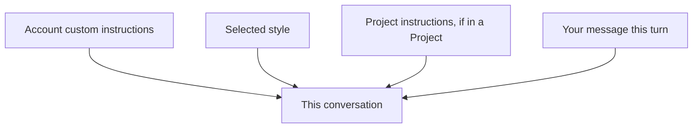

<LevelBadge level="beginner" />

<VerifyNote lastVerified="2026-06-20" source="https://www.anthropic.com">
Claude ऐप्स में कस्टम निर्देशों और स्टाइल के सटीक नाम और स्थान बदलते रहते हैं — ऐप/हेल्प सेंटर में पुष्टि करें।
</VerifyNote>

हर चैट में "संक्षिप्त रहो" या "मैं एक नर्स हूँ, उसके अनुसार समझाओ" दोहराते-दोहराते थक गए? **कस्टम निर्देश** और **स्टाइल** आपको अपनी डिफ़ॉल्ट सेटिंग्स एक बार सेट करने और उन्हें हर जगह लागू करने देते हैं।

## कस्टम निर्देश = आपका व्यक्तिगत सिस्टम प्रॉम्प्ट

स्थायी तथ्य और प्राथमिकताएँ सेट करें — आप कौन हैं, आप क्या करते हैं, आपको जवाब कैसे पसंद हैं — और Claude उन्हें सभी बातचीतों में लागू करता है। यह [सिस्टम प्रॉम्प्ट](/docs/foundations/roles) का कंज़्यूमर-ऐप संस्करण है (और डेवलपर्स के लिए [CLAUDE.md](/docs/claude-code/claude-md) का चचेरा भाई)।

शामिल करने लायक अच्छी चीज़ें:
- **आपके बारे में संदर्भ** ("मैं एक छोटी बेकरी चलाता हूँ"; "मैं Python में कोड करता हूँ")।
- **आउटपुट प्राथमिकताएँ** ("डिफ़ॉल्ट रूप से छोटे बुलेट जवाब दो"; "हमेशा अपना तर्क दिखाओ")।
- **सख्त नियम** ("कभी emoji का उपयोग मत करो"; "मेट्रिक इकाइयाँ")।

## स्टाइल = प्रस्तुति प्रीसेट

**स्टाइल** टोन/फ़ॉर्मेट बदलते हैं (संक्षिप्त, औपचारिक, व्याख्यात्मक, आदि) और प्रति-बातचीत बदले जा सकते हैं। किसी स्टाइल का उपयोग तब करें जब आप *इस चैट के लिए एक अलग आवाज़* चाहते हों, अपने स्थायी निर्देशों को फिर से लिखे बिना।

## वे कैसे एक-दूसरे पर लागू होते हैं

जब कोई टकराव होता है तो अधिक विशिष्ट/बाद वाला संदर्भ जीतता है — इसलिए किसी [प्रोजेक्ट](/docs/claude-app/projects) के निर्देश या आपके संदेश में एक स्पष्ट माँग आपकी ग्लोबल डिफ़ॉल्ट सेटिंग्स को ओवरराइड कर सकती है। आश्चर्य से बचने के लिए इन्हें सुसंगत रखें।

## सुझाव

- **निर्देशों को छोटा और सच्चा रखें** — CLAUDE.md की तरह, फ़ालतू भरमार और पुराने नियम नुकसान पहुँचाते हैं।
- कस्टम निर्देशों में **राज़ न डालें**।
- जैसे-जैसे आपकी ज़रूरतें बदलती हैं, उन्हें कभी-कभी **दोबारा देखें**।

## अगला

- [सिस्टम, यूज़र और असिस्टेंट भूमिकाएँ](/docs/foundations/roles)
- [प्रोजेक्ट्स: स्थायी वर्कस्पेस](/docs/claude-app/projects)
- [CLAUDE.md और मेमोरी फ़ाइलें](/docs/claude-code/claude-md)
