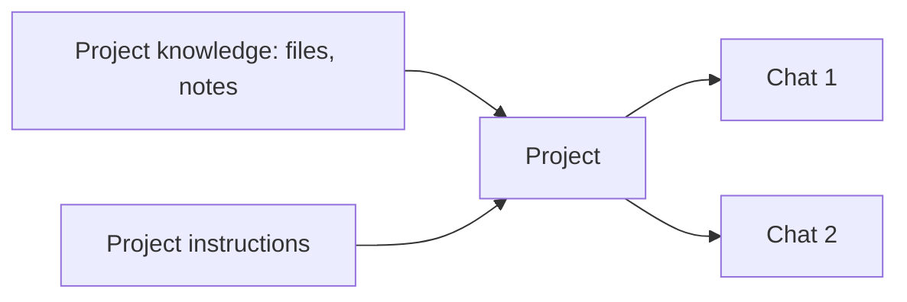

<LevelBadge level="beginner" />

<VerifyNote lastVerified="2026-06-20" source="https://www.anthropic.com">
प्रोजेक्ट सुविधाएँ और सीमाएँ प्लान के अनुसार भिन्न होती हैं और बदलती रहती हैं — मौजूदा व्यवहार की पुष्टि ऐप/हेल्प सेंटर में करें।
</VerifyNote>

एक **प्रोजेक्ट** Claude.ai में एक समर्पित वर्कस्पेस है जो **अपनी खुद की फ़ाइलें, ज्ञान और निर्देश** बंडल करता है। हर चैट में वही डॉक्युमेंट दोबारा अपलोड करने और संदर्भ दोबारा समझाने की बजाय, आप इसे एक बार सेट करते हैं — और प्रोजेक्ट में हर बातचीत पहले से जानकार होकर शुरू होती है।

## प्रोजेक्ट का उपयोग क्यों करें

- **आधारित जवाब।** अपने डॉक्युमेंट जोड़ें (एक हैंडबुक, स्पेसिफ़िकेशन, नोट्स) और Claude *उनसे* जवाब देता है — [RAG](/docs/foundations/rag) का एक अंतर्निहित, नो-कोड स्वरूप।
- **स्थायी संदर्भ।** प्रोजेक्ट निर्देश इसके अंदर हर चीज़ के लिए एक स्कोप किए गए [सिस्टम प्रॉम्प्ट](/docs/foundations/roles) की तरह काम करते हैं।
- **व्यवस्थित।** एक विषय/क्लाइंट/पहल के बारे में सभी चैट्स एक साथ रहती हैं।

## एक सेट करें

1. **एक प्रोजेक्ट बनाएँ** और इसे एक स्पष्ट उद्देश्य दें।
2. **ज्ञान जोड़ें** — वे फ़ाइलें/टेक्स्ट जो इसे हमेशा जाननी चाहिए।
3. **प्रोजेक्ट निर्देश लिखें** — भूमिका, परंपराएँ, क्या करना है/किससे बचना है।
4. **चैट करना शुरू करें** — हर बातचीत ज्ञान + निर्देश विरासत में पाती है।

## बेहतरीन उपयोग के मामले

- एक **क्लाइंट/अकाउंट** वर्कस्पेस (उनके डॉक्युमेंट + आपके नोट्स)।
- Q&A के लिए एक **कोडबेस या प्रोडक्ट** नॉलेज बेस।
- आपकी स्टाइल गाइड और पिछले लेखों के साथ एक **लेखन प्रोजेक्ट** (ताकि ड्राफ़्ट आपकी आवाज़ से मेल खाएँ)।
- किसी कोर्स के लिए **अध्ययन**, सिलेबस और सामग्री लोड की गई।

## सुझाव

- **ज्ञान को सावधानी से चुनें** — प्रासंगिक, मौजूदा फ़ाइलें सब कुछ डंप करने से बेहतर हैं (शोर रिट्रीवल को नुकसान पहुँचाता है)।
- **निर्देशों को कसा हुआ और सच्चा रखें** (वही नियम जो [कस्टम निर्देशों](/docs/claude-app/custom-instructions) का है)।
- ऐसा **संवेदनशील डेटा न जोड़ें** जिसे स्टोर करने में आप सहज नहीं हैं — देखें [गोपनीयता](/docs/foundations/privacy)।

## अगला

- [कस्टम निर्देश और स्टाइल](/docs/claude-app/custom-instructions)
- [चैट्स के बीच मेमोरी](/docs/claude-app/memory)
- [रिट्रीवल-ऑगमेंटेड जेनरेशन (RAG)](/docs/foundations/rag)
