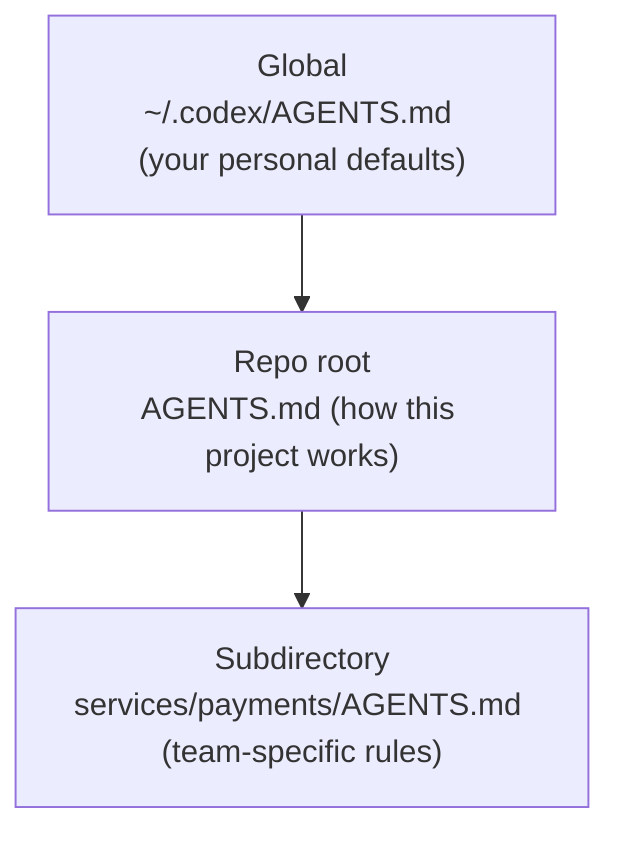

<LevelBadge level="intermediate" />

<VerifyNote lastVerified="2026-06-27" source="https://agents.md/">
AGENTS.md अपनाने वालों की सूची और Claude Code का इम्पोर्ट/सिमलिंक व्यवहार तेज़ी से बदलता है — विशिष्ट बातों की पुष्टि आधिकारिक AGENTS.md साइट और Claude Code मेमोरी डॉक्स के विरुद्ध करें।
</VerifyNote>

आप पहले से ही [CLAUDE.md](/docs/claude-code/claude-md) जानते हैं — Claude Code की प्रोजेक्ट ब्रीफिंग। लेकिन आपके रेपो को संभवतः *एक से अधिक* एजेंट छूते हैं: एक टीममेट Codex चलाता है, CI एक कोडिंग बॉट का उपयोग करता है, कोई रेपो को Cursor में खोलता है। `AGENTS.md` वह खुला मानक है जिसे पढ़ने पर वे टूल सहमत होते हैं, इसलिए आप अपने प्रोजेक्ट के निर्देश हर टूल के लिए अलग फ़ाइल बनाए रखने के बजाय **एक बार** लिखते हैं।

<Callout type="objectives" items={["AGENTS.md क्या है और इसकी देखरेख कौन करता है", "Claude Code CLAUDE.md क्यों पढ़ता है और AGENTS.md क्यों नहीं", "टूल्स में सत्य का एकल स्रोत बनाए रखने के तीन भरोसेमंद तरीके", "नेस्टेड और ग्लोबल AGENTS.md फ़ाइलें कैसे मर्ज होती हैं", "फ़ाइल में क्या आना चाहिए — और क्या बाहर रखना चाहिए"]} />

## AGENTS.md क्या है

`AGENTS.md` आपके रेपो की जड़ में एक सादी Markdown फ़ाइल है — इसे **इंसानों के बजाय एजेंट्स के लिए लिखी गई README** के रूप में सोचें। यह एक कोडिंग एजेंट को बताती है कि प्रोजेक्ट को कैसे बिल्ड, टेस्ट और उसमें योगदान करना है। फ़ॉर्मैट में कोई आवश्यक फ़ील्ड नहीं है: एजेंट बस गद्य पढ़ते हैं।

यह एक खुला मानक है जिसकी देखरेख **Linux Foundation के अंतर्गत Agentic AI Foundation (AAIF)** करती है, और 2026 के मध्य तक यह 60 हज़ार से अधिक ओपन-सोर्स प्रोजेक्ट्स द्वारा उपयोग किया जाता है और 30 से अधिक टूल्स द्वारा पढ़ा जाता है — जिनमें OpenAI Codex, Google का Jules और Gemini CLI, Cursor, Windsurf, Devin, Zed, Warp, Aider, goose, Amp, और GitHub Copilot का कोडिंग एजेंट शामिल हैं।

<Callout type="info" items={["AGENTS.md एक परंपरा है, रनटाइम नहीं: हर टूल तय करता है कि वह फ़ाइल को कैसे खोजता, मर्ज करता और इंजेक्ट करता है।", "कोई स्कीमा लागू नहीं होती — स्पष्ट गद्य कठोर संरचना से बेहतर है।", "यह आपकी README की पूरक है; इसकी जगह नहीं लेती।"]} />

## Claude Code वाला पेच

यहाँ वह बात है जिस पर लोग ठोकर खाते हैं: **Claude Code `CLAUDE.md` पढ़ता है, `AGENTS.md` नहीं।** अगर आपके रेपो में केवल `AGENTS.md` है, तो Claude Code डिफ़ॉल्ट रूप से इसे नज़रअंदाज़ कर देता है। यह कोई बग नहीं है — यह मानक से पहले का है — लेकिन इसका मतलब है कि एक मल्टी-टूल रेपो को एक सोची-समझी सिंक रणनीति की ज़रूरत होती है, वरना आपके निर्देश चुपचाप अलग-अलग खिसक जाते हैं।

<Callout type="warning" items={["यह न मानें कि Claude Code AGENTS.md पर वापस गिरता है — यह इसे स्वतः नहीं पढ़ता।", "हाथ से बनाए रखी गई दो फ़ाइलें (CLAUDE.md और AGENTS.md) खिसक जाएँगी। सत्य का एक स्रोत चुनें।", "किसी भी फ़ॉलबैक दावे पर भरोसा करने से पहले आधिकारिक मेमोरी डॉक्स में मौजूदा व्यवहार की पुष्टि करें।"]} />

## सत्य का एक स्रोत बनाए रखें

तीन पैटर्न सामग्री की नकल किए बिना CLAUDE.md और AGENTS.md को सिंक में रखते हैं। अपनी टीम के प्लैटफ़ॉर्म के अनुसार चुनें।

<Steps items={[{title: "सिमलिंक (सबसे सरल)", body: "CLAUDE.md को AGENTS.md का सिमलिंक बना दें। Claude Code सिमलिंक का अनुसरण करता है और लक्ष्य को बाइट-दर-बाइट पढ़ता है — एक असली फ़ाइल, शून्य मर्ज लॉजिक। चेतावनी: Windows पर, सिमलिंक बनाने के लिए Developer Mode या एडमिन अधिकार चाहिए, इसलिए क्रॉस-प्लैटफ़ॉर्म टीमें इम्पोर्ट विधि को प्राथमिकता दे सकती हैं।"}, {title: "@import (क्रॉस-प्लैटफ़ॉर्म)", body: "एक छोटी CLAUDE.md रखें जिसका एकमात्र काम मानक फ़ाइल को @AGENTS.md इम्पोर्ट के साथ खींचना है। Claude Code लॉन्च पर इम्पोर्ट की गई फ़ाइल को कॉन्टेक्स्ट में विस्तारित करता है, इसलिए AGENTS.md एकल स्रोत बनी रहती है और Windows पर टूटने के लिए कोई सिमलिंक नहीं रहता।"}, {title: "/init (माइग्रेशन)", body: "एक ऐसे रेपो में Claude Code को बूटस्ट्रैप कर रहे हैं जिसमें पहले से एक AGENTS.md (या .cursorrules / .windsurfrules) है? /init चलाएँ — यह उन फ़ाइलों को पढ़ता है और प्रासंगिक हिस्सों को एक जनरेट की गई CLAUDE.md में समेट देता है।"}]} />

<PromptCard title="CLAUDE.md को साझा मानक से सिमलिंक करें (macOS / Linux)">{`ln -s AGENTS.md CLAUDE.md`}</PromptCard>

<PromptCard title="या एक-पंक्ति वाली CLAUDE.md रखें जो इसे इम्पोर्ट करे">{`@AGENTS.md`}</PromptCard>

<Callout type="tip" items={["जब आपकी पूरी टीम macOS/Linux पर हो तो सिमलिंक करें — इसे बनाए रखना सबसे कम है।", "जब Windows योगदानकर्ता शामिल हों तो @import का उपयोग करें।", "जो भी चुनें उसे कमिट करें ताकि पूरी टीम को एक ही व्यवहार मिले।"]} />

## नेस्टेड और ग्लोबल फ़ाइलें कैसे मर्ज होती हैं

समृद्ध एजेंट AGENTS.md को पदानुक्रमिक रूप से व्यवहार करते हैं — वही मानसिक मॉडल जो [CLAUDE.md मेमोरी पदानुक्रम](/docs/claude-code/claude-md) का है। Codex, उदाहरण के लिए, आपकी होम डायरेक्टरी में एक ग्लोबल फ़ाइल से नीचे Git रूट से होते हुए आपके मौजूदा फ़ोल्डर तक चलता है, और चलते-चलते जोड़ता जाता है:

काम के करीब की फ़ाइलें जीतती हैं, क्योंकि वे **अंत में** जोड़ी जाती हैं और पहले के मार्गदर्शन को ओवरराइड करती हैं। तो एक `services/payments/AGENTS.md` रेपो-रूट के निर्देशों को विरासत में लेती है और ऐसे नियम जोड़ती है जो केवल उस सेवा के भीतर लागू होते हैं — विशेषीकृत मार्गदर्शन को विशेषीकृत कोड के जितना करीब हो सके रखें।

<Flashcards title="एक नज़र में इंटरऑप" cards={[{front: "AGENTS.md कौन पढ़ता है?", back: "30 से अधिक टूल — Codex, Cursor, Windsurf, Devin, Zed, Gemini CLI, Copilot का कोडिंग एजेंट, और भी बहुत कुछ। डिफ़ॉल्ट रूप से Claude Code नहीं।"}, {front: "CLAUDE.md कौन पढ़ता है?", back: "Claude Code — और केवल Claude Code। यह AGENTS.md को स्वतः नहीं पढ़ता।"}, {front: "Mac/Linux टीम के लिए सबसे अच्छा सिंक", back: "CLAUDE.md → AGENTS.md सिमलिंक करें। एक असली फ़ाइल, कोई खिसकाव नहीं।"}, {front: "Windows योगदानकर्ताओं के साथ सबसे अच्छा सिंक", back: "एक-पंक्ति वाली CLAUDE.md जिसमें @AGENTS.md हो — किसी सिमलिंक की ज़रूरत नहीं।"}, {front: "नेस्टेड फ़ाइलों के लिए मर्ज क्रम", back: "ग्लोबल → रेपो रूट → सबडायरेक्टरी। काम के करीब की फ़ाइलें ओवरराइड करती हैं, क्योंकि वे अंत में जोड़ी जाती हैं।"}]} />

## इसमें क्या डालें

वही अनुशासन जो एक अच्छी CLAUDE.md का है — मानक बस कुछ सामान्य खंड सुझाता है:

- **प्रोजेक्ट अवलोकन** — यह क्या है, दो वाक्यों में।
- **बिल्ड और टेस्ट कमांड** — कैसे चलाएँ, टेस्ट करें और लिंट करें।
- **कोड शैली** — परंपराएँ जिन्हें एक एजेंट अनुमान से नहीं जान सकता।
- **टेस्टिंग निर्देश** — "हो गया" का क्या मतलब है।
- **सुरक्षा संबंधी विचार** — कभी क्या न छुएँ या कमिट न करें।
- **कमिट / PR दिशानिर्देश** — संदेश फ़ॉर्मैट, ब्रांच नियम।

<Callout type="warning" items={["एजेंट फ़ाइल का अक्षरशः पालन करते हैं — पुराने या आकांक्षात्मक निर्देश सक्रिय रूप से नुकसान पहुँचाते हैं, ठीक CLAUDE.md की तरह।", "इसे छोटा और सच्चा रखें; बताएँ कि प्रोजेक्ट आज कैसे काम करता है।", "कभी सीक्रेट्स कमिट न करें; बड़े डॉक्स को चिपकाने के बजाय उनका संदर्भ दें।"]} />

## खुद को परखें

<Quiz title="खुद को परखें" questions={[{q: "क्या Claude Code AGENTS.md को स्वतः पढ़ता है?", options: ["हाँ, यह AGENTS.md पर वापस गिरता है", "नहीं — यह केवल CLAUDE.md पढ़ता है", "केवल Windows पर"], answer: 1, explain: "Claude Code CLAUDE.md पढ़ता है और डिफ़ॉल्ट रूप से एक स्टैंडअलोन AGENTS.md को नज़रअंदाज़ कर देता है, इसलिए मल्टी-टूल रेपो को एक सोची-समझी सिंक रणनीति की ज़रूरत होती है।"}, {q: "आपकी टीम पूरी तरह macOS और Linux पर है। Claude Code और Codex के बीच एक निर्देश फ़ाइल साझा करने का सबसे कम-रखरखाव वाला तरीका क्या है?", options: ["CLAUDE.md और AGENTS.md को हाथ से बनाए रखें", "CLAUDE.md को AGENTS.md से सिमलिंक करें", "AGENTS.md को एक कमेंट में चिपकाएँ"], answer: 1, explain: "CLAUDE.md → AGENTS.md सिमलिंक करने से आपको एक असली फ़ाइल मिलती है; Claude Code सिमलिंक का अनुसरण करता है और लक्ष्य को बाइट-दर-बाइट पढ़ता है।"}, {q: "जब एजेंट एक ग्लोबल, एक रेपो-रूट, और एक सबडायरेक्टरी AGENTS.md को मर्ज करते हैं, तो टकराव पर कौन जीतती है?", options: ["ग्लोबल फ़ाइल", "रेपो-रूट फ़ाइल", "काम के सबसे करीब वाली सबडायरेक्टरी फ़ाइल"], answer: 2, explain: "फ़ाइलें ग्लोबल → रूट → सबडायर क्रम में जोड़ी जाती हैं, इसलिए काम के सबसे करीब वाली फ़ाइल अंत में आती है और पहले के मार्गदर्शन को ओवरराइड करती है।"}]} />

<Callout type="takeaways" items={["AGENTS.md वह खुला, Linux-Foundation-द्वारा-देखरेख किया गया मानक है जिसे 30 से अधिक कोडिंग एजेंट पढ़ते हैं — एजेंट्स के लिए एक README।", "Claude Code CLAUDE.md पढ़ता है, AGENTS.md नहीं, इसलिए मल्टी-टूल रेपो को इन्हें सिंक में रखना ही होगा।", "Mac/Linux पर CLAUDE.md → AGENTS.md सिमलिंक करें, या क्रॉस-प्लैटफ़ॉर्म टीमों के लिए एक-पंक्ति वाला @AGENTS.md इम्पोर्ट उपयोग करें।", "नेस्टेड फ़ाइलें ग्लोबल → रूट → सबडायरेक्टरी क्रम में मर्ज होती हैं, जिसमें सबसे करीब वाली फ़ाइल जीतती है।", "इसे एक बढ़िया CLAUDE.md की तरह भरें: अवलोकन, बिल्ड/टेस्ट कमांड, परंपराएँ, सुरक्षा, और गार्डरेल्स — छोटा और सच्चा।"]} />

## आगे

- [CLAUDE.md और मेमोरी फ़ाइलें](/docs/claude-code/claude-md) — उसी विचार का Claude Code वाला पक्ष
- [CLAUDE.md टेम्पलेट्स](/docs/templates/claude-md) — तैयार स्टार्टर जिन्हें आप AGENTS.md के रूप में दोबारा इस्तेमाल कर सकते हैं
- [स्लैश कमांड](/docs/claude-code/slash-commands) — मौजूदा निर्देश फ़ाइलों को माइग्रेट करने के लिए /init सहित

## स्रोत और आगे पढ़ने के लिए

- [AGENTS.md — आधिकारिक साइट और स्पेक](https://agents.md/)
- [OpenAI Codex — AGENTS.md के साथ कस्टम निर्देश](https://developers.openai.com/codex/guides/agents-md)
- [Claude Code मेमोरी दस्तावेज़ीकरण](https://code.claude.com/docs/en/memory)
