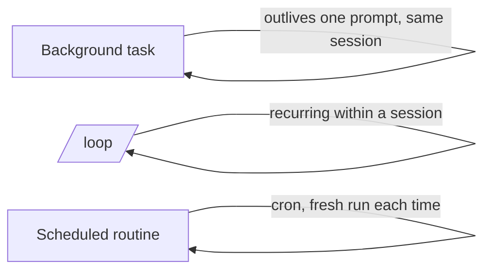

<LevelBadge level="advanced" />

<VerifyNote lastVerified="2026-06-20" source="https://code.claude.com/docs/en">
बैकग्राउंड टास्क, /loop, और शेड्यूलिंग के सटीक कमांड और उपलब्धता रिलीज़ के बीच बदलती रहती है — आधिकारिक डॉक्स में पुष्टि करें।
</VerifyNote>

हर चीज़ एक त्वरित संपादन नहीं होती। Claude Code ऐसा काम चला सकता है जो **एक ही प्रॉम्प्ट से आगे टिके रहे**: बैकग्राउंड में लंबे कमांड, आवर्ती लूप, और शेड्यूल किए गए रन।

## बैकग्राउंड टास्क

किसी लंबे समय तक चलने वाले कमांड (एक dev सर्वर, एक टेस्ट वॉचर, एक बिल्ड) को सत्र को **ब्लॉक किए बिना** शुरू करें। Claude काम करता रहता है और जब टास्क आउटपुट देता है या समाप्त होता है तब उसे सूचित किया जाता है। इसका उपयोग किसी भी ऐसी चीज़ के लिए करें जिसे आप सामान्यतः `&` के साथ बैकग्राउंड में डालते — लेकिन प्रबंधित रूप में, ताकि Claude बाद में आउटपुट पढ़ सके।

:::tip बिज़ी-वेट न करें
टास्क को बैकग्राउंड में शुरू करें और आगे बढ़ें; एक टाइट लूप में पोल करने के बजाय, पूर्णता सूचना को आपको वापस लाने दें।
:::

## आवर्ती लूप (`/loop`)

`/loop` किसी प्रॉम्प्ट या कमांड को एक सत्र के भीतर **आवर्ती अंतराल** पर चलाता है — जैसे "हर 5 मिनट में, डिप्लॉय स्थिति जाँचें।" इसे एक अंतराल दें, या Claude को स्वयं गति निर्धारित करने दें। किसी CI रन की निगरानी करने या किसी बाहरी जॉब को पोल करने के लिए बढ़िया है जिसके बारे में हार्नेस अन्यथा आपको सूचित नहीं कर सकता।

## शेड्यूल किए गए क्लाउड एजेंट

ऐसे काम के लिए जो **घड़ी के अनुसार, निरंतर** होना चाहिए — "हर सुबह नई इश्यूज़ का सारांश दें," "हर घंटे, समाचार जाँचें और डॉक्स अपडेट करें" — **शेड्यूल किए गए टास्क / रूटीन** (cron-शैली) का उपयोग करें। प्रत्येक रन नए सिरे से शुरू होता है, इसलिए इसके निर्देश **स्व-निहित** होने चाहिए।

## इनमें से चुनना

| आवश्यकता | उपयोग करें |
|---|---|
| एक लंबा कमांड चलाएँ, काम करते रहें | बैकग्राउंड टास्क |
| इस सत्र में हर N मिनट में कुछ पोल करें | `/loop` |
| अनिश्चित काल तक शेड्यूल पर कुछ करें | शेड्यूल किया गया रूटीन |

:::warning स्वायत्तता को सुरक्षा कवच की आवश्यकता है
कोई भी चीज़ जो शेड्यूल पर बिना निगरानी के कार्य करती है, उसका दायरा कसकर सीमित और प्रतिवर्ती (reversible) होना चाहिए। इसे सख्त [अनुमतियों](/docs/claude-code/permissions) के साथ जोड़ें और [स्वायत्त रन को मज़बूत बनाना](/docs/security/hardening-autonomous-runs) पढ़ें।
:::

## आगे

- [हेडलेस मोड और Agent SDK](/docs/claude-code/headless-and-agent-sdk)
- [अनुमतियाँ और मोड](/docs/claude-code/permissions)
- [स्वायत्त रन को मज़बूत बनाना](/docs/security/hardening-autonomous-runs)
