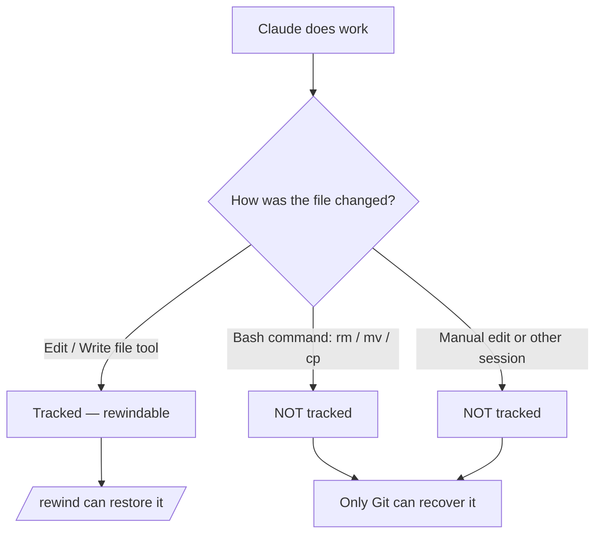

<LevelBadge level="intermediate" />

<Callout type="objectives" items={["समझें कि एक चेकपॉइंट क्या कैप्चर करता है — और चुपचाप क्या नहीं करता", "रिवाइंड मेनू को दो तरीकों से खोलें और हर बार सही रिस्टोर क्रिया चुनें", "'restore' (स्थिति पूर्ववत करना) को 'summarize' (संदर्भ संपीड़ित करना) से अलग पहचानें", "ठीक-ठीक जानें कि चेकपॉइंट Git के पूरक क्यों हैं पर उसकी जगह कभी नहीं ले सकते"]} />

<VerifyNote lastVerified="2026-07-09" source="https://code.claude.com/docs/en/checkpointing">
चेकपॉइंट का व्यवहार, रिवाइंड मेनू की क्रियाएं, रिटेंशन, और संस्करण की आवश्यकताएं (जैसे `/clear` के आगे रिज्यूम करने के लिए Claude Code v2.1.191+ चाहिए) रिलीज़ के बीच बदलती हैं — आधिकारिक दस्तावेज़ों में पुष्टि करें।
</VerifyNote>

## बड़ा विचार

जब आप Claude को किसी महत्वाकांक्षी, व्यापक बदलाव पर खुला छोड़ते हैं, तो सबसे डरावना सवाल यह होता है कि "अगर यह तीन संपादन गहराई में जाकर गलत हो जाए तो?" **चेकपॉइंटिंग** इसका जवाब है: Claude Code प्रत्येक संपादन से पहले आपके कोड का स्वचालित रूप से स्नैपशॉट लेता है, ताकि आप किसी अधूरे रीफैक्टर को हाथ से सुलझाने के बजाय किसी भी पहले की स्थिति पर रिवाइंड कर सकें।

इसे **पूरे सत्र के लिए एक स्थानीय अनडू** के रूप में सोचें — एक सुरक्षा जाल जो आपको बिना डर के "हां, बोल्ड तरीका आज़माओ" कहने देता है।

## चेकपॉइंट कैसे बनते हैं

आप चेकपॉइंट नहीं बनाते — वे स्वचालित रूप से होते हैं।

<Steps items={[{title: "हर प्रॉम्प्ट = एक चेकपॉइंट", body: "प्रत्येक उपयोगकर्ता प्रॉम्प्ट Claude के फ़ाइल-संपादन टूल चलने से पहले आपके कोड की स्थिति कैप्चर करता है। कोई कमांड नहीं, कोई कॉन्फ़िग नहीं, कोई औपचारिकता नहीं।"}, {title: "वे सत्रों के पार बने रहते हैं", body: "चेकपॉइंट किसी बातचीत को छोड़ने और फिर से शुरू करने के बाद भी बचे रहते हैं, इसलिए आप केवल लाइव सत्र में ही नहीं, बल्कि रिज्यूम किए गए सत्र में भी रिवाइंड कर सकते हैं।"}, {title: "वे खुद को साफ़ कर लेते हैं", body: "चेकपॉइंट अपने सत्र के साथ 30 दिनों के बाद हटा दिए जाते हैं (कॉन्फ़िगर करने योग्य)। ये सत्र-स्तर की रिकवरी हैं, कोई संग्रह नहीं।"}]} />

## रिवाइंड मेनू खोलना

अंदर जाने के दो तरीके हैं:

<Steps items={[{title: "/rewind चलाएं", body: "प्रॉम्प्ट से स्लैश कमांड टाइप करें। हमेशा काम करता है।"}, {title: "Esc दो बार दबाएं — पर केवल खाली इनपुट पर", body: "डबल-Esc रिवाइंड मेनू तब खोलता है जब प्रॉम्प्ट बॉक्स खाली हो। अगर उसमें कोई टेक्स्ट है, तो डबल-Esc उस टेक्स्ट को साफ़ कर देता है (साफ़ किया गया टेक्स्ट इनपुट इतिहास में सहेजा जाता है, इसलिए बाद में उसे वापस पाने के लिए Up दबाएं)।"}]} />

<PromptCard title="रिवाइंड मेनू खोलें">{`/rewind`}</PromptCard>

मेनू **इस सत्र में आपके द्वारा भेजे गए हर प्रॉम्प्ट** को सूचीबद्ध करता है। जिस बिंदु पर आप कार्रवाई करना चाहते हैं उसे चुनें, फिर एक क्रिया चुनें।

## रिस्टोर बनाम समराइज़: मुख्य अंतर

यहीं लोग भ्रमित होते हैं। मेनू दो *प्रकार* की क्रिया देता है:

- **रिस्टोर** क्रियाएं डिस्क पर और/या बातचीत में स्थिति बदलती हैं — वे पूर्ववत करती हैं।
- **समराइज़** क्रियाएं आपकी फ़ाइलों को कभी नहीं छूतीं — वे संदर्भ विंडो में जगह खाली करने के लिए बातचीत को संपीड़ित करती हैं।

<Callout type="warning" items={["रिस्टोर = पूर्ववत (कोड, बातचीत, या दोनों को वापस लाता है)। समराइज़ = संदर्भ संपीड़ित (डिस्क पर फ़ाइलें अछूती रहती हैं)।", "जब किसी संपादन ने कुछ तोड़ दिया हो तो रिस्टोर की ओर बढ़ें। जब सत्र फूला हुआ हो पर कोड ठीक हो तो समराइज़ की ओर बढ़ें।"]} />

### रिस्टोर क्रियाएं

<Steps items={[{title: "कोड और बातचीत रिस्टोर करें", body: "अपनी फ़ाइलों और चैट इतिहास दोनों को चयनित बिंदु पर वापस लाएं — उस पल तक का एक साफ़-सुथरा 'समय रिवाइंड'।"}, {title: "बातचीत रिस्टोर करें", body: "चैट को उस संदेश तक रिवाइंड करें पर अपना मौजूदा कोड रखें। किसी सवाल को उन संपादनों को खोए बिना फिर से पूछने के लिए उपयोगी है जिन्हें आप रखना चाहते हैं।"}, {title: "कोड रिस्टोर करें", body: "फ़ाइल परिवर्तनों को वापस लाएं पर बातचीत रखें। संपादनों को पूर्ववत करें, उनके बारे में चर्चा रखें।"}]} />

बातचीत रिस्टोर करने के बाद (या "यहां से समराइज़ करें" चुनने पर), चयनित संदेश का मूल प्रॉम्प्ट इनपुट फ़ील्ड में वापस डाल दिया जाता है ताकि आप उसे फिर से भेज सकें या संपादित कर सकें।

### समराइज़ क्रियाएं

दोनों बातचीत के एक हिस्से को AI-जनित सारांश में संपीड़ित करती हैं — एक **लक्षित `/compact`** की तरह जहां आप चुनते हैं कि चयनित संदेश की किस तरफ़ को निचोड़ना है।

<Steps items={[{title: "यहां से समराइज़ करें", body: "चयनित संदेश से पहले के संदेश अछूते रहते हैं। चयनित संदेश और उसके बाद की हर चीज़ एक सारांश बन जाती है। किसी साइड चर्चा को हटाते हुए शुरुआती संदर्भ को पूरे विस्तार में रखने के लिए इसका उपयोग करें।"}, {title: "यहां तक समराइज़ करें", body: "चयनित संदेश से पहले के संदेश एक सारांश बन जाते हैं; चयनित संदेश और उसके बाद की हर चीज़ अछूती रहती है। आप बातचीत के अंत में बने रहते हैं। हाल के काम को शब्दशः रखते हुए शुरुआती सेटअप की बातचीत को संपीड़ित करने के लिए इसका उपयोग करें।"}]} />

किसी भी तरह से मूल संदेश सत्र ट्रांसक्रिप्ट में बने रहते हैं, इसलिए Claude अब भी विवरणों का संदर्भ ले सकता है। आप वैकल्पिक निर्देश टाइप कर सकते हैं ताकि सारांश किस पर केंद्रित हो यह तय कर सकें।

पूरे प्रवाह के लिए, देखें [संदर्भ प्रबंधन](/docs/claude-code/context-management) — `/rewind` की समराइज़ क्रियाएं एक चाकू हैं जहां `/compact` एक चौड़ा ब्रश है।

## `/clear` के आगे रिवाइंड करना

अगर आपने उसी Claude Code प्रक्रिया में पहले `/clear` चलाया था, तो रिवाइंड मेनू शीर्ष पर एक अतिरिक्त प्रविष्टि दिखाता है: `/resume <session-id> (previous session)`। `/clear` से पहले सक्रिय बातचीत पर वापस कूदने के लिए इसे चुनें।

<VerifyNote lastVerified="2026-07-09" source="https://code.claude.com/docs/en/checkpointing">
रिवाइंड मेनू से `/clear` के आगे रिज्यूम करने के लिए Claude Code v2.1.191 या उससे नया चाहिए। पुराने संस्करणों पर, इसके बजाय `/resume` चलाएं और सूची से पिछला सत्र चुनें।
</VerifyNote>

## जहां चेकपॉइंट रुक जाते हैं — वे सीमाएं जो काट सकती हैं

चेकपॉइंट जादुई लगते हैं जब तक कि वे नहीं लगते। तीन खामियां मायने रखती हैं:

<Steps items={[{title: "बैश परिवर्तन अदृश्य होते हैं", body: "Claude द्वारा चलाए गए शेल कमांड से छुई गई फ़ाइलें — rm, mv, cp, कोड जनरेटर, फ़ॉर्मैटर — ट्रैक नहीं होतीं। केवल Claude के फ़ाइल-संपादन टूल के जरिए सीधे संपादन ही चेकपॉइंट होते हैं। rm से हटाई गई फ़ाइल रिवाइंड के हिसाब से चली गई है।"}, {title: "बाहरी और समवर्ती परिवर्तन अदृश्य होते हैं", body: "Claude Code के बाहर आपके किए गए मैन्युअल संपादन, और अन्य समवर्ती सत्रों के संपादन, सामान्यतः कैप्चर नहीं होते — जब तक कि वे संयोगवश उन्हीं फ़ाइलों को न छू लें जिन्हें मौजूदा सत्र ने संपादित किया।"}, {title: "यह सत्र-स्तर का है, इतिहास नहीं", body: "चेकपॉइंट त्वरित, स्थानीय रिकवरी हैं। वे कमिट नहीं हैं, ब्रांच नहीं हैं, और आपकी टीम के साथ साझा करने योग्य नहीं हैं।"}]} />

## चेकपॉइंट बनाम Git: दोनों का उपयोग करें

वे अलग-अलग समस्याएं हल करते हैं, इसलिए उन्हें जोड़ें।

| | चेकपॉइंट (`/rewind`) | Git |
|---|---|---|
| दायरा | एक सत्र | पूरे प्रोजेक्ट का इतिहास |
| सूक्ष्मता | प्रति प्रॉम्प्ट, स्वचालित | प्रति कमिट, सुविचारित |
| बैश से किए बदलाव ट्रैक करता है? | नहीं | हां (एक बार स्टेज/कमिट होने पर) |
| जीवनकाल | ~30 दिन, फिर चला गया | स्थायी |
| साझा करने योग्य / सहयोगात्मक | नहीं | हां |
| मानसिक मॉडल | "स्थानीय अनडू" | "स्थायी इतिहास" |

<Callout type="tip" items={["किसी जोखिमपूर्ण, व्यापक रन से पहले Git के साथ काम करने वाली स्थितियों को कमिट करें — वह आपकी टिकाऊ बुनियाद है।", "अपने Git इतिहास को प्रदूषित किए बिना कमिट के बीच तेज़ इन-सेशन रिकवरी के लिए /rewind का उपयोग करें।", "अगर Claude विनाशकारी बैश (rm/mv) या जनरेटर चलाएगा, तो Git पर भरोसा करें — रिवाइंड उन फ़ाइलों को नहीं बचाएगा।"]} />

## इसका उपयोग कब करें

<Steps items={[{title: "विकल्पों की खोज", body: "एक बोल्ड कार्यान्वयन आज़माएं, और अगर आपको यह पसंद न आए, तो कोड और बातचीत को फ़ोर्क बिंदु पर रिस्टोर करें और दूसरा आज़माएं।"}, {title: "खराब संपादन से उबरना", body: "किसी संपादन ने तीन प्रॉम्प्ट पहले एक बग पैदा किया? मलबे को डीबग करने के बजाय कोड को उससे ठीक पहले तक रिस्टोर करें।"}, {title: "किसी फ़ीचर पर पुनरावृत्ति", body: "विविधताओं के साथ प्रयोग करें, यह जानते हुए कि एक ज्ञात-अच्छी स्थिति एक /rewind की दूरी पर है।"}, {title: "संदर्भ स्थान खाली करना", body: "एक वाचाल डीबगिंग भटकाव ने आपकी संदर्भ विंडो खा ली? मध्यबिंदु से आगे समराइज़ करें और अपने मूल निर्देशों को पूरे विस्तार में रखें।"}]} />

<Quiz title="खुद को परखें" questions={[{q: "Claude ने बैश कमांड के जरिए `rm config.old.json` चलाया और आप इसे वापस चाहते हैं। क्या `/rewind` इसे रिस्टोर कर सकता है?", options: ["हां — Claude जो भी बदलाव करता है वह चेकपॉइंट होता है", "नहीं — बैश से किए बदलाव ट्रैक नहीं होते; केवल सीधे फ़ाइल-टूल संपादन ही होते हैं", "केवल अगर आप 30 सेकंड के भीतर /rewind चलाएं"], answer: 1, explain: "चेकपॉइंटिंग केवल Claude के फ़ाइल-संपादन टूल के जरिए किए गए संपादनों को कैप्चर करती है। बैश कमांड (rm, mv, cp) से बदली गई फ़ाइलें ट्रैक नहीं होतीं — Git ठीक इसी के लिए है।"}, {q: "आपका कोड ठीक है, पर एक लंबे डीबगिंग भटकाव ने संदर्भ विंडो भर दी है। कौन सी क्रिया फिट बैठती है?", options: ["भटकाव से पहले कोड और बातचीत रिस्टोर करें", "कोड रिस्टोर करें", "भटकाव की शुरुआत में यहां से समराइज़ करें"], answer: 2, explain: "समराइज़ क्रियाएं फ़ाइलों को छुए बिना बातचीत संपीड़ित करती हैं। 'यहां से समराइज़ करें' भटकाव को एक सारांश में बदल देता है जबकि आपका पहले का संदर्भ अछूता रखता है — शून्य कोड परिवर्तनों के साथ संदर्भ स्थान खाली करता है।"}, {q: "एक चेकपॉइंट कैसे बनता है?", options: ["आप /checkpoint को मैन्युअल रूप से चलाते हैं", "स्वचालित रूप से, प्रत्येक संपादन से पहले — हर प्रॉम्प्ट एक बनाता है", "केवल जब आप Git में कमिट करते हैं"], answer: 1, explain: "चेकपॉइंटिंग स्वचालित है: प्रत्येक उपयोगकर्ता प्रॉम्प्ट आपके कोड की संपादन-पूर्व स्थिति कैप्चर करता है। कोई मैन्युअल चरण नहीं है।"}]} />

<Flashcards title="चेकपॉइंट और रिवाइंड शब्दावली" cards={[{front: "चेकपॉइंट", back: "प्रत्येक संपादन से पहले, प्रति प्रॉम्प्ट एक बार लिया गया आपके कोड का स्वचालित स्नैपशॉट। सत्र-दायरे वाला, ~30 दिन रखा जाता है।"}, {front: "/rewind", back: "रिवाइंड मेनू खोलता है जो इस सत्र के हर प्रॉम्प्ट को सूचीबद्ध करता है, ताकि आप किसी भी बिंदु से रिस्टोर या समराइज़ कर सकें। खाली इनपुट पर डबल-Esc से भी पहुंचा जा सकता है।"}, {front: "रिस्टोर क्रिया", back: "स्थिति को — कोड, बातचीत, या दोनों — चयनित बिंदु पर वापस लाती है। यह 'पूर्ववत' है।"}, {front: "समराइज़ क्रिया", back: "संदर्भ खाली करने के लिए बातचीत के एक हिस्से को एक AI सारांश में संपीड़ित करती है। डिस्क पर फ़ाइलें कभी नहीं छुई जातीं।"}, {front: "बैश का अंधा स्थान", back: "शेल कमांड (rm/mv/cp) से बदली गई फ़ाइलें चेकपॉइंट नहीं होतीं — केवल सीधे फ़ाइल-टूल संपादन होते हैं। उनके लिए Git का उपयोग करें।"}]} />

<Callout type="takeaways" items={["चेकपॉइंट आपके कोड के स्वचालित, प्रति-प्रॉम्प्ट स्नैपशॉट हैं — पूरे सत्र के लिए एक स्थानीय अनडू, लगभग 30 दिन रखा जाता है।", "रिवाइंड मेनू को /rewind से या खाली इनपुट पर डबल-Esc से खोलें; यह आपके भेजे हर प्रॉम्प्ट को सूचीबद्ध करता है।", "रिस्टोर क्रियाएं स्थिति पूर्ववत करती हैं (कोड, बातचीत, या दोनों); समराइज़ क्रियाएं संदर्भ संपीड़ित करती हैं और फ़ाइलों को कभी नहीं छूतीं।", "बैश से किए गए, बाहरी, और समवर्ती परिवर्तन ट्रैक नहीं होते — केवल सीधे फ़ाइल-टूल संपादन होते हैं।", "चेकपॉइंट Git के पूरक हैं, उसकी जगह नहीं लेते: 'स्थानीय अनडू' बनाम 'स्थायी, साझा करने योग्य इतिहास' के रूप में सोचें।"]} />

## आगे

- [संदर्भ प्रबंधन](/docs/claude-code/context-management) — `/compact`, `/clear`, और समराइज़ बड़ी तस्वीर में कैसे फिट बैठता है
- [प्लान मोड](/docs/claude-code/plan-mode) — संपादन चलने से पहले किसी योजना की जांच और अनुमोदन करें, ताकि आप कम बार रिवाइंड करें
- [अनुमतियां](/docs/claude-code/permissions) — महत्वाकांक्षी कार्यों को सुरक्षित रूप से चलाने का दूसरा हिस्सा
