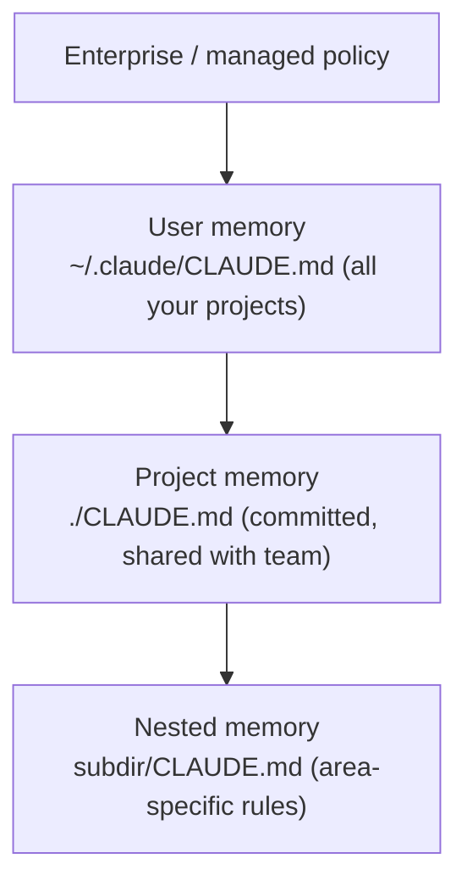

<LevelBadge level="beginner" />

<VerifyNote lastVerified="2026-06-20" source="https://docs.anthropic.com/en/docs/claude-code/memory">
मेमोरी फ़ाइल के स्थान और इम्पोर्ट सिंटैक्स बदल सकते हैं — आधिकारिक Claude Code मेमोरी डॉक्स में विशिष्ट बातों की पुष्टि करें।
</VerifyNote>

अगर आप [Claude Code](/docs/claude-code/what-is-claude-code) को बेहतर बनाने के लिए **एक** काम करें, तो यह करें। `CLAUDE.md` एक सादा-टेक्स्ट फ़ाइल है जिसे Claude हर सत्र की शुरुआत में पढ़ता है — आपके प्रोजेक्ट की स्थायी ब्रीफ़िंग।

## यह सबसे अधिक प्रभाव वाली सेटिंग क्यों है

इसके बिना, आप हर सत्र में अपना प्रोजेक्ट दोबारा समझाते हैं ("हम pnpm उपयोग करते हैं, टेस्ट `__tests__` में हैं, `/generated` को मत छुएँ…")। इसके साथ, Claude पहले से ही जानता है। यहाँ अच्छे निर्देश एक ही बार में *हर* भविष्य की बातचीत को बेहतर बनाते हैं।

## मेमोरी पदानुक्रम

Claude Code कई स्थानों से मेमोरी पढ़ता है और उन्हें मर्ज करता है, मोटे तौर पर सबसे-वैश्विक से सबसे-विशिष्ट तक:

- **यूज़र मेमोरी** — हर प्रोजेक्ट में आपकी व्यक्तिगत प्राथमिकताएँ।
- **प्रोजेक्ट मेमोरी** (`./CLAUDE.md`, कमिट की गई) — *यह* रेपो कैसे काम करता है। आपकी टीम के साथ साझा।
- **नेस्टेड** — ऐसे नियमों के लिए किसी सबफ़ोल्डर में `CLAUDE.md` रखें जो केवल वहीं लागू होते हैं।

## एक शुरुआती बिंदु तैयार करें

किसी प्रोजेक्ट में `/init` चलाएँ और Claude कोड का निरीक्षण करके एक `CLAUDE.md` का मसौदा तैयार करता है। फिर उसे **संपादित करके छोटा करें** — मसौदा एक शुरुआती बिंदु है, अंतिम पड़ाव नहीं।

## इसमें क्या डालें

- प्रोजेक्ट क्या है, दो वाक्यों में।
- टेक स्टैक और **रन / टेस्ट / लिंट** कैसे करें।
- ऐसे नियम जिनका Claude अनुमान नहीं लगा सकता (नामकरण, संरचना, कमिट शैली)।
- **सुरक्षा कवच**: "पूर्ण घोषित करने से पहले टेस्ट चलाएँ", "`/vendor` को कभी संपादित न करें", "सीक्रेट्स को कभी कमिट न करें"।

[CLAUDE.md टेम्पलेट्स](/docs/templates/claude-md) से तैयार स्टार्टर लें।

## इसमें क्या न डालें

:::warning छोटा और सत्य, लंबा और आकांक्षात्मक से बेहतर है
Claude `CLAUDE.md` का *अक्षरशः* पालन करता है। बासी, अस्पष्ट, या इच्छाधारी निर्देश वास्तव में नुकसान पहुँचाते हैं। बताएँ कि प्रोजेक्ट आज **वास्तव में** कैसे काम करता है, इसे संक्षिप्त रखें, और समय-समय पर इसकी समीक्षा करें।
:::

इनसे बचें: विशाल पेस्ट किए गए डॉक्स (इसके बजाय फ़ाइलों को संदर्भित करने के लिए `@imports` उपयोग करें), सीक्रेट्स, और ऐसे नियम जिनका आप वास्तव में पालन नहीं करते।

## इम्पोर्ट्स

मौजूदा डॉक्स को डुप्लिकेट करने के बजाय उन्हें खींचें — जैसे, अपनी स्टाइल गाइड को `@path/to/file` इम्पोर्ट के साथ संदर्भित करें ताकि सत्य का एक ही स्रोत रहे। सटीक सिंटैक्स के लिए [आधिकारिक मेमोरी डॉक्स](https://docs.anthropic.com/en/docs/claude-code/memory) देखें।

## आगे

- [Plan Mode](/docs/claude-code/plan-mode) — सुरक्षित पहले बदलाव
- [अनुमतियाँ और मोड](/docs/claude-code/permissions) — Claude बिना निगरानी के क्या कर सकता है
- [वॉकथ्रू: एक वास्तविक रेपो के लिए Claude Code को कस्टमाइज़ करें](/docs/walkthroughs/customize-claude-code)
