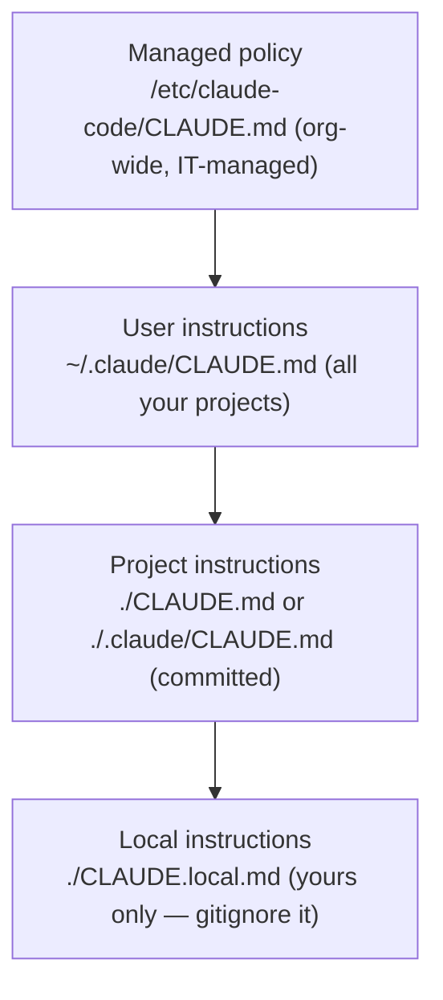

<LevelBadge level="beginner" />

<VerifyNote lastVerified="2026-10-06" source="https://code.claude.com/docs/en/memory">
स्थान, लोड क्रम और इम्पोर्ट सिंटैक्स आधिकारिक मेमोरी डॉक्स ("How Claude remembers your project") से लिए गए हैं, जो अब **दो** तंत्रों का वर्णन करते हैं: वे CLAUDE.md फ़ाइलें जो आप लिखते हैं और वह **ऑटो मेमोरी** जो Claude स्वयं लिखता है। इम्पोर्ट अधिकतम चार हॉप की गहराई तक हल होते हैं। विशिष्ट बातों की पुष्टि वहीं करें — ये विवरण बदलते रहते हैं।
</VerifyNote>

अगर आप [Claude Code](/docs/claude-code/what-is-claude-code) को बेहतर बनाने के लिए **एक** काम करें, तो यह करें। `CLAUDE.md` एक सादा-टेक्स्ट फ़ाइल है जिसे Claude हर सत्र की शुरुआत में पढ़ता है — आपके प्रोजेक्ट की स्थायी ब्रीफ़िंग।

<Callout type="objectives" items={["CLAUDE.md क्यों एकमात्र सबसे अधिक प्रभाव वाली Claude Code सेटिंग है", "मेमोरी पदानुक्रम कैसे लोड होता है, प्रबंधित नीति से लेकर CLAUDE.local.md तक", "ऑटो मेमोरी आपके लिखे CLAUDE.md से कैसे अलग है", "/init से एक शुरुआती फ़ाइल कैसे तैयार करें और उसे छोटा कैसे करें", "CLAUDE.md में क्या होना चाहिए — और क्या बाहर रखना चाहिए", "@imports आपको डॉक्स को डुप्लिकेट किए बिना उन्हें संदर्भित करने कैसे देते हैं"]} />

## यह सबसे अधिक प्रभाव वाली सेटिंग क्यों है

इसके बिना, आप हर सत्र में अपना प्रोजेक्ट दोबारा समझाते हैं ("हम pnpm उपयोग करते हैं, टेस्ट `__tests__` में हैं, `/generated` को मत छुएँ…")। इसके साथ, Claude पहले से ही जानता है। यहाँ अच्छे निर्देश एक ही बार में *हर* भविष्य की बातचीत को बेहतर बनाते हैं।

## मेमोरी पदानुक्रम

Claude Code कई स्थानों से मेमोरी लोड करता है और उन्हें लोड क्रम में मर्ज करता है, सबसे व्यापक दायरे से शुरू करके — इसलिए एक प्रोजेक्ट निर्देश कॉन्टेक्स्ट में एक यूज़र निर्देश के *बाद* आता है:

```mermaid
flowchart TD
  A["Managed policy<br/>/etc/claude-code/CLAUDE.md (org-wide, IT-managed)"] --> B["User instructions<br/>~/.claude/CLAUDE.md (all your projects)"]
  B --> C["Project instructions<br/>./CLAUDE.md or ./.claude/CLAUDE.md (committed)"]
  C --> D["Local instructions<br/>./CLAUDE.local.md (yours only — gitignore it)"]
```

- **प्रबंधित नीति** — संगठन-स्तरीय निर्देश जो आपकी IT/DevOps टीम वितरित करती है। पथ प्रति ऑपरेटिंग सिस्टम अलग है: macOS पर `/Library/Application Support/ClaudeCode/CLAUDE.md`, Linux और WSL पर `/etc/claude-code/CLAUDE.md`, Windows पर `C:\Program Files\ClaudeCode\CLAUDE.md`।
- **यूज़र निर्देश** (`~/.claude/CLAUDE.md`) — हर प्रोजेक्ट में आपकी व्यक्तिगत प्राथमिकताएँ।
- **प्रोजेक्ट निर्देश** (`./CLAUDE.md` *या* `./.claude/CLAUDE.md`, कमिट की गई) — *यह* रेपो कैसे काम करता है। आपकी टीम के साथ साझा। अगर आपका रेपो [`AGENTS.md`](/docs/claude-code/agents-md) उपयोग करता है, तो वह इनकी जगह या इनके साथ लोड हो सकती है।
- **स्थानीय निर्देश** (`./CLAUDE.local.md`) — केवल आपके लिए प्रोजेक्ट-विशिष्ट नोट्स, जैसे किसी सैंडबॉक्स का URL। इसे `.gitignore` में जोड़ें।

आपकी कार्यशील डायरेक्टरी के *ऊपर* की डायरेक्टरी पदानुक्रम में मौजूद फ़ाइलें लॉन्च पर लोड होती हैं; सबडायरेक्टरी में मौजूद **फ़ाइलें मांग पर लोड होती हैं**, जब Claude उस क्षेत्र में कुछ छूता है।

<Callout type="tip" items={["एक फ़ाइल छोटी पड़ गई? निर्देशों को .claude/rules/*.md में बाँट दें — एक फ़ाइल में एक विषय, पुनरावर्ती रूप से खोजे जाते हैं। paths फ़्रंटमैटर के बिना नियम लॉन्च पर .claude/CLAUDE.md की ही प्राथमिकता के साथ लोड होते हैं; किसी नियम को केवल तब लोड करने के लिए जब Claude मेल खाती फ़ाइलों पर काम करे, paths फ़्रंटमैटर जोड़ें — इससे कॉन्टेक्स्ट बचता है।"]} />

<Flashcards title="अपनी मेमोरी परतों को जानें" cards={[{front: "प्रबंधित नीति", back: "संगठन-स्तरीय, IT द्वारा प्रबंधित CLAUDE.md — सबसे व्यापक परत, जो यूज़र और प्रोजेक्ट निर्देशों से पहले लोड होती है।"}, {front: "यूज़र निर्देश", back: "~/.claude/CLAUDE.md — आपकी व्यक्तिगत प्राथमिकताएँ जो हर प्रोजेक्ट में लागू होती हैं।"}, {front: "प्रोजेक्ट निर्देश", back: "./CLAUDE.md या ./.claude/CLAUDE.md — कमिट की गई और टीम के साथ साझा; बताती है कि यह रेपो कैसे काम करता है।"}, {front: "स्थानीय निर्देश", back: "./CLAUDE.local.md — व्यक्तिगत, प्रोजेक्ट-विशिष्ट प्राथमिकताएँ। इसे gitignore करें।"}, {front: ".claude/rules/*.md", back: "बड़े प्रोजेक्ट्स के लिए एक फ़ाइल में एक विषय वाले निर्देश। paths फ़्रंटमैटर के साथ ये केवल मेल खाती फ़ाइलों के लिए लोड होते हैं।"}, {front: "सबडायरेक्टरी की CLAUDE.md", back: "मांग पर लोड होती है — जब Claude ट्री के उस हिस्से में काम करता है — लॉन्च पर नहीं।"}]} />

## दूसरा आधा हिस्सा: ऑटो मेमोरी

CLAUDE.md मेमोरी का वह आधा हिस्सा है जो *आप* लिखते हैं। Claude Code **ऑटो मेमोरी** भी रखता है — वे नोट्स जो Claude आपके सुधारों और प्राथमिकताओं से स्वयं लिखता है, जो प्रति रिपॉज़िटरी संग्रहीत होते हैं और आपकी CLAUDE.md फ़ाइलों के साथ-साथ हर सत्र में लोड होते हैं।

| | CLAUDE.md फ़ाइलें | ऑटो मेमोरी |
| --- | --- | --- |
| **इसे कौन लिखता है** | आप | Claude |
| **इसमें क्या होता है** | निर्देश और नियम | सीख और पैटर्न |
| **दायरा** | प्रोजेक्ट, यूज़र, या संगठन | प्रति रिपॉज़िटरी, worktrees के बीच साझा |

दोनों *कॉन्टेक्स्ट* हैं, प्रवर्तन नहीं: Claude इन्हें ऐसे मार्गदर्शन की तरह मानता है जिसे वह तोल सकता है, ऐसी कॉन्फ़िगरेशन की तरह नहीं जिसका पालन उसे करना ही है। Claude जो भी तय करे, उससे स्वतंत्र रूप से किसी क्रिया को पूरी तरह रोकने के लिए इसके बजाय एक [PreToolUse हुक](/docs/claude-code/hooks) उपयोग करें।

<Callout type="warning" items={["ऑटो मेमोरी केवल अपनी पहली 200 पंक्तियाँ या 25 KB लोड करती है — फूली हुई MEMORY.md चुपचाप कट जाती है। स्टार्टअप लागत के पूरे ब्योरे के लिए कॉन्टेक्स्ट बजट ऑडिट देखें।"]} />

## एक शुरुआती बिंदु तैयार करें

<Steps items={[{title: "प्रोजेक्ट में /init चलाएँ", body: "Claude कोड का निरीक्षण करता है और आपके लिए स्वचालित रूप से एक CLAUDE.md का मसौदा तैयार करता है।"}, {title: "इसे संपादित करके छोटा करें", body: "मसौदा एक शुरुआती बिंदु है, अंतिम पड़ाव नहीं। इसे उसी तक सीमित करें जो सत्य और उपयोगी है।"}, {title: "एक टेम्पलेट उधार लें", body: "CLAUDE.md टेम्पलेट्स पेज से तैयार स्टार्टर लें और इसे अपने रेपो के अनुसार अनुकूलित करें।"}]} />

<PromptCard title="एक CLAUDE.md मसौदा तैयार करें">{`/init`}</PromptCard>

[CLAUDE.md टेम्पलेट्स](/docs/templates/claude-md) से तैयार स्टार्टर लें।

## इसमें क्या डालें

- प्रोजेक्ट क्या है, दो वाक्यों में।
- टेक स्टैक और **रन / टेस्ट / लिंट** कैसे करें।
- ऐसे नियम जिनका Claude अनुमान नहीं लगा सकता (नामकरण, संरचना, कमिट शैली)।
- **सुरक्षा कवच**: "पूर्ण घोषित करने से पहले टेस्ट चलाएँ", "`/vendor` को कभी संपादित न करें", "सीक्रेट्स को कभी कमिट न करें"।

## इसमें क्या न डालें

<Callout type="warning" items={["Claude CLAUDE.md का अक्षरशः पालन करता है — बासी, अस्पष्ट, या इच्छाधारी निर्देश वास्तव में नुकसान पहुँचाते हैं।", "बताएँ कि प्रोजेक्ट आज वास्तव में कैसे काम करता है; छोटा और सत्य, लंबा और आकांक्षात्मक से बेहतर है।", "विशाल पेस्ट किए गए डॉक्स (इसके बजाय @imports उपयोग करें), सीक्रेट्स, और ऐसे नियम जिनका आप वास्तव में पालन नहीं करते, से बचें।", "इसकी समय-समय पर समीक्षा करें ताकि यह प्रोजेक्ट के विकसित होने के साथ सटीक बना रहे।"]} />

## इम्पोर्ट्स

मौजूदा डॉक्स को डुप्लिकेट करने के बजाय उन्हें खींचें — जैसे, अपनी स्टाइल गाइड को `@path/to/file` इम्पोर्ट के साथ संदर्भित करें ताकि सत्य का एक ही स्रोत रहे। सापेक्ष और पूर्ण पथ दोनों काम करते हैं; सापेक्ष पथ उस फ़ाइल के सापेक्ष हल होते हैं जिसमें इम्पोर्ट है, आपकी कार्यशील डायरेक्टरी के सापेक्ष **नहीं**। इम्पोर्ट की गई फ़ाइलें आगे और फ़ाइलें इम्पोर्ट कर सकती हैं, अधिकतम **चार हॉप** की गहराई तक।

दो सिंटैक्स जाल जिन्हें काटने से पहले जान लेना अच्छा है:

- **स्पेस के लिए बैकस्लैश चाहिए।** `@Design\ Docs/api-conventions.md` काम करता है; बैकस्लैश के बिना पथ पहले स्पेस पर रुक जाता है। इसे कोट्स में लपेटने से फ़ाइल बिल्कुल इम्पोर्ट नहीं होती।
- **बैकटिक इम्पोर्ट से बाहर कर देते हैं।** इम्पोर्ट पार्सिंग कोड स्पैन और फ़ेंस्ड ब्लॉक को छोड़ देती है, इसलिए `` `@README` `` शाब्दिक टेक्स्ट बना रहता है जबकि अकेला `@README` फ़ाइल इम्पोर्ट कर लेता है। किसी पथ को लोड किए बिना *उल्लेख* करने का यही तरीका है।

पूर्ण संदर्भ के लिए [आधिकारिक मेमोरी डॉक्स](https://code.claude.com/docs/en/memory) देखें।

<Callout type="tip" items={["सत्य का एक ही स्रोत: किसी फ़ाइल की सामग्री को CLAUDE.md में पेस्ट करने के बजाय उसे @imports से संदर्भित करें।", "अगर कोई डॉक पहले से मौजूद है, तो उसे लिंक करें — उसे कॉपी न करें। कॉपियाँ समय के साथ पुरानी हो जाती हैं।"]} />

## स्वयं जाँचें

<Quiz title="स्वयं जाँचें" questions={[{q: "Claude Code आपके प्रोजेक्ट की स्थायी ब्रीफ़िंग के रूप में हर सत्र की शुरुआत में कौन-सी फ़ाइल पढ़ता है?", options: ["README.md", "CLAUDE.md", "package.json"], answer: 1, explain: "CLAUDE.md वह सादा-टेक्स्ट मेमोरी फ़ाइल है जिसे Claude हर सत्र की शुरुआत में पढ़ता है।"}, {q: "किसी प्रोजेक्ट में /init चलाने से क्या होता है?", options: ["यह CLAUDE.md को आपकी टीम के रेपो में कमिट करता है", "यह कोड का निरीक्षण करके एक CLAUDE.md का मसौदा तैयार करता है, जिसे फिर आप संपादित करके छोटा करते हैं", "यह बासी मेमोरी फ़ाइलों को हटा देता है"], answer: 1, explain: "/init कोड से एक शुरुआती CLAUDE.md का मसौदा तैयार करता है — मसौदा एक शुरुआती बिंदु है, इसलिए आप बाद में उसे संपादित करके छोटा करते हैं।"}, {q: "स्टाइल गाइड जैसे किसी बड़े मौजूदा डॉक को शामिल करने का अनुशंसित तरीका क्या है?", options: ["पूरे दस्तावेज़ को CLAUDE.md में पेस्ट करें", "इसे @path/to/file इम्पोर्ट के साथ संदर्भित करें", "इसे एक सीक्रेट के रूप में संग्रहीत करें"], answer: 1, explain: "@imports का उपयोग फ़ाइल की ओर इंगित करने के लिए करें ताकि एक डुप्लिकेट, पुरानी होती कॉपी के बजाय सत्य का एक ही स्रोत रहे।"}, {q: "व्यक्तिगत, प्रोजेक्ट-विशिष्ट नोट्स कहाँ जाते हैं — वे जिन्हें आप कमिट नहीं करना चाहते?", options: ["~/.claude/CLAUDE.md", "./CLAUDE.local.md", "./.claude/CLAUDE.md"], answer: 1, explain: "./CLAUDE.local.md स्थानीय परत है: प्रोजेक्ट-विशिष्ट लेकिन केवल आपकी। इसे gitignore करें। ~/.claude/CLAUDE.md आपके सभी प्रोजेक्ट्स पर लागू होती है, और ./.claude/CLAUDE.md कमिट किए गए टीम निर्देश हैं।"}, {q: "ऑटो मेमोरी कौन लिखता है?", options: ["आप, हाथ से", "Claude, आपके सुधारों और प्राथमिकताओं से", "आपका IT प्रशासक"], answer: 1, explain: "ऑटो मेमोरी वह आधा हिस्सा है जो Claude स्वयं लिखता है — सीख और पैटर्न, प्रति रिपॉज़िटरी संग्रहीत। CLAUDE.md वह आधा हिस्सा है जो आप लिखते हैं।"}, {q: "किसी सबडायरेक्टरी की CLAUDE.md कब लोड होती है?", options: ["लॉन्च पर, हर दूसरी मेमोरी फ़ाइल के साथ", "मांग पर, जब Claude ट्री के उस हिस्से में काम करता है", "केवल तब जब आप इसे @import करें"], answer: 1, explain: "आपकी कार्यशील डायरेक्टरी के ऊपर की फ़ाइलें लॉन्च पर लोड होती हैं; सबडायरेक्टरी की फ़ाइलें मांग पर लोड होती हैं, जब Claude उस क्षेत्र में कुछ छूता है।"}]} />

<Callout type="takeaways" items={["CLAUDE.md सबसे अधिक प्रभाव वाली सेटिंग है: यह एक ही बार में हर भविष्य के सत्र को बेहतर बनाती है।", "मेमोरी सबसे व्यापक से पहले लोड होती है: प्रबंधित नीति, फिर यूज़र (~/.claude/CLAUDE.md), प्रोजेक्ट (./CLAUDE.md या ./.claude/CLAUDE.md), फिर स्थानीय (./CLAUDE.local.md)। सबडायरेक्टरी की फ़ाइलें मांग पर लोड होती हैं।", "ऑटो मेमोरी दूसरा आधा हिस्सा है — Claude के अपने नोट्स, प्रति रिपॉज़िटरी, हर सत्र में लोड। दोनों कॉन्टेक्स्ट हैं, प्रवर्तन नहीं: किसी चीज़ को पूरी तरह रोकने के लिए एक हुक उपयोग करें।", "एक फ़ाइल छोटी पड़ गई? इसे .claude/rules/*.md में बाँट दें और paths फ़्रंटमैटर से नियमों का दायरा तय करें।", "/init से शुरू करें, फिर मसौदे को संपादित करके उसी तक सीमित करें जो वास्तव में सत्य है।", "इसे छोटा और सत्य रखें — बड़े डॉक्स के लिए @imports उपयोग करें (अधिकतम चार हॉप), और सीक्रेट्स को कभी कमिट न करें।"]} />

## आगे

- [AGENTS.md और क्रॉस-टूल इंटरऑप](/docs/claude-code/agents-md) — हर कोडिंग एजेंट के साथ एक ही निर्देश फ़ाइल साझा करें
- [Plan Mode](/docs/claude-code/plan-mode) — सुरक्षित पहले बदलाव
- [अनुमतियाँ और मोड](/docs/claude-code/permissions) — Claude बिना निगरानी के क्या कर सकता है
- [वॉकथ्रू: एक वास्तविक रेपो के लिए Claude Code को कस्टमाइज़ करें](/docs/walkthroughs/customize-claude-code)
