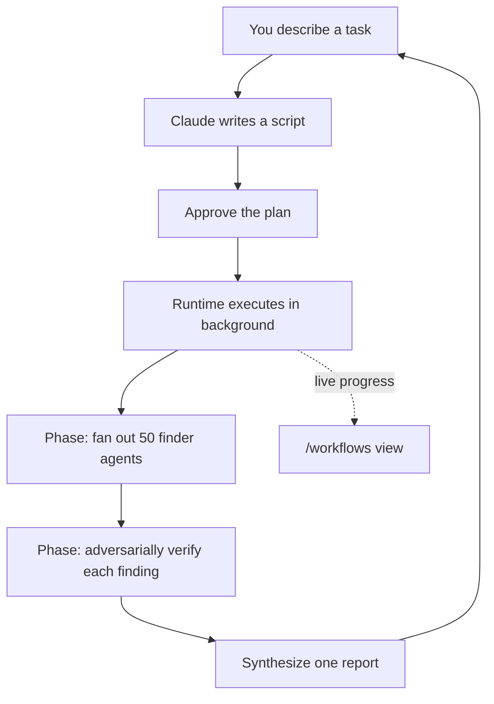

<LevelBadge level="advanced" />

<VerifyNote lastVerified="2026-06-28" source="https://code.claude.com/docs/en/workflows">
डायनामिक वर्कफ़्लो एक तेज़ी से विकसित होने वाला फ़ीचर है: ट्रिगर कीवर्ड, अनुमोदन विकल्प, एजेंट कैप, और उपलब्धता Claude Code रिलीज़ के बीच बदलते रहते हैं — विशिष्ट विवरणों की पुष्टि आधिकारिक डॉक्स में करें। इनके लिए Claude Code v2.1.154+ और एक भुगतान वाली योजना आवश्यक है।
</VerifyNote>

<Callout type="objectives" items={["किसके पास योजना है, इससे एक वर्कफ़्लो को subagents, skills, और एजेंट टीमों से अलग पहचानें", "बंडल किए गए /deep-research कमांड के साथ 30 सेकंड में एक को देखें", "अपना खुद का तीन तरीकों से शुरू करें: ultracode कीवर्ड, /effort ultracode, या एक सहेजा गया कमांड", "Yes दबाने से पहले जानें कि अनुमोदन प्रॉम्प्ट आपको किससे बचा रहा है", "स्लाइसिंग और allowlist के साथ लागत और अनअटेंडेड रन को नियंत्रण में रखें"]} />

एक **डायनामिक वर्कफ़्लो** एक JavaScript स्क्रिप्ट है जो [subagents](/docs/claude-code/subagents) को बड़े पैमाने पर ऑर्केस्ट्रेट करती है। आप एक कार्य का वर्णन करते हैं; Claude *स्क्रिप्ट लिखता है*; एक रनटाइम इसे पृष्ठभूमि में चलाता है जबकि आपका सेशन उत्तरदायी बना रहता है। जहाँ एक सामान्य मल्टी-स्टेप कार्य Claude के कॉन्टेक्स्ट विंडो में टर्न-दर-टर्न रहता है, वहीं एक वर्कफ़्लो **योजना को कोड में** स्थानांतरित करता है — लूप, ब्रांचिंग, और हर मध्यवर्ती परिणाम स्क्रिप्ट वेरिएबल्स में रहते हैं, इसलिए आपके कॉन्टेक्स्ट में केवल अंतिम उत्तर होता है।

यही एक बदलाव वर्कफ़्लो को एक ही रन में *दर्जनों या सैकड़ों* एजेंट तक स्केल करने में सक्षम बनाता है, जबकि साधारण डेलिगेशन कुछ ही तक सीमित रहता है।

## वर्कफ़्लो का सहारा कब लें

Claude Code आपको मल्टी-स्टेप कार्य चलाने के चार तरीके देता है। असली सवाल यह है कि **किसके पास योजना है**:

| | [Subagents](/docs/claude-code/subagents) | [Skills](/docs/claude-code/skills) | एजेंट टीमें | **वर्कफ़्लो** |
| :-- | :-- | :-- | :-- | :-- |
| यह क्या है | एक वर्कर जिसे Claude स्पॉन करता है | निर्देश जिनका Claude पालन करता है | एक लीड जो पीयर सेशन की निगरानी करता है | एक स्क्रिप्ट जिसे रनटाइम निष्पादित करता है |
| आगे क्या चलेगा यह कौन तय करता है | Claude, टर्न-दर-टर्न | Claude, प्रॉम्प्ट के अनुसार | लीड, टर्न-दर-टर्न | **स्क्रिप्ट** |
| परिणाम कहाँ रहते हैं | कॉन्टेक्स्ट विंडो | कॉन्टेक्स्ट विंडो | एक साझा कार्य सूची | **स्क्रिप्ट वेरिएबल्स** |
| स्केल | प्रति टर्न कुछ | subagents के समान | कुछ पीयर | **दर्जनों से सैकड़ों** |
| बाधा आने पर | टर्न को पुनः आरंभ करता है | टर्न को पुनः आरंभ करता है | टीममेट चलते रहते हैं | **सेशन के भीतर पुनः शुरू करने योग्य** |

एक वर्कफ़्लो का उपयोग तब करें जब किसी कार्य के लिए **एक बातचीत के समन्वय योग्य से अधिक एजेंट** चाहिए, या जब आप ऑर्केस्ट्रेशन को **एक स्क्रिप्ट के रूप में संहिताबद्ध करना चाहते हैं जिसे आप पढ़ और फिर से चला सकें**। प्रामाणिक मामले:

- एक **कोडबेस-व्यापी बग स्वीप** — हर मॉड्यूल पर एक फ़ाइंडर फैलाएँ, फिर स्वतंत्र एजेंट्स से हर निष्कर्ष को रिपोर्ट किए जाने से पहले विरोधात्मक रूप से सत्यापित कराएँ।
- एक **500-फ़ाइल माइग्रेशन** — प्रति फ़ाइल एक एजेंट, प्रत्येक अपने स्वयं के worktree में, एक सत्यापन चरण के साथ।
- एक **शोध प्रश्न** जहाँ स्रोतों को केवल सारांशित करने के बजाय **एक-दूसरे के विरुद्ध क्रॉस-चेक** किया जाना चाहिए।
- एक **कठिन योजना** जिसे कई स्वतंत्र दृष्टिकोणों से तैयार करना सार्थक है, फिर प्रतिबद्ध होने से पहले एक-दूसरे के विरुद्ध तौला जाए।

वह अंतिम बिंदु कम आँका गया है: एक वर्कफ़्लो एक *दोहराने योग्य गुणवत्ता पैटर्न* (विरोधात्मक समीक्षा, बहु-कोणीय ड्राफ्टिंग, बहुमत-मत सत्यापन) लागू कर सकता है, ताकि आपको एकल पास की तुलना में अधिक भरोसेमंद परिणाम मिले — न कि केवल अधिक एजेंट।



## एक को देखने का सबसे तेज़ तरीका: /deep-research

Claude Code एक अंतर्निहित वर्कफ़्लो के साथ आता है ताकि मॉडल को आज़माने के लिए आपको एक लिखने की ज़रूरत न पड़े। इसे किसी भी प्रश्न पर चलाएँ:

<PromptCard title="एक कमांड में एक वर्कफ़्लो आज़माएँ">{`/deep-research What changed in the Node.js permission model between v20 and v22?`}</PromptCard>

यह वेब खोजों को कई कोणों पर फैलाता है, स्रोतों को प्राप्त करता है और **क्रॉस-चेक** करता है, हर दावे पर मतदान करता है, और **उन दावों के साथ एक उद्धृत रिपोर्ट लौटाता है जो क्रॉस-चेकिंग में टिक नहीं पाए, उन्हें फ़िल्टर करके निकाल देता है**। प्रॉम्प्ट मिलने पर अनुमोदन दें, फिर `/workflows` के साथ इसे काम करते हुए देखें। (इसके लिए WebSearch टूल उपलब्ध होना चाहिए।)

## अपना खुद का शुरू करने के तीन तरीके

**1. एक प्रॉम्प्ट में पूछें।** कीवर्ड `ultracode` शामिल करें, या बस सादे शब्दों में पूछें ("use a workflow", "run a workflow")। Claude आपके सेशन के एफ़र्ट स्तर को बदले बिना उस एकल कार्य के लिए एक स्क्रिप्ट लिखता है:

<PromptCard title="एक कार्य को वर्कफ़्लो के रूप में चलाएँ">{`ultracode: audit every API endpoint under src/routes/ for missing auth checks`}</PromptCard>

कीवर्ड आपके इनपुट में हाइलाइट किया जाता है। ऐसा करने का इरादा नहीं था? उस प्रॉम्प्ट के लिए हाइलाइट को हटाने के लिए `Option+W` (macOS) या `Alt+W` (Windows/Linux) दबाएँ।

:::note कीवर्ड इतिहास
v2.1.160 से पहले शाब्दिक ट्रिगर शब्द `workflow` था; इसका नाम बदलकर `ultracode` कर दिया गया ताकि सामान्य शब्द "workflow" किसी रन को ट्रिगर न करे। प्राकृतिक-भाषा अनुरोध ("run a workflow") **दोनों** संस्करणों में काम करते हैं।
:::

**2. Claude को तय करने दें — ultracode एफ़र्ट।** सेशन को ultracode पर सेट करें और Claude *हर* महत्वपूर्ण कार्य के लिए एक वर्कफ़्लो की योजना बनाता है, स्वयं तय करता है कि कब कोई वारंटेड है:

<PromptCard title="सेशन के लिए स्वचालित ऑर्केस्ट्रेशन चालू करें">{`/effort ultracode`}</PromptCard>

Ultracode `xhigh` [रीज़निंग एफ़र्ट](/docs/api/thinking-and-effort) को स्वचालित ऑर्केस्ट्रेशन के साथ जोड़ता है। एक एकल अनुरोध लगातार कई वर्कफ़्लो बन सकता है — एक कोड को समझने के लिए, एक बदलाव करने के लिए, एक उसे सत्यापित करने के लिए। फिर हर कार्य अधिक टोकन का उपयोग करता है और अधिक समय लेता है, इसलिए नियमित काम के लिए `/effort high` के साथ वापस आ जाएँ। यह केवल वर्तमान सेशन तक रहता है।

**3. एक सहेजा गया या बंडल किया गया कमांड चलाएँ।** `/deep-research`, या कोई भी वर्कफ़्लो जिसे आपने सहेजा है (नीचे), किसी भी स्लैश कमांड की तरह `/` ऑटोकंप्लीट में दिखाई देता है।

## चलने से पहले अनुमोदन दें

वर्कफ़्लो बहुत सारे एजेंट स्पॉन कर सकते हैं, इसलिए CLI आपको नियोजित चरण दिखाता है और पहले पूछता है:

- **Yes, run it** — रन शुरू करें
- **Yes, and don't ask again for `[name]` in `[path]`** — शुरू करें और इस प्रोजेक्ट में इस वर्कफ़्लो के लिए प्रॉम्प्ट को छोड़ दें
- **View raw script** (`Ctrl+G` इसे आपके एडिटर में खोलता है) — तय करने से पहले पढ़ें
- **No** — रद्द करें (`Tab` आपको पहले प्रॉम्प्ट में बदलाव करने देता है)

आपको प्रॉम्प्ट मिलता है या नहीं, यह आपके [अनुमति मोड](/docs/claude-code/permissions) पर निर्भर करता है: **Default / accept-edits** हर रन पर प्रॉम्प्ट करता है (जब तक आपने उस वर्कफ़्लो के लिए ऑप्ट आउट न किया हो); **Auto** केवल पहली बार लॉन्च पर प्रॉम्प्ट करता है; **bypass / `claude -p` / Agent SDK** कभी प्रॉम्प्ट नहीं करता — रन तुरंत शुरू हो जाता है।

:::warning subagents आपके सेशन के मोड को इनहेरिट नहीं करते
आपके सेशन का अनुमति मोड चाहे जो भी हो, एक वर्कफ़्लो द्वारा स्पॉन किए गए एजेंट हमेशा **`acceptEdits`** में चलते हैं और आपके [टूल allowlist](/docs/claude-code/permissions) को इनहेरिट करते हैं — फ़ाइल एडिट स्वतः-अनुमोदित होते हैं। शेल कमांड, वेब फ़ेच, और MCP टूल जो आपके allowlist पर *नहीं* हैं, फिर भी रन को रोककर आपको प्रॉम्प्ट कर सकते हैं। एक लंबे अनअटेंडेड रन पर, **शुरू करने से पहले एजेंट्स को जिन कमांड की ज़रूरत है उन्हें अपने allowlist में जोड़ें** ताकि यह आपका इंतज़ार करते हुए रुक न जाए। देखें [स्वायत्त रन को सुदृढ़ करना](/docs/security/hardening-autonomous-runs)।
:::

## एक रन कैसे निष्पादित होता है

रनटाइम स्क्रिप्ट को आपकी बातचीत से अलग, एक **पृथक वातावरण** में चलाता है — मध्यवर्ती परिणाम स्क्रिप्ट वेरिएबल्स में रहते हैं, Claude के कॉन्टेक्स्ट को कभी नहीं छूते। स्क्रिप्ट के पास स्वयं **कोई प्रत्यक्ष फ़ाइलसिस्टम या शेल एक्सेस नहीं** होता: *एजेंट* पढ़ते, लिखते, और कमांड चलाते हैं; स्क्रिप्ट केवल उनका समन्वय करती है।

हर रन अपनी स्क्रिप्ट को `~/.claude/projects/` में आपकी सेशन डायरेक्टरी के अंतर्गत एक फ़ाइल में लिखता है, और Claude को पथ मिल जाता है। इसलिए आप Claude से स्क्रिप्ट माँग सकते हैं, उसके द्वारा लिखे गए ऑर्केस्ट्रेशन को पढ़ सकते हैं, इसे पिछले रन के विरुद्ध डिफ़ कर सकते हैं, या इसे एडिट करके Claude से अपने एडिट किए गए संस्करण से पुनः लॉन्च करने के लिए कह सकते हैं।

रनटाइम कुछ कैप लागू करता है ताकि एक खराब स्क्रिप्ट बेकाबू न हो जाए:

| बाधा | क्यों |
| :-- | :-- |
| रन के बीच में कोई उपयोगकर्ता इनपुट नहीं (केवल एजेंट अनुमति प्रॉम्प्ट इसे रोकते हैं) | चरणों के बीच साइन-ऑफ के लिए, प्रत्येक चरण को अपने स्वयं के वर्कफ़्लो के रूप में चलाएँ |
| स्क्रिप्ट के पास कोई प्रत्यक्ष फ़ाइलसिस्टम/शेल एक्सेस नहीं | एजेंट काम करते हैं; स्क्रिप्ट समन्वय करती है |
| **16 समवर्ती** एजेंट तक (कम-कोर मशीनों पर कम) | स्थानीय संसाधन उपयोग को सीमित करता है |
| प्रति रन कुल **1,000 एजेंट** | बेकाबू लूप को रोकता है |

## रन देखें और प्रबंधित करें

चल रहे और पूर्ण किए गए रन सूचीबद्ध करने के लिए `/workflows` चलाएँ, फिर इसके प्रगति दृश्य को खोलने के लिए एक का चयन करें — प्रत्येक चरण अपने एजेंट गणना, टोकन कुल, और बीते समय के साथ। एक चरण में, फिर एक एजेंट में जाकर, उसका प्रॉम्प्ट, हाल की टूल कॉल, और परिणाम पढ़ें। मुख्य नियंत्रण:

| Key | क्रिया |
| :-- | :-- |
| `↑` / `↓` | एक चरण या एजेंट चुनें |
| `Enter` / `→` | अंदर जाएँ; `Esc` पीछे ले जाता है |
| `f` | स्थिति के आधार पर एजेंट फ़िल्टर करें (v2.1.186+) |
| `p` | रन को रोकें या फिर से शुरू करें |
| `x` | चयनित एजेंट को रोकें — या पूरा रन जब फ़ोकस उस पर हो |
| `r` | चयनित चल रहे एजेंट को पुनः आरंभ करें |
| `s` | इस रन की स्क्रिप्ट को एक कमांड के रूप में **Save** करें |

आपके इनपुट बॉक्स के नीचे कार्य पैनल में एक एक-पंक्ति प्रगति सारांश भी दिखाई देता है; इसे फ़ोकस करने के लिए नीचे-तीर दबाएँ, विस्तार करने के लिए Enter।

**Resume:** एक रन को रोकें और बाद में फिर से शुरू करें (`p`) — जो एजेंट पहले ही समाप्त हो चुके हैं वे कैश्ड परिणाम लौटाते हैं, बाकी लाइव चलते हैं। Resume **एक ही सेशन के भीतर** काम करता है; रन के बीच में Claude Code से बाहर निकलें और अगला सेशन इसे नए सिरे से शुरू करता है।

## पुन: उपयोग के लिए एक वर्कफ़्लो सहेजें

जब Claude किसी ऐसी चीज़ के लिए एक अच्छा ऑर्केस्ट्रेशन लिखता है जिसे आप दोहराएँगे — एक समीक्षा जो आप हर ब्रांच पर चलाते हैं — तो उस रन की स्क्रिप्ट को सहेजने के लिए `/workflows` में `s` दबाएँ। `Tab` टॉगल करता है कि कहाँ:

- आपके प्रोजेक्ट में `.claude/workflows/` — रेपो क्लोन करने वाले सभी के साथ साझा
- आपके होम में `~/.claude/workflows/` — हर जगह उपलब्ध, केवल आप इसे देखते हैं

यह फिर भविष्य के सेशन में `/[name]` के रूप में चलता है। एक सहेजा गया वर्कफ़्लो एक `args` ग्लोबल के माध्यम से इनपुट ले सकता है, इसलिए आप स्क्रिप्ट को एडिट करने के बजाय कॉल समय पर इसे पैरामीटराइज़ करते हैं:

```text
> Run /triage-issues on issues 1024, 1025, and 1030
```

Claude सूची को संरचित डेटा के रूप में पास करता है, इसलिए स्क्रिप्ट सीधे `args` पर ऐरे/ऑब्जेक्ट विधियाँ कॉल करती है।

## लागत का ध्यान रखें

एक वर्कफ़्लो कई एजेंट स्पॉन करता है, इसलिए एक रन उसी कार्य को बातचीत में करने की तुलना में **उल्लेखनीय रूप से अधिक टोकन** का उपयोग कर सकता है, और यह आपकी योजना के उपयोग और रेट लिमिट में गिना जाता है। दो आदतें इसे समझदारीपूर्ण रखती हैं:

- **पहले स्लाइस करें।** खर्च का अनुमान लगाने के लिए पहले एक डायरेक्टरी (पूरे रेपो पर नहीं) या एक संकीर्ण प्रश्न पर चलाएँ; `/workflows` प्रति-एजेंट टोकन उपयोग लाइव दिखाता है, और आप पूर्ण किए गए काम को खोए बिना किसी भी समय रोक सकते हैं।
- **मॉडल को सही आकार दें।** हर एजेंट आपके सेशन के मॉडल का उपयोग करता है जब तक कि स्क्रिप्ट किसी चरण को कहीं और रूट न करे। एक बड़े रन से पहले `/model` जाँचें, और जब आप कार्य का वर्णन करें, तो Claude से **उन चरणों के लिए एक छोटे मॉडल का उपयोग करने के लिए कहें जिन्हें सबसे मज़बूत की ज़रूरत नहीं है**। देखें [लागत और लेटेंसी](/docs/foundations/cost-and-latency) और [एक मॉडल चुनना](/docs/api/choosing-a-model)।

## आम गलतियाँ

- **रन के बीच में ह्यूमन-इन-द-लूप की अपेक्षा करना।** रन के बीच में कोई इनपुट नहीं होता। अगर किसी कार्य के लिए चरणों के बीच आपके साइन-ऑफ की ज़रूरत है, तो इसे अलग-अलग वर्कफ़्लो में विभाजित करें।
- **अनअटेंडेड रन पर allowlist भूल जाना।** एक लंबा वर्कफ़्लो उसी क्षण रुक जाता है जब कोई एजेंट किसी गैर-allowlisted शेल कमांड पर पहुँचता है। एजेंट्स को जो चाहिए उसे पहले से अधिकृत करें।
- **जब एक subagent पर्याप्त हो तब वर्कफ़्लो का सहारा लेना।** प्रति टर्न कुछ डेलिगेट किए गए कार्य ही [subagents](/docs/claude-code/subagents) के लिए हैं। वर्कफ़्लो अपना ओवरहेड *फ़्लीट* पैमाने पर या जब आप ऑर्केस्ट्रेशन को एक पुनः चलाने योग्य स्क्रिप्ट के रूप में सहेजना चाहते हैं तब अर्जित करते हैं।
- **नियमित एडिट के लिए पूरे सेशन में ultracode एफ़र्ट चलाना।** यह हर चीज़ के लिए एक वर्कफ़्लो की योजना बनाता है — कठिन काम के लिए शानदार, एक-पंक्ति फ़िक्स के लिए बेकार। `/effort high` पर आ जाएँ।

<Quiz title="स्वयं जाँचें" questions={[{q: "एक वर्कफ़्लो और subagents, skills, या एजेंट टीमों के बीच निर्णायक अंतर क्या है?", options: ["एक वर्कफ़्लो एजेंट स्पॉन कर सकता है; बाकी नहीं कर सकते", "योजना एक स्क्रिप्ट में रहती है जिसे रनटाइम निष्पादित करता है, Claude के कॉन्टेक्स्ट में टर्न-दर-टर्न नहीं", "वर्कफ़्लो ही एकमात्र हैं जो पृष्ठभूमि में चलते हैं"], answer: 1, explain: "चारों मल्टी-स्टेप कार्य चला सकते हैं। एक वर्कफ़्लो में लूप, ब्रांचिंग, और मध्यवर्ती परिणाम स्क्रिप्ट वेरिएबल्स में रहते हैं — Claude के कॉन्टेक्स्ट में केवल अंतिम उत्तर होता है — यही इसे दर्जनों या सैकड़ों एजेंट तक स्केल करने देता है।"}, {q: "आप एक लंबा अनअटेंडेड वर्कफ़्लो चलाते हैं और एजेंट्स को एक शेल कमांड चाहिए जो आपके allowlist पर नहीं है। क्या होता है?", options: ["एजेंट इसे स्वतः-अनुमोदित करते हैं क्योंकि वे acceptEdits में चलते हैं", "रन आपके अनुमोदन का इंतज़ार करते हुए रुक जाता है", "रन उस कमांड को छोड़ देता है और जारी रहता है"], answer: 1, explain: "वर्कफ़्लो एजेंट acceptEdits में चलते हैं इसलिए फ़ाइल एडिट स्वतः-अनुमोदित होते हैं, लेकिन शेल कमांड, वेब फ़ेच, और MCP टूल जो आपके allowlist पर नहीं हैं, फिर भी रन को रोककर आपको प्रॉम्प्ट करते हैं। अनअटेंडेड रन से पहले एजेंट्स को जो चाहिए उसे पहले से अधिकृत करें।"}, {q: "एक बड़े वर्कफ़्लो की लागत का अनुमान प्रतिबद्ध होने से पहले लगाने का सबसे सस्ता तरीका कौन सा है?", options: ["पहले सहेजी गई स्क्रिप्ट पढ़ें", "इसे एक संकीर्ण स्लाइस पर चलाएँ — एक डायरेक्टरी या एक प्रश्न — और /workflows में प्रति-एजेंट टोकन देखें", "पूरे सेशन को एक छोटे मॉडल पर स्विच करें"], answer: 1, explain: "पहले स्लाइस करें: एक डायरेक्टरी या एक संकीर्ण प्रश्न पर चलाएँ, /workflows में लाइव प्रति-एजेंट टोकन उपयोग देखें, और पूर्ण किए गए काम को खोए बिना किसी भी समय रोकें।"}]} />

<Callout type="takeaways" items={["एक वर्कफ़्लो योजना को कोड में स्थानांतरित करता है — स्क्रिप्ट लूप और मध्यवर्ती परिणाम रखती है, इसलिए रन दर्जनों या सैकड़ों एजेंट तक स्केल करते हैं।", "/deep-research के साथ तुरंत एक आज़माएँ; अपना खुद का ultracode कीवर्ड, /effort ultracode, या एक सहेजे गए /command से शुरू करें।", "अनुमोदन प्रॉम्प्ट इसलिए मौजूद है क्योंकि एक रन कई एजेंट स्पॉन कर सकता है — Default और accept-edits हर रन पर प्रॉम्प्ट करते हैं; Auto एक बार प्रॉम्प्ट करता है; bypass और हेडलेस कभी प्रॉम्प्ट नहीं करते।", "स्पॉन किए गए एजेंट आपके allowlist के साथ acceptEdits में चलते हैं, इसलिए अनअटेंडेड रन से पहले उन्हें जिन कमांड की ज़रूरत है उन्हें पहले से अधिकृत करें।", "वर्कफ़्लो उल्लेखनीय रूप से अधिक टोकन खर्च करते हैं — पहले स्लाइस करें, प्रति चरण मॉडल को सही आकार दें, और नियमित एडिट के लिए ultracode एफ़र्ट को वापस /effort high पर लाएँ।"]} />

## वर्कफ़्लो बंद करें

`/config` में **Dynamic workflows** को बंद टॉगल करें, `~/.claude/settings.json` में `"disableWorkflows": true` सेट करें, या `CLAUDE_CODE_DISABLE_WORKFLOWS=1` एनवायरनमेंट वेरिएबल सेट करें। संगठन उन्हें [प्रबंधित सेटिंग्स](/docs/claude-code/settings) में अक्षम कर सकते हैं। बंद होने पर, बंडल किए गए वर्कफ़्लो कमांड गायब हो जाते हैं और `ultracode` अब किसी रन को ट्रिगर नहीं करता या `/effort` मेनू में दिखाई नहीं देता।

## आगे

- [Subagents और समानांतर एजेंट](/docs/claude-code/subagents) — वर्कर प्रिमिटिव जिसे वर्कफ़्लो ऑर्केस्ट्रेट करते हैं
- [एक मल्टी-Subagent वर्कफ़्लो डिज़ाइन करें (वॉकथ्रू)](/docs/walkthroughs/multi-subagent-workflow)
- [लंबे समय तक चलने वाले एजेंट हार्नेस](/docs/frontiers/long-running-agent-harnesses) — टिकाऊ मल्टी-एजेंट रन के पीछे के डिज़ाइन सिद्धांत
- [स्वायत्त रन को सुदृढ़ करना](/docs/security/hardening-autonomous-runs)
