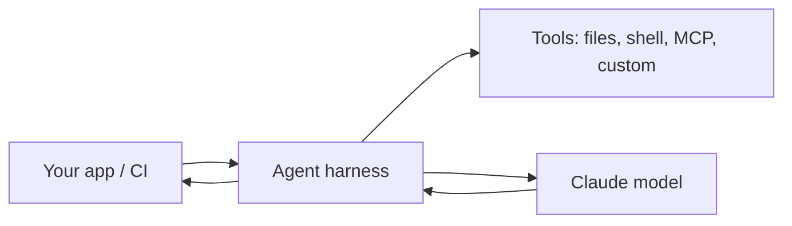

<LevelBadge level="advanced" />

<VerifyNote lastVerified="2026-06-20" source="https://docs.anthropic.com/en/docs/claude-code/sdk">
SDK नाम, पैकेज नाम, और हेडलेस फ़्लैग्स विकसित होते रहते हैं — आधिकारिक Claude Agent SDK / Claude Code डॉक्स में पुष्टि करें।
</VerifyNote>

Claude Code केवल इंटरैक्टिव नहीं है। आप इसे **हेडलेस** (नॉन-इंटरैक्टिव, स्क्रिप्ट करने योग्य) चला सकते हैं और आप **Agent SDK** के साथ उसी अंतर्निहित हार्नेस पर अपने **स्वयं के एजेंट** बना सकते हैं।

## हेडलेस मोड

किसी एकल प्रॉम्प्ट को नॉन-इंटरैक्टिव रूप से चलाएँ और आउटपुट कैप्चर करें — स्क्रिप्ट्स, प्री-कमिट हुक्स, और CI के लिए एकदम सही:

```bash
claude -p "Review the staged diff and list any bugs as a Markdown checklist"
```

इनपुट पाइप करें, एक परिणाम बाहर पाएँ। इसे [अनुमतियों](/docs/claude-code/permissions) के साथ एक सुरक्षित, नॉन-इंटरैक्टिव स्थिति पर सेट करके जोड़ें ताकि यह कभी भी अनुमोदन की प्रतीक्षा में अटका न रहे — और इसे **लॉक डाउन करें** ताकि एक स्वचालित रन सीक्रेट्स को न छू सके (देखें [स्वायत्त रन को मज़बूत बनाना](/docs/security/hardening-autonomous-runs))।

एक क्लासिक उपयोग: एक CI जॉब जिसमें Claude हर पुल रिक्वेस्ट की समीक्षा करता है — देखें [PR-समीक्षा वॉकथ्रू](/docs/walkthroughs/pr-review-action)।

## Agent SDK

**Claude Agent SDK** (Python और TypeScript) आपको उसी लूप पर प्रोडक्शन एजेंट बनाने देता है जो Claude Code को शक्ति प्रदान करता है — टूल उपयोग, फ़ाइल/शेल एक्सेस, अनुमतियाँ, संदर्भ प्रबंधन — लेकिन *आपके* एप्लिकेशन में जुड़ा हुआ।



इसे तब अपनाएँ जब आप एक एकल API कॉल या हाथ से बनाए गए लूप से आगे बढ़ चुके हों और एक बैटरीज़-इन्क्लूडेड एजेंट रनटाइम चाहते हों। विकल्पों के पूरे स्पेक्ट्रम के लिए — एकल कॉल → वर्कफ़्लो → कस्टम एजेंट → प्रबंधित — देखें [API पर एजेंट बनाना](/docs/api/building-agents)।

## हेडलेस/SDK बनाम इंटरैक्टिव

| मोड | किसके लिए |
|---|---|
| इंटरैक्टिव Claude Code | लूप में एक मानव के साथ रोज़मर्रा का dev |
| हेडलेस (`claude -p`) | स्क्रिप्ट्स, प्री-कमिट, CI एकमुश्त कार्य |
| Agent SDK | आपके सॉफ़्टवेयर में एम्बेडेड प्रोडक्शन एजेंट |

## आगे

- [GitHub Action जो हर PR की समीक्षा करता है (वॉकथ्रू)](/docs/walkthroughs/pr-review-action)
- [API पर एजेंट बनाना](/docs/api/building-agents)
- [स्वायत्त रन को मज़बूत बनाना](/docs/security/hardening-autonomous-runs)
