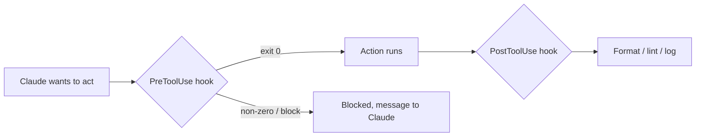

<LevelBadge level="advanced" />

<VerifyNote lastVerified="2026-06-20" source="https://docs.anthropic.com/en/docs/claude-code/hooks">
हुक इवेंट के सटीक नाम और config स्कीमा विकसित होते रहते हैं — किसी विशिष्ट इवेंट पर निर्भर रहने से पहले आधिकारिक हुक्स डॉक्स के विरुद्ध पुष्टि करें।
</VerifyNote>

हुक्स वे **शेल कमांड हैं जिन्हें Claude Code स्वचालित रूप से चलाता है** अपनी लाइफ़साइकल में परिभाषित बिंदुओं पर। जहाँ [अनुमतियाँ](/docs/claude-code/permissions) यह तय करती हैं कि कोई क्रिया *अनुमत है या नहीं*, वहीं हुक्स *आपको* उसके आसपास नियतात्मक तर्क चलाने देते हैं — फ़ॉर्मेटिंग, सत्यापन, लॉगिंग, गेट्स। ये वह तरीका हैं जिससे आप व्यवहार को "कृपया याद रखना" के बजाय गारंटीशुदा बनाते हैं।

## हुक का सहारा कब लें

- **ऑटो-फ़ॉर्मेट / लिंट** हर फ़ाइल संपादन के बाद (`PostToolUse`)।
- किसी नियम का उल्लंघन करने वाली क्रिया को उसके चलने से पहले **ब्लॉक करें** (`PreToolUse`)।
- जब कोई सत्र समाप्त हो या कोई कार्य पूरा हो तब **सूचित या लॉग करें** (`Stop`)।
- सत्र की शुरुआत में **संदर्भ इंजेक्ट करें**।

## ये कैसे काम करते हैं

आप [`settings.json`](/docs/claude-code/settings) में हुक्स पंजीकृत करते हैं, किसी **इवेंट** (और अक्सर एक टूल मैचर) से मेल खाते हुए। जब इवेंट चालू होता है, तो Claude आपका कमांड चलाता है और उसका परिणाम पढ़ता है — एक नॉन-ज़ीरो एग्ज़िट या विशिष्ट आउटपुट क्रिया को **ब्लॉक** कर सकता है और Claude को एक संदेश वापस भेज सकता है।

```json
{
  "hooks": {
    "PostToolUse": [
      {
        "matcher": "Edit|Write",
        "hooks": [
          { "type": "command", "command": "npx prettier --write \"$CLAUDE_FILE_PATH\"" }
        ]
      }
    ]
  }
}
```

हुक को संदर्भ (जैसे फ़ाइल पथ, टूल नाम) environment/stdin के माध्यम से मिलता है — सटीक payload के लिए डॉक्स देखें, जो इवेंट के अनुसार भिन्न होता है।

## मानसिक मॉडल



## अच्छी प्रथाएँ

- **हुक्स को तेज़ और idempotent रखें** — ये बहुत बार चलते हैं।
- **वास्तविक समस्याओं पर ज़ोर से विफल हों**, लेकिन सतही समस्याओं पर ब्लॉक न करें।
- **हुक आउटपुट को Claude के लिए फ़ीडबैक मानें** — एक स्पष्ट संदेश इसे स्वयं को सुधारने में मदद करता है।
- हुक्स आपके शेल के विशेषाधिकारों के साथ चलते हैं — किसी भी ऐसे हुक की समीक्षा करें जिसे आपने नहीं लिखा है ([तृतीय-पक्ष कोड की समीक्षा करना](/docs/security/reviewing-third-party-code))।

कॉपी-पेस्ट स्टार्टर्स [हुक्स और settings.json रेसिपीज़](/docs/templates/hooks-settings) में हैं।

## आगे

- [settings.json](/docs/claude-code/settings) · [अनुमतियाँ](/docs/claude-code/permissions)
- [स्किल्स](/docs/claude-code/skills) — विशेषज्ञता बनाम स्वचालन
- [स्वायत्त रन को मज़बूत बनाना](/docs/security/hardening-autonomous-runs)
