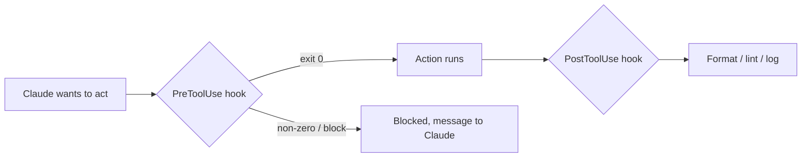

<LevelBadge level="advanced" />

<VerifyNote lastVerified="2026-06-23" source="https://code.claude.com/docs/en/hooks">
सटीक hook इवेंट नाम, stdin पेलोड, और blocking प्रोटोकॉल विकसित होते रहते हैं — किसी विशिष्ट इवेंट या फ़ील्ड पर निर्भर होने से पहले आधिकारिक hooks डॉक्स से पुष्टि कर लें।
</VerifyNote>

Hooks ऐसे **शेल कमांड हैं जिन्हें Claude Code अपने जीवनचक्र में परिभाषित बिंदुओं पर स्वचालित रूप से चलाता है**। जहाँ [permissions](/docs/claude-code/permissions) यह तय करती हैं कि कोई क्रिया अनुमत है *या नहीं*, वहीं hooks *आपको* उसके आसपास नियतात्मक तर्क चलाने देते हैं — फ़ॉर्मेटिंग, सत्यापन, लॉगिंग, गेट्स। यही वह तरीका है जिससे आप व्यवहार को "कृपया याद रखें" के बजाय गारंटीशुदा बनाते हैं।

## hook का सहारा कब लें

- हर फ़ाइल संपादन के बाद **ऑटो-फ़ॉर्मेट / lint** (`PostToolUse`)।
- किसी नियम का उल्लंघन करने वाली क्रिया को उसके चलने से पहले **block** करें (`PreToolUse`)।
- सत्र समाप्त होने या कोई कार्य पूरा होने पर **सूचित या लॉग करें** (`Stop`)।
- सत्र की शुरुआत में **संदर्भ इंजेक्ट करें**।

## ये कैसे काम करते हैं

आप [`settings.json`](/docs/claude-code/settings) में hooks रजिस्टर करते हैं, किसी **इवेंट** (और अक्सर एक tool matcher) से मिलान करते हुए। जब इवेंट ट्रिगर होता है, तो Claude आपका कमांड चलाता है और **stdin पर एक JSON पेलोड** पास करता है (tool का नाम, उसके इनपुट, सत्र)। आपके कमांड का exit code और आउटपुट तय करते हैं कि आगे क्या होगा।

```json
{
  "hooks": {
    "PostToolUse": [
      {
        "matcher": "Edit|Write",
        "hooks": [
          { "type": "command", "command": "jq -r '.tool_input.file_path' | xargs npx prettier --write" }
        ]
      }
    ]
  }
}
```

ऊपर दिया गया hook stdin JSON में से संपादित फ़ाइल का पथ (`.tool_input.file_path`) पढ़ता है और उसे फ़ॉर्मेट करता है। यह न मानें कि कोई env var पथ को रखता है — **इसे stdin से पढ़ें।** स्क्रिप्ट्स को खोजने के लिए `${CLAUDE_PROJECT_DIR}` जैसे उपयोगी पथ प्लेसहोल्डर्स *उपलब्ध हैं*।

## hook कैसे block करता है

इवेंट के आधार पर दो तरीके हैं:

- **Exit code 2** — hook क्रिया को विफल कर देता है और जो कुछ भी उसने **stderr** पर लिखा है वह Claude को दिखने वाला संदेश बन जाता है। सरल है और कमांड hooks के लिए काम करता है।
- **stdout पर JSON (exit 0)** — एक संरचित निर्णय लौटाएँ। `PreToolUse` के लिए, यह `deny` का एक `permissionDecision` होता है; `PostToolUse`/`Stop`/इत्यादि के लिए यह `{"decision": "block", "reason": "…"}` होता है।

```bash
#!/usr/bin/env bash
# PreToolUse hook on the Bash tool: refuse to delete things.
command=$(jq -r '.tool_input.command' < /dev/stdin)
if [[ "$command" == rm\ * || "$command" == *"rm -rf"* ]]; then
  echo "Blocked: destructive 'rm' is not allowed by policy." >&2
  exit 2
fi
exit 0
```

## मानसिक मॉडल



## अच्छी प्रथाएँ

- **hooks को तेज़ और idempotent रखें** — ये बहुत बार चलते हैं।
- **वास्तविक समस्याओं पर ज़ोर-शोर से विफल हों**, लेकिन सतही मुद्दों पर block न करें।
- **hook आउटपुट को Claude के लिए फ़ीडबैक मानें** — एक स्पष्ट संदेश इसे स्वयं सुधार करने में मदद करता है।
- hooks आपके शेल के विशेषाधिकारों के साथ चलते हैं — किसी भी ऐसे hook की समीक्षा करें जिसे आपने नहीं लिखा ([तृतीय-पक्ष कोड की समीक्षा करना](/docs/security/reviewing-third-party-code))।

## आम गलतियाँ

- **फ़ाइल पथ को किसी env var से पढ़ना।** पथ stdin JSON (`.tool_input.file_path`) में रहता है, `$CLAUDE_FILE_PATH` में नहीं। stdin को `jq` के माध्यम से pipe करें।
- **मौन blocks।** यदि कोई `PreToolUse` hook stderr पर कुछ भी लिखे बिना exit 2 करता है, तो Claude block हो जाता है पर उसे *कारण* पता नहीं चलता और वह अनुकूलन नहीं कर सकता। हमेशा एक स्पष्ट कारण लिखें।
- **धीमे hooks।** कोई `PostToolUse` hook *हर* मिलान करने वाले संपादन के बाद चलता है। 3-सेकंड का linter पूरे सत्र को सुस्त महसूस कराता है — hooks को तेज़ रखें और, आदर्श रूप से, केवल उसी पर कार्य करें जो बदला है।
- **अति-व्यापक matchers।** `matcher: ".*"` हर tool पर ट्रिगर होता है। एक सटीक नाम, एक `Edit|Write` सूची, या प्रति-handler `if` फ़ील्ड (उदाहरण के लिए `"if": "Bash(git push *)"`) के साथ इसे संकीर्ण करें।
- **उन hooks पर भरोसा करना जिन्हें आपने नहीं लिखा।** एक hook आपके विशेषाधिकारों के साथ मनमाना शेल चलाता है। किसी plugin या template से आए किसी भी hook की पहले समीक्षा करें — देखें [तृतीय-पक्ष कोड की समीक्षा करना](/docs/security/reviewing-third-party-code)।

कॉपी-पेस्ट स्टार्टर्स [Hooks & settings.json Recipes](/docs/templates/hooks-settings) में हैं।

## आगे

- [settings.json](/docs/claude-code/settings) · [Permissions](/docs/claude-code/permissions)
- [Skills](/docs/claude-code/skills) — विशेषज्ञता बनाम स्वचालन
- [Hardening Autonomous Runs](/docs/security/hardening-autonomous-runs)
</content>
